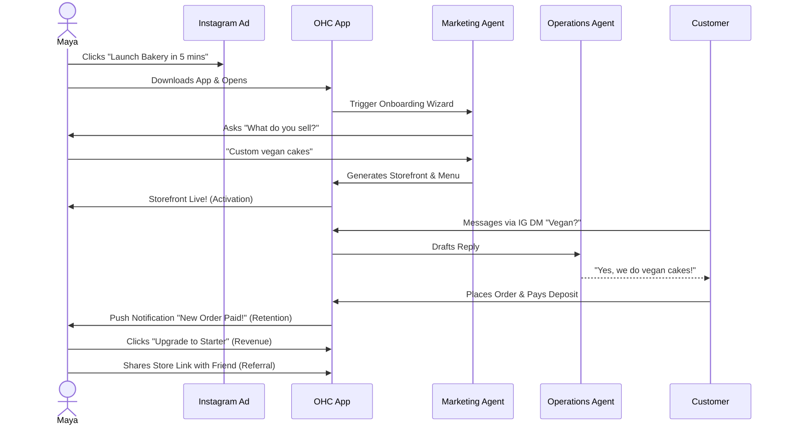
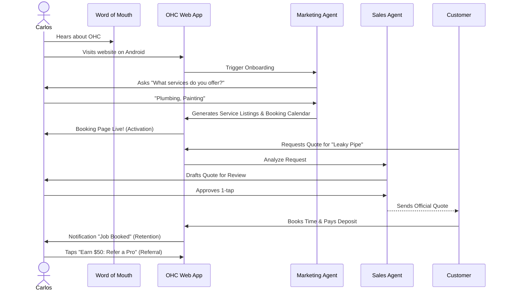
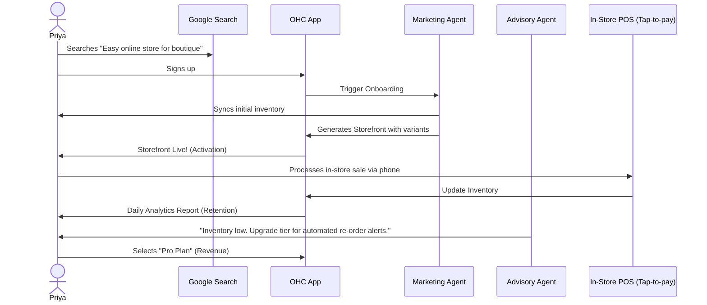
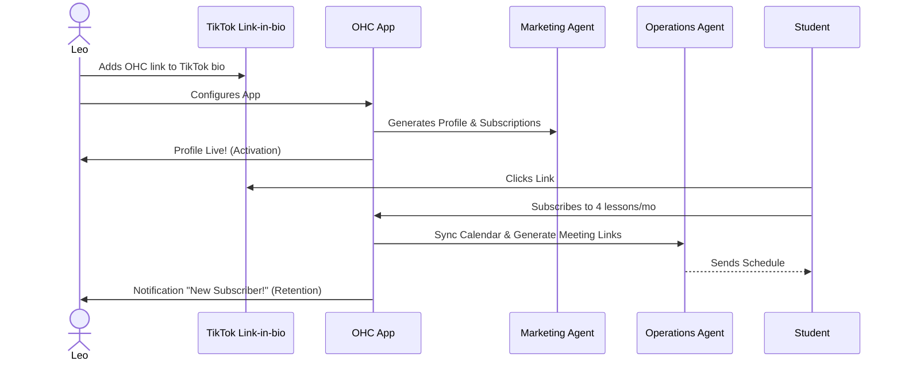
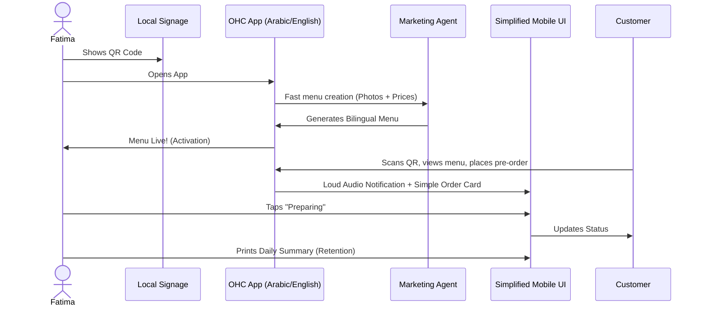

# OHC Core Architecture: Business Journey Maps

## Title
Architectural Mapping of the End-to-End Business Journey for OHC Personas

## Problem Statement
The OHC platform must serve a diverse set of real-world small business owners (e.g., Maya the Baker, Carlos the Handyman, Priya the Boutique Owner, Leo the Music Tutor, and Fatima the Food Cart Operator) who share a common goal: launching and growing their business entirely from a mobile device without technical expertise. Currently, the overarching business journeys—from initial acquisition to sustainable revenue generation and referral loops—are fragmented. We need a unified architectural map of the end-to-end user journeys for these personas to ensure that the system naturally supports their progression through Acquisition, Onboarding, Activation, Retention, Revenue generation, and Referral, while identifying critical friction points where non-technical users might abandon the platform.

## Research Report
### Context and Personas
The business journey is evaluated against the following core personas:
1.  **Maya (Home Baker, 28)**: Needs a mobile-first storefront, Instagram integration, order management with deposit payments, and AI handling direct messages.
2.  **Carlos (Handyman, 42)**: Requires clean service listings, a robust booking system with deposits, a unified customer inbox, and an AI quote generator.
3.  **Priya (Boutique Owner, 35)**: Wants omnichannel support (in-store/online), POS integration (tap-to-pay), inventory sync, and actionable daily analytics.
4.  **Leo (Music Tutor, 22)**: Needs subscription-based packages, schedule syncing, automated meeting links, and a strong public profile (link-in-bio).
5.  **Fatima (Food Cart Operator, 50)**: Prioritizes extreme simplicity, pre-order management, multi-language UI, and fast low-data mobile performance.

### Journey Stages
-   **Acquisition**: Organic search, social media ads (Instagram/TikTok), or word-of-mouth. The call-to-action (CTA) must clearly promise a functional business setup in under 10 minutes.
-   **Onboarding**: A highly guided, AI-driven wizard flow. Crucial to minimize initial input; deferring advanced configurations (like custom domains) to a later stage.
-   **Activation**: The "Aha!" moment. A live storefront, the first booking, or the first payment. Must be achieved within Day 1.
-   **Retention**: Kept engaged through actionable notifications (e.g., new order alerts) and AI-generated weekly health reports.
-   **Revenue**: Transitioning from a free tier to a paid plan. Triggered by hitting specific milestones (e.g., reaching product limits, needing custom domains).
-   **Referral**: Incentivized sharing. Creating a viral loop through referral discounts and shareable success metrics.

### Identified Friction Points
1.  **Cognitive Overload during Onboarding**: Requesting too much setup information upfront (e.g., complex shipping rules) causes drop-offs.
2.  **Payment Gateway Integration**: Technical jargon during Stripe connection can stall progress.
3.  **Inventory/Calendar Sync**: Difficulties mapping real-world availability to digital systems without intuitive AI assistance.
4.  **Language and Accessibility Barriers**: Interfaces that assume high technical literacy or English fluency.

## Design Doc
### Key Design Decisions
-   **Progressive Profiling**: The onboarding flow will request the absolute minimum required data to generate a viable starting point.
-   **AI-First Setup**: The Marketing Agent acts as the primary onboarding guide, generating the initial website layout and copy based on a single descriptive prompt.
-   **Mobile-First Constraint**: All journey flows are designed and tested starting at the 375px breakpoint.
-   **Asynchronous Processing**: Non-critical setup tasks are handled asynchronously by background agents.

### AI Agent Integration Points
- **The Promoter (Marketing)**: Guides onboarding and builds the first version of the storefront.
- **The Salesperson (Sales)**: Drafts quotes for users like Carlos.
- **The Manager (Operations)**: Syncs calendars for Leo and manages pre-orders for Fatima.
- **The Advisor**: Analyzes data and suggests tier upgrades when appropriate limits are approached.

### UI Wireframes & Mobile UX Flow
- **Screen 1 (Acquisition):** Clean landing page. "Launch in 5 mins."
- **Screen 2 (Chat Onboarding):** AI conversational UI ("What do you sell?"). Keyboard optimized.
- **Screen 3 (Generating):** Glassmorphism shimmer effect while AI builds the site.
- **Screen 4 (Live Storefront Preview):** 375px preview of the user's new site with a "Publish" button.
- **Screen 5 (Dashboard):** Bottom-navigation dashboard showing active orders, AI agent drafts for approval, and quick metrics.

### Architecture Diagrams (Mermaid.js)

#### 1. Maya (The Home Baker) Journey

#### 2. Carlos (The Handyman) Journey

#### 3. Priya (The Boutique Owner) Journey

#### 4. Leo (The Music Tutor) Journey

#### 5. Fatima (The Food Cart Operator) Journey

## Implementation Prompt
**To Implementer Agent:**
Implement the foundational user onboarding flow and dashboard state management that supports the progression from Acquisition to Activation for the OHC personas.

**CUJ (Critical User Journey):**
1. User creates an account via mobile web or native app.
2. User is greeted by the conversational onboarding UI.
3. User enters a single sentence describing their business (e.g., "I sell vegan cakes in Portland").
4. System leverages the Marketing Agent to generate a full product catalog and storefront configuration.
5. User is redirected to their live 375px storefront preview, successfully reaching the "Activation" stage.

**Acceptance Criteria:**
- The system must define the required data models to capture the user's business type and minimal initial configuration (deferring complex settings like custom domains).
- The mobile-first (375px) UI wizard correctly guides a user through the initial setup.
- The UI features glassmorphism and the OHC design system typography (Outfit/Inter).
- The KAIROS backend asynchronously handles the AI generation of the storefront data.
- E2E tests written in Playwright confirm the user can complete the entire onboarding journey from sign-up to viewing the generated storefront preview.

## Priority
P0

## Estimated Scope
Large
