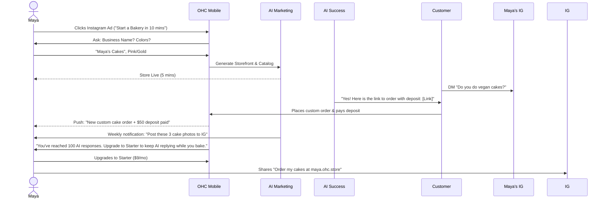
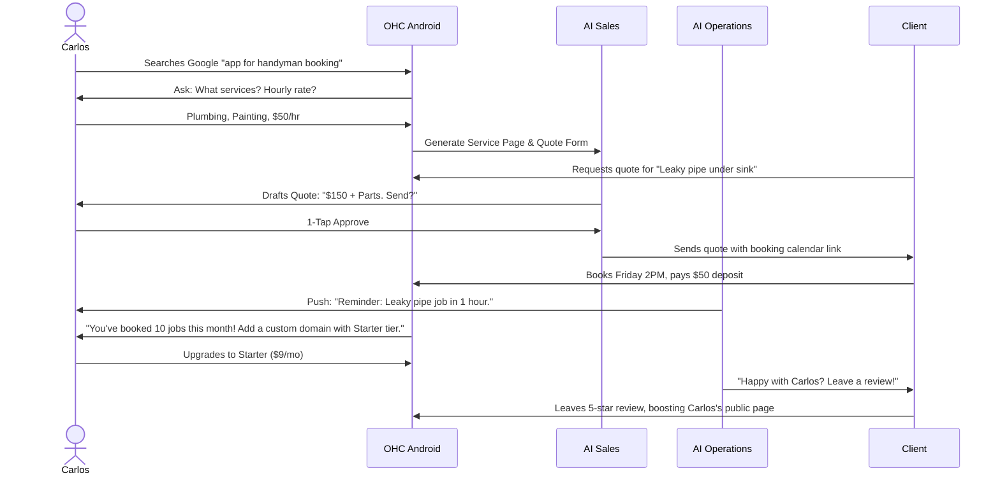
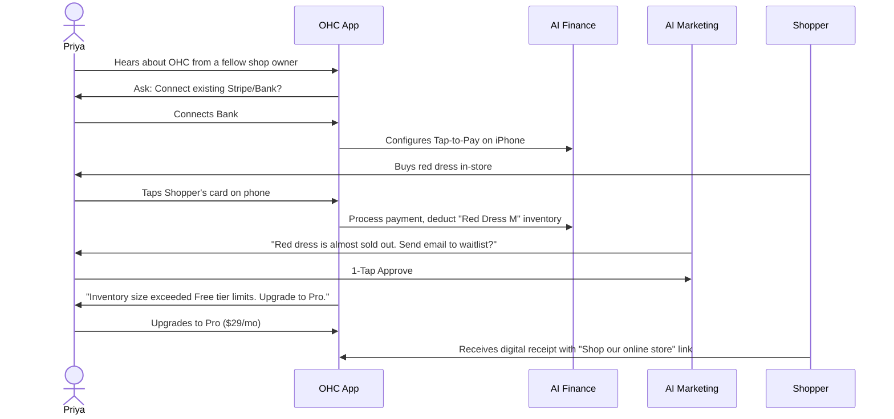
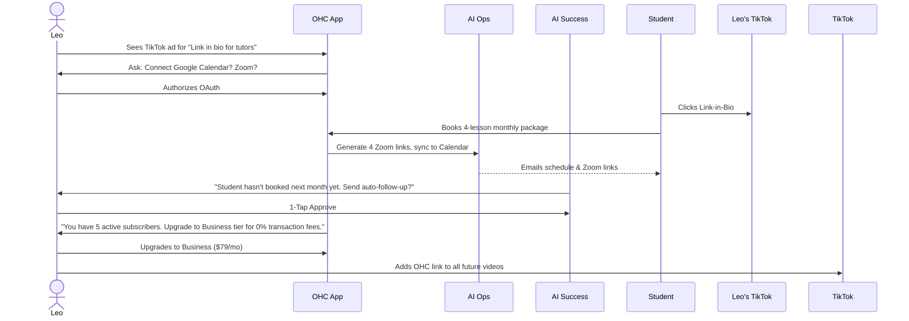
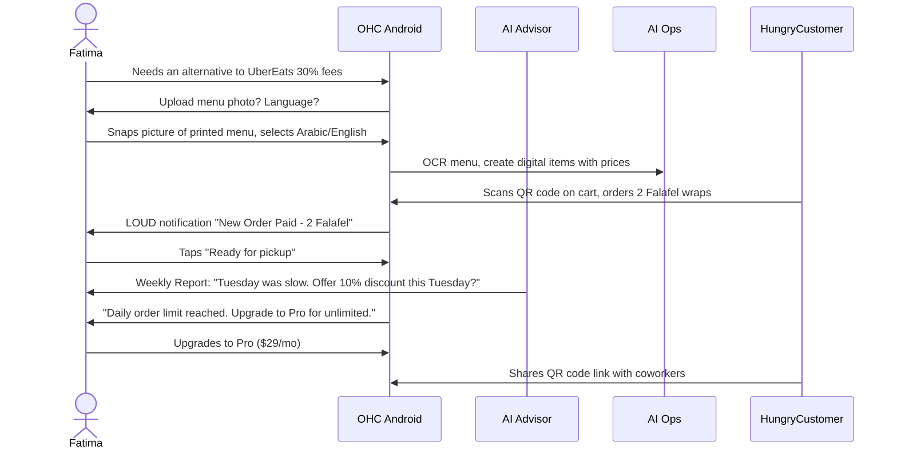

# [architecture] Business Journey Architecture

## Problem Statement
Small business owners often abandon SaaS products because the journey from "sign up" to "first dollar earned" is filled with technical friction. We need a clearly defined, persona-driven architecture for the complete end-to-end user journey—from acquisition to referral—ensuring a zero-code, zero-jargon path to value in under 10 minutes.

## Research Report
An analysis of common SaaS drop-off points reveals that non-technical users abandon platforms mostly during DNS setup, complex store configurations, or when confronted with empty dashboards post-signup. OHC solves this by treating AI as an invisible teammate that auto-generates the store, processes orders, and proactively advises the owner.

### Key Lifecycle Phases Assessed
- **Acquisition:** The entry point. Must be highly context-aware (e.g., an ad targeting bakers must land on a baker-specific onboarding).
- **Onboarding:** Must ask only 3-4 essential questions and auto-generate the rest.
- **Activation:** The "Aha!" moment. Earning the first dollar or receiving the first booking.
- **Retention:** AI proactive notifications (e.g., "Your vegan cake is trending") replace passive dashboards.
- **Revenue:** Upsells must be tied to success limits (e.g., outgrowing the 100-action AI limit), not arbitrary paywalls.
- **Referral:** Organic sharing driven by branded links and customer satisfaction.

## Design Doc: Persona Sequence Diagrams

Below are the end-to-end journey maps for our 5 core personas, designed for a 375px mobile-first experience.

### 1. Maya — The Home Baker (Custom Orders)
Maya needs a simple storefront, custom deposit-based orders, and automated DM replies.

### 2. Carlos — The Freelance Handyman (Service Bookings)
Carlos relies on word-of-mouth. He needs service listings, booking with deposits, and quotes.

### 3. Priya — The Boutique Owner (Physical/In-Person)
Priya needs online/offline sync, POS tap-to-pay, and inventory management.

### 4. Leo — The Music Tutor (Digital/Subscriptions)
Leo needs calendar sync, auto-Zoom links, and subscription management.

### 5. Fatima — The Food Cart Operator (Pre-orders)
Fatima needs photo menus, pre-order payments, and loud phone notifications.

## Key Invariants & Architectural Constraints
1. **AI Invisible Teammate:** All persona journeys rely on asynchronous AI events (e.g., auto-drafting replies, OCRing menus). These require durable event queuing (PostgreSQL SKIP LOCKED) to guarantee delivery.
2. **Push Notifications:** The retention loops for Maya, Fatima, and Carlos depend entirely on reliable mobile push notifications instead of requiring them to actively open the app to check dashboards.
3. **Usage-Based Upsells:** Upsell CTAs must be contextual (e.g., reaching inventory limits or AI action quotas), driven by telemetry rather than time-gating.

## Implementation Prompt
**For Implementer Agents:** Use these sequence diagrams to guide the implementation of the onboarding wizard and KAIROS event triggers. Do not ask the user technical setup questions. If a value can be inferred or generated by an LLM (e.g., store description, initial inventory from a photo), use the AI department to fulfill it.

- **Acceptance Criteria**: E2E flows for all 5 personas must be fully navigable without manual configuration of underlying services (e.g., Stripe keys should be OAuth'd, Zoom links auto-generated).
- **Priority**: P0
- **Estimated Scope**: Large
