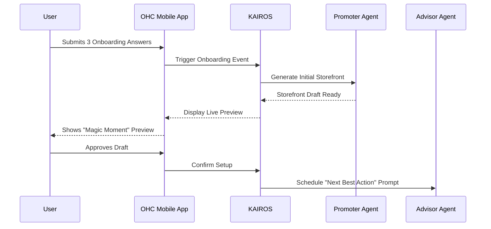
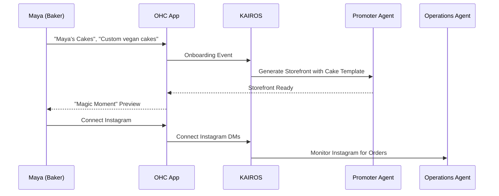
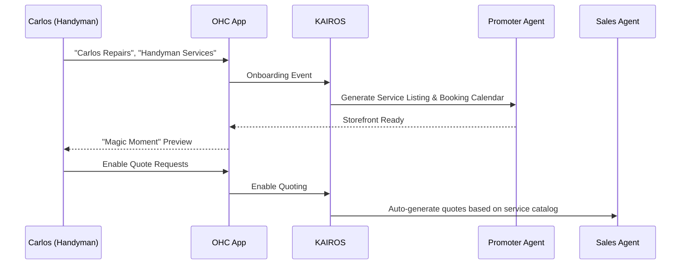
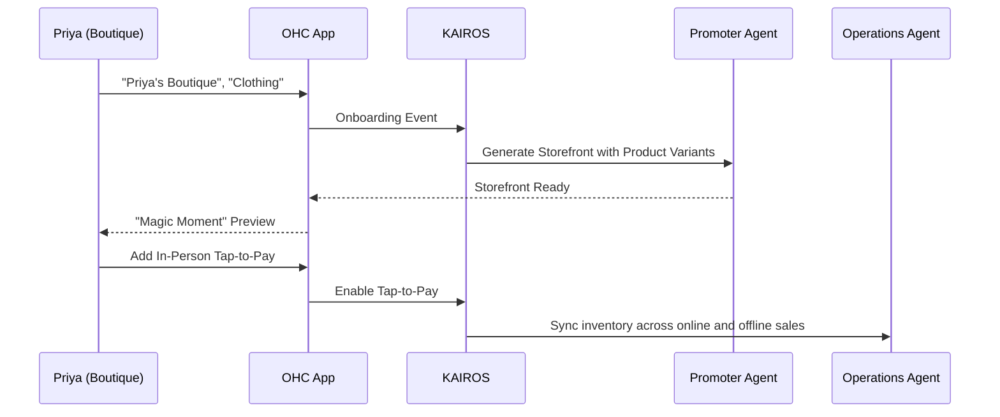
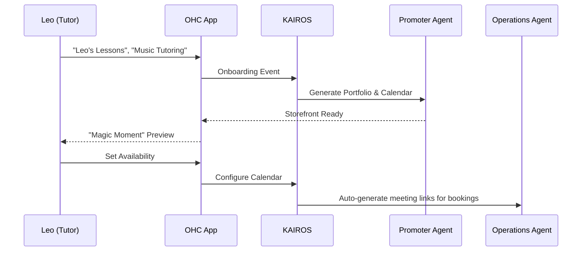
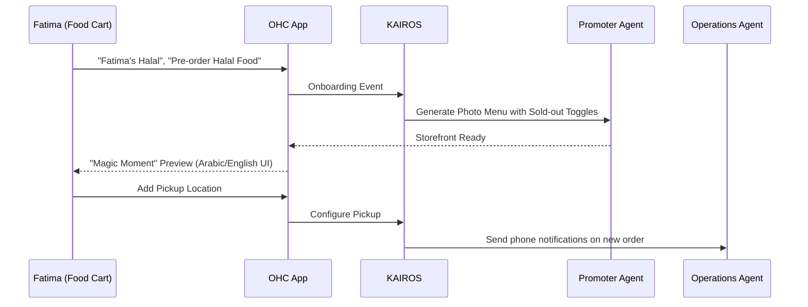

# Research: Business Journey Architecture

## Problem Statement
Small business owners often abandon digital platform onboarding because the initial setup is too complex, requires technical jargon, or doesn't immediately show value. The transition from a non-technical state (e.g., selling via Instagram DMs or word-of-mouth) to a fully functional digital storefront must be frictionless. Maya (a baker), Carlos (a handyman), Priya (a boutique owner), Leo (a tutor), and Fatima (a food cart operator) need tailored journeys that guide them from discovery to their first sale in under 10 minutes, without requiring a manual or code. The current OHC journey needs a structured architectural mapping to ensure no persona drops off due to cognitive overload.

## Research Report
An analysis of competing platforms (Shopify, Wix, Squarespace) reveals a common flaw: they front-load configuration. Users are asked to set up payment gateways, shipping zones, and tax rates before they even see their storefront. This creates a "configuration cliff" where non-technical users abandon the flow.

OHC's "Unfair Advantage" is the invisible orchestration of these tasks by AI agents. The research indicates that the onboarding journey must be inverted:
1. **Immediate Value**: Generate the storefront *first* based on minimal input.
2. **Progressive Disclosure**: Only ask for configurations (like bank details) when they are absolutely necessary (e.g., when the first order arrives).
3. **AI Handholding**: Use the AI agents to prompt for missing information conversationally rather than through dense forms.

Competitor Analysis:
- **Shopify**: Excellent scalability, but requires significant upfront setup. Not suitable for Carlos (handyman).
- **Wix**: Drag-and-drop is powerful, but often leads to messy, non-responsive mobile sites if the user lacks design skills.
- **GoDaddy**: Fast setup, but rigid templates. Lacks deep AI integration.

## Design Doc

### Key Design Decisions
1. **Deferred Configuration**: Account setup, payment details, and complex shipping rules are deferred until after the user has seen their generated storefront. The "magic moment" must happen within 60 seconds.
2. **Conversational Onboarding**: Instead of forms, users are greeted by a conversational AI that asks 3-4 key questions (e.g., "What do you sell?", "What's your business name?") and uses that to generate the initial site.
3. **Mobile-First Editing**: The entire storefront builder and management dashboard must be 100% functional on a mobile device (375px viewport), emphasizing tap-friendly targets and swipe gestures.
4. **Agent-Driven Prompts**: If a user abandons the setup, the "Customer Success" agent proactively sends a SMS or WhatsApp message offering to complete the setup for them based on their chat responses.

### Mobile UX Flow
1. **Discovery**: User taps an Instagram ad -> Lands on OHC mobile landing page.
2. **Activation**: Conversational interface starts: "Hi! Let's get your business online. What are you selling today?"
3. **Generation**: Loading screen with a premium blur effect while the AI generates the site.
4. **The "Magic Moment"**: The user sees their live site.
5. **Progressive Setup**: A persistent, unobtrusive notification asks the user to "Add a bank account to start accepting payments" when they are ready.

### AI Integration Points
- **The Promoter (Marketing & Advertising)**: Automatically generates the initial SEO meta tags, social media previews, and sample products based on the onboarding conversation.
- **The Salesperson (Sales & Acquisition)**: Triggers an abandoned cart-style recovery if the user drops off during onboarding.
- **The Advisor (Business Advisory)**: Suggests the next best action (e.g., "Upload a profile picture to increase trust by 20%").

### Architecture Diagrams (Mermaid.js)

### UI Wireframes
*Note: Designed for 375px mobile viewport adhering to the Visual Excellence Mandate (Glassmorphism, 20px blur).*

**Screen 1: Conversational Onboarding**
- Background: Subtle, animated mesh gradient.
- Chat Bubble: "What are you selling today?" (Outfit font).
- Input Area: Large, thumb-friendly text field with a prominent microphone icon for voice input.

**Screen 2: The Magic Moment**
- Top Navbar: Glassmorphic panel (20px blur) with "Your Site is Live" badge.
- Main Content: An iframe preview of their generated site.
- Bottom Floating Action Button (FAB): "Share Link" (Inter font, bold).

## Implementation Prompt
**Context**: You are implementing the core Business Journey Onboarding flow for OHC. The goal is to get a user from a cold start to a live, generated storefront in under 60 seconds using conversational inputs.
**User-Facing Outcome**: A frictionless, mobile-first conversational wizard that captures minimal intent and instantly generates a previewable storefront.
**CUJ (Critical User Journey)**:
1. User opens the app and starts the conversational wizard.
2. User provides their business name and primary offering (e.g., "Maya's Cakes", "Custom vegan cakes").
3. The system generates a draft storefront and displays it to the user.
4. The system defers payment and shipping configuration, presenting them as later action items in the dashboard.
**Acceptance Criteria**:
- The onboarding wizard must use a conversational UI paradigm, not traditional forms.
- The storefront generation must complete in under 5 seconds from the final input.
- The UI must adhere to the Visual Excellence Mandate (Glassmorphism, Outfit/Inter fonts).
- The user must be able to view their generated storefront without entering payment details.
- The KAIROS orchestrator must correctly route the onboarding event to the Promoter agent for generation.

## Priority
P0

## Estimated Scope
Large

### Persona Specific Journeys (Mermaid.js)

### Post-Activation Journey Phases

**Retention**
- **Trigger**: Carlos needs to check his bookings; Maya needs to process orders.
- **Action**: Users receive push notifications for new orders/bookings and a weekly "AI Business Briefing" summarizing activity.
- **Friction Point**: If the app is too noisy, they disable notifications.
- **Solution**: The Advisor Agent curates notifications, only sending high-value alerts or daily summaries.

**Revenue (Upgrade Path)**
- **Trigger**: Maya wants a custom domain (`mayascakes.com`) or Priya reaches the 10-product limit on the Free tier.
- **Action**: A contextual, non-blocking upgrade prompt appears within the UI workflow (e.g., when adding the 11th product).
- **Friction Point**: The upgrade cost seems high without clear ROI.
- **Solution**: The Advisor Agent shows projected revenue increase from the upgrade (e.g., "Stores with custom domains see a 30% increase in trust").

**Referral (Viral Loop)**
- **Trigger**: Priya loves OHC and wants to share it with a fellow boutique owner.
- **Action**: Priya shares a unique referral link from the dashboard. Both receive a credit (e.g., "Get 1 month of Starter tier free").
- **Friction Point**: The referral process requires too many steps or context switching.
- **Solution**: A 1-tap share button in the mobile UI that integrates with native OS sharing (WhatsApp, iMessage).
