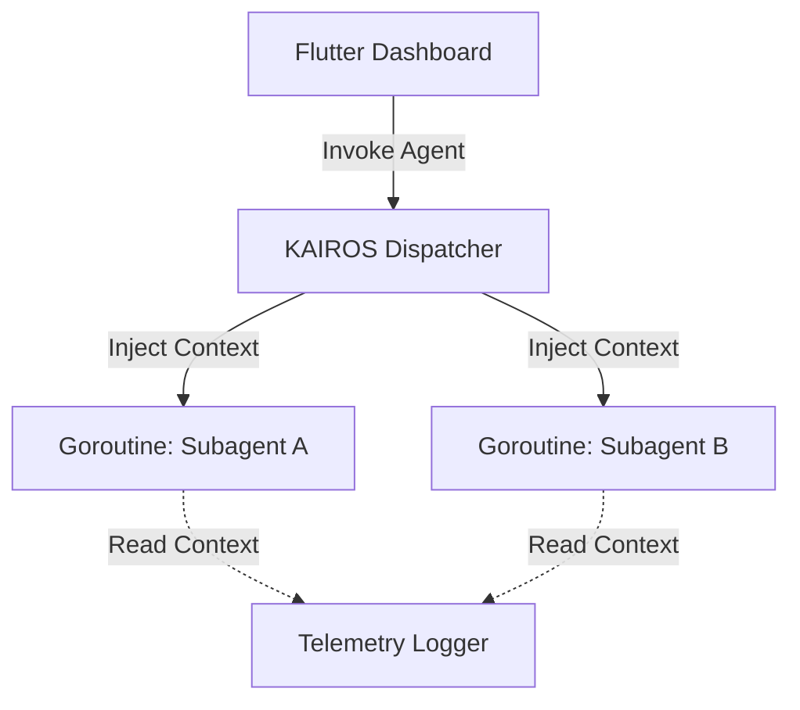

# Research Report: Native AsyncLocalStorage for Subagent Traceability in OHC-HA

## Current State
In the current OHC codebase, agent identity is traced via explicit parameters passed to each function, or fallback global state, leading to complex and brittle API contracts. This is especially problematic in Standalone Desktop Mode where local resources are constrained.

## Competitor Analysis (AI coding assistant -  Version 2.1.88)
The recently analyzed AI coding assistant agent bypasses parameter drilling entirely by utilizing Node.js's `AsyncLocalStorage`. In `src/utils/agentContext.ts`, they define explicit `SubagentContext` and `TeammateAgentContext` bounds. They use `AsyncLocalStorage<AgentContext>()` to isolate execution chains. When agents are backgrounded, they do not interfere with each other because the runtime maintains isolated async boundaries natively.

## Proposed Solution
Introduce an equivalent to `AsyncLocalStorage` in the Go backend (`srcs/server/`) for the KAIROS Orchestrator. We will use Go's `context.Context` combined with strongly typed context keys to flow `SubagentContext` implicitly through goroutines. This ensures isolated execution tracing without global variable pollution.

## Design Doc
*   **Architecture**:
    *   A new middleware/context wrapper in `srcs/server/orchestration/agent_context.go`.
    *   Types: `SubagentContext` and `TeammateAgentContext`.
    *   `WithAgentContext(ctx, agentCtx)` and `GetAgentContext(ctx)` functions.
*   **Telemetry Integration**:
    *   Ensure all logging (`slog`) and metrics automatically extract the `AgentId` and `ParentSessionId` from the active context.
*   **Visual Representation**:
    *   A new Flutter UI widget displaying active Agent IDs tracked by the tracing layer, styled using OHC Glassmorphism (20px blur, Outfit font).

