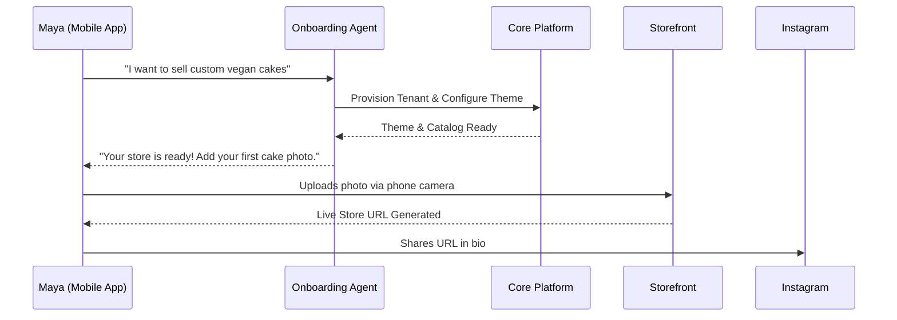
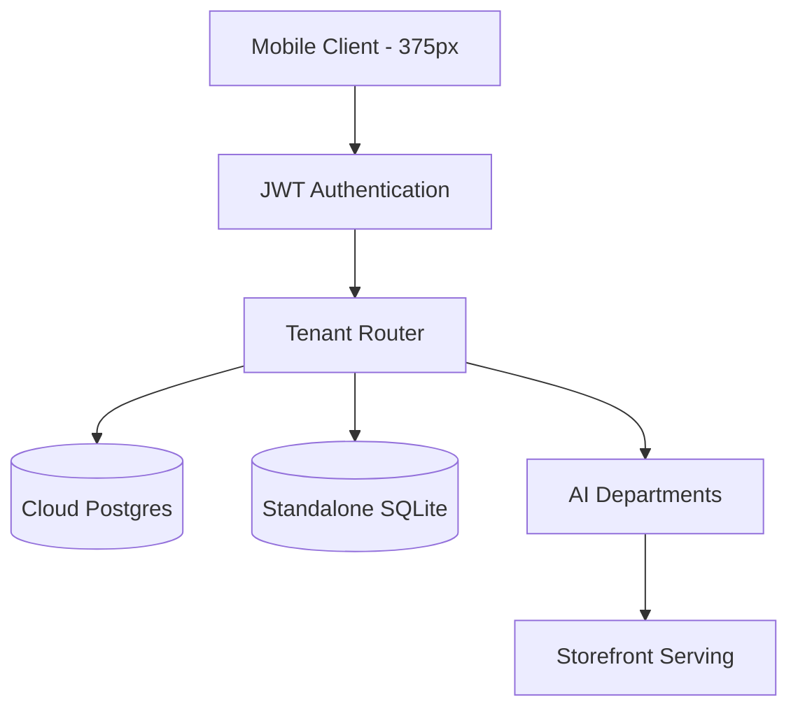

# Title: 🔎 Scout: Tool Integration Research [quarter] - End-to-End Business Journey Architecture

## Problem Statement
Small business owners—like Maya the baker, Carlos the handyman, and Priya the boutique owner—often feel overwhelmed by the technical complexities of launching an online presence. Setting up domains, configuring payment gateways, and managing online bookings usually require technical knowledge or hiring expensive professionals. The gap lies in providing a seamless, mobile-first experience that takes a user from zero to a live, transactional business in under 10 minutes without touching a single line of code, passing the "grandmother test."

## Research Report

### Persona-Specific Pain Point Summaries
- **Maya (baker, 28)**: Struggles to manage custom cake requests scattered across Instagram DMs. Needs automated replies while she sleeps, and a simple photo catalog.
- **Carlos (handyman, 42)**: Relies purely on word-of-mouth. Lacks a professional service listing, making it hard to take deposits securely. Android-only access.
- **Priya (boutique owner, 35)**: Wants to unify in-store and online inventory seamlessly. Needs an email newsletter and daily mobile analytics to track growth.
- **Leo (music tutor, 22)**: Needs automatic calendar syncing and link generation for his online lessons, allowing him to link directly from TikTok.
- **Fatima (food cart, 50)**: Needs a multi-lingual (Arabic + English), ultra-simple interface for pre-orders that works reliably on low-end mobile devices.

### Competitive Analysis & Market Positioning
- **Shopify**: Excellent for e-commerce, but overly complex for pure service businesses (Carlos) or simple food pre-orders (Fatima). High learning curve.
- **Wix / Squarespace**: Good visual builders, but require desktop use for serious setup. Not inherently "agentic" (users must configure everything themselves).
- **OneHumanCorp (OHC)**: Invisible AI agents handle the configuration. Fully mobile-first, ensuring 100% feature parity on a 375px screen.

### Key Advantages and Risks
**Key Advantages:**
- True mobile-first approach (zero desktop requirement).
- AI invisibly orchestrates setup, reducing time-to-value to under 10 minutes.
- Unified architecture serving diverse business types (physical, digital, services, food).

**Risks:**
- AI agent hallucination in automated customer communications.
- Managing reliable offline support and sync states for low-end devices.

### Rough Pricing Context
- Focus on Freemium adoption: Free tier ($0) for initial 10 products, Starter tier ($9/mo) with custom domain.
- Competitors typically start at $20-$30/mo, making OHC highly attractive to micro-businesses.

### Cloud vs. Standalone Modes Evaluation
- **Whether it works in both Cloud and Standalone modes**: Yes. The Business Journey Architecture is designed to function seamlessly across both.
  - **Cloud Mode**: Multi-tenant environment handles high traffic and orchestrates shared AI resources.
  - **Standalone Mode**: Ensures that business owners who require complete data sovereignty or offline capabilities (e.g., in a remote food cart scenario) can still run the entire stack locally with SQLite-backed SIPDB, maintaining the same AI-driven journey.

## Design Doc

### Mobile UX Flow (375px First)
1. **Acquisition & Landing**: User taps an Instagram ad. Presented with a sleek, Glassmorphism-styled splash screen.
2. **Onboarding Wizard**: 3-step conversation with an AI agent ("What's your business name?", "What do you sell?"). No complex forms.
3. **Activation**: The AI agent instantly generates the storefront, populating placeholder images and copy. The user connects their payment method in one tap.
4. **Retention**: Push notifications summarize daily revenue and agent activities.

### Key Design Decisions and Why
- **Conversational Onboarding**: Replaces daunting forms with an AI chat interface to reduce drop-off rates and pass the "grandmother test" (usable in < 30 seconds).
- **Mobile Parity**: 100% of tasks, including website building and inventory management, are fully operational on mobile. Desktop is treated as an optional expansion, not a necessity.
- **Visual Excellence Mandate**: Every interface must feel premium, utilizing specific CSS tokens to build trust:
  - Background: `backdrop-filter: blur(15px) saturate(200%); background: rgba(255, 255, 255, 0.03)`
  - Typography: 'Outfit' for headings, 'Inter' for body.

### Architecture Diagrams

#### End-to-End User Journey (Maya the Baker)

#### Multi-Tenant Data Interaction Model

## Implementation Prompt
**User-Facing Outcome:** Implement the new AI-driven conversational onboarding flow for mobile clients. The flow must allow a new user to type a single sentence describing their business and automatically generate a fully configured OHC storefront with a custom subdomain.

**Customer User Journey (CUJ):**
1. User downloads the app and signs up via email/OTP.
2. User is greeted by the Operations AI Agent.
3. User inputs "I run a local handyman service in Austin."
4. System provisions the tenant, configures a service-booking template, and presents the live site preview.

**Acceptance Criteria:**
- The flow must be fully usable on a 375px viewport.
- Interface must implement the designated Glassmorphism design tokens and Outfit/Inter typography.
- Time from signup to live storefront generation must not exceed 10 minutes (target < 3 minutes).
- Do not prescribe specific database schemas or API endpoints; focus entirely on the frontend state management and integration with the backend AI orchestrator.

## Priority
P0

## Estimated Scope
Large
