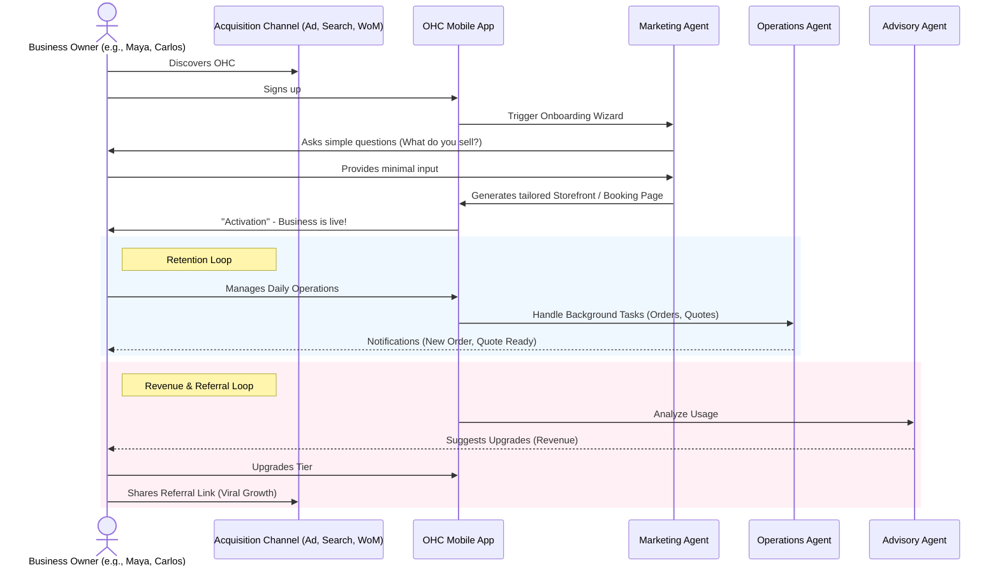

# Research Report: Business Journey Architecture

## Title
Business Journey Architecture

## Problem Statement
Small business owners—from bakers to handymen—need a streamlined path from discovering the platform to running a fully functional, revenue-generating business. They lack technical skills and need an environment that guides them from zero to live within 10 minutes. Without a unified, architecturally mapped journey, the platform risks high drop-off rates during onboarding and fails to deliver the "Aha!" moment early enough.

## Research Report
The core personas for OneHumanCorp are diverse but share a common need:
- **Maya (Baker, 28)**: Needs a mobile-first storefront, Instagram integration, and AI for DMs.
- **Carlos (Handyman, 42)**: Needs service listings, booking with deposits, and AI quote generation.
- **Priya (Boutique Owner, 35)**: Needs inventory sync, tap-to-pay, and daily analytics.
- **Leo (Music Tutor, 22)**: Needs lesson booking, meeting links, and link-in-bio.
- **Fatima (Food Cart, 50)**: Needs photo menus, simple pre-orders, and multi-language support.

**Key Findings:**
1. **Friction at Onboarding:** Users abandon platforms when asked for too much initial configuration (e.g., shipping zones, complex tax settings).
2. **Speed to Value:** The primary goal is achieving "Activation"—a live, functional storefront or booking page—within the first day, ideally within minutes.
3. **Retention relies on Actionable Insights:** Regular, plain-language updates (e.g., "New order received" or "Weekly health report") are crucial for retention.
4. **Viral Growth:** Simple, incentivized referral mechanisms (e.g., "Give $10, Get $10") drive organic growth.

## Design Doc

### Architecture Diagram (Mermaid.js)

### UI Wireframes / Screen Flow (375px)
1. **Welcome Screen:** Large, inviting CTA. "Launch your business in 5 minutes."
2. **Wizard Step 1 (Bio):** A single text area or microphone input. "Describe what you do."
3. **Wizard Step 2 (Magic Generation):** A shimmer effect screen ("Building your store...").
4. **Activation Screen:** The live preview of their storefront with a clear "Share Link" button.
5. **Dashboard Home:** Clean, actionable feed. "1 New Order," "Weekly Report Ready."

### Mobile UX Flow
- **Progressive Disclosure:** Only ask for what is absolutely necessary to generate the initial site. Advanced settings are hidden behind a "Settings" or "Advanced" tab, suggested later by AI.
- **Optimistic UI:** Actions like "Approve Quote" should immediately reflect in the UI, with the actual API call happening in the background.
- **Native Feels:** Utilize native mobile keyboards (e.g., numeric for pricing) and bottom navigation for core actions.

### AI Agent Integration Points
- **Onboarding:** "The Promoter" generates initial site copy and selects themes based on the user's description.
- **Operations:** "The Manager" handles the background processing of orders and triggers notifications.
- **Retention/Growth:** "The Advisor" analyzes usage and prompts the user to upgrade tiers when beneficial (e.g., "You're getting lots of orders! Upgrade for custom domains.").

### Key Design Decisions
- **Mobile-First Exclusivity:** All critical flows must be fully functional on a 375px screen.
- **"Born Live" Stores:** Sites are generated as a `DRAFT` and moved to `LIVE` with a single tap, bypassing complex domain/SSL setup initially.
- **AI as a Co-Pilot, Not an Autopilot:** AI agents suggest actions (e.g., drafting a quote) but require 1-tap approval from the user to maintain trust.

## Implementation Prompt
**To Implementer Agent:**
Implement the foundational user onboarding flow that maps the journey from Acquisition to Activation.
1. Build the mobile-first (375px) AI-driven onboarding wizard. The wizard should take minimal input (e.g., a simple description of the business) and generate a functional "Storefront" or "Booking Page" state.
2. Ensure the transition to the "Live" state is seamless, providing the user with an immediate shareable link.
3. Implement the primary dashboard view that the user lands on post-activation, focusing on actionable items (e.g., a feed of pending tasks or notifications).
Do not prescribe specific database schemas or API endpoints. Focus on the UI transitions, optimistic updates for a snappy feel, and the integration with the "Marketing Agent" for content generation. Ensure all screens use OHC premium design tokens (Glassmorphism, correct typography).

## Priority
P0

## Estimated Scope
Large
