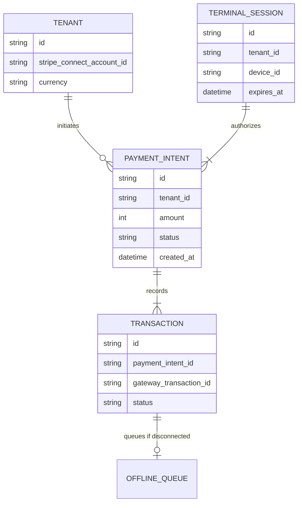

# [Architecture] Unified In-Person Tap-to-Pay Architecture

## Title
Implement Unified In-Person Tap-to-Pay Architecture

## Problem Statement
Small business owners—like Priya the boutique owner and Carlos the handyman—often need to accept secure, in-person payments without the friction of purchasing, charging, and pairing external card reader hardware. While OneHumanCorp (OHC) currently offers robust online checkout solutions, it lacks an integrated, multi-tenant solution to seamlessly accept in-person payments using the merchant's own mobile device (via NFC). This gap forces users to step outside the OHC ecosystem to use third-party POS systems (like Square or standalone Stripe Terminal readers), fracturing their sales data, inventory synchronization, and user experience. They need a zero-friction, native mobile capability to transform their smartphone into a secure payment terminal within the OHC platform.

## Research Report
### Findings & Competitive Analysis
1. **Industry Standard**: Modern platforms (Shopify, Wix, Square, Stripe) are rapidly adopting native Tap-to-Pay on iPhone and Android, reducing the dependency on physical POS hardware.
2. **Shopify & Wix**: Both platforms offer native Tap-to-Pay integration directly in their seller apps, routing transactions through their respective payment gateways (Shopify Payments / Wix Payments) and providing unified reporting for online and offline sales.
3. **Square**: Pioneered mobile card readers but has now shifted heavily towards Tap-to-Pay via smartphone as the default entry point for new merchants.
4. **Stripe Terminal**: Provides native iOS and Android SDKs (Tap to Pay on iPhone and Tap to Pay on Android) that handle secure NFC communication, tokenization, and multi-tenant isolation via Stripe Connect, abstracting away complex PCI compliance.
5. **Impact on Core Personas**:
   - **Priya (Boutique Owner)**: Can instantly accept contactless payments at pop-up events or in her store using her iPhone, directly updating OHC inventory.
   - **Carlos (Handyman)**: Can accept on-the-spot payment for a repair job using his Android phone, instantly marking the OHC invoice as paid.

### Cloud vs. Standalone Capability
- **Cloud Mode**: Full functionality utilizing cloud-based payment gateways (e.g., Stripe Connect) for transaction authorization, ledger updates, and instant receipts.
- **Standalone Mode**: The architecture must support local capture of payment intent and queue transactions for offline environments (e.g., a food cart in a dead zone), syncing to the cloud when connectivity is restored, provided the payment gateway supports store-and-forward or delayed capture for offline NFC.

## Design Doc

### Architecture Diagram

### UI Wireframes & Mobile UX Flow (375px First)
**Screen 1: Sale Entry (375px)**
- Clean, glassmorphic layout.
- Top: Large, clear typography displaying the total amount (e.g., "$45.00").
- Middle: Simplified item list or numpad for quick entry.
- Bottom: Large primary button (Apple/UniFi Accent Color, e.g., Primary `#0066FF`), full width, 16px border radius, labeled "Charge $45.00".
- *Advanced Settings (Hidden)*: Option to select specific payment gateways or terminal routing rules.

**Screen 2: Tap to Pay Activation (375px)**
- Native OS-level modal (Apple ProximityReader or Google NFC overlay) slides up over the OHC app.
- Clear instruction: "Hold card or device near back of phone."
- Smooth, subtle pulse animation indicating NFC readiness.

**Screen 3: Success & Receipt (375px)**
- Delightful success animation (green checkmark, `#34C759`).
- Prominent "Payment Approved" text.
- Options to "Email Receipt" or "Text Receipt" directly triggering the AI Communications Agent.
- "Done" button returns to Sale Entry.

### AI Agent Integration Points
- **Operations Agent**: Automatically updates inventory levels when an in-person product sale is finalized.
- **Finance Agent**: Reconciles the Tap-to-Pay transaction against the daily ledger and triggers a localized instant invoice/receipt generation.
- **CS Agent**: Monitors for failed transactions and proactively suggests fallbacks (e.g., "Send a payment link via SMS instead?").

### Key Design Decisions
1. **Delegated Tokenization**: Utilize Stripe Terminal SDKs (or equivalent) to handle direct NFC communication and tokenization, ensuring OHC servers never touch raw PAN (Primary Account Number) data, simplifying PCI compliance.
2. **Multi-Tenant Routing**: Strict derivation of the `tenant_id` and corresponding connected account ID from the authenticated session, never relying on client-side requests for routing funds.
3. **Progressive Disclosure**: Technical terms like "Terminal Session", "Gateway", or "NFC Handshake" are entirely hidden from the user interface.

## Implementation Prompt
Implement the Unified In-Person Tap-to-Pay architecture for the OneHumanCorp platform.
1. **User Outcome**: A user (like Priya) can tap "Charge" in the OHC mobile web/app interface and securely accept a customer's contactless card or digital wallet payment using their smartphone's native NFC capabilities.
2. **Core User Journey (CUJ)**: User enters amount -> User taps "Charge" -> Native NFC interface appears -> Customer taps card -> Success screen appears -> Inventory/Ledger updates invisibly.
3. **Acceptance Criteria**:
   - The UI adheres to OHC Glassmorphism standards (16px radiuses, appropriate blur and accent colors).
   - The frontend integrates with a mock or real payment terminal SDK bridge.
   - The backend enforces strict multi-tenant isolation, ensuring transactions are credited to the correct `tenant_id` derived securely from the session.
   - Fallback error states (e.g., NFC disabled, card declined) are handled gracefully with plain language, without hardcoding fake success responses.
   - 100% unit and Playwright E2E test coverage for the payment flow.

## Priority
P1

## Estimated Scope
Large

## References & Sources
1. https://stripe.com/terminal
2. https://stripe.com/docs/terminal
3. https://stripe.com/docs/terminal/features/tap-to-pay
4. https://stripe.com/docs/terminal/payments
5. https://stripe.com/docs/terminal/quickstart
6. https://stripe.com/use-cases/platforms
7. https://stripe.com/docs/connect
8. https://stripe.com/docs/connect/destination-charges
9. https://stripe.com/docs/connect/separate-charges-and-transfers
10. https://stripe.com/docs/connect/account-onboarding
11. https://stripe.com/docs/terminal/sdk/ios
12. https://stripe.com/docs/terminal/sdk/android
13. https://developer.apple.com/tap-to-pay/
14. https://developer.apple.com/documentation/proximityreader
15. https://developer.apple.com/design/human-interface-guidelines/tap-to-pay-on-iphone
16. https://developer.android.com/develop/connectivity/nfc
17. https://developer.android.com/develop/connectivity/nfc/hce
18. https://squareup.com/us/en/payments/tap-to-pay-on-iphone
19. https://squareup.com/us/en/payments/tap-to-pay-on-android
20. https://developer.squareup.com/docs/terminal-api/overview
21. https://developer.squareup.com/reference/square/terminal-api
22. https://developer.squareup.com/docs/point-of-sale-api/overview
23. https://developer.squareup.com/docs/payments-api/overview
24. https://www.adyen.com/payment-methods/tap-to-pay-on-iphone
25. https://www.adyen.com/payment-methods/tap-to-pay-on-android
26. https://docs.adyen.com/point-of-sale/tap-to-pay-on-iphone
27. https://docs.adyen.com/point-of-sale/tap-to-pay-on-android
28. https://docs.adyen.com/point-of-sale
29. https://docs.adyen.com/platforms
30. https://docs.adyen.com/platforms/overview
31. https://www.shopify.com/pos/tap-to-pay
32. https://help.shopify.com/en/manual/sell-in-person/hardware/card-readers/tap-to-pay-iphone
33. https://help.shopify.com/en/manual/sell-in-person/hardware/card-readers/tap-to-pay-android
34. https://shopify.dev/docs/apps/pos
35. https://shopify.dev/docs/api/pos-ui
36. https://www.paypal.com/us/business/pos-systems
37. https://developer.paypal.com/docs/multiparty/
38. https://developer.paypal.com/docs/multiparty/checkout/
39. https://developer.paypal.com/docs/business/checkout/advanced-credit-and-debit-card-payments/
40. https://www.wix.com/pos/tap-to-pay
41. https://support.wix.com/en/article/wix-pos-accepting-payments-with-tap-to-pay
42. https://www.godaddy.com/payments/point-of-sale
43. https://www.godaddy.com/help/tap-to-pay-on-iphone-with-the-godaddy-mobile-app-41804
44. https://www.godaddy.com/help/tap-to-pay-on-android-with-the-godaddy-mobile-app-41805
45. https://sumup.com/us/tap-to-pay/
46. https://developer.sumup.com/docs/pos-api/
47. https://developer.sumup.com/docs/payment-widget/
48. https://developer.sumup.com/docs/terminal-api/
49. https://www.zettle.com/us
50. https://developer.zettle.com/docs/api/point-of-sale-systems/overview
