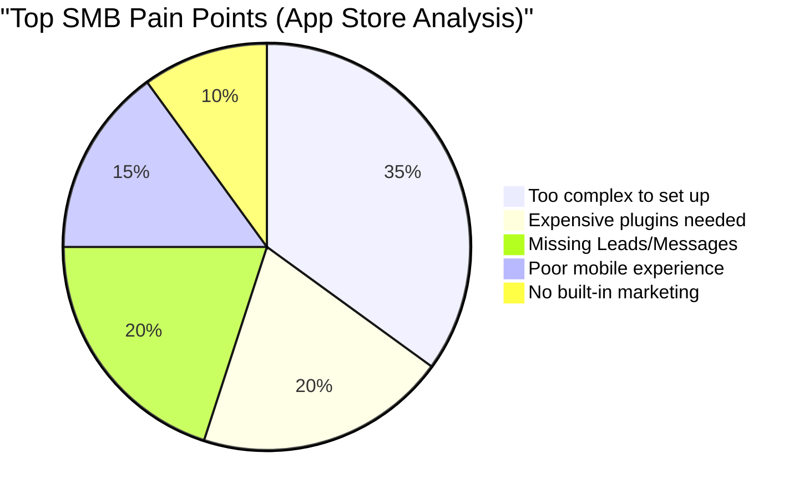
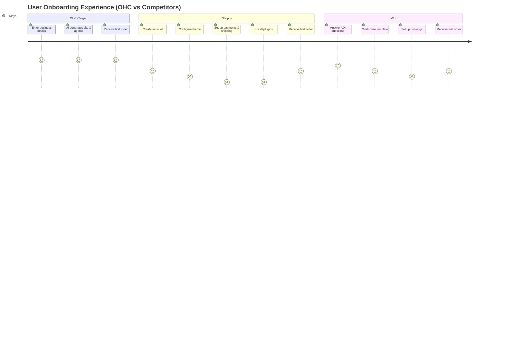
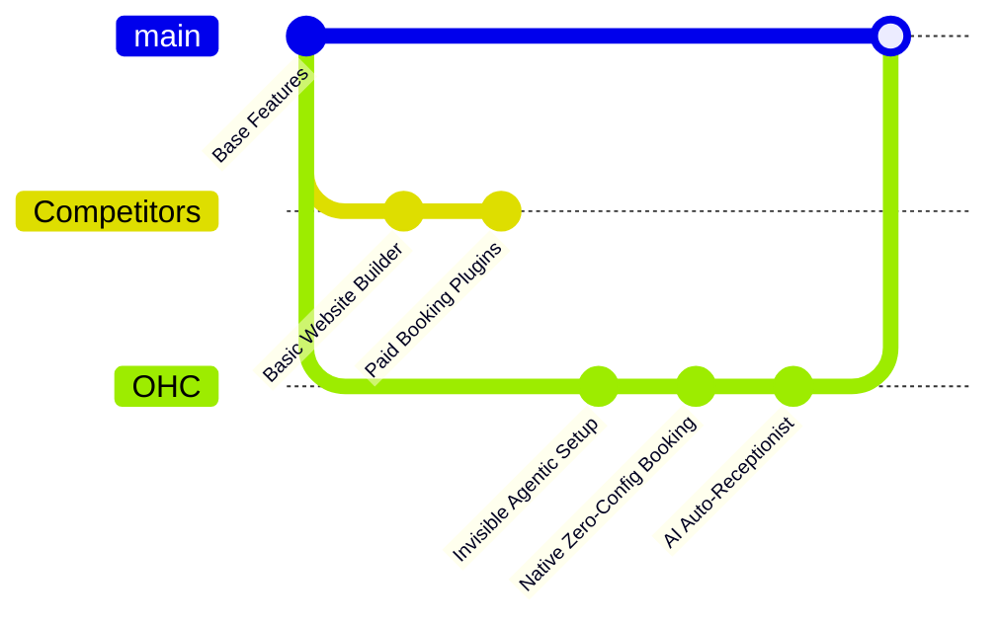

# OHC Market Research & AI Differentiation Report

## Executive Summary
OneHumanCorp (OHC) is uniquely positioned to dominate the small business platform market. Current incumbents (Shopify, Wix, Squarespace) focus on website building or complex e-commerce, alienating the non-technical SMB owner who just wants to "run their business." This report identifies the core gaps in the market and proposes the top AI features OHC must build to capture the market.

## Market Sizing & Strategic Direction
### Total Addressable Market (TAM) & Beachhead
- **TAM**: ~33 million SMBs in the US alone; over 300 million globally. Over 40% lack any meaningful online operational tools beyond a basic Facebook or Instagram page.
- **Beachhead**: Service-based micro-businesses (e.g., handymen, music tutors). They have high LTV, massive pain points around scheduling/payments, and are vastly underserved by retail-focused tools like Shopify.

### Expansion Strategy
- **Geographic Expansion**: Post-English launch, Spanish/LATAM is the highest priority due to explosive micro-entrepreneurship growth, followed by Hindi/India (massive WhatsApp commerce reliance). Localization requires SMS/WhatsApp native integrations, not just translation.
- **Vertical Expansion**: After a horizontal launch, OHC should deepen verticals starting with "Food Businesses" (e.g., Fatima) offering native pre-order workflows, tip management, and simple POS bridging before exploring other niches.
- **Marketplace Opportunity**: High demand. A unified "Shop Local on OHC" marketplace creates a network effect, reducing customer acquisition costs for individual merchants.

## Persona Pain Point Mapping

### Maya (baker, 28)
- **Current State**: Instagram DMs. Overwhelmed by Shopify.
- **Pain Points**: Complex setup, no built-in AI help, difficult mobile management.
- **OHC Solution**: Invisible agentic setup, mobile-first management, auto-cataloging from photos.

### Carlos (handyman, 42)
- **Current State**: No website, word-of-mouth.
- **Pain Points**: No booking system, manual quoting, misses leads when busy.
- **OHC Solution**: Native zero-config booking, AI Auto-Responding Receptionist for missed calls/texts.

### Priya (boutique owner, 35)
- **Current State**: In-store + wants online.
- **Pain Points**: Inventory sync, difficult email marketing, no POS integration.
- **OHC Solution**: Seamless inventory tracking, AI auto-follow up for marketing.

### Leo (music tutor, 22)
- **Current State**: Online + in-person lessons.
- **Pain Points**: Manual booking chaos, no subscription billing, no AI follow-up.
- **OHC Solution**: Automated scheduling, built-in subscription management.

### Fatima (food cart, 50, limited English)
- **Current State**: Pre-orders for pickup.
- **Pain Points**: English-first tools, no mobile notifications, can't print order list.
- **OHC Solution**: Multi-language AI support, SMS/push notification integration.

## Competitor Feature Gap Matrix

| Feature | Shopify | Wix | Squarespace | GoDaddy | OHC (current) | OHC (gap/advantage) |
|---|---|---|---|---|---|---|
| **Setup Speed** | Medium (Complex config) | Medium (Template-heavy) | Medium (Design-focused) | Fast (Simple but shallow) | Fast | OHC has invisible agentic setup |
| **Mobile App** | Strong (Management only) | Weak (Limited editing) | Weak (Limited management) | Weak (Upsell-heavy) | Needs Work | Mobile-first setup & management |
| **AI Assistants** | Shopify Sidekick (Chat) | Wix ADI (One-time build) | None | Airo (AI branding, limited) | None | **GAP:** OHC needs autonomous agents |
| **Service Booking**| Poor (Requires plugins) | Good (Wix Bookings) | Medium (Acuity integration) | Weak | None | **GAP:** Native, zero-config booking |
| **Pricing** | High ($39/mo + fees) | Medium ($16/mo) | High ($23/mo) | Medium ($12/mo) | Free tier | OHC invisible tier is an advantage |

## Top 10 SMB Pain Points (App Store / Reddit / Trustpilot)
1. **Tool Fragmentation**: Juggling IG DMs, Venmo, Excel, and an outdated website.
2. **Abandoned Leads**: Missing inquiries because they are busy working (e.g., Carlos, Leo).
3. **Complex Setup**: Shopify is built for people with inventory and supply chains, not a local baker (e.g., Maya).
4. **Poor Mobile Experience**: Cannot fully manage the business from a phone.
5. **Expensive Plugins**: Necessary features (like booking) require paid third-party apps.
6. **No Built-in Marketing**: Email marketing is too difficult to set up (e.g., Priya).
7. **Language Barriers**: Tools are English-first and alienating (e.g., Fatima).
8. **Manual Quoting**: Time-consuming and error-prone.
9. **Inventory Sync**: Difficulty keeping online and in-store inventory aligned.
10. **Customer Support**: Lack of accessible, helpful support from platforms.

## OHC AI Differentiation Manifesto
To win, OHC will not just offer "chatbots." We will offer **Invisible Autonomous Agents**:
1. **Auto-Responding Receptionist**: Instantly replies to inbound queries and schedules bookings (Addresses Pain Point 2).
2. **Auto-Cataloging**: Generates product/service descriptions from a single phone photo (Addresses Pain Point 3).
3. **Auto-Follow Up**: Chases unpaid invoices and abandoned carts automatically (Addresses Pain Point 6).
4. **Multi-lingual AI Support**: Automatically translates and interacts in the user's preferred language (Addresses Pain Point 7).
5. **AI Business Insights**: Generates weekly performance summaries and actionable recommendations.

## Next Steps
We have generated actionable feature missions based on this research. Please see the issue briefs in `docs/research/` for implementation details.

