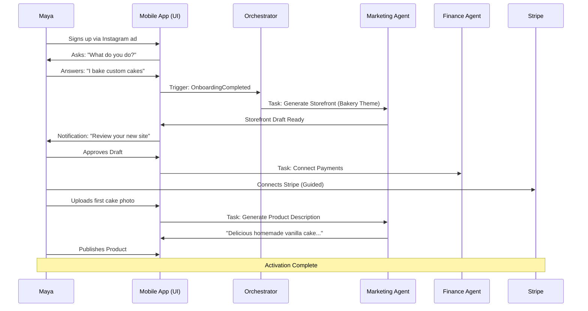
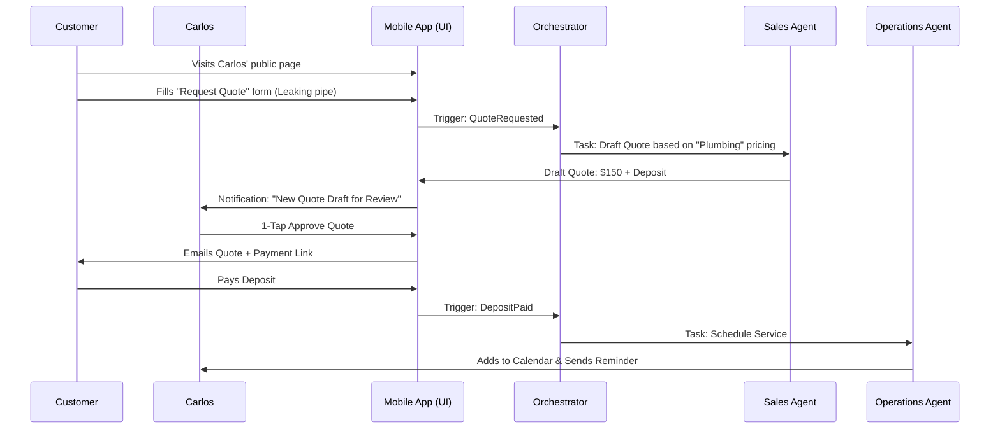
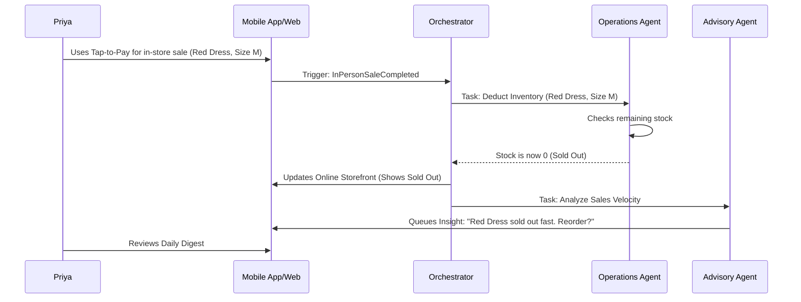
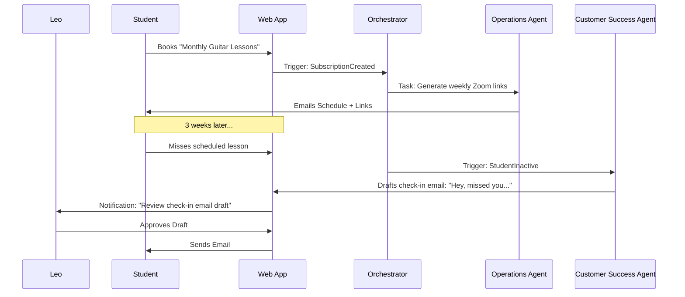
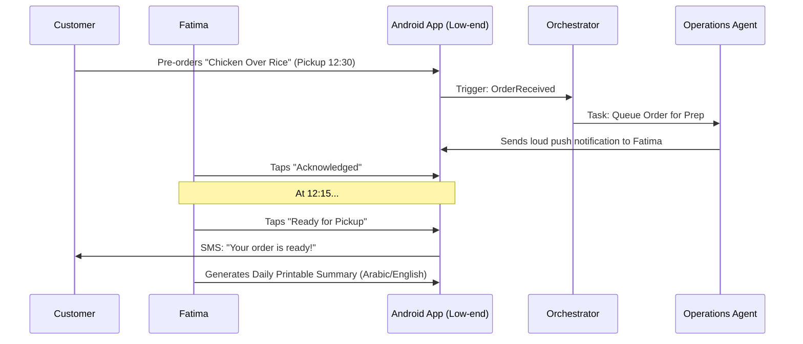

# Issue Brief: End-to-End Business Journey Architecture

## Problem Statement
Small business owners coming to OneHumanCorp (OHC) need a frictionless, delightful experience from discovery to their first sale and beyond. Currently, there is a risk of drop-off if the onboarding, activation, or daily management flows are not perfectly tailored to their non-technical background. To ensure OHC fulfills its promise of "zero to live business in under 10 minutes", we need a formally designed, end-to-end user journey architecture for each of our core personas. This architecture must define the critical user journeys (CUJs), identify potential friction points, and clearly specify the interactions between the user, the UI, and the underlying AI agents.

## Research Report
- **Market Gap**: Competitors like Shopify and Wix have general-purpose onboarding that often assumes some technical or design literacy. They focus on store creation rather than business operation. OHC's differentiation is being a "Business in a Box" that is mobile-first and AI-driven.
- **SMB Pain Points**:
    - High drop-off during complex setup wizards (e.g., configuring Stripe, setting up DNS).
    - "Blank page syndrome" when designing a storefront.
    - Lack of clear actionable steps after initial setup ("I built it, now what?").
- **Persona Diversity**: Our personas (Maya the baker, Carlos the handyman, Priya the boutique owner, Leo the tutor, Fatima the food cart operator) have distinct needs, ranging from simple product catalogs to complex booking and pre-order systems. The platform must dynamically adapt its onboarding and daily management UI to these specific use cases.
- **Key finding**: The journey must be structured into Acquisition, Onboarding, Activation, Retention, Revenue, and Referral. AI agents must be integrated seamlessly at each stage to reduce cognitive load.

## Design Doc

### High-Level Architecture
The Business Journey Architecture defines the user states and transitions within the OHC platform. It relies on the KAIROS Orchestrator to monitor user progress and trigger the appropriate AI agent interventions.

Key components:
1.  **Dynamic Onboarding Engine**: A wizard that collects minimal initial data (business name, primary goal) and delegates the rest (storefront generation, policy creation) to AI agents.
2.  **Activation Tracker**: Monitors the completion of core tasks (e.g., first product added, Stripe connected).
3.  **Proactive Dashboard (375px first)**: A unified mobile interface that prioritizes actionable items generated by the Business Advisory and Customer Success agents, rather than passive data displays.

### Sequence Diagrams (Mermaid.js)

#### 1. Maya (The Home Baker) - Acquisition to First Sale

#### 2. Carlos (The Handyman) - Booking and AI Quote

#### 3. Priya (The Boutique Owner) - Omni-channel Inventory

#### 4. Leo (The Music Tutor) - Subscription & Retention

#### 5. Fatima (Food Cart Operator) - High-Velocity Pre-orders

### Key Design Decisions
- **Frictionless Onboarding**: We must defer non-critical setup (like custom domains) until *after* the user has experienced their first "aha" moment (seeing their AI-generated storefront).
- **Proactive Interventions**: Agents should never wait to be asked. They must monitor the event stream (e.g., `InPersonSaleCompleted`, `StudentInactive`) and queue actionable drafts for the user.
- **Mobile-First Validation**: The primary interaction paradigm for approvals and insights must be designed for a 375px screen, utilizing 1-tap actions.

## Implementation Prompt
Implement the underlying orchestration logic to support the end-to-end business journeys defined in this architecture. Specifically, build the state machines or event handlers within the KAIROS Orchestrator that map domain events (e.g., `OnboardingCompleted`, `QuoteRequested`, `InPersonSaleCompleted`, `StudentInactive`, `OrderReceived`) to the appropriate AI Agent Department triggers. Ensure that high-risk actions (like sending quotes or emails) generate `PENDING` approval tasks in the database, while low-risk actions (like inventory deduction) execute automatically. Create comprehensive E2E tests validating these user flows from initial event to final UI state on the mobile dashboard.

## Priority
P0

## Estimated Scope
Large