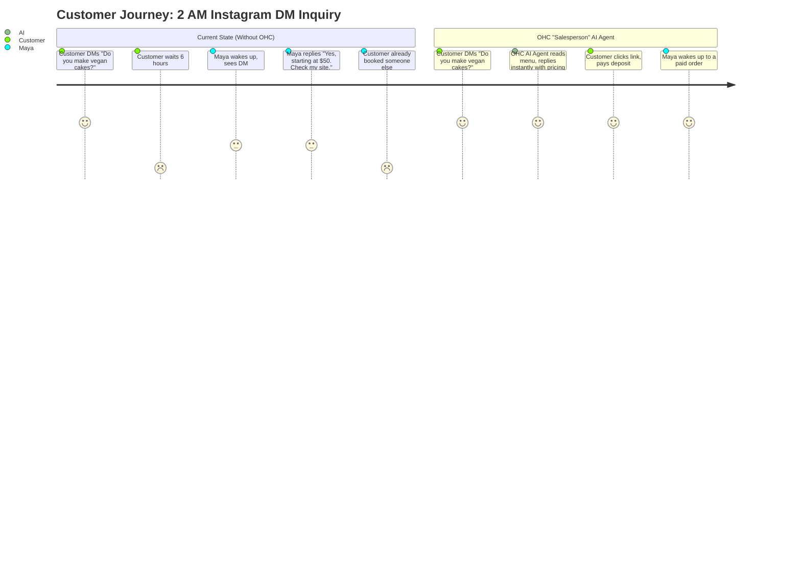
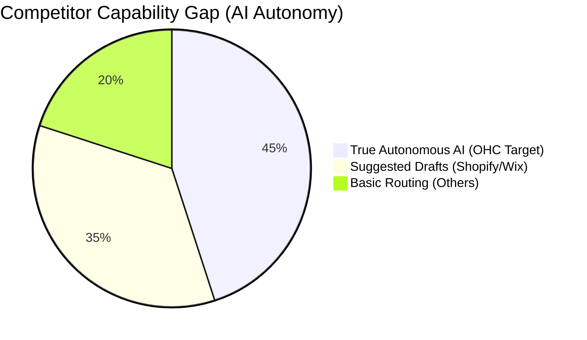

# Omnichannel AI Inbox for "The Salesperson" Agent

## Issue Tracker Information
```yaml
issue_id: "OHC-RES-1002"
```

## Problem Statement
Small business owners, especially those running operations entirely from their mobile phones, are overwhelmed by the fragmented nature of customer communications. They receive inquiries via Instagram DMs, WhatsApp, SMS, email, and their website's contact form. Missing a message often means losing a potential lead or frustrating an existing customer. Competitors like Shopify and Wix offer basic chat widgets or basic unified inboxes, but they lack autonomous AI capabilities to *resolve* inquiries on behalf of the owner while they sleep or work.

### Target Personas Pain Points
- **Maya (The Home Baker):** "I wake up to 15 Instagram DMs asking about cake pricing. I spend an hour copying and pasting the same answers. Sometimes I miss DMs and lose orders."
- **Carlos (The Freelance Handyman):** "I get texts, voicemails, and WhatsApp messages while I'm under a sink. I can't reply immediately, and customers move on to the next guy."
- **Priya (The Boutique Owner):** "Customers email about restocks, DM about sizes, and text my business line. I just want one place to see everything and have an assistant answer the basic questions."

## Research Report & Market Landscape

### Competitor Analysis

| Feature | OHC (Proposed) | Shopify | Wix | Squarespace | GoDaddy |
| :--- | :--- | :--- | :--- | :--- | :--- |
| **Unified Inbox** | ✅ Yes (All channels) | ✅ Yes (Shopify Inbox) | ✅ Yes (Wix Inbox) | ⚠️ Partial (Email focus) | ⚠️ Partial (Conversations) |
| **AI Auto-Reply** | ✅ Autonomous (Resolves) | ⚠️ Suggested drafts only | ⚠️ Suggested drafts only | ❌ No | ❌ No |
| **Channel Integrations** | ✅ IG, WA, SMS, Email, Web | ✅ IG, FB, Web | ✅ FB, IG, WA, Web | ⚠️ Web, Email | ✅ IG, FB, Web |
| **Mobile-First UX** | ✅ Native App & PWA (375px) | ⚠️ Clunky mobile app | ⚠️ Desktop-first | ❌ Poor mobile UX | ❌ Basic |
| **Action Generation** | ✅ Auto-creates quotes/links | ❌ Manual | ❌ Manual | ❌ Manual | ❌ Manual |

### User Journey Comparison (Maya receiving an IG DM at 2 AM)



### Feature Gap Analysis Heatmap



## Proposed Solution: The Omnichannel AI Inbox

A centralized inbox integrated into the OHC Mobile App, managed by "The Salesperson" (Sales & Acquisition) and "The Ambassador" (Customer Success) AI Agents.

### Key Capabilities
1. **Universal Aggregation:** Merges Instagram DMs, WhatsApp Business, SMS (via Twilio integration), Email, and Web Chat into a single conversational thread per customer.
2. **Contextual AI Autonomy:** The AI Agent reads the incoming message, accesses the tenant's knowledge base (products, pricing, schedule), and *autonomously replies* if it has high confidence.
3. **Action Triggers:** The AI can generate Stripe Payment Links, booking calendar links, or custom quotes directly within the chat.
4. **Human Handoff:** If the AI is unsure, it drafts a response and notifies the business owner on their mobile device for approval or editing.

### Design Architecture & UX Flow

- **Entity Types:** `Conversation`, `Message`, `Channel` (IG, WA, SMS), `Participant` (Customer, Owner, AI_Agent).
- **Mobile UX (375px):**
  - **Inbox View:** Simple list of active conversations with unread indicators. Channel icons (e.g., small IG logo) show the source.
  - **Thread View:** Native chat interface. Messages colored by sender. AI actions (e.g., "AI sent a payment link") appear as distinct cards in the timeline.
  - **Agent Toggle:** A simple switch at the top: "AI Auto-Reply: ON/OFF".

## Implementation Prompt

Develop the backend infrastructure for the Omnichannel AI Inbox, focusing on the event-driven architecture required to ingest messages from multiple webhooks, route them to the AI Agent Queue, and broadcast updates to the Flutter client via the Teammate Mesh.

**Critical User Journey (CUJ) to Implement/Test:**
1. A simulated incoming webhook payload (e.g., Instagram DM) is received by the backend.
2. The system creates or updates a `Conversation` record for the tenant.
3. An AI job is enqueued to process the message.
4. The AI Agent processes the message and generates a response.
5. The response is saved and broadcasted to the frontend via the Teammate Mesh.

**Acceptance Criteria:**
- Unified `Message` schema that supports text, media, and structured actions (quotes/links).
- Idempotent webhook processing to handle duplicate deliveries from Meta/Twilio.
- AI Agent integration point (mocked for the CUJ test) that reads context and returns a response.
- 100% E2E test coverage for the message ingestion and AI reply loop.

## Metadata
- **Priority:** P0
- **Estimated Scope:** Large
