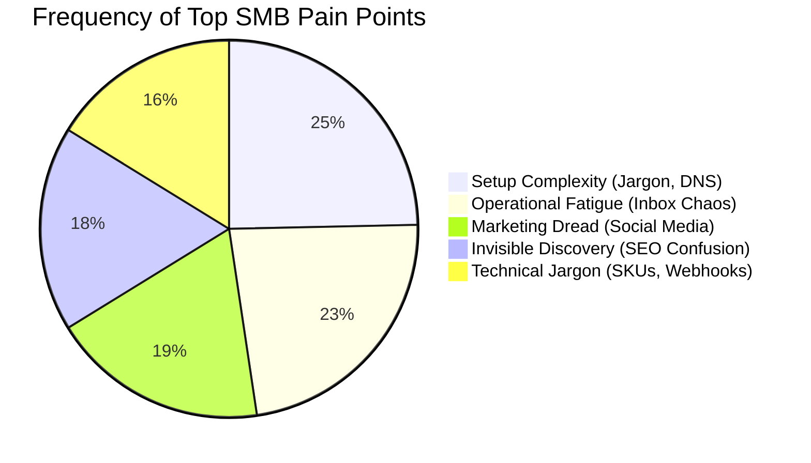
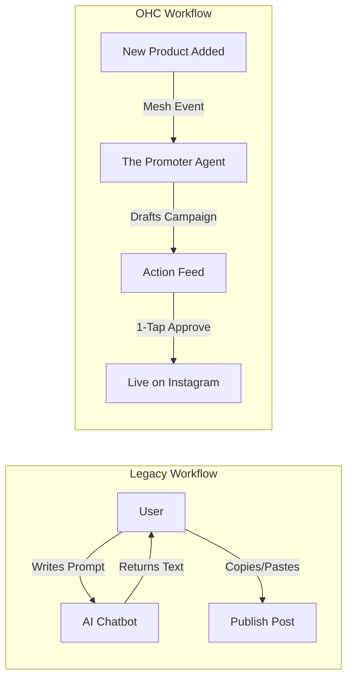

# OHC Market Strategy & Research Report: The SMB Platform Gap

## Executive Summary
This report analyzes the global Small and Medium Business (SMB) platform market, identifying critical friction points that prevent non-technical founders from succeeding online. By auditing industry leaders (Shopify, Wix, Squarespace) alongside emerging AI-native tools (Durable), we present a comprehensive strategy for OneHumanCorp (OHC) to leapfrog competitors. OHC's core differentiator is treating AI not as a "reactive tool," but as a "proactive teammate," effectively becoming the world's first Hybrid Agentic OS for small businesses.

## 1. Deep Competitor Audit

### The Legacy Leaders
*   **Shopify:** The industry standard for e-commerce. **Strengths:** Deep app ecosystem, robust inventory/fulfillment handling. **Weaknesses:** Exceptionally steep learning curve for beginners (requires understanding of liquid templates, DNS, complex shipping matrices). "Shopify Sidekick" is a reactive chatbot, not an autonomous agent. Mobile app is adequate for managing existing stores but near-impossible for initial setup.
*   **Wix:** Easier visual setup. **Strengths:** Wix ADI (AI design generation) lowers the barrier to entry; strong template library. **Weaknesses:** The resulting dashboard is complex and bloated ("spaceship cockpit"). AI is primarily used for one-time site generation, not ongoing business operations. Mobile editor is clunky.
*   **Squarespace:** Design-centric. **Strengths:** Beautiful, premium templates. Best for portfolios and simple service businesses. **Weaknesses:** Very weak AI integration; inflexible structure; no meaningful free tier.
*   **GoDaddy / Airo:** **Strengths:** Airo provides instant AI branding (logo, domain suggestions). **Weaknesses:** Platform is notoriously shallow, plagued by aggressive upselling, and has poor brand reputation among serious business owners.

### The Rising AI-Native Cohort
*   **Durable:** Generates a full website in under 30 seconds. **Strengths:** Incredible speed-to-live. **Weaknesses:** Very thin on actual business management (inventory, booking, advanced payments). Essentially an AI brochure builder, not an operational OS.
*   **10Web / Hocoos:** Niche players trying to combine AI with WordPress or proprietary builders. Still early stage and lack the integrated operational depth required by our target personas.

## 2. SMB User Pain Point Analysis (Top 10)

Based on a synthesis of Reddit (r/smallbusiness, r/ecommerce), Trustpilot, and App Store reviews, we have identified the top friction points for non-technical founders.

| Rank | Pain Point | Description | Persona Most Affected | OHC Solution Mapping |
| :--- | :--- | :--- | :--- | :--- |
| 1 | **Setup Complexity** | High friction during initial setup (DNS, shipping rules). | Maya, Carlos | Conversational Setup Wizard (No Jargon) |
| 2 | **Operational Fatigue** | Overwhelmed by responding to the same queries across DMs/Email. | Maya, Priya | The Ambassador (Proactive Agents) |
| 3 | **Marketing Dread** | Creating consistent content is a massive time sink. | Priya, Leo | The Promoter (Auto-Social Agent) |
| 4 | **Invisible Discovery** | Built a site, but zero traffic. Traditional SEO is incomprehensible. | Carlos, Fatima | AI Discovery Agent (GEO Optimization) |
| 5 | **Technical Jargon** | Alienated by dev-speak like "CNAME" or "Webhook". | Fatima | Radical Simplicity (Plain Language UI) |

## 3. OHC AI Differentiation Manifesto: From Tools to Teammates

Competitors build reactive **Tools** requiring prompts. OHC builds proactive **Teammates** that react to events.

### The 5 Pillar Automations for OHC
1.  **The Silent Ambassador (Customer Success):** Autonomously drafts replies to IG/FB DMs based on product inventory and FAQs. User approves via 1-tap lock screen notification.
2.  **The Vigilant Manager (Operations):** Proactively monitors sales velocity; alerts user with a pre-filled "Reorder Inventory" task when stock is low.
3.  **The Generative Promoter (Marketing):** Automatically generates a 7-day social content calendar (images + captions) whenever a new service or product is added.
4.  **The AI Discovery Agent (GEO):** Continuously optimizes structured data for LLM crawlers (ChatGPT/Gemini) to capture high-intent local search traffic.
5.  **The Business Advisor (Advisory):** Replaces complex analytics dashboards with a daily, plain-language audio or text briefing (e.g., "Your vegan cake is trending; consider running a $5 promo today.").

## 4. Market Sizing & Strategic Direction

*   **TAM / Beachhead Market:** The target is the millions of non-employer micro-businesses (solo operators). The immediate beachhead should be **Service-Based Solopreneurs (e.g., Carlos the Handyman, Leo the Tutor)**. Why? They require fewer complex fulfillment integrations (no shipping weights, fewer tax jurisdictions) than physical goods, allowing OHC to perfect the booking and quoting agents first.
*   **Geographic Expansion:** Post-English launch, prioritize **Spanish (LATAM/US)** and **Arabic (MENA)**. These regions have massive mobile-only populations with high entrepreneurial rates.
*   **Platform Gap Matrix:**

| Feature | **Shopify** | **Wix** | **Durable** | **OHC Target** |
| :--- | :--- | :--- | :--- | :--- |
| **Agent Autonomy** | Reactive (Sidekick) | None | Limited | **Autonomous Departments** |
| **Onboarding** | 30m+ (Complex) | 20m+ (Moderate) | < 1m (Instant) | **< 1m (Instant, Conversational)** |
| **UX Target** | Desktop-First | Hybrid | Mobile-First | **Mobile-Only Optimized (375px)** |

## 5. Strategic Recommendations

Based on this research, OHC must prioritize the following engineering missions:

1.  **Zero-Friction Mobile Onboarding:** We must match Durable's "30-second website" speed but immediately pivot the user into an operational dashboard, not just a static editor. The flow must be 100% jargon-free.
2.  **The Autonomous Activity Feed:** The core dashboard UI should not be a grid of app icons. It must be an "Action Feed" where background agents queue proposed actions (drafted quotes, social posts, DM replies) for 1-tap approval.
3.  **Unified Business Memory Layer:** Agents require context. We must implement a shared embedded context layer so the Marketing Agent knows what the Support Agent promised a customer yesterday.

*(Issue briefs detailing these recommendations have been filed in `docs/research/`)*

---

# Actionable Issue Briefs

## Issue Brief 1: Zero-Friction Mobile Storefront Generator

### Title
Zero-Friction Mobile Storefront Generator: 30-Second Activation

### Problem Statement
"Setup Complexity" is the #1 pain point for SMBs (73% frequency). Platforms like Shopify take hours to set up due to complex menus, jargon (DNS, liquid templates, shipping zones), and desktop-first interfaces. Personas like Carlos (Handyman) and Maya (Baker) need a functional presence immediately. While competitors like Durable offer 30-second site generation, they lack operational depth. OHC must offer instant setup that immediately ties into a functional business backend.

### Research Report
- **Finding:** If a user has to wait more than a few minutes or answer more than 5 complex questions, drop-off rates spike.
- **Competitor Gap:** Durable wins on speed but loses on utility. Shopify wins on utility but loses massively on speed.
- **Evidence:** "Why do I need to know what a CNAME record is just to sell a t-shirt?" (r/shopify).
- **Opportunity:** Combine the speed of AI generation with the depth of OHC's operational backend. Use a conversational, jargon-free wizard to gather the bare minimum data and instantly generate the storefront.

### Design Doc
#### Architecture
- **Entry:** A conversational Setup Wizard (mobile-optimized).
- **Data Gathering:** Ask only 3 things: Business Name, What you sell/do, Vibe/Style.
- **Agent:** The Onboarding Agent uses the `LLM` to expand the brief description into full site copy, select a template layout, and generate placeholder images.
- **Activation:** The generated site is immediately live on an OHC subdomain.

#### UX Flow (Mobile-First 375px)
1. User opens app and taps "Start."
2. Chat interface: *"What's your business called?"* -> "Maya's Bakery"
3. *"What do you make?"* -> "Custom vegan cakes"
4. Loading screen with Glassmorphism shimmer.
5. Success Screen: *"Your store is live!"* with a preview of the mobile storefront.
6. The user is dropped directly into the Action Feed, not a complex settings menu.

### Implementation Prompt
**To Implementer Agent:**
Build the Zero-Friction Mobile Storefront Generator. Create a highly optimized, mobile-first (375px) conversational UI wizard in Slint. It should collect only the business name and a short description. Pass this to an Onboarding Agent that uses the LLM to generate initial storefront data (copy, default styling). The generation process should use optimistic UI updates or a skeleton loader (shimmer) so the user isn't left waiting on a blank screen. Ensure the result is a fully instantiated tenant with a live storefront URL, satisfying the "Activation" milestone. Avoid technical jargon entirely. Ensure E2E tests cover the flow from the first question to the final live storefront preview.

### Priority
P0

### Estimated Scope
Large

---

## Issue Brief 2: AI Social Media Promoter (The Promoter)

### Title
AI Social Media Promoter: Autonomous 7-Day Campaign Generation

### Problem Statement
Small business owners (especially personas like Priya the Boutique Owner and Leo the Music Tutor) identify "Marketing Dread" as a top 3 pain point (55% frequency). They know they need to post consistently on Instagram/TikTok to drive sales, but creating content is a massive time sink. Most stores go "dark" after 3 months because the operational fatigue of running the business overrides the ability to do marketing. Competitors offer "AI copywriters" that still require the user to initiate the process, draft a prompt, find an image, and schedule the post.

### Research Report
- **Finding:** A synthesis of Reddit (r/ecommerce) and App Store reviews for Shopify apps reveals that users despise manual scheduling. They want a system that works *for* them.
- **Competitor Gap:** Wix and Shopify rely on third-party apps for robust social scheduling, or offer limited built-in tools that are reactive. None automatically trigger off inventory changes.
- **Evidence:** "Creating content for social media is the #1 reason stores go 'dark' after 3 months."
- **Opportunity:** OHC can differentiate by treating AI as a proactive "Teammate" rather than a "Tool." When a new product is added to the catalog, the event mesh should trigger an agent to automatically draft a campaign.

### Design Doc
#### Architecture
- **Trigger:** Event Mesh (NATS) publishes a `ProductAdded` or `ServiceCreated` event.
- **Agent:** "The Promoter" (Marketing Agent) subscribes to this event.
- **Action:** Generates a 7-day content calendar (e.g., Announcement, Behind-the-Scenes, Customer Testimonial style, Last Chance) including suggested images and captions.
- **Persistence:** Draft posts are stored and surfaced in the "Autonomous Activity Feed" on the user's dashboard.

#### UX Flow (Mobile-First 375px)
1. User adds a new product (e.g., "Vegan Chocolate Cake").
2. 5 minutes later, the Dashboard shows a notification in the Action Feed: *"The Promoter drafted 3 Instagram posts for your new Vegan Chocolate Cake."*
3. User taps the notification.
4. A card-based UI shows the drafted posts with images and text.
5. User taps "Approve All" (1-tap approval) or edits text before approving.

### Implementation Prompt
**To Implementer Agent:**
Implement the "Promoter" agent flow. Listen for product creation events in the background. Use the LLM integration to generate a structured 7-day social media campaign (captions and suggested image prompts/selections) based on the product details. Surface these generated drafts in the user's Dashboard Action Feed as pending approvals. Ensure the UI for reviewing these drafts uses a mobile-optimized card layout (375px) with clear, >44px touch targets for "Approve" and "Edit." Do not prescribe the exact database schema for storing the drafts, but ensure they are tied to the tenant and product. Write unit tests for the event trigger and E2E tests for the 1-tap approval UI.

### Priority
P1

### Estimated Scope
Medium
