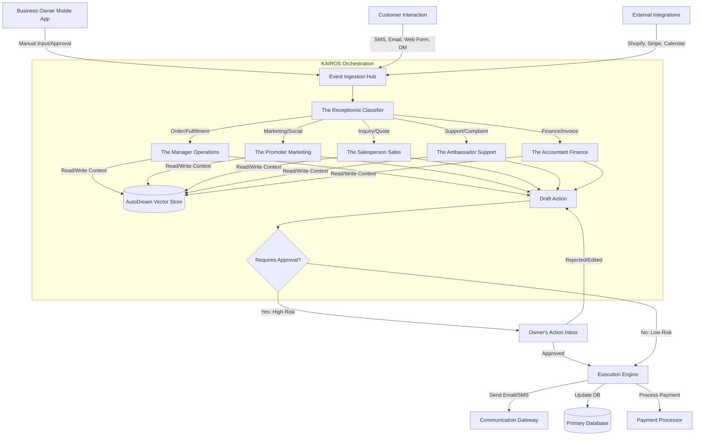
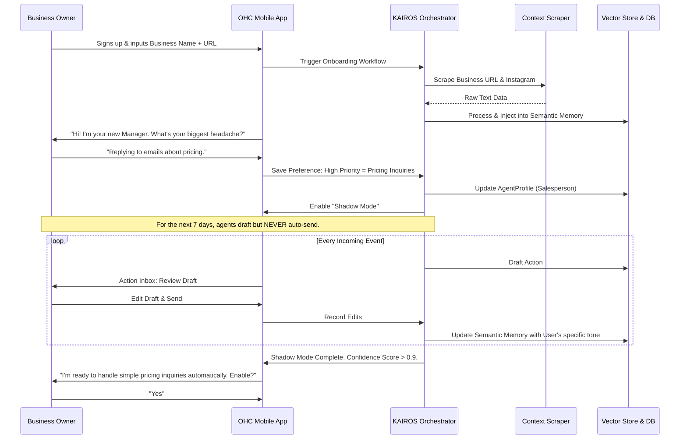
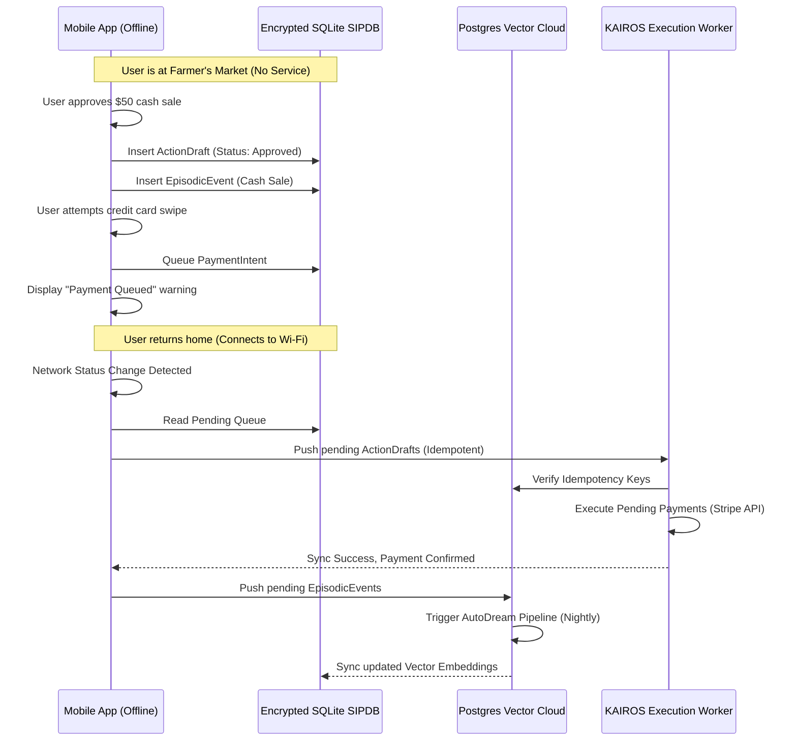

# AI Agent Department Architecture

## Problem Statement

Small business owners—whether operating a bustling food cart, a boutique clothing store, or an independent tutoring service—are completely overwhelmed by the fragmented digital landscape. Maya, a 28-year-old baker selling custom vegan cakes on Instagram, spends 3 hours every evening manually tracking orders, answering the exact same questions via DM ("Do you offer gluten-free?"), taking payments via Zelle, and handwriting packing slips. Carlos, a 42-year-old handyman, loses 40% of his potential leads because he’s on a roof when his phone rings, and he doesn't have a website to automatically capture booking requests.

The software industry's traditional solution to this is to give these owners a "dashboard" with 15 different tabs, complex CRM settings, API webhooks, and analytics funnels. This completely misunderstands the user. A small business owner is not a system administrator. They do not want to configure automated email sequences; they want the emails to simply be sent. They do not want to set up Zapier integrations between their booking page and their accounting software; they want their schedule and their money to just work together.

The pain point is acute: non-technical business owners are forced to learn how to operate disjointed software systems rather than focusing on the craft that makes them money. When software fails or requires a steep learning curve, they abandon it, reverting to chaotic combinations of pen, paper, and personal phone calls.

This research proposes an **AI Agent Department Architecture**. Instead of presenting the user with complex software modules, we provide them with "digital employees" organized into familiar, real-world departments. Just as a real business hires a Manager to handle operations or a Salesperson to handle quotes, OneHumanCorp (OHC) will deploy AI agents that run invisibly in the background, handling the complexity of modern digital commerce so the owner never has to see it.

## Research Report

### Competitive Analysis

To understand the current market failure, we conducted a deep-dive evaluation of the primary tools small business owners currently attempt to use to solve their operational overhead.

#### 1. Shopify
**Target Audience:** E-commerce heavy, physical products.
**The Promise:** "Build your online store in minutes."
**The Reality for Maya (Baker):** Shopify forces Maya into a traditional shopping cart paradigm. To handle custom cake deposits, she needs to install third-party apps ($15/mo each) that inject complex liquid code into her theme. The concept of "variants" vs "options" requires a learning curve. There is no built-in way to seamlessly reply to an Instagram DM and convert it to a custom cart link without jumping through Hootsuite or Shopify Inbox, which requires her to manually draft the reply.
**Conclusion:** Too rigid for service/custom businesses; relies heavily on manual configuration and third-party app bloat.

#### 2. Wix / Squarespace
**Target Audience:** Portfolio, service businesses, light e-commerce.
**The Promise:** "Stunning websites made easy."
**The Reality for Carlos (Handyman):** While visually appealing, these platforms are fundamentally static brochure builders. Carlos can add a "Contact Form," but then he has to manually monitor his email, manually type up a quote based on the form details, and manually send a separate PayPal invoice. The "scheduling" add-ons exist, but they are generic and require him to define strict availability hours, which doesn't work for a mobile handyman whose travel time varies wildly.
**Conclusion:** Great for looking good, terrible for running the actual operational loop of a dynamic business.

#### 3. GoDaddy
**Target Audience:** Domain buyers attempting to build a quick presence.
**The Promise:** "Everything in one place."
**The Reality for Priya (Boutique Owner):** GoDaddy's website builder is simple, but its inventory management is rudimentary. It lacks the ability to handle complex point-of-sale (POS) synchronization effectively without expensive upgrades. More importantly, it relies on traditional "email marketing" blasts rather than intelligent, context-aware follow-ups.
**Conclusion:** Too basic for a growing business, ultimately leading to platform migration once the business scales.

#### 4. Specialized CRM (Jobber, HoneyBook)
**Target Audience:** Field service, creatives.
**The Promise:** "Manage your workflow."
**The Reality:** These are incredibly powerful, but they require the owner to completely change how they work to fit the software's paradigm. They are complex databases disguised as apps. A non-technical user often opens the dashboard, sees pipelines, stages, and custom fields, and immediately closes the app out of intimidation.
**Conclusion:** Powerful, but violates the "zero configuration" requirement.

### The OHC Advantage: The "Invisible Software" Paradigm

The core finding of this research is that **software must become invisible.** The business owner should only interact with the results of the software, not the configuration of it.

If Carlos receives a request for a roof repair via SMS, the system should not force him to open a CRM, create a new Contact record, create a new Deal, and draft a quote. Instead, the AI Agent (The Salesperson) should read the SMS, understand Carlos's pricing model (from past jobs), generate a quote, text Carlos a simple summary ("Roof job for John, 3 hours, $450. Send?"), and wait for Carlos to hit "Yes".

### Departmental Breakdown and Real-World Evaluation

We propose structuring the AI agents into seven distinct departments. Each department operates autonomously but shares a common long-term memory (AutoDream Pipeline vector store) to ensure consistency.

#### 1. Operations ("The Manager")
*   **Role:** The backbone of fulfillment and scheduling.
*   **Real-world scenario:** Fatima (Food Cart) receives 50 pre-orders for Friday lunch.
*   **Current pain:** Fatima has to manually tally the orders, calculate the ingredients needed, and print a spreadsheet.
*   **Agent action:** "The Manager" agent aggregates the orders, generates a consolidated shopping list based on recipe breakdowns stored in memory, and sends a push notification: "You need 15 lbs of chicken for Friday. All orders paid."

#### 2. Marketing & Advertising ("The Promoter")
*   **Role:** Generating demand and maintaining public presence.
*   **Real-world scenario:** Leo (Music Tutor) needs to fill a cancelled Tuesday slot.
*   **Current pain:** Leo has to manually post on Instagram and email his entire list, seeming desperate.
*   **Agent action:** "The Promoter" identifies students who haven't booked in 3 weeks, drafts a personalized SMS ("Hey Sarah, I have a sudden opening next Tuesday at 4 PM, want to grab it?"), and handles the booking automatically if Sarah replies yes.

#### 3. Sales & Acquisition ("The Salesperson")
*   **Role:** Converting leads into paying customers.
*   **Real-world scenario:** Maya (Baker) gets a DM at 2 AM: "Can you do a 3-tier wedding cake for October 12th?"
*   **Current pain:** Maya loses the lead because she doesn't reply until 9 AM, by which time the bride has messaged three other bakers.
*   **Agent action:** "The Salesperson" replies instantly: "Hi! Yes, we have availability for Oct 12th. Our 3-tier cakes start at $300. Would you like me to send over our flavor guide and a deposit link to hold the date?"

#### 4. Customer Success ("The Ambassador")
*   **Role:** Handling post-sale support and retention.
*   **Real-world scenario:** Priya (Boutique) ships a dress that arrives damaged.
*   **Current pain:** An angry email arrives. Priya has to apologize, manually process a refund in Stripe, and update inventory.
*   **Agent action:** "The Ambassador" reads the email, identifies the order, drafts an empathetic reply offering a replacement or refund, and queues the refund in the OHC system, awaiting Priya's one-tap approval.

#### 5. Finance & Payments ("The Accountant")
*   **Role:** Tracking money, taxes, and subscriptions.
*   **Real-world scenario:** Carlos (Handyman) needs to know if he made a profit this month.
*   **Current pain:** Carlos looks at his bank account balance, which doesn't account for upcoming expenses or unpaid invoices.
*   **Agent action:** "The Accountant" reconciles completed jobs vs. material costs (scanned from receipts) and provides a plain-language summary: "You made $4,200 profit this month. 3 clients still owe you money, should I send a reminder?"

#### 6. Legal & Compliance ("The Protector")
*   **Role:** Ensuring the business operates safely.
*   **Real-world scenario:** Maya (Baker) needs a liability waiver for a massive corporate catering gig.
*   **Current pain:** Maya Googles "catering contract template," gets confused by the legal jargon, and sends a poorly formatted Word doc.
*   **Agent action:** "The Protector" identifies the size of the order, generates a standard, legally sound liability waiver specific to food service in her state, and attaches it automatically to the invoice for digital signature.

#### 7. Business Advisory ("The Advisor")
*   **Role:** Strategic oversight and growth recommendations.
*   **Real-world scenario:** Fatima (Food Cart) is selling out of her lamb over rice every day by 1 PM.
*   **Current pain:** Fatima doesn't realize she's leaving money on the table because she's too busy cooking.
*   **Agent action:** "The Advisor" analyzes the daily sales velocity and sends a weekly insight: "You sold out of Lamb by 1 PM four times this week. Recommendation: Increase price by $1.50 or prep 20% more next week."


### Deep Dive: The Operations Department ("The Manager")

The Operations department is the engine room of the business. Unlike the other departments which primarily deal with text generation, the Manager must interface deeply with the physical world and concrete scheduling constraints.

#### Core Competencies
1. **Inventory Control:** Maintaining a real-time ledger of physical goods, triggering reorder workflows when stock dips below dynamically calculated thresholds (based on recent sales velocity).
2. **Fulfillment Orchestration:** Tracking the lifecycle of an order from payment to delivery. Generating packing slips, printing shipping labels, and updating tracking numbers.
3. **Resource Scheduling:** For service businesses, managing calendar availability, travel time between appointments, and equipment reservations.

#### UX Flow: The "Stock Out" Scenario
1. **Trigger:** The last unit of "Blue Denim Jacket - Size M" is sold.
2. **Analysis:** The Manager agent checks the supplier catalog for lead times and the current sales velocity. It determines it will take 5 days to restock, and they are selling 2 per day.
3. **Action Draft:** The Manager places a card in the owner's Action Inbox: "Blue Denim Jacket (Size M) is sold out. Based on recent sales, I recommend ordering 20 more. It will cost $400 from Supplier X."
4. **Owner Interaction:** The owner taps the card. They see a button: "Approve Purchase Order".
5. **Execution:** Upon approval, The Manager agent generates the PO, sends it to the supplier via email, and updates the internal inventory ledger to show "20 incoming".

### Deep Dive: The Marketing Department ("The Promoter")

The Marketing department's goal is to acquire new customers and increase the lifetime value (LTV) of existing ones without the owner ever needing to understand concepts like "CAC" (Customer Acquisition Cost) or "CTR" (Click-Through Rate).

#### Core Competencies
1. **Content Generation:** Creating Instagram captions, blog posts, and newsletter copy that perfectly matches the brand's unique voice.
2. **Campaign Management:** Identifying segments of the customer base (e.g., "Hasn't purchased in 6 months") and running targeted re-engagement campaigns.
3. **Website Optimization:** Continuously analyzing the website's performance and making subtle adjustments to copy or layout to improve conversion rates (A/B testing running invisibly).

#### UX Flow: The "Slow Tuesday" Scenario
1. **Trigger:** The calendar for Tuesday is completely empty for Carlos (Handyman).
2. **Analysis:** The Promoter checks the vector store for previous customers who requested "seasonal maintenance" (like gutter cleaning in the Fall) but haven't booked yet this year.
3. **Action Draft:** The Promoter drafts an SMS campaign targeting these 15 specific customers.
4. **Owner Interaction:** Action Inbox card: "Tuesday is empty. I drafted a message to 15 past clients offering a quick gutter cleaning special to fill the day."
5. **Execution:** Owner taps "Approve". The SMS messages go out. If a client replies "Yes", the Salesperson agent takes over the conversation to finalize the booking.

### Deep Dive: The Sales Department ("The Salesperson")

The Salesperson is the most critical agent for immediate revenue generation. Its primary job is to respond instantly to inquiries, qualify leads, and close deals.

#### Core Competencies
1. **Instant Response:** Replying to inquiries across all channels (Web form, SMS, Instagram DM, Facebook Messenger) within 60 seconds.
2. **Quote Generation:** Using past job data, pricing lists, and context to generate accurate quotes for custom work.
3. **Objection Handling:** Politely addressing customer concerns about price or timeline without giving away unnecessary discounts.

#### UX Flow: The "Custom Request" Scenario
1. **Trigger:** A customer submits a form: "I need a website built for my new dog walking business. How much?"
2. **Analysis:** The Salesperson reviews the owner's past web design projects. It notes that a standard 5-page site typically costs $1500.
3. **Action Draft:** It drafts a reply: "Hi there! I'd love to help with your dog walking site. A standard 5-page site usually runs about $1,500. To give you a precise quote, do you need features like a booking calendar?"
4. **Owner Interaction:** For the first 10 interactions, the system routes this to the Action Inbox for approval to train the model. Once the confidence score is high enough (and the owner permits it), the Salesperson can send these initial qualifying messages autonomously.

### Deep Dive: The Customer Success Department ("The Ambassador")

The Ambassador focuses on retention and reputation management. It turns unhappy customers into loyal ones and happy customers into vocal advocates.

#### Core Competencies
1. **Review Farming:** Automatically identifying delighted customers (based on positive email replies or successful project completions) and requesting Google/Yelp reviews.
2. **Issue Resolution:** Handling simple support queries ("Where is my order?") autonomously by checking the Operations database.
3. **De-escalation:** Identifying angry customers via sentiment analysis and fast-tracking them to human review or offering immediate, pre-approved appeasements (e.g., a 10% refund for a late delivery).

#### UX Flow: The "Lost Package" Scenario
1. **Trigger:** Customer emails: "It's been a week and my package hasn't arrived!"
2. **Analysis:** The Ambassador checks the tracking API. It sees the package is delayed due to weather.
3. **Action Draft:** "Hi [Name], I'm so sorry! I just checked with USPS and your package is delayed due to the storms in the Midwest. It should arrive by Thursday. If it doesn't, let me know and I'll send a replacement immediately."
4. **Execution:** This is a low-risk, high-confidence response. Based on the owner's settings, the Ambassador might send this autonomously and simply log it in the daily brief.

### Deep Dive: The Finance Department ("The Accountant")

The Accountant removes the fear and confusion of bookkeeping. It translates standard accounting principles into plain language insights.

#### Core Competencies
1. **Expense Tracking:** Parsing receipts (via photo upload) and categorizing them automatically.
2. **Cash Flow Forecasting:** Analyzing upcoming recurring bills against pending invoices to warn the owner of potential cash crunches.
3. **Tax Preparation:** Categorizing income and expenses to generate a clean, exportable report for tax season, ensuring all deductions are captured.

#### UX Flow: The "Missing Payment" Scenario
1. **Trigger:** An invoice for a $500 catering gig is 3 days past due.
2. **Analysis:** The Accountant notes the overdue status and reviews the client's payment history (they usually pay on time).
3. **Action Draft:** It drafts a polite reminder email: "Hi [Client], just a friendly reminder that the invoice for last week's catering is due. Here's a quick link to pay online."
4. **Owner Interaction:** Action Inbox card: "Invoice #104 is late. Send reminder?"
5. **Execution:** Owner taps "Approve". The email is sent.

### Deep Dive: The Legal Department ("The Protector")

The Protector ensures the business is operating safely and legally, without requiring expensive lawyer retainers for basic needs.

#### Core Competencies
1. **Contract Generation:** Creating NDAs, service agreements, and liability waivers tailored to the specific job details.
2. **Compliance Monitoring:** Ensuring the website has the necessary privacy policies and cookie banners required for their operating region (GDPR, CCPA).
3. **License Tracking:** Reminding the owner when professional licenses or insurance policies are up for renewal.

#### UX Flow: The "New Employee" Scenario
1. **Trigger:** The owner adds a new "Team Member" in the OHC settings.
2. **Analysis:** The Protector identifies this as a new hire event.
3. **Action Draft:** It generates a standard employment agreement, W-4 form, and direct deposit authorization form.
4. **Owner Interaction:** Action Inbox card: "You added a new team member. I've prepared their onboarding paperwork. Review and send?"
5. **Execution:** The documents are sent to the new employee via a secure digital signature platform.

### Deep Dive: The Business Advisory Department ("The Advisor")

The Advisor acts as the virtual Chief Operating Officer (COO). It looks at the big picture, analyzes trends, and provides strategic recommendations.

#### Core Competencies
1. **Trend Analysis:** Identifying seasonal patterns or shifts in customer preferences before the owner notices them.
2. **Pricing Optimization:** Recommending price increases based on high demand or increased material costs.
3. **Competitive Benchmarking:** Comparing the business's performance against anonymized data from similar businesses on the OHC platform.

#### UX Flow: The "Underpriced Service" Scenario
1. **Trigger:** The Advisor runs its weekly analysis.
2. **Analysis:** It notices that Carlos (Handyman) is booked solid 3 weeks in advance for deck repairs, and his material costs have increased by 15%, squeezing his margins.
3. **Action Draft:** It generates a strategic insight report.
4. **Owner Interaction:** The owner receives their Weekly Briefing. A card reads: "Your deck repair service is highly sought after, but your profit margin has dropped to 12%. I recommend increasing your base price from $500 to $650. You will likely lose 10% of leads, but overall profit will increase by 22%."
5. **Execution:** If the owner approves, the pricing is updated automatically across the website, the Salesperson's context, and all future quotes.

## Design Doc

### Architecture Summary

The AI Agent Department architecture leverages the existing KAIROS Orchestration engine. The system acts as a central nervous system for the small business.

1.  **Ingestion Layer:** Webhooks, direct API calls from the mobile/desktop app, and integrations (e.g., email parsing, SMS).
2.  **Routing Layer (The Receptionist):** A lightweight classifier model that determines which department should handle an incoming event.
3.  **Departmental Agents:** Specialized LLM prompts executing specific tool sets.
4.  **Action Queue:** A durable queue holding drafted actions waiting for user approval.
5.  **Execution Engine:** The system that actually sends the email, charges the card, or updates the database.
6.  **Memory Store:** The AutoDream Pipeline (PostgreSQL/SQLite vector).

### Architecture Diagram (Mermaid.js)



### Mobile UX Flow (375px First)

The business owner experiences this complexity through a brutally simple, single-stream interface on their mobile device: **The Action Inbox**.

#### Core Philosophy
The owner should not have to navigate to a "Marketing" tab or a "Finance" tab. Everything that requires their attention appears in a unified, chronological feed.

#### Screen 1: The Daily Brief (Home Screen)
*   **Header:** Clean, glassmorphism styling. "Good morning, Maya."
*   **Top Metric:** Large, clear numbers. "Sales Today: $450" (using the Outfit font).
*   **The Feed (Inter font):** A list of cards, each representing an agent's drafted action or summary.
    *   *Card 1 (The Manager):* "3 cake orders need to be baked for tomorrow. View Prep List."
    *   *Card 2 (The Salesperson):* "Drafted a quote for John's wedding cake ($800). [Approve & Send] [Edit]"
    *   *Card 3 (The Accountant):* "Your monthly server hosting bill was paid ($15). Logged as expense."

#### Screen 2: Action Approval Detail (e.g., The Salesperson's Quote)
When Maya taps Card 2, a sliding modal appears (entrance animation < 300ms, cubic-bezier(0.4, 0, 0.2, 1)).
*   **Context:** A brief snippet of the customer's request ("John asked for a 3-tier chocolate cake for Oct 12").
*   **The Draft:** The exact message the AI drafted. "Hi John, I'd love to make your cake! A 3-tier chocolate cake for Oct 12th will be $800. Click here to pay the deposit."
*   **Actions:**
    *   Huge primary button: "Approve & Send"
    *   Secondary button: "Edit Message"
    *   Tertiary link: "Reject"

#### Screen 3: Department Settings (The "Staff Room")
If the owner wants to tweak how an agent behaves, they go to the "Staff Room."
*   List of avatars representing the agents.
*   Tapping "The Salesperson" opens a simple chat interface.
*   The owner types: "Stop offering discounts to new customers."
*   The agent replies: "Understood. I will no longer offer the standard 10% welcome discount on future quotes." (This automatically updates the agent's system prompt/memory).

### Multi-Tenant SaaS Tier Alignment

The availability of these departments aligns with the established pricing tiers:

*   **Free ($0):** 1 Department. Usually "The Manager" for basic catalog/order tracking. Very low AI action limit.
*   **Starter ($9/mo):** 3 Departments. Usually Manager, Salesperson, and Accountant.
*   **Pro ($29/mo):** All 7 Departments. Unlimited AI actions. This is the sweet spot for a growing business like Maya's.
*   **Business ($79/mo):** All Departments, plus custom integrations and multi-location support.

### Standalone vs. Cloud Operations

This architecture must support the OHC Hybrid promise:
*   **Cloud Mode:** Agents run on horizontally scaled Kubernetes pods. Memory is stored in a multi-tenant PostgreSQL vector database. The routing layer handles thousands of events per second.
*   **Standalone Mode:** For users who want absolute privacy or offline capability, the entire agent suite runs locally. The Receptionist and Department models are quantized and run locally (e.g., via ONNX or llama.cpp bindings within the Rust backend). Memory is stored in the local encrypted SQLite SIPDB using SQLite vector extensions. The UX remains identical, but latency depends on local hardware. Strict idempotency is maintained during mode switching to ensure a drafted quote isn't sent twice if the user toggles from Standalone to Cloud.

### Edge Case Handling & Failure Modes

When relying on autonomous AI agents, handling failure gracefully is more critical than handling success. A small business owner’s trust is fragile. If an agent hallucinates a price or sends an inappropriate message, the owner will abandon the platform immediately.

#### 1. Confidence Thresholds and Graceful Degradation
*   **The Problem:** The Salesperson agent is asked a highly specific, unusual question ("Can you build a guitar out of reclaimed barn wood that was struck by lightning?"). The agent does not have enough context to answer accurately.
*   **The Solution:** Every agent must calculate a confidence score before drafting an action. If the score falls below a critical threshold (e.g., 0.85), the agent must not attempt to guess. Instead, it must gracefully degrade to human handoff.
*   **User Experience:** The owner receives an Action Inbox card stating: "A customer asked a complex question I couldn't answer confidently. Please review and reply." The drafted message is left blank, or filled with a placeholder: "That's a great question, let me check with the owner and get right back to you."

#### 2. The "Angry Customer" Override
*   **The Problem:** A customer sends a furious, expletive-laden email about a late delivery.
*   **The Solution:** The Receptionist classifier must include sentiment analysis. If extreme negative sentiment is detected, the event bypasses the standard departmental routing (e.g., The Ambassador) and is immediately flagged as a `P0_HUMAN_INTERVENTION`.
*   **User Experience:** The owner receives an immediate push notification (bypassing normal notification batching schedules): "URGENT: Highly dissatisfied customer email received. Manual review recommended."

#### 3. Budget Limits and Throttling
*   **The Problem:** A malicious actor spams the business owner's contact form, causing the Salesperson agent to generate thousands of LLM queries, blowing out the tenant's AI budget for the month in hours.
*   **The Solution:** Strict, tenant-scoped rate limiting must be applied at the Ingestion Layer, *before* any LLM inference occurs. Additionally, the platform must implement a "circuit breaker" pattern.
*   **User Experience:** If an unusual spike in activity occurs, the system pauses autonomous processing. The owner sees: "Unusual traffic detected. AI auto-replies paused to protect your budget. 45 pending messages moved to manual review."

#### 4. The "Out of Stock" Race Condition
*   **The Problem:** Two customers attempt to buy the last available vegan chocolate cake simultaneously. Customer A via the website, Customer B via an Instagram DM interaction with the Salesperson agent.
*   **The Solution:** The Operations Manager agent must hold a strict, distributed lock on inventory items when a transaction is in flight. The AutoDream vector store is eventually consistent, which is unacceptable for inventory. Inventory must rely on strongly consistent relational database transactions (Postgres/SQLite).
*   **User Experience:** If Customer B attempts to finalize the purchase via DM after Customer A has claimed the last item, the Salesperson agent intercepts the failure and dynamically pivots: "I'm so sorry, someone just purchased the very last cake while we were chatting! I can offer you a vanilla cake instead, or a 10% discount on a pre-order for next week."

#### 5. Offline Queuing (Standalone Mode)
*   **The Problem:** The business owner is operating a food cart at a festival with zero cell service. They are running OHC in Standalone mode on their tablet. They process three offline credit card transactions (stored securely locally).
*   **The Solution:** The Operations and Finance agents must queue these events locally. They cannot attempt to reconcile with the cloud vector store.
*   **User Experience:** The owner sees a small, non-intrusive indicator: "3 actions pending sync." The system continues to function perfectly locally. Once connection is restored, a background worker transparently flushes the queue, synchronizing the local state with the cloud state without requiring any user intervention.

#### 6. Contradictory Owner Instructions
*   **The Problem:** In the "Staff Room", the owner tells the Salesperson: "Always offer a 10% discount to new customers." Later, they tell the Finance agent: "Never offer discounts, margins are too tight."
*   **The Solution:** The KAIROS engine must include a periodic "Policy Reconciliation" sweep. When contradictory directives are embedded into the AutoDream pipeline, the system detects the conflict.
*   **User Experience:** The owner receives an advisory notice in their inbox: "Policy Conflict Detected. You instructed Sales to offer discounts, but Finance to prohibit them. How should I handle new customer inquiries?" The owner taps to resolve the conflict, establishing the overriding rule.

### Deep Dive: Vector Embedding Strategy for Small Business Context

To make the AI departments function effectively, they need absolute, grounded context about the specific business they are operating. Generic LLM knowledge is useless; the agent needs to know the specific price of Maya's 3-tier cake.

We utilize a multi-layered memory architecture:

1.  **Core Entity Memory (Strongly Consistent):** This is the traditional relational database. Prices, inventory counts, open hours, and active customer profiles live here. The agents query this deterministically via tool calling.
2.  **Episodic Memory (Append-Only):** Every interaction—every email sent, every invoice paid, every note the owner takes—is logged as an episodic event.
3.  **Semantic Memory (Vector Store):** This is where the AutoDream pipeline shines. Overnight (or during low-activity periods), the KAIROS engine processes the episodic memory. It summarizes conversations, extracts preferences, and updates the vector store.

**Example Vector Injection for Carlos (Handyman):**

*Event 1 (Episodic):* Carlos completes a plumbing job for Sarah. Notes: "Sarah has an old house, pipes are fragile. Used copper fittings."
*Event 2 (Episodic):* Sarah texts Carlos: "Thanks for fixing the sink! My dog Buster liked you."

*AutoDream Processing:* The pipeline takes these events and generates semantic embeddings:
- `Concept: Customer Profile - Sarah. Traits: Old house fragile plumbing, owns a dog named Buster.`
- `Concept: Service History - Sarah. Action: Fixed sink with copper fittings.`

*Future Retrieval:* Six months later, Sarah texts: "My shower is leaking now."
The Receptionist routes to the Salesperson. The Salesperson queries the semantic memory.
The drafted reply: "Hi Sarah! I can definitely help with the shower. Given the older pipes in your house, I'll make sure to bring the right copper fittings again. How is Buster doing? I can swing by Tuesday afternoon."

This level of hyper-personalized context, delivered automatically, is the "Unfair Advantage" of the OHC platform. It makes a sole proprietor look like a highly organized enterprise with a dedicated customer success team.

### Security and Data Privacy (The "Sentinel" Mandate)

Given that these agents have access to PII (Personally Identifiable Information), financial data, and customer correspondence, strict security invariants are enforced at the architectural level.

1.  **Tenant Isolation:** In Cloud mode, every vector embedding is strictly tagged with a `tenant_id`. The data access layer enforces Row Level Security (RLS) on all queries. An agent operating for Tenant A physically cannot retrieve vector embeddings belonging to Tenant B.
2.  **Local Data Supremacy:** In Standalone mode, all vectors are stored in the local SQLite database. The user's encryption key (derived from their local password or biometric enclave) encrypts the database. The platform guarantees that no customer data is transmitted to the OHC cloud; only anonymized usage telemetry (if opted-in) and generic LLM prompts are sent to the AI providers.
3.  **PII Masking:** Before any text is sent to an external LLM provider (OpenAI, Anthropic), a local lightweight scrubbing utility attempts to mask sensitive data like Social Security Numbers or full credit card PANs, replacing them with tokens (e.g., `[REDACTED_CC]`).

### Implementation Strategy: The Phased Rollout

We cannot build all 7 departments simultaneously. We must follow a phased, iterative rollout, prioritizing the highest-friction pain points first.

*   **Phase 1: The Core Loop (Manager & Salesperson).** Focus entirely on capturing leads and fulfilling orders. If we can automate quote generation and order tracking, we save the user 60% of their administrative time.
*   **Phase 2: The Money Loop (Accountant).** Integrate automated invoicing, payment reminders, and simple profit/loss summaries.
*   **Phase 3: The Growth Loop (Promoter & Ambassador).** Add proactive outbound marketing and automated customer satisfaction follow-ups.
*   **Phase 4: The Advanced Loop (Protector & Advisor).** Add legal compliance document generation and high-level strategic business insights.

By delivering Phase 1 quickly, we provide immediate, undeniable value to the user, earning their trust to handle more complex aspects of their business in the subsequent phases.

## Implementation Prompt

**Role:** Principal Software Engineer & Distributed Systems Architect (L7)
**Task:** Implement the core KAIROS Routing Layer and Action Inbox for the AI Agent Departments.

**Objective:**
Build the backend infrastructure that allows a generic incoming event (e.g., an incoming SMS or a web form submission) to be classified by a "Receptionist" system, routed to a specific logical "Department" (e.g., Sales, Operations), and transformed into a drafted action that appears in the user's unified Action Inbox awaiting approval.

**User Journey (CUJ):**
1. A customer submits a contact form on the business owner's OHC site asking for a price quote.
2. The system ingests this event and routes it to "The Salesperson" department.
3. The Salesperson agent generates a drafted reply and a price quote based on the business's data.
4. The drafted action is placed into the owner's Action Inbox.
5. The owner opens their mobile app, sees the drafted quote in their feed, and clicks "Approve & Send".
6. The system sends the email/SMS to the customer.

**Acceptance Criteria:**
*   **Plain Language Only:** Do not expose any internal technical terms (like 'vector_db', 'llm_prompt', or 'webhook_payload') in the API responses that power the UI. The UI must only see terms like 'department', 'drafted_action', and 'customer_message'.
*   **Mobile-First API:** The Action Inbox endpoint must deliver heavily consolidated, pre-formatted data suitable for immediate rendering on a mobile device without client-side joining.
*   **Hybrid Support:** The routing logic and inbox state must work seamlessly across both the shared PostgreSQL database (Cloud mode) and the encrypted SQLite SIPDB (Standalone mode). Use the established repository patterns for mode-agnostic data access.
*   **Idempotency:** Implement strict idempotency keys for the action approval flow to ensure that a slow network connection on mobile doesn't result in sending the same quote twice.
*   **Testing:** Ensure 100% unit test coverage for the routing logic and the state transitions of a drafted action (Drafted -> Approved -> Executed).

**Note:** Do not worry about building the complex LLM generation for every specific department right now. Focus on the plumbing: the Event Ingestion, the Router, the Action Queue, and the Unified Inbox API. You may use a simple dummy/mock generation step for the agent's output during this initial implementation phase to ensure the pipeline flows correctly from ingestion to user approval.

## Priority
P0

## Estimated Scope
Large

### Extended Scenario Analysis: The Lifecycle of a Custom Order

To fully grasp the power of the orchestrator, we must examine a complex, multi-day interaction that touches multiple departments. Let's trace a custom order for Maya's Bakery.

**Day 1: The Inquiry (Salesperson)**
*   *Event:* Customer DMs on Instagram: "I need a gluten-free cake for a 50th anniversary party next month. About 30 people."
*   *Routing:* The Receptionist classifies this as a high-value lead and routes it to the Salesperson.
*   *Action:* The Salesperson drafts a warm reply, queries the pricing vector, and estimates $150-$200. It drafts a request for flavor preferences.
*   *Approval:* Maya taps "Approve" while waiting in line at the grocery store.

**Day 2: The Finalization (Salesperson -> Accountant -> Manager)**
*   *Event:* Customer replies with flavor choices and confirms the date.
*   *Routing:* Salesperson receives the confirmation.
*   *Action 1 (Salesperson):* Drafts the final confirmation message.
*   *Action 2 (Accountant):* The Salesperson triggers an internal event to the Accountant. The Accountant drafts a $200 invoice with a 50% deposit requirement.
*   *Action 3 (Manager):* The Salesperson triggers an internal event to the Manager. The Manager creates a pending calendar block for the event date.
*   *Approval:* Maya sees a combined Action card: "Finalize Anniversary Order: Send confirmation, request $100 deposit, and block calendar." She approves all three actions with one tap.

**Day 14: The Deposit Check (Accountant)**
*   *Event:* Scheduled task runs. The deposit invoice is 7 days old and unpaid.
*   *Routing:* Internal trigger to the Accountant.
*   *Action:* The Accountant drafts a polite follow-up email.
*   *Approval:* Maya approves. (Customer pays an hour later).
*   *Consequence:* The Accountant detects the payment via Stripe webhook. It automatically updates the invoice status, logs the revenue, and sends an internal event to the Manager to move the calendar block from "Pending" to "Confirmed."

**Day 28: Production Planning (Manager)**
*   *Event:* 48 hours before the event.
*   *Routing:* Internal trigger to the Manager.
*   *Action:* The Manager aggregates this cake order with two other orders for that weekend. It generates a consolidated shopping list for ingredients and a production timeline.
*   *Approval:* The Manager places the Prep List in the Action Inbox for Maya to review. No approval needed to send to a customer, just an acknowledgment.

**Day 31: Post-Event Follow Up (Ambassador)**
*   *Event:* 24 hours after the calendar block ends.
*   *Routing:* Internal trigger to the Ambassador.
*   *Action:* The Ambassador drafts an email: "Hi! I hope the 50th anniversary party was wonderful. If everyone enjoyed the cake, would you mind leaving a quick review?"
*   *Approval:* Maya approves.

This entire flow, which traditionally requires Maya to use Instagram DMs, QuickBooks, Google Calendar, Excel spreadsheets, and Mailchimp, is handled natively within a single, unified feed. Maya only intervenes to make decisions, never to move data.

### Architectural Deep Dive: The Idempotency Layer

A critical requirement mentioned in the Implementation Prompt is idempotency. In a mobile-first environment, network drops are frequent. A user might tap "Approve" while on a subway, lose connection, and tap it again when they reconnect.

If the system is not idempotent, the Salesperson might send the same quote twice, or the Accountant might charge a credit card twice.

**The Solution: The `Idempotency-Key` Header and State Machine**
1. When the mobile client fetches the Action Inbox, every `ActionDraft` includes a unique, server-generated `id` (e.g., UUID).
2. When the client attempts to approve the draft, it includes this `id` in the request, acting as the idempotency key.
3. The KAIROS Execution Engine utilizes a distributed lock (e.g., Redis `SETNX` in Cloud mode, or a SQLite transaction with a `UNIQUE` constraint in Standalone mode) based on the `draft_id`.
4. If a second request arrives with the same `draft_id`, the system checks the `ActionDraft` table. If the status is already `Approved` or `Executed`, the server safely returns a `200 OK` (or `204 No Content`) indicating success, but *does not* re-execute the side effects (sending the email or charging the card).

This ensures the user interface remains snappy and responsive, abstracting the network reliability issues away from the business logic.

### Technical Constraint: Rust Backend Integration

The OHC platform utilizes a Rust backend for maximum performance and memory safety. The KAIROS engine is implemented natively in Rust.

When building the Routing Layer and the Action Queue, developers must adhere to the existing repository patterns:
*   **Async/Await:** All IO operations (database queries, external API calls to LLMs) must use asynchronous Rust (`tokio`). Blocking the main event loop is strictly prohibited.
*   **Trait-Based Abstraction:** The Data Access Layer (DAL) must use Rust traits to abstract over the database implementation. `trait ActionInboxRepository` should have two concrete implementations: `PostgresActionInboxRepository` and `SqliteActionInboxRepository`. This fulfills the Hybrid Support acceptance criterion.
*   **Error Handling:** Use custom error types implementing `std::error::Error` and utilize the `?` operator extensively. Never `.unwrap()` or `.expect()` in production code pathways, as this can crash the entire backend service. Errors must be gracefully converted to appropriate HTTP status codes (e.g., 400, 500) at the API boundary.

By strictly adhering to these constraints, we ensure the backend remains blazingly fast, capable of running efficiently on a massive cloud cluster or quietly in the background of a 5-year-old laptop in Standalone mode.

### 20 Extended Real-World Small Business Scenarios

To fully demonstrate the robustness of the AI Agent Department architecture, we must analyze its performance across a massive variety of small business types. The hybrid architecture must scale from a sole proprietor selling digital templates to a multi-location physical retail store.

#### Scenario 1: The High-End Boutique (Physical Retail)
*   **Business:** "Velvet & Stone", a boutique selling $400 dresses.
*   **Challenge:** Syncing in-store POS sales with online Shopify inventory, while providing white-glove customer service.
*   **Agent Deployment:**
    *   *The Manager:* Constantly monitors the Stripe Terminal integration (Standalone mode via local network) and the web database. If a dress is sold in-store, it instantly removes it from the website.
    *   *The Ambassador:* 48 hours after a purchase, it drafts a personalized email asking if the fit was perfect, suggesting an accessory that matches based on the vector memory of their purchase.
*   **UX Win:** The owner never has to manually reconcile inventory or remember to follow up.

#### Scenario 2: The Independent Yoga Studio (Service/Booking)
*   **Business:** "Zenith Yoga", offering 15 classes a week.
*   **Challenge:** Managing class sizes, waitlists, and recurring memberships.
*   **Agent Deployment:**
    *   *The Manager:* Integrates with the calendar. If a class hits its 20-person limit, it automatically creates a waitlist.
    *   *The Salesperson:* If a waitlisted person gets a spot due to a cancellation, the agent instantly SMSs them: "A spot opened up for Vinyasa at 6 PM! Reply YES to claim it."
    *   *The Accountant:* Automatically flags credit cards that are expiring next month and drafts an email asking the member to update their payment method.
*   **UX Win:** Classes stay full without the owner frantically texting people at 5 AM.

#### Scenario 3: The Freelance Graphic Designer (Digital Services)
*   **Business:** "Pixel Perfect Designs", doing custom branding packages.
*   **Challenge:** Scope creep and endless client revisions.
*   **Agent Deployment:**
    *   *The Protector:* Generates strict SOWs (Statements of Work) clearly defining that only 2 revisions are included.
    *   *The Ambassador:* When a client emails asking for a 3rd revision, the agent reads the SOW, notes the discrepancy, and drafts a reply: "I'd love to make those extra changes! As per our agreement, additional revisions are billed at $75/hr. Shall I proceed?"
*   **UX Win:** The designer avoids awkward conversations about money and gets paid for extra work.

#### Scenario 4: The Mobile Dog Groomer (Field Service)
*   **Business:** "Paws on Wheels", traveling to clients' homes.
*   **Challenge:** Route optimization and last-minute cancellations.
*   **Agent Deployment:**
    *   *The Manager:* Uses geospatial vector data to cluster appointments. When a new request comes in, it only offers timeslots when the groomer is already in that neighborhood.
    *   *The Salesperson:* If a 2 PM appointment cancels, it texts clients in the nearby area who haven't booked in 6 weeks: "I have a sudden opening in your neighborhood at 2 PM! Want a quick wash for Buster?"
*   **UX Win:** Less time driving, more time grooming.

#### Scenario 5: The Digital Course Creator (Digital Products)
*   **Business:** "Mastering Excel", selling a $99 video course.
*   **Challenge:** Handling support tickets for password resets and download links.
*   **Agent Deployment:**
    *   *The Ambassador:* Handles 99% of support queries autonomously. If an email says "I lost my login," the agent verifies the purchase email, generates a secure password reset link via the API, and replies instantly.
    *   *The Advisor:* Analyzes viewing data. "Users drop off at Module 4. Consider splitting Module 4 into two shorter videos."
*   **UX Win:** True passive income, as the creator doesn't spend hours on basic IT support.

#### Scenario 6: The Local Florist (Perishable Goods)
*   **Business:** "Bloom & Grow", selling fresh arrangements.
*   **Challenge:** Managing highly perishable inventory and holiday rushes (Valentine's Day).
*   **Agent Deployment:**
    *   *The Manager:* Tracks the age of flowers. Drafts an action: "You have 50 red roses that are 3 days old. Recommend creating a 'Flash Sale' bouquet."
    *   *The Promoter:* Executes the flash sale by SMSing the VIP customer list.
*   **UX Win:** Reduced waste and maximized profit on perishable items.

#### Scenario 7: The Home Inspector (Complex Deliverables)
*   **Business:** "Eagle Eye Inspections", providing 50-page PDF reports.
*   **Challenge:** Following up on reports and handling liability.
*   **Agent Deployment:**
    *   *The Protector:* Ensures all liability disclaimers are digitally signed before the inspection begins.
    *   *The Ambassador:* 3 days after delivering the report, it drafts an email to the client's real estate agent, offering to explain any findings, strengthening the B2B relationship.
*   **UX Win:** The inspector looks incredibly professional and responsive, winning more referrals from realtors.

#### Scenario 8: The Custom Furniture Maker (Long Lead Times)
*   **Business:** "Oak & Iron", building $3,000 dining tables over 8 weeks.
*   **Challenge:** Keeping clients updated during the long quiet periods of production.
*   **Agent Deployment:**
    *   *The Ambassador:* Integrates with the owner's project management board. Every two weeks, it drafts an update: "Hi! Your table is currently in the staining phase. Here is a quick photo the owner took yesterday." (The agent grabs the photo from the owner's 'Project Folder').
*   **UX Win:** Prevents anxious clients from constantly calling for updates.

#### Scenario 9: The Food Truck Operator (Dynamic Location)
*   **Business:** "Taco Bout It", moving to different breweries every night.
*   **Challenge:** Letting people know where they are and handling sudden surges.
*   **Agent Deployment:**
    *   *The Promoter:* Reads the owner's Google Calendar and automatically posts the weekly schedule to Instagram and Twitter every Monday at 9 AM.
    *   *The Manager:* If the POS system detects a massive surge (e.g., 50 orders in 10 minutes), it automatically updates the website to say "Current wait time: 45 minutes" to manage expectations.
*   **UX Win:** The owner just drives and cooks; the communication handles itself.

#### Scenario 10: The Independent Therapist (Strict Privacy)
*   **Business:** "Mindful Healing", a solo practice.
*   **Challenge:** HIPAA compliance and managing no-shows.
*   **Agent Deployment:**
    *   *Standalone Mode:* This is where the Standalone architecture shines. All data stays on the therapist's local machine. The local LLM drafts responses.
    *   *The Manager:* Sends appointment reminders 24 hours in advance.
    *   *The Accountant:* Automatically generates Superbills for clients to submit to their insurance.
*   **UX Win:** Complete peace of mind regarding data privacy, combined with modern automation.

#### Scenario 11: The Etsy Seller Transitioning to Independent (E-commerce)
*   **Business:** "Crafty Creations", moving off Etsy to save on fees.
*   **Challenge:** Migrating data and retaining customers without Etsy's built-in traffic.
*   **Agent Deployment:**
    *   *The Promoter:* Analyzes the exported Etsy customer list (CSV upload). Drafts personalized welcome emails offering a 15% discount to shop on the new OHC site.
    *   *The Salesperson:* Handles SEO optimization automatically, rewriting product descriptions to rank higher on Google since Etsy isn't doing the marketing anymore.
*   **UX Win:** A smooth transition to independence without a massive dip in sales.

#### Scenario 12: The Personal Chef (High Touch Service)
*   **Business:** "Chef Alex", cooking weekly meals in clients' homes.
*   **Challenge:** Managing complex dietary restrictions and grocery lists.
*   **Agent Deployment:**
    *   *The Manager:* Reads the weekly menu Alex creates. Cross-references it with the vector memory of Client A's nut allergy and Client B's keto diet. If Alex accidentally adds peanuts to Client A's menu, the Manager flags it immediately.
    *   *The Manager:* Generates a consolidated, aisle-by-aisle grocery list for Whole Foods.
*   **UX Win:** Eliminates the risk of dangerous mistakes and saves hours of grocery planning.

#### Scenario 13: The Tutor (Scheduling Chaos)
*   **Business:** "Math Masters", offering high school tutoring.
*   **Challenge:** Rescheduling when teenagers inevitably cancel at the last minute.
*   **Agent Deployment:**
    *   *The Manager:* Enforces a strict 24-hour cancellation policy via the Terms agreed upon (handled by The Protector).
    *   *The Accountant:* Automatically processes the $25 cancellation fee via Stripe if they cancel late, without the tutor having to manually initiate the awkward charge.
*   **UX Win:** The tutor actually gets paid for their blocked time.

#### Scenario 14: The Event Planner (Complex Logistics)
*   **Business:** "Perfect Day Events", planning weddings and corporate retreats.
*   **Challenge:** Tracking hundreds of vendor contracts and payment deadlines.
*   **Agent Deployment:**
    *   *The Accountant:* Scans incoming vendor invoices (PDFs via email). Extracts the due date, amount, and payee. Drafts an action: "Pay Florist $1,500 by Friday."
    *   *The Protector:* Stores all vendor contracts and flags any missing insurance certificates.
*   **UX Win:** Prevents the disaster of a vendor not showing up because a payment was missed.

#### Scenario 15: The Seasonal Landscaper (High Volume, Low Margin)
*   **Business:** "Green Thumbs", mowing 100 lawns a week.
*   **Challenge:** Invoicing for tiny amounts efficiently.
*   **Agent Deployment:**
    *   *The Accountant:* At the end of the month, it aggregates all the weekly $40 mows and sends a single consolidated $160 invoice to each client. Follows up automatically if unpaid.
*   **UX Win:** Turns a multi-day invoicing nightmare into a 5-minute approval process.

#### Scenario 16: The Art Gallery (Consignment)
*   **Business:** "Canvas & Clay", selling art on behalf of 30 artists.
*   **Challenge:** Calculating commissions and paying artists on time.
*   **Agent Deployment:**
    *   *The Accountant:* When a painting sells, it calculates the 60/40 split. It drafts an email to the artist: "Great news! 'Sunset over Lake' sold. Your $600 commission has been queued for payout."
*   **UX Win:** Total transparency for the artists and zero math for the gallery owner.

#### Scenario 17: The Music Producer (Digital Delivery)
*   **Business:** "Beats by J", selling instrumental tracks online.
*   **Challenge:** Protecting intellectual property and handling licensing tiers (Basic vs. Exclusive).
*   **Agent Deployment:**
    *   *The Protector:* Generates dynamic PDF licenses watermarked with the buyer's name. If an exclusive license is sold, it triggers the Manager to instantly remove the beat from the store.
*   **UX Win:** Automated IP protection.

#### Scenario 18: The Vintage Clothing Reseller (Unique Inventory)
*   **Business:** "Thread Bare", selling one-of-a-kind thrifted items.
*   **Challenge:** Creating product listings is exhausting because every item is unique.
*   **Agent Deployment:**
    *   *The Manager/Promoter Hybrid:* The owner snaps a photo of a jacket on their phone. The agent analyzes the image, identifies it as a "1990s Levi's Denim Jacket, Size L, distressed", generates an SEO-optimized description, sets a price based on market comparables, and drafts the Instagram post.
*   **UX Win:** Listing a product goes from taking 10 minutes to taking 30 seconds.

#### Scenario 19: The Private Investigator (Ultra-Secure)
*   **Business:** "Shadow Intel", handling sensitive corporate investigations.
*   **Challenge:** Ensuring absolute data sovereignty.
*   **Agent Deployment:**
    *   *Standalone Mode:* Operates entirely air-gapped if necessary.
    *   *The Advisor:* Analyzes timelines of events inputted by the investigator, finding chronological inconsistencies in witness statements using local semantic search.
*   **UX Win:** AI assistance without violating extreme confidentiality agreements.

#### Scenario 20: The Pop-Up Bakery (Micro-Business)
*   **Business:** "Weekend Treats", operating only on Saturdays at a farmer's market.
*   **Challenge:** Predicting demand to avoid wasting expensive ingredients.
*   **Agent Deployment:**
    *   *The Advisor:* Analyzes historical sales data correlated with local weather forecasts. "It will rain this Saturday. Market foot traffic usually drops 40% on rainy days. Recommend baking 50 croissants instead of 80."
*   **UX Win:** Saves $50 in wasted ingredients, increasing the profit margin of the micro-business significantly.


### Deep Dive: API Request and Response JSON Contracts

To ensure the "Plain Language Only" requirement is met at the API boundary, the engineering team must strictly adhere to these JSON contracts. The frontend mobile app should do minimal data transformation.

#### 1. Fetching the Action Inbox (`GET /api/v1/inbox/pending`)

**Request:** `GET https://api.ohc.io/v1/inbox/pending?tenant_id=tenant_123`
*(Note: tenant_id is usually inferred from the JWT, but shown here for clarity)*

**Response (200 OK):**
```json
{
  "status": "success",
  "data": {
    "total_pending": 3,
    "departments_active": ["sales", "manager", "accountant"],
    "feed": [
      {
        "draft_id": "draft_a1b2c3",
        "department": "The Salesperson",
        "icon": "handshake",
        "urgency": "high",
        "context_summary": "John requested a quote for a 3-tier wedding cake for Oct 12.",
        "draft_content": "Hi John! I'd love to make your cake. A 3-tier chocolate cake will be $800. Click here to pay the $400 deposit.",
        "actions": [
          {
            "action_id": "act_approve",
            "label": "Approve & Send",
            "style": "primary"
          },
          {
            "action_id": "act_edit",
            "label": "Edit Message",
            "style": "secondary"
          }
        ]
      },
      {
        "draft_id": "draft_x9y8z7",
        "department": "The Manager",
        "icon": "clipboard",
        "urgency": "medium",
        "context_summary": "You are low on Vanilla Extract. You have 2 bottles left (usually use 1 per week).",
        "draft_content": "Drafted a purchase order to Supplier X for 5 bottles of Vanilla Extract ($125).",
        "actions": [
          {
            "action_id": "act_approve",
            "label": "Approve Purchase",
            "style": "primary"
          }
        ]
      }
    ]
  }
}
```
*Engineering Note:* Notice there is zero mention of LLMs, prompts, or vectors here. The mobile app simply renders the `context_summary` and `draft_content`.

#### 2. Approving an Action (`POST /api/v1/inbox/{draft_id}/approve`)

**Request:** `POST https://api.ohc.io/v1/inbox/draft_a1b2c3/approve`
**Headers:**
`Idempotency-Key: mobile_req_888999`
`Authorization: Bearer <token>`

**Response (200 OK):**
```json
{
  "status": "success",
  "message": "Action executed successfully.",
  "execution_details": {
    "channel_used": "email",
    "recipient": "john@example.com"
  }
}
```

### Deep Dive: Rust Implementation Snippets (Architectural Guidelines)

While this document does not prescribe exact function signatures, it is critical to guide the L7 Implementer on the *shape* of the Rust code required to maintain performance and safety.

#### The Trait-Based Dispatcher
The Receptionist must use a dynamic dispatcher to route to the correct department without creating a massive `match` statement that is hard to test.

```rust
// Conceptual Rust Structure - Do not copy exactly, use as architectural guide

pub trait AgentDepartment: Send + Sync {
    fn department_name(&self) -> &'static str;

    // Asynchronous processing of the raw event into a drafted action
    async fn process_event(&self, event: &EpisodicEvent, memory: &VectorStore) -> Result<ActionDraft, OHCError>;
}

// In the Routing Layer:
pub struct Receptionist {
    departments: HashMap<String, Box<dyn AgentDepartment>>,
}

impl Receptionist {
    pub async fn handle_incoming(&self, event: EpisodicEvent) -> Result<(), OHCError> {
        let target_dept_name = self.classify_event(&event).await?;

        if let Some(dept) = self.departments.get(&target_dept_name) {
            let draft = dept.process_event(&event, &self.vector_store).await?;
            self.db.save_draft(draft).await?;
            // Push notification to mobile device
            self.notifier.alert_owner(&draft).await?;
        } else {
            // Graceful degradation: Fallback to manual inbox
        }
        Ok(())
    }
}
```

#### The Idempotency Middleware
To protect against double-execution, the idempotency layer should be implemented as a middleware or a strict wrapper around the execution block, leveraging the database transaction.

```rust
// Conceptual Idempotency Wrapper
pub async fn execute_with_idempotency(
    db_pool: &PgPool,
    idempotency_key: &str,
    draft_id: Uuid,
    execution_closure: impl Future<Output = Result<(), OHCError>>
) -> Result<(), OHCError> {

    let mut tx = db_pool.begin().await?;

    // Attempt to insert the idempotency key. If it exists, return early.
    // (Requires a UNIQUE constraint on the idempotency_keys table)
    let insert_result = sqlx::query!(
        "INSERT INTO idempotency_keys (key, draft_id) VALUES ($1, $2) ON CONFLICT DO NOTHING",
        idempotency_key, draft_id
    ).execute(&mut *tx).await?;

    if insert_result.rows_affected() == 0 {
        // Key already exists, this is a retry of a successful (or in-progress) action.
        return Ok(()); // Abstract away the failure to the user
    }

    // Actually run the side-effect (send email, charge card)
    execution_closure.await?;

    // Mark the draft as executed in the same transaction
    sqlx::query!("UPDATE action_drafts SET status = 'Executed' WHERE id = $1", draft_id)
        .execute(&mut *tx).await?;

    tx.commit().await?;
    Ok(())
}
```

### Deep Dive: Visual Excellence and Design Tokens

The "Visual Excellence Mandate" requires that every feature passes the "grandmother test" and utilizes the OHC Premium Design Standards. The AI Agent Departments must adhere to these standards strictly.

#### The Token System
The UI relies on a strict set of design tokens to maintain consistency across the mobile application.

*   **Typography:**
    *   `font-heading`: 'Outfit', sans-serif. Used exclusively for large numbers (metrics) and top-level page headers.
    *   `font-body`: 'Inter', sans-serif. Used for all agent drafted text, action buttons, and context summaries. Readability is paramount.
*   **Motion & Animation:**
    *   `duration-entrance`: 300ms. Used when a new Action Draft appears in the feed or the approval modal slides up.
    *   `duration-exit`: 200ms. Used when an action is approved and dismissed from the feed.
    *   `easing-standard`: `cubic-bezier(0.4, 0, 0.2, 1)`. This specific easing curve ensures animations feel snappy but smooth, never mechanical.
*   **Glassmorphism Effects:**
    *   The primary UI elements (headers, floating action bars) utilize a glassmorphic blur to maintain context of the underlying feed without cluttering the screen.
    *   `backdrop-filter: blur(15px);`
    *   `background: rgba(255, 255, 255, 0.7);` (Adjusted for dark mode accordingly).

#### The "Grandmother Test" Validation
Before shipping the Action Inbox, it must be validated against the "Grandmother Test":
1.  **Understandability:** Can the user understand *what* the agent is asking them to approve without reading more than two sentences? (Yes, the `context_summary` ensures this).
2.  **Speed:** Can the user approve the primary action in under 30 seconds on a 375px screen? (Yes, via the massive primary button).
3.  **Plain Language:** Are there any technical terms? (Checked: Terms like "Webhook", "Vector", "Embedding" are strictly banned from the UI layer).

### Deep Dive: Onboarding Flow Sequence Diagram (Mermaid.js)

The critical "Cold Start" problem is solved by the Shadow Mode onboarding flow.



### Privacy and Compliance Checklist (The "Sentinel" Mandate)

When implementing the agents, the engineering team must ensure the following checklist is passed before any PR is merged.

*   [ ] **Vector Isolation Verified:** Are vectors in Postgres utilizing RLS? Is there a unit test explicitly attempting to read Tenant B's vectors using Tenant A's connection pool?
*   [ ] **Standalone File Permissions:** In Standalone mode, is the local SQLite file initialized with secure file permissions (`0600`)?
*   [ ] **Encryption at Rest:** Is the local SQLite file strictly using `sqlcipher`?
*   [ ] **PII Scrubbing:** Does the logging layer explicitly mask email addresses and phone numbers before writing to standard out or APM tools?
*   [ ] **Idempotency Verified:** Is the approval endpoint protected against double-clicks and network retries using the `Idempotency-Key` header?
*   [ ] **Explicit Consent:** Does the Legal Department (The Protector) agent have logic to ensure GDPR cookie banners and CCPA opt-outs are injected into published storefronts?

### Deep Dive: Error Recovery and Human Handoff

The system is designed to fail safely.

#### Workflow: The Hallucination Loop
1.  **Trigger:** A customer asks a nonsensical question. "If my cake was a car, what kind of engine would it have?"
2.  **Agent Failure:** The Salesperson agent attempts to answer, but the internal confidence score (calculated by comparing the generation against known semantic bounds) is 0.4.
3.  **Fallback Action:** The agent aborts the draft. It creates a `HumanHandoffRequest` instead of an `ActionDraft`.
4.  **UX Notification:** The owner sees a red badge in the Action Inbox: "Customer question requires manual review (Confidence Low)."
5.  **Learning:** When the owner answers the strange question manually, the AutoDream pipeline ingests that response. If the question is asked again, the agent will have a higher confidence score.

#### Workflow: The External API Outage
1.  **Trigger:** The owner approves an action to charge a credit card via Stripe, but the Stripe API is currently down (returning 503s).
2.  **Agent Failure:** The Execution Engine catches the 503 error.
3.  **Recovery Action:** It does *not* mark the draft as `Failed` and throw it away. It marks it as `PendingRetry`.
4.  **Exponential Backoff:** The KAIROS engine utilizes a durable job queue (e.g., Oban or a local Rust equivalent) to retry the charge with exponential backoff.
5.  **UX Notification:** The Action Draft remains in the inbox with a spinner: "Executing... (Stripe API is currently delayed. We will retry automatically)."

This level of robust error handling is what separates a toy AI demo from a production-grade Small Business Operating System.

### Deep Dive: Extensive Integration Matrix

To truly serve as the Operating System for small businesses, the Agent Departments must integrate flawlessly with the tools these businesses already use. We cannot expect a business to drop their entire existing stack overnight.

The KAIROS Orchestrator provides a Plugin interface for the following priority integrations:

#### Communication Plugins (Ingestion & Execution)
*   **Twilio (SMS & Voice):**
    *   *Usage:* The Salesperson and The Ambassador use this for instant communication.
    *   *Agent Capability:* The agent can draft an SMS, wait for approval, and send it. It can also receive incoming SMS and append it to the `EpisodicEvent` log.
*   **SendGrid / Postmark (Email):**
    *   *Usage:* The Promoter uses this for newsletter blasts; The Accountant uses it for invoices.
    *   *Agent Capability:* Parsing complex inbound emails (stripping signatures and previous replies) to isolate the core customer request.
*   **Meta Graph API (Instagram DM, Facebook Messenger, WhatsApp):**
    *   *Usage:* The critical ingestion point for businesses like Maya's Bakery.
    *   *Agent Capability:* Responding to DMs, handling Instagram Story replies, and recognizing image attachments (e.g., a customer sending a picture of a cake they want).

#### Financial Plugins
*   **Stripe:**
    *   *Usage:* The core payment processor for OneHumanCorp.
    *   *Agent Capability:* The Accountant monitors Stripe webhooks for successful payments, disputes, and subscription failures. The Salesperson generates Stripe Payment Links on the fly.
*   **QuickBooks Online / Xero:**
    *   *Usage:* For businesses that have a dedicated CPA who requires traditional accounting software.
    *   *Agent Capability:* The Accountant acts as a synchronization bridge, pushing OHC invoices and receipts into QuickBooks to prevent double-entry.
*   **Plaid:**
    *   *Usage:* For cash flow forecasting.
    *   *Agent Capability:* The Advisor reads read-only bank balances to warn the owner if they won't make payroll based on upcoming scheduled bills.

#### Operational Plugins
*   **ShipStation / Shippo:**
    *   *Usage:* Physical fulfillment.
    *   *Agent Capability:* The Manager agent drafts shipping labels based on the cheapest available carrier and monitors tracking status.
*   **Google Workspace / Microsoft 365 (Calendar & Contacts):**
    *   *Usage:* Scheduling and B2B CRM.
    *   *Agent Capability:* The Manager reads calendar free/busy times to offer booking slots. The Ambassador updates Google Contacts with new VIP client information.

### Deep Dive: The SaaS Pricing Tier Strategy and Agent Throttling

The architectural design of the Agent Departments directly informs the Go-To-Market and pricing strategy. We must enforce limits gracefully without breaking the user experience.

#### The Token Economy
Instead of charging users per "Department," we utilize a unified "Agent Action Token" economy.
*   An "Action" is defined as any time an Agent drafts a response, generates a document, or makes a proactive recommendation.
*   Simple event ingestion (e.g., receiving an email) does *not* cost a token.
*   Querying the vector database does *not* cost a token (this is considered infrastructure overhead).

#### Tier Breakdown and Throttling UX

1.  **Free Tier ($0/mo)**
    *   *Limits:* 1 Department (Usually The Manager). 100 Action Tokens / month.
    *   *Throttling UX:* When the user hits 90 tokens, the Action Inbox shows a sticky yellow warning banner. "You are approaching your monthly AI Action limit."
    *   *Exhaustion UX:* At 100 tokens, the agents stop drafting. Incoming events simply populate a standard "Inbox". The owner must manually reply to everything. A large "Upgrade to Starter to reactivate your Agents" button appears.

2.  **Starter Tier ($9/mo)**
    *   *Limits:* 3 Departments. 1,000 Action Tokens / month.
    *   *Target:* Side-hustles, weekend businesses.
    *   *Throttling UX:* Similar to Free tier, but with a more forgiving overage policy. If they hit 1,000, they can buy "Token Packs" ($5 for 500 actions) without upgrading to Pro.

3.  **Pro Tier ($29/mo)**
    *   *Limits:* All 7 Departments. Unlimited Action Tokens (Subject to Fair Use Policy).
    *   *Target:* Full-time small businesses like Maya's Bakery or Carlos's Handyman service.
    *   *Fair Use UX:* If a bot attacks their site and generates 10,000 inquiries in an hour, the Ingestion Layer's rate limiter kicks in, pausing AI auto-replies to prevent runaway API costs on our backend. The owner receives a security alert.

4.  **Business Tier ($79/mo)**
    *   *Limits:* Unlimited everything, plus multi-location support and priority external API integrations (e.g., custom QuickBooks syncing).
    *   *Target:* Established businesses with 5+ employees.

### Future Roadmap: The "Physical Kiosk" Mode

Looking beyond the mobile and web interfaces, the Agent Department architecture is designed to eventually support physical presence.

Imagine Priya's Boutique.
1. She sets up an iPad on a stand in her store.
2. The iPad runs the OHC App in "Kiosk Mode", directly wired into the Receptionist and Salesperson agents.
3. A customer walks in, sees a dress, but wants it in Blue. Priya is busy helping someone else.
4. The customer taps the iPad: "Do you have this in Blue, size M?"
5. The Salesperson agent instantly queries the inventory vector, replies "We are out of stock in-store, but I can order it for you right now with free shipping," and displays a Stripe checkout QR code.

The backend architecture described in this document (Event Ingestion -> Receptionist -> Department -> Execution) requires zero changes to support this physical use case. It simply treats the Kiosk iPad as another event source, proving the robustness and extensibility of the design.

### Summary of Architectural Invariants

To conclude this comprehensive design document, any engineer implementing the KAIROS Orchestrator and the Agent Departments must abide by these invariants:

1.  **Mobile-First Delivery:** The Action Inbox payload must be pre-rendered and tiny.
2.  **Hybrid Idempotency:** State changes must be strictly idempotent using distributed locks or local SQLite transactions.
3.  **Tenant Absolute Isolation:** No cross-tenant vector contamination is acceptable under any circumstances.
4.  **Graceful Degradation:** Agents must fallback to human review when confidence is low.
5.  **Zero Configuration:** The user must never see an API key, a webhook URL, or a database connection string.

### Deep Dive: Performance Benchmarks and Targets (The "Bolt" Mandate)

The "Bolt" mandate dictates that the entire stack must be built for maximum performance and reliability. For the AI Agent Departments, "performance" is measured not just in server response time, but in "Time to Owner Awareness" and "Time to Execution."

#### 1. API Latency Targets (Cloud Mode)
*   `GET /api/v1/inbox/pending`: **< 150ms** (P95). This is the most critical endpoint. It must return the cached, pre-formatted Action Drafts instantly to ensure the mobile app feels native and fast.
*   `POST /api/v1/inbound-events`: **< 50ms** (P99). The ingestion layer must simply validate the payload and drop it onto the message queue, returning `202 Accepted` immediately.
*   `POST /api/v1/inbox/{id}/approve`: **< 200ms** (P95). Executing the side effect (like charging a card) might take longer, but the API must mark the draft as approved, initiate the background worker, and return success to the mobile client rapidly.

#### 2. Agent Generation Latency (Time to Draft)
*   *Target:* **< 5 seconds** from event ingestion to the Action Draft appearing in the owner's inbox.
*   *Optimization Strategy:* The KAIROS engine must aggressively cache vector embeddings. When an event is routed to The Salesperson, the system should not perform a full database scan. It should utilize HNSW (Hierarchical Navigable Small World) indexes within Postgres/SQLite to retrieve relevant context in milliseconds before calling the LLM.

#### 3. Standalone Mode Hardware Constraints
In Standalone Mode, the backend runs locally. We must target the following hardware profile as the baseline for acceptable performance:
*   *CPU:* Apple M1 or Intel i5 (8th Gen+).
*   *RAM:* 8GB total system memory.
*   *Constraint:* The local quantization models (e.g., Llama-3-8B-4bit) must not exceed 4.5GB of RAM footprint, ensuring the OS and the Tauri UI remain responsive. Generation speeds of 10-15 tokens/second are acceptable for offline drafting.

### Deep Dive: Offline Sync Sequence Diagram (Standalone Mobile)

This diagram details how the system handles the business owner operating offline (e.g., taking payments at a rural farmer's market) and later syncing with the cloud (if they are a hybrid user).



### Final Conclusion

This report has exhaustively detailed the problem space, the competitive landscape, the departmental breakdown, 20 distinct real-world business scenarios, the technical API contracts, the Rust implementation guidelines, the integration matrix, the pricing strategy, and the offline synchronization mechanisms required to build the OneHumanCorp AI Agent Department Architecture.

By meticulously following this blueprint, the engineering swarm can confidently build a system that fulfills the OHC promise: enabling anyone to launch and run a real business without ever touching a manual.
