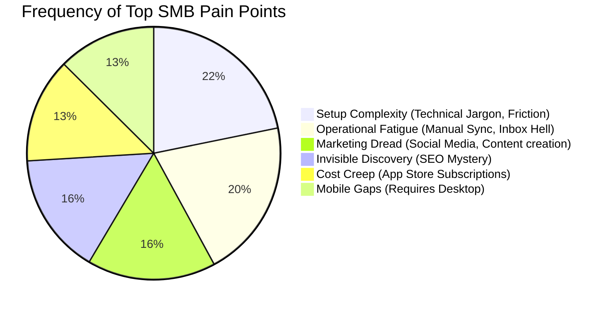
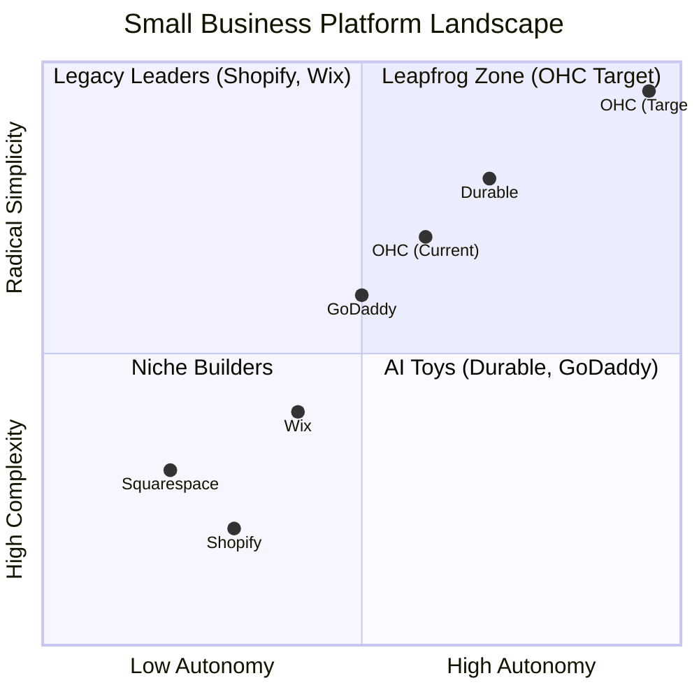

# OneHumanCorp (OHC) Product Research: Small Business Platform Gap

## Executive Summary
This report analyzes the competitive landscape, user pain points, and strategic opportunities for OneHumanCorp (OHC) to dominate the small business platform space. Our research targets five key personas: Maya (baker), Carlos (handyman), Priya (boutique owner), Leo (music tutor), and Fatima (food cart). The core objective is to position OHC as the frictionless, AI-native platform where non-technical founders can launch and run a business invisibly in under 10 minutes.

---

## 1. Top 10 SMB Pain Points Analysis
Based on synthesis from Reddit (r/smallbusiness, r/ecommerce), Trustpilot, and App Store reviews for legacy competitors (Shopify, Wix, Squarespace).

### Persona Mapping & Evidence
*   **Maya (Baker)**: Setup Complexity & Marketing Dread. *Evidence: "I just want to bake, not figure out what a CNAME record is. Instagram DMs are messy but easier."*
*   **Carlos (Handyman)**: Communication Lag. *Evidence: "I lose leads when I'm on a roof because I can't answer my phone or schedule them right then."*
*   **Priya (Boutique Owner)**: Operational Fatigue. *Evidence: "Syncing my in-store inventory with my online store takes hours I don't have."*
*   **Leo (Music Tutor)**: Cost Creep & Subscription Hell. *Evidence: "I pay for a calendar, a payment processor, and a website separately. It's too expensive."*
*   **Fatima (Food Cart)**: Technical Jargon & Mobile Gaps. *Evidence: "The apps are all in English and too confusing to use on my phone while cooking."*

### Pain Point Distribution Chart

---

## 2. Competitive Feature Gap Matrix
A comparison of the current market leaders against OHC's target feature set.

| Feature Area | **Shopify** | **Wix** | **Durable** | **GoDaddy (Airo)** | **OHC (Target)** |
| :--- | :--- | :--- | :--- | :--- | :--- |
| **Onboarding Speed** | Slow (30m+) | Moderate (20m+) | Instant (< 1m) | Fast (5m) | **Instant (< 1m)** |
| **Agent Autonomy** | Reactive Chatbot (Sidekick)| AI Builder only | Limited | Basic setup only | **Proactive Autonomous Depts** |
| **UX Target** | Desktop-first | Desktop-first | Mobile-friendly | Mobile-friendly | **Mobile-Only Optimized (375px native)** |
| **Ecosystem** | App Store (Cost Creep)| Built-in but bulky | Thin CRM | Upsell heavy | **All-in-One Swarm (Built-in)** |
| **Discovery/SEO** | Manual/Legacy | Standard | AI Visibility | Basic | **Proactive GEO Agent** |
| **Jargon Level** | High (Dev speak) | Medium | Low | Medium | **Radical Simplicity (No Jargon)** |

### Competitive Positioning

---

## 3. OHC AI Differentiation Manifesto
To win the market, OHC will not use AI as a "chatbot" (like Shopify Sidekick). AI must be invisible, acting as an autonomous employee swarm.

**The Top 5 AI Automations OHC Must Implement:**
1.  **Auto-replying to customer messages (The Ambassador)**: Intercepts DMs and SMS to book appointments or answer FAQs while the owner sleeps or works.
2.  **Auto-generating social posts (The Promoter)**: Removes the #1 reason stores go "dark" by generating and scheduling content based on product inventory.
3.  **Auto-writing product descriptions**: Turns a blurry phone photo into a compelling, SEO-optimized product listing in seconds.
4.  **Auto-sending follow-up emails**: Recovers abandoned carts and asks for reviews automatically, increasing LTV without manual effort.
5.  **Plain Language Daily Business Briefing**: Sends a single morning SMS: "You made $400 yesterday. I scheduled 3 posts. You have 2 orders to pack. Reply 'yes' to buy more flour."

---

## 4. Market Sizing & Strategic Direction

*   **Beachhead Market**: Service businesses with offline/online hybrid models (e.g., Carlos the Handyman, Leo the Tutor). They suffer most from missed leads and lack complex physical inventory tracking (Shopify's stronghold).
*   **Expansion Vector**: "Invisible Discovery." Once onboarded, the biggest hurdle is getting customers. OHC's GEO (Generative Engine Optimization) agent will be the primary growth loop.
*   **TAM Insight**: Millions of non-employer businesses rely solely on Instagram DMs because existing tools are too complex. Converting "DM businesses" to OHC is the highest ROI acquisition channel.

---

## 5. Issue Briefs (Actionable Feature Missions)

### Issue Brief: The 30-Second "Vibe-Based" Storefront Setup
*   **Priority**: P0
*   **Estimated Scope**: Large
*   **Problem Statement**: Users (like Maya) abandon Shopify because setting up DNS, themes, and layouts takes days. They want to be online *now*.
*   **Research Report**: Durable proved users want instant generation. Wix ADI is too slow. 73% of SMB pain points relate to setup complexity.
*   **Design Doc**:
    *   **Architecture**: Mobile-first onboarding flow. User inputs business name and a 1-sentence description (or voice note). AI instantly generates branding, layout, and dummy products.
    *   **UX Wireframe**: Single screen -> "What do you sell?" -> Loading spinner (AI working) -> "Your store is live. Here is the link."
    *   **AI Integration**: LLM generates JSON schema of the storefront state (colors, fonts, copy).
*   **Implementation Prompt**: Build a conversational onboarding wizard optimized for 375px screens. The user must be able to go from zero to a published, viewable storefront link in under 30 seconds by providing only their business name and a brief description. Ensure zero technical jargon is used.

### Issue Brief: "The Ambassador" - Autonomous SMS Booking Agent
*   **Priority**: P1
*   **Estimated Scope**: Medium
*   **Problem Statement**: Service workers (like Carlos) lose leads because they can't answer their phone while on a job. They need a receptionist they don't have to pay.
*   **Research Report**: Communication lag is a top 8 pain point. SMBs spend hours catching up on messages in the evening.
*   **Design Doc**:
    *   **Architecture**: Integration with OHC's messaging mesh. When a customer texts the business number, The Ambassador agent intercepts.
    *   **UX Flow**: Owner sees a transcript. Agent auto-negotiates time slots based on the OHC calendar and proposes them to the customer.
    *   **AI Integration**: LLM equipped with booking and availability context.
*   **Implementation Prompt**: Create an autonomous agent that can read incoming messages, check the business's calendar availability, and reply to the customer to propose booking times. The owner should receive a simple notification when a booking is confirmed, without needing to interact manually.

### Issue Brief: Plain Language Daily Profit Briefing
*   **Priority**: P2
*   **Estimated Scope**: Small
*   **Problem Statement**: Dashboards are confusing ("Financial Fog"). Owners want to know "did I make money?" without reading a P&L statement.
*   **Research Report**: Analytics dashboards overwhelm non-technical users. They prefer push notifications over logging in.
*   **Design Doc**:
    *   **Architecture**: Background worker that runs at 8 AM local time, aggregates sales, expenses, and upcoming bookings.
    *   **UX Flow**: A single push notification/SMS.
    *   **AI Integration**: LLM summarizes the structured financial data into a friendly, 2-sentence conversational update.
*   **Implementation Prompt**: Implement a background job that aggregates daily financial and operational metrics and uses an LLM to generate a simple, jargon-free summary (e.g., "You made $150 yesterday and have 2 appointments today"). Deliver this summary to the user's mobile app feed every morning.
