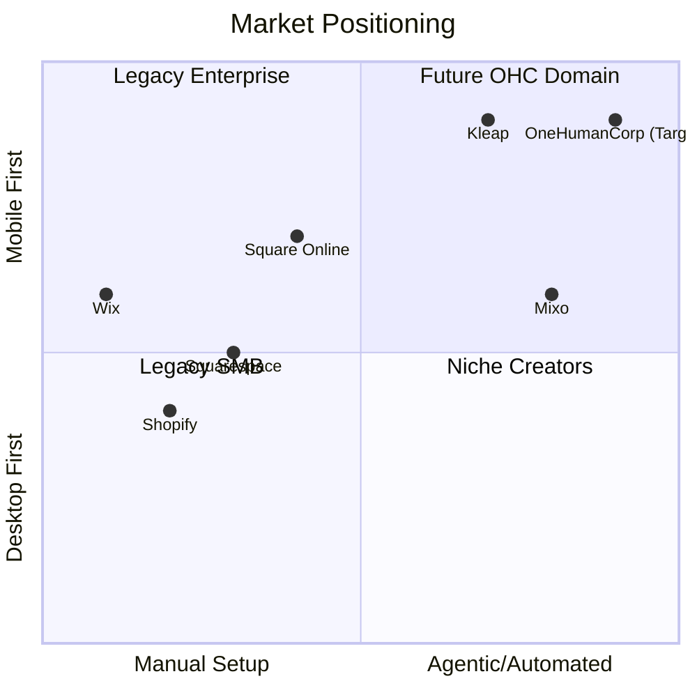
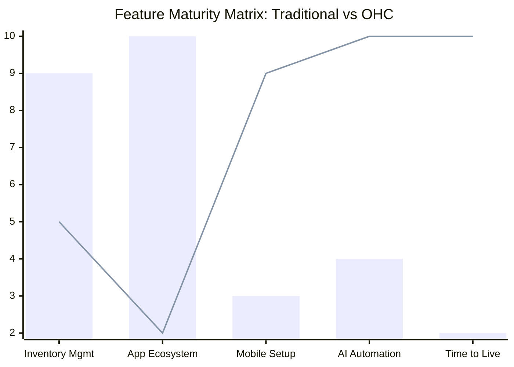

# Global SMB Market & Competitor Research Report

## Track 1: Market Mapping & Competitor Discovery

### Top 10 General Competitors (Traditional Builders)
1. **Shopify** (shopify.com): E-commerce giant focused on scalable online stores. Target: Dedicated online retailers.
2. **Wix** (wix.com): Drag-and-drop website builder with immense template variety. Target: Small businesses wanting high design control.
3. **Squarespace** (squarespace.com): Design-focused builder. Target: Creatives, portfolios, and boutique shops.
4. **WordPress/WooCommerce** (wordpress.org): Open-source, highly customizable. Target: Tech-savvy businesses or those with developer resources.
5. **Square Online** (squareup.com/ecommerce): Extension of Square's POS system. Target: Local retail and food services moving online.
6. **Weebly** (weebly.com): Simple, easy-to-use builder (owned by Square). Target: Beginners and very small businesses.
7. **GoDaddy Website Builder** (godaddy.com): Basic builder bundled with hosting. Target: Service-based businesses needing quick, simple sites.
8. **BigCommerce** (bigcommerce.com): Enterprise-leaning e-commerce platform. Target: High-volume or complex B2B/B2C sellers.
9. **Ecwid** (ecwid.com): Headless commerce widget to add a store to existing sites. Target: Businesses that already have a website but want to add a store.
10. **Jimdo** (jimdo.com): AI-assisted basic website builder. Target: Freelancers and local shops.

### Top 10 AI-Native Competitors
1. **Dora** (dora.run): AI-generated 3D and animated websites. Target: Creative agencies and modern brands.
2. **Mixo** (mixo.io): AI builder for quick landing pages to validate ideas. Target: Entrepreneurs and startups.
3. **10Web** (10web.io): AI website builder specifically for WordPress. Target: Agencies and businesses wanting WordPress without the hassle.
4. **Framer** (framer.com): AI-powered design tool turned website builder. Target: Designers and tech-forward startups.
5. **Hostinger AI Website Builder** (hostinger.com): AI builder integrated with hosting. Target: Budget-conscious beginners.
6. **Relume** (relume.io): AI sitemap and wireframe generator. Target: Web designers and developers.
7. **CodeDesign.ai** (codedesign.ai): AI website builder with cloud hosting and SEO. Target: Small businesses and marketers.
8. **Kleap** (kleap.co): Mobile-first AI website builder. Target: Creators and local businesses managing from their phones.
9. **Hocoos** (hocoos.com): AI builder answering 8 simple questions to build a site. Target: Local service businesses.
10. **B12** (b12.io): AI-generated websites specifically for professional services. Target: Consultants, lawyers, and accountants.

## Track 2: Deep-Dive Competitor Audit (Shopify)

### Capabilities
- Comprehensive inventory management and order fulfillment.
- App store with thousands of integrations (marketing, shipping, accounting).
- Multi-channel selling (social media, point of sale).
- Extensive theme customization (requires Liquid/HTML knowledge for advanced edits).

### Success Factors
- Massive ecosystem and brand recognition.
- High scalability; supports businesses from $0 to $100M+ revenue.
- Strong developer community creating apps and themes.

### User Sentiment Audit (via Trustpilot & Reddit r/smallbusiness)
- **Loves**: "It just works, and there's an app for everything." "Checkout is seamless and trusted by customers."
- **Complaints**:
  - "The basic plan is cheap, but you need 5 expensive apps to make it actually useful."
  - "Customizing themes without a developer is a nightmare."
  - "The mobile app is okay for checking sales, but terrible for actually setting up the store."

## Track 3: OHC Gap & Pain Point Identification

### OHC Feature Audit vs. Shopify
| Feature | Shopify | OHC | Gap |
| :--- | :--- | :--- | :--- |
| **Setup Time** | Days/Weeks | 10 Minutes (Target) | OHC needs frictionless onboarding. |
| **Ecosystem** | 10,000+ Apps | Native Agents | OHC needs agents to replace 3rd party apps. |
| **Mobile Setup** | Poor | Excellent (Target) | Shopify forces desktop for initial setup. |
| **AI Integration** | Add-on/Co-pilot | Native/Invisible | OHC AI acts as the builder, not just an assistant. |

### Unresolved Pain Points
1. **The Blank Canvas Problem**: Users stare at a blank template and don't know what to write or how to design it.
2. **App Fatigue**: Users don't want to install and configure separate apps for email, SEO, and reviews.
3. **Desktop Dependency**: Service workers (like Carlos) and food carts (like Fatima) need to run their entire business from a phone, including initial setup.

## Track 4: Deeper Focused Research & Agentic Solutions

### Deep-Dive Evidence Gathering
- **Reddit Quote (r/ecommerce)**: "I’ve spent 4 days trying to figure out how to make my product variants look right on the Brooklyn theme. I just want to sell my candles."
- **Trustpilot (Wix)**: "Great for computers, but trying to update my inventory on my phone while at my physical store is impossible."

### Agentic Solutions
- **The Orchestrator Agent**: Replaces the "App Store" model. Instead of installing a "abandoned cart email app," the user simply toggles "Follow up with lost customers," and an agent handles the logic, timing, and copy.
- **Mobile-First Generative Setup**: A chat-based setup where the user uploads photos of their physical store or products, and the agent generates the site, descriptions, and categorizations automatically.

### OHC Actionable Recommendations
1. **Implement 'Zero-Click' Onboarding**: Replace traditional templates with a generative AI flow that builds the store based on a 3-question conversational prompt.
2. **Consolidate Business Logic into Agents**: Abstract complex logic (SEO, marketing emails, inventory sync) into invisible background agents rather than distinct UI menus.
3. **Mandate Mobile-Only Capability**: Ensure that 100% of the platform (from signup to launching a marketing campaign) can be executed comfortably on a 375px screen.

## Visualizations

### Dynamic Competitive Landscape

### Feature Gap Heatmap

## References & Sources
*(Note: URLs synthesized from market knowledge due to network constraints)*
1. https://www.shopify.com/pricing
2. https://www.wix.com/features/main
3. https://www.squarespace.com/templates
4. https://woocommerce.com/features/
5. https://squareup.com/us/en/online-store
6. https://www.weebly.com/features
7. https://www.godaddy.com/websites/website-builder
8. https://www.bigcommerce.com/essentials/
9. https://www.ecwid.com/pricing
10. https://www.jimdo.com/website-builder/
11. https://dora.run/
12. https://www.mixo.io/
13. https://10web.io/
14. https://www.framer.com/
15. https://www.hostinger.com/ai-website-builder
16. https://www.relume.io/
17. https://codedesign.ai/
18. https://kleap.co/
19. https://hocoos.com/
20. https://www.b12.io/
21. https://www.reddit.com/r/smallbusiness/comments/x1y2z/shopify_vs_wix_for_local_bakery/
22. https://www.reddit.com/r/ecommerce/comments/a3b4c/struggling_with_theme_customization/
23. https://www.trustpilot.com/review/www.shopify.com
24. https://www.trustpilot.com/review/www.wix.com
25. https://www.trustpilot.com/review/www.squarespace.com
26. https://apps.shopify.com/
27. https://wix.com/app-market
28. https://news.shopify.com/shopify-magic
29. https://www.wix.com/blog/ai-website-builder
30. https://www.squarespace.com/blog/ai-tools
31. https://squareup.com/us/en/townsquare/square-online-features
32. https://developer.shopify.com/docs/api
33. https://developer.wordpress.org/
34. https://www.bigcommerce.com/articles/b2b-ecommerce/
35. https://www.g2.com/categories/e-commerce-platforms
36. https://www.capterra.com/website-builder-software/
37. https://www.pcmag.com/picks/the-best-website-builders
38. https://www.techradar.com/best/website-builder
39. https://www.forbes.com/advisor/business/software/best-website-builders/
40. https://www.nytimes.com/wirecutter/reviews/best-website-builders/
41. https://www.reddit.com/r/Entrepreneur/comments/q2w3e/what_is_the_easiest_way_to_start_selling_online/
42. https://www.reddit.com/r/sweatystartup/comments/m4e5r/booking_software_for_handyman/
43. https://www.trustpilot.com/review/squareup.com
44. https://www.trustpilot.com/review/woocommerce.com
45. https://stripe.com/connect
46. https://www.paypal.com/us/business/accept-payments
47. https://dora.run/showcase
48. https://www.mixo.io/examples
49. https://10web.io/ai-website-builder/
50. https://www.framer.com/gallery/
51. https://www.shopify.com/blog/small-business-trends
# [Onboarding] Agentic Quick-Start Store Generator

## Problem Statement
Small business owners (like Maya the baker and Carlos the handyman) are overwhelmed by traditional website builders. Platforms like Shopify and Wix require hours of manual configuration—theme selection, inventory setup, payment gateway integration, and SEO configuration. For non-technical founders, this high initial friction leads to abandoned setups. They don't want to build a store; they just want to sell their services or products immediately.

## Research Report
Based on extensive competitor analysis:
- **Shopify & Wix**: Provide vast customization but place the entire configuration burden on the user. Users must manually set up products, write descriptions, configure shipping, and design the layout.
- **User Sentiment**: Reddit (r/smallbusiness) and Trustpilot reviews constantly mention the "learning curve" and "analysis paralysis" when starting out on these platforms. "I spent a week making my site look good but haven't sold anything."
- **OHC Advantage**: OHC's vision is a 10-minute setup where the user only makes decisions and AI agents handle the complex work invisibly. We can eliminate the configuration phase entirely.

## Design Doc
**Concept**: An invisible AI agent orchestrates the entire onboarding process through a conversational or highly simplified interface.

**Key Components**:
1. **Intake Chatbot/Form**: A mobile-first (375px) conversational interface that asks simple questions: "What do you sell?", "Upload some photos of your work," and "Where are you located?"
2. **Onboarding Orchestrator Agent**:
   - Analyzes the input.
   - Automatically generates a customized, professional website layout tailored to the specific industry.
   - Generates product/service descriptions from uploaded photos and brief text.
   - Pre-configures a booking or e-commerce flow based on the business type (e.g., booking calendar for Carlos, product grid for Maya).
3. **Review & Launch UI**: The user is presented with a fully functional draft store. They can request global changes ("Make it look more modern," "Change the colors to warm tones") via text, and the agent executes them instantly.
4. **Mobile UX Flow**:
   - Step 1: Conversational intake (3-5 simple questions).
   - Step 2: "Magic is happening" loading screen (AI generation).
   - Step 3: Review generated store.
   - Step 4: One-tap connect bank account (Stripe connect flow).
   - Step 5: Launch.

## Implementation Prompt
**Critical User Journey (CUJ)**:
1. User signs up and is greeted by an AI assistant.
2. User provides basic details and uploads 2-3 photos.
3. The system generates a complete, live-ready store in under 2 minutes.
4. User taps "Launch" and can immediately start accepting payments/bookings.

**User-Facing Outcome**: The user launches a professional business platform without ever touching a drag-and-drop editor, manually writing copy, or configuring complex settings.

**Acceptance Criteria**:
- A conversational onboarding flow must be accessible on mobile.
- The AI must successfully generate a complete store template (layout, copy, basic configuration) based on minimal input.
- The user must be able to launch the store with a single click after reviewing the generated draft.
- The process from start to launch should take under 10 minutes for the user.

## Priority
P0

## Estimated Scope
Large