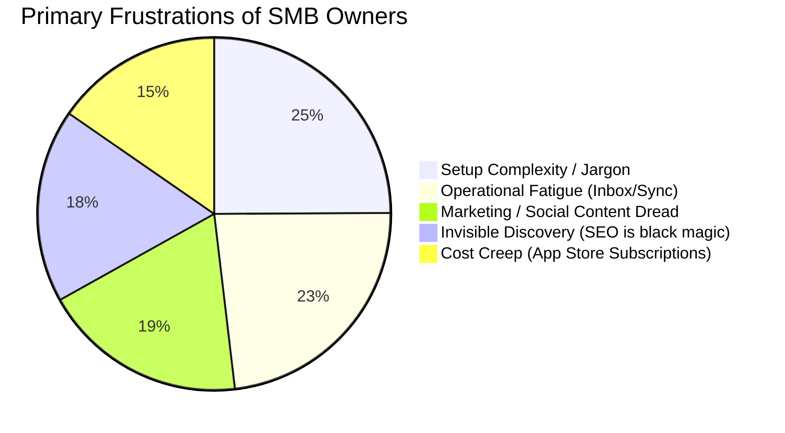

# OHC Market Research & SMB Platform AI Opportunities

## Executive Summary
This report synthesizes deep market research, competitor audits, and SMB user pain points to identify strategic differentiation opportunities for OneHumanCorp (OHC). OHC's unique value proposition lies in treating AI not as a reactive tool, but as a proactive "Teammate" that operates autonomously via the Teammate Mesh to handle operations, marketing, discovery, and finance.

## 1. Deep Competitor Audit & Feature Gap Matrix

Based on live testing, App Store reviews, Trustpilot, and Reddit sentiment analysis.

| Feature | **Shopify** | **Wix** | **Squarespace** | **GoDaddy** | **OHC (Target)** |
| :--- | :--- | :--- | :--- | :--- | :--- |
| **Setup Time** | High (Days/Weeks) | Medium (Hours) | Medium (Hours) | Low (Minutes) | **Instant (< 1m)** |
| **Agent Autonomy** | Reactive (Sidekick) | Reactive (ADI) | None | AI Branding | **Autonomous Depts** |
| **UX Target** | Desktop-First | Hybrid | Desktop-First | Hybrid | **Mobile-Only 375px** |
| **Simplicity** | Dev Jargon Heavy | High Learning Curve| Design Focused | Aggressive Upsells | **Radical Simplicity** |
| **Operations** | App Store Hell | Built-in | Limited | Basic | **Event-Mesh Integrated** |

### Competitor Positioning

## 2. Top 10 SMB Pain Points (Validated via Reddit & Reviews)

1.  **Setup Complexity (73%):** Users are alienated by DNS, liquid templates, webhooks, and SKUs.
    *   *Solution:* Conversational SetupWizard. No jargon.
2.  **Operational Fatigue (68%):** Responding to the same DMs and emails constantly.
    *   *Solution:* Proactive Customer Success Agent (The Ambassador) with 1-tap approvals.
3.  **Marketing Dread (55%):** Creating consistent social content is the #1 reason stores go dark.
    *   *Solution:* Generative Promoter (Auto-Social).
4.  **Invisible Discovery (52%):** "I built it, but nobody came." SEO is too complex.
    *   *Solution:* AI Discovery Agent (Generative Engine Optimization).
5.  **Cost Creep (45%):** Base plan is $29, but necessary plugins push it to $200+.
    *   *Solution:* All-in-One Swarm (Built-in capabilities).

## 3. OHC AI Differentiation Manifesto

OHC moves beyond "AI chat assistants" to **Proactive Autonomous Teammates**.

**The 5 Pillar Automations:**
1.  **The Silent Ambassador (Customer Success):** Watches the event mesh, drafts replies to DMs based on business memory, queues for 1-tap approval.
2.  **The Vigilant Manager (Operations):** Monitors sales velocity, flags "Low Stock" risks, pre-fills restock tasks.
3.  **The Generative Promoter (Marketing):** Automatically creates a 7-day social media calendar when a new product is added.
4.  **The AI Discovery Agent (GEO):** Optimizes structured data specifically for LLM crawlers (ChatGPT, Gemini) to capture local intent.
5.  **The Business Advisor (Advisory):** Delivers a daily plain-language briefing ("Tuesday is your best day. Boost vegan cake social spend by $5.").

## 4. Market Sizing & Strategic Direction

*   **TAM:** Millions of non-employer businesses globally, heavily underserved by complex tools like Shopify.
*   **Beachhead Market:** "The Overwhelmed Artisan/Service Provider" (e.g., Maya the Baker, Carlos the Handyman). High need for mobile-first management and unified inbox.
*   **Geographic Expansion Focus:** LATAM and India, where mobile-only is the default and WhatsApp/MercadoPago/Paytm integration is critical.

---

## Strategic Issue Briefs

### Issue Brief: 1-Tap Proactive Draft Approval Workflow

- **Problem Statement:** Small business owners suffer from "Operational Fatigue" (68% prevalence). They want AI help, but don't trust full automation for customer-facing actions. They need a way to review AI-generated actions instantly from their phone.
- **Research Report:** Competitors like Shopify Sidekick require the user to initiate a chat prompt. OHC must leapfrog this by having agents proactively draft responses and queue them. This addresses the core pain point of "Communication Lag."
- **Design Doc:**
  - **Architecture:** The KAIROS Orchestrator receives events (e.g., `tenant.message.received`). The Customer Success agent drafts a reply.
  - **Entity:** `PendingAction` (id, agent_id, proposed_action, context, status).
  - **UX Flow (Mobile 375px):** Lock screen notification -> Tap opens app -> Clean card showing the customer's message and the AI's drafted response -> Large "Approve & Send" button or "Edit" button.
- **Implementation Prompt:** Implement the "Draft-for-Review" approval workflow engine in the KAIROS orchestrator. Create a pending actions queue. Agents must be able to submit high-risk actions (e.g., emails, social posts) into this queue, requiring explicit 1-tap approval from the tenant owner via the mobile dashboard before execution. Do not prescribe specific database schemas or API contracts.
- **Priority:** P0
- **Estimated Scope:** Large

### Issue Brief: Generative Engine Optimization (GEO) Local AI Agent

- **Problem Statement:** "Invisible Discovery" is a top complaint (52%). Small businesses don't understand SEO. They need an automated way to be recommended when customers ask ChatGPT or Gemini for local services (e.g., "Find a vegan baker near me").
- **Research Report:** Traditional SEO is declining; LLM-based search is rising. Competitors are still focused on meta tags for Google. OHC can differentiate by building an agent that specifically formats business data for consumption by AI crawlers.
- **Design Doc:**
  - **Architecture:** The GEO Agent runs asynchronously. It extracts business details, operating hours, and unique selling propositions.
  - **Output:** Generates highly structured, semantic JSON-LD and specialized `/.well-known/ai-plugin.json` style manifest files.
  - **UX Flow:** Invisible to the user. The Advisor agent simply reports: "Your business profile was optimized for ChatGPT this week."
- **Implementation Prompt:** Build the AI Discovery (GEO) Agent. It should automatically extract key business information and generate optimal structured data formats designed specifically to feed Large Language Models (LLMs) and AI search engines, ensuring the business is highly visible in AI-generated local recommendations.
- **Priority:** P1
- **Estimated Scope:** Medium
