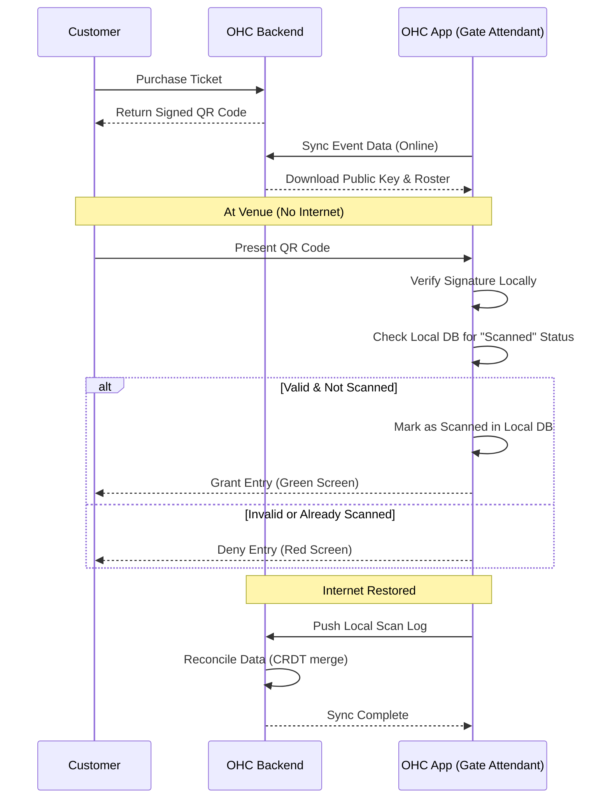

# Offline-First Ticketing & Event Management Engine Research Report

## Problem Statement

Small event organizers (local bands, community workshops, independent theater groups) often struggle with connectivity at event venues (basements, remote outdoor locations, crowded halls). Traditional ticketing systems like Eventbrite or Ticketmaster require a constant internet connection to validate tickets, leading to long queues and frustrated attendees when the network is slow or drops completely. OneHumanCorp (OHC) needs to empower these organizers with an event management and ticketing engine that functions flawlessly in offline or intermittent connectivity scenarios, ensuring smooth entry operations without relying on continuous server access.

## Research Report

### Current Solutions & Their Limitations
- **Eventbrite/Ticketmaster:** Require constant connection for real-time validation. "Offline mode" often just caches a static list of tickets, which doesn't support on-the-spot sales or dynamic updates across multiple gate attendants if connectivity is entirely lost.
- **Square/Stripe Terminal:** Can queue payments offline, but ticket validation logic is often decoupled from the payment terminal, still requiring network for the "ticket system" itself.
- **Custom QR Scanners:** Simple offline scanners check against a pre-downloaded database but cannot synchronize state across multiple scanners without a local network.

### Proposed Architectural Approach for OHC
The solution requires a dual-layer approach:
1.  **Cryptographic Ticket Generation:** Instead of just a database ID, tickets are generated as cryptographically signed payloads (e.g., JWTs or custom signed QR codes) containing essential ticket data (Event ID, Ticket Type, Holder Name, Timestamp).
2.  **Offline Validation:** The OHC mobile app (used by gate attendants) holds the public key for the event. When a ticket is scanned, the app verifies the signature locally.
3.  **Local Mesh Synchronization (Optional/Advanced):** If multiple attendants are scanning, devices can form a local peer-to-peer mesh network (using Bluetooth Low Energy or Wi-Fi Direct) to share "ticket used" statuses, preventing double-entry even when completely isolated from the internet.
4.  **Eventual Consistency Sync:** Once the device regains internet access, it syncs the local "scanned" ledger back to the OHC backend to update central records, process any offline sales, and reconcile data.

### Key Technologies
- **Ticket Format:** Signed JWTs encoded into high-density QR codes.
- **Local Storage:** SQLite (via Flutter's `sqflite`) or IndexedDB (PWA) for the offline ledger.
- **Sync Mechanism:** CRDTs (Conflict-free Replicated Data Types) to merge scan logs from multiple devices when they reconnect.

## Design Document

### System Architecture

The Offline-First Ticketing Engine operates across the OHC Backend and the OHC Mobile Client (Gate App).

1.  **Ticket Issuance (Online):** When a user buys a ticket, the OHC backend generates a cryptographic signature using a private key specific to the event/tenant. The ticket data and signature are encoded into a QR code.
2.  **App Pre-Loading (Online):** Before the event, the organizer opens the OHC app while online. The app downloads the event details, the public key for validation, and a baseline snapshot of sold tickets.
3.  **Scanning (Offline):** At the gate, the app scans the QR code, verifies the signature locally using the public key, and checks its local SQLite database to ensure the ticket hasn't already been scanned.
4.  **Synchronization (Online):** When connectivity returns, the local database pushes the scan events to the OHC backend to achieve eventual consistency.

### Mermaid Diagram

## Implementation Prompt

**Task:** Implement the Offline-First Ticketing Engine core components for OneHumanCorp.

**Requirements:**
1.  **Backend (Rust/Go):** Implement the ticket generation service. It must accept event details and customer info, generate a secure, compact signed payload (e.g., using Ed25519 signatures), and return a base64 encoded string suitable for QR code generation. Ensure tenant isolation.
2.  **Backend API:** Create endpoints for the mobile client to (a) download the event public key and roster, and (b) upload a batch of offline scan logs (resolving conflicts if the same ticket was scanned by different offline devices).
3.  **Frontend (Flutter/Dart or PWA):** Implement the offline validation logic. Given a scanned QR payload and the pre-downloaded public key, verify the signature. Create a local data structure (e.g., an in-memory map or SQLite schema) to record scanned tickets and prevent double-scanning locally.
4.  **Synchronization Logic:** Implement the sync worker that detects network restoration and pushes the local scan queue to the backend API.
5.  **Testing:** Provide comprehensive unit tests for the cryptographic signing and verification processes. Write an E2E test simulating the full offline scan and subsequent sync flow.

**Context:** Remember that OHC is designed for non-technical users. The "offline mode" should require zero configuration from the event organizer—the app should handle the transition seamlessly.
