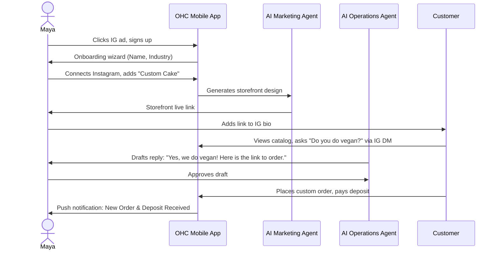
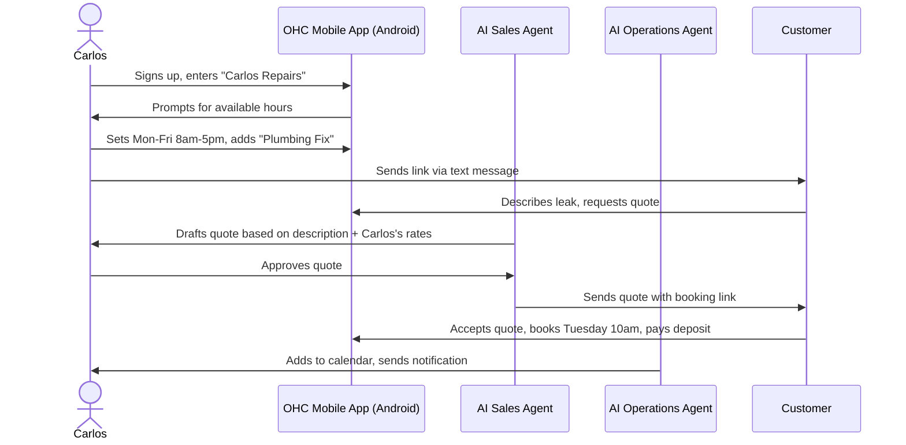
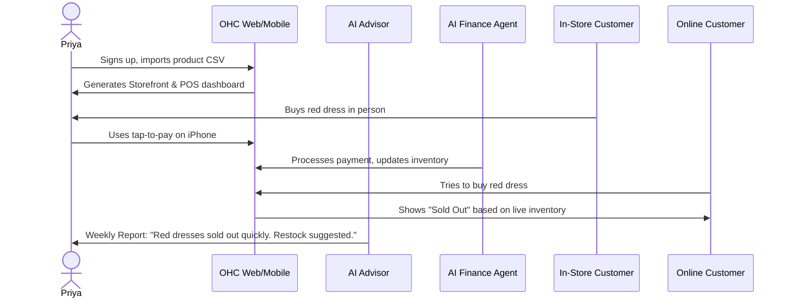
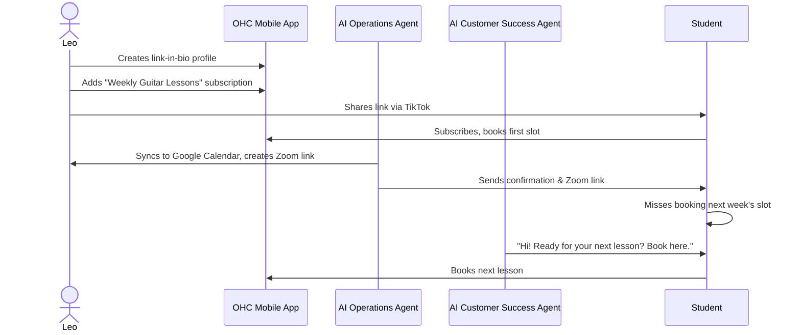
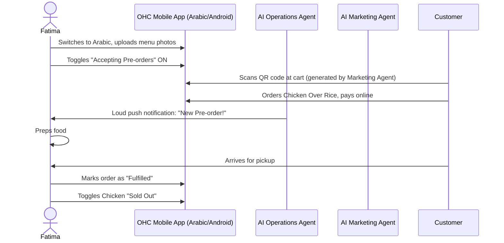

# Business Journey Architecture

## Overview
This document outlines the end-to-end user journey for the key personas of OneHumanCorp (OHC). For each persona, we detail the Acquisition, Onboarding, Activation, Retention, Revenue, and Referral stages, provide a sequence diagram of their journey, and identify potential friction points where they might abandon the flow.

---

## 1. Maya — The Home Baker (28, non-technical)

**Acquisition:** Maya discovers OHC via an Instagram ad showing a beautiful phone-first bakery setup process. The CTA is "Start taking custom orders in 5 minutes. Free."
**Onboarding:** Guided wizard asking for business name ("Maya's Sweets"), industry ("Bakery/Custom Cakes"), and connecting her Instagram account to auto-import photos. Minimum input: Name and 1 photo.
**Activation:** Maya adds her first cake to the catalog with a price and deposit requirement. She sets up Stripe to accept payments. Success by Day 1 is having a live storefront link she can put in her Instagram bio.
**Retention:** Maya receives a push notification when a new order comes in. She checks the app to see the AI agent's draft replies to her Instagram DMs about vegan cakes.
**Revenue:** After a month of high order volume, Maya hits the 10-product limit or wants a custom domain. She upgrades from Free to the Starter tier ($9/mo) triggered by an in-app prompt when trying to add her 11th cake.
**Referral:** Maya shares a referral link on a baker's Facebook group: "This app handles all my orders and deposits automatically."

### Journey Diagram

### Friction Points
- **Friction Point 1:** Connecting Instagram might require logging into Meta, which can be confusing on mobile.
- **Friction Point 2:** Setting up Stripe for the first time requires tax/identity info which she may not have on hand. (Solution: allow deferring this until the first payout).

---

## 2. Carlos — The Freelance Handyman (42, non-technical)

**Acquisition:** Carlos hears about OHC from another tradesperson at Home Depot. He searches for it on Google. The CTA is "Get a booking page that quotes jobs for you."
**Onboarding:** Simple flow: Name, service category ("Repairs & Maintenance"), and setting his available hours.
**Activation:** Carlos creates his first service "Plumbing Fix" with a base price and enables the booking calendar. Success is seeing his first available time slot online.
**Retention:** Carlos checks the app every morning to see his schedule. The AI agent notifies him of new quote requests based on customer descriptions.
**Revenue:** Carlos wants to add the "Business Advisory" feature to track his most profitable services. He upgrades to the Starter tier.
**Referral:** Carlos taps his phone against another contractor's phone to share his OHC invite link, earning a free month of the Pro tier.

### Journey Diagram

### Friction Points
- **Friction Point 1:** Explaining complex pricing (e.g., "$50/hr plus materials") vs fixed pricing during setup.
- **Friction Point 2:** Calendar syncing (Google Calendar integration on Android) must be seamless, or he will get double-booked.

---

## 3. Priya — The Boutique Owner (35, semi-technical)

**Acquisition:** Priya searches for "Shopify alternative for small boutiques" on Google. She lands on an OHC comparison page.
**Onboarding:** Priya signs up via desktop. She imports her existing CSV of products.
**Activation:** Priya syncs her online catalog with her in-store inventory. Success is completing her first in-person sale using OHC's tap-to-pay on her iPhone.
**Retention:** Priya uses the daily analytics dashboard to see which items are trending. The AI Business Advisor sends her a weekly summary of top sellers.
**Revenue:** Priya upgrades to Pro ($29/mo) immediately because she needs unlimited products and a custom domain with SSL.
**Referral:** Priya shows the tap-to-pay feature to the shop owner next door and sends an email invite.

### Journey Diagram

### Friction Points
- **Friction Point 1:** CSV import must be flawless and handle variants (size/color) automatically without manual mapping if possible.
- **Friction Point 2:** Trusting the tap-to-pay reliability in a busy store environment. It must work instantly.

---

## 4. Leo — The Music Tutor (22, non-technical)

**Acquisition:** Leo clicks an OHC "link-in-bio" on another creator's TikTok profile.
**Onboarding:** Leo sets up his profile specifically to be a link-in-bio. He adds his YouTube videos, a short bio, and his lesson packages.
**Activation:** Leo sets up a recurring subscription for "4 lessons a month". Success is getting his first student to subscribe.
**Retention:** Leo relies on the automated Zoom link generation and Google Calendar sync. The AI agent follows up with students who missed a lesson.
**Revenue:** When Leo reaches the 100-student mark or wants to use the advanced Referral Program tools, he upgrades to Starter.
**Referral:** Leo's students get an automated email after their 5th lesson asking them to refer a friend for a free lesson.

### Journey Diagram

### Friction Points
- **Friction Point 1:** Setting up Zoom integration requires OAuth flow which can break the mobile experience if it opens in an external browser and loses context.
- **Friction Point 2:** Managing subscription cancellations smoothly so Leo doesn't have to deal with manual refunds.

---

## 5. Fatima — The Food Cart Operator (50, non-technical, limited English)

**Acquisition:** Fatima's son helps her find an app to manage pre-orders because the lunch rush is too chaotic.
**Onboarding:** Fatima selects the "Arabic" language option. She uploads photos of her 5 menu items directly from her phone camera.
**Activation:** Fatima turns on the "Accepting Pre-Orders" toggle. Success is receiving the first order notification with a loud, distinct ringtone on her phone.
**Retention:** Fatima uses the daily printable order list to prep the right amount of food each morning. She uses the simple "Sold Out" toggle when she runs out of chicken.
**Revenue:** Fatima uses the Free tier initially. She upgrades to Starter when she wants to add a QR code menu printed on her cart.
**Referral:** Fatima tells other food cart vendors in the commissary kitchen about the app.

### Journey Diagram

### Friction Points
- **Friction Point 1:** The app must work flawlessly on a slow 3G/4G connection in a crowded city square. Offline mode or optimistic UI updates are critical.
- **Friction Point 2:** Multi-language support must cover the entire app UI natively, not just Google Translate, as nuanced business terms can be mistranslated.
- **Friction Point 3:** Notification reliability. If she misses the notification because her phone screen is off, she misses the order.
