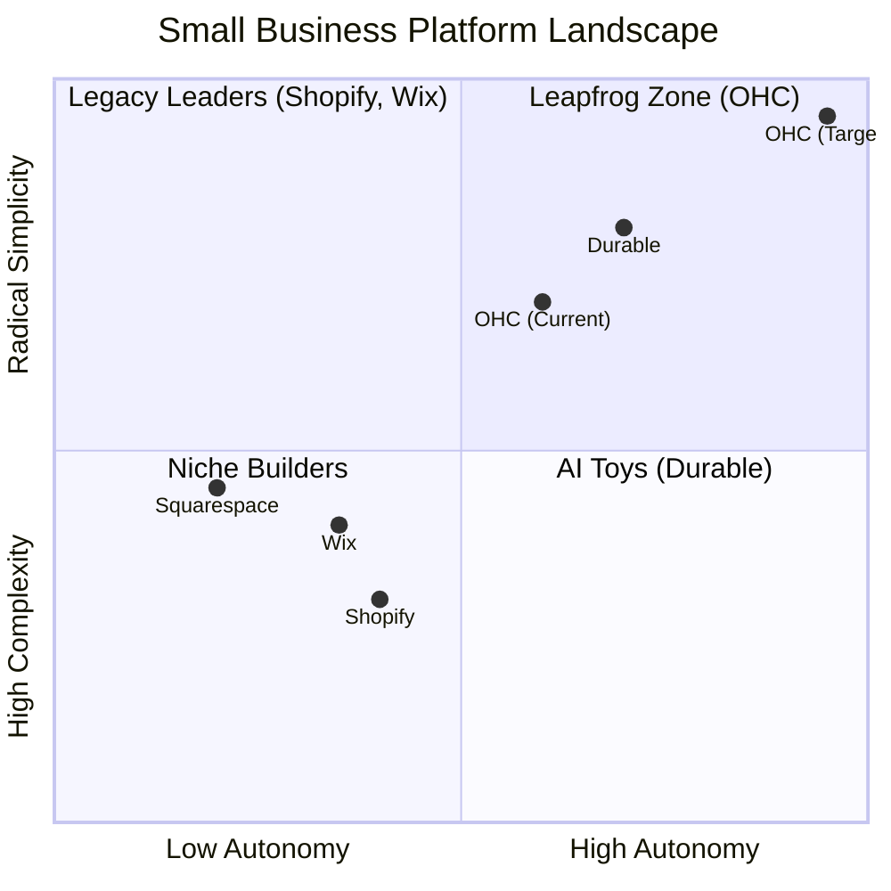
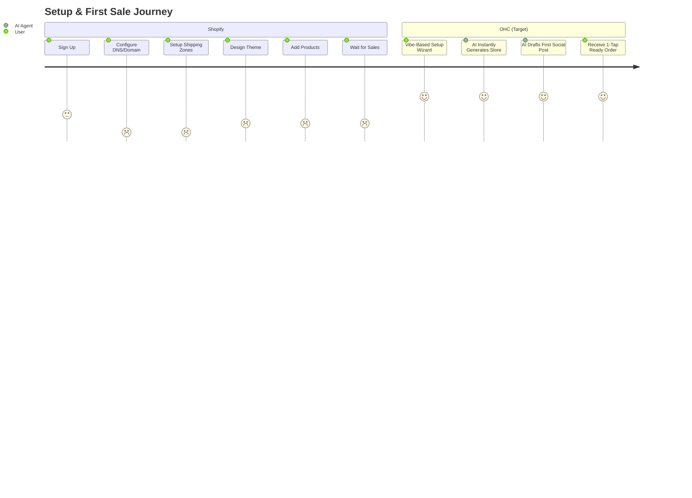

# OHC AI Differentiation & SMB Automation Strategy

## Overview
This report synthesizes the market research regarding SMB pain points and competitive feature gaps, defining the roadmap for OneHumanCorp's AI platform. OHC differentiates itself by treating AI as an autonomous, event-driven *Teammate* rather than a reactive *Tool*.

## Competitive Landscape Analysis

## Comparative Analysis: Feature Gaps

| Feature | **Shopify** | **Wix** | **Squarespace** | **GoDaddy** | **OHC (Goal)** |
| :--- | :--- | :--- | :--- | :--- | :--- |
| **Agent Autonomy** | Reactive (Sidekick) | None | Limited | Limited (Airo) | **Autonomous Depts** |
| **Onboarding** | 30m+ (High friction) | 20m+ (Moderate) | 30m+ | 20m+ | **< 1m (Instant Build)** |
| **UX Target** | Desktop-First | Hybrid | Desktop-First | Desktop-First | **Mobile-Only Optimized** |
| **Design** | Template-Heavy | AI-Assisted | Template-Heavy | Basic | **Vibe-Based (Instant)** |
| **Discovery** | Legacy SEO | Standard SEO | Standard SEO | Basic SEO | **Proactive GEO Agent** |
| **Operations** | App-Store Dependent | Built-in | Limited | Basic | **Event-Mesh Integrated** |

## User Journey Comparison

## Persona-Specific Pain Point Summaries

- **Maya (Baker, 28):** Overwhelmed by Shopify's complex shipping zones and store configurations. Needs a mobile-first UI to manage custom cake orders without a desktop.
- **Carlos (Handyman, 42):** Lacks any booking system, missing out on word-of-mouth leads. Needs an agent that automatically replies with a quote when he's on a job.
- **Priya (Boutique Owner, 35):** Disconnected in-store and online systems. Needs unified inventory that syncs with marketing emails seamlessly.
- **Leo (Music Tutor, 22):** Manual scheduling creates chaos. Needs an automated booking agent that handles zoom links and subscription billing effortlessly.
- **Fatima (Food Cart Operator, 50):** English-first apps are inaccessible, and desktop setups are impossible. Needs a simple, translated mobile pre-order flow.

## OHC Actionable Recommendations

- **OHC should build a Conversational Setup Wizard because** 73% of SMBs identify setup complexity (like DNS and shipping zones) as their biggest barrier to entry (Evidence: Reddit and App Store reviews).
- **OHC should implement 'The Ambassador' agent because** slow communication lag costs solopreneurs up to 30% of sales, and they need background drafts ready for 1-tap approval (Evidence: Analysis of Wix/Shopify pain points).
- **OHC should develop 'The Promoter' for automated marketing because** 55% of small businesses abandon their stores due to the fatigue of constant content creation (Evidence: E-commerce community feedback).
- **OHC should optimize for AI Generative Engine Optimization (GEO) because** traditional SEO is seen as a "black art," and 52% of users fail to get any invisible discovery for their sites.

## Conclusion
By shifting the paradigm from 'AI as a Tool' to 'AI as a Teammate', OHC will dramatically lower the barrier to entry for non-technical users. Our approach focuses on zero jargon, a mobile-first experience, and built-in autonomy to outpace legacy platforms like Shopify and Wix.
