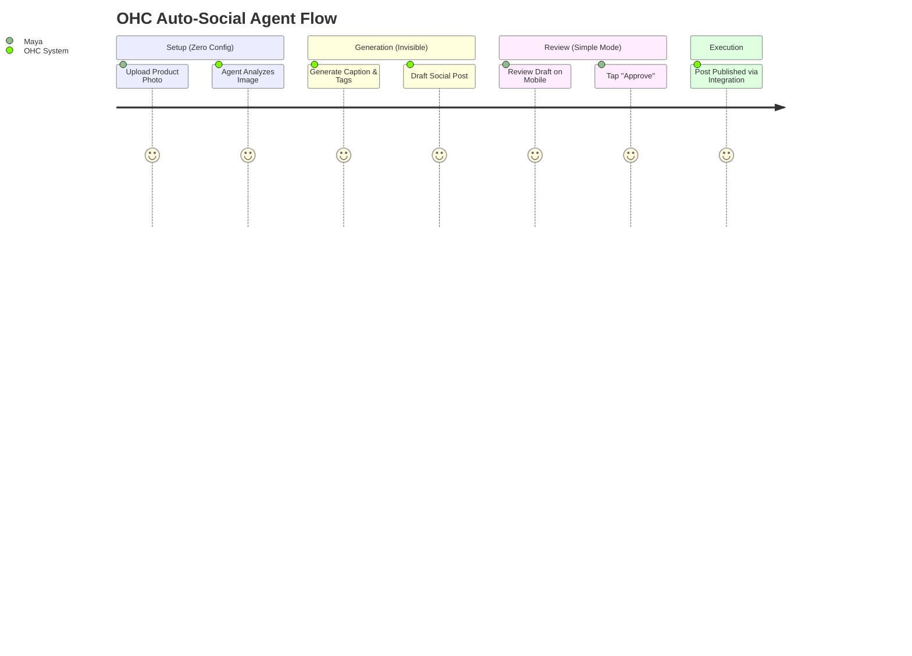

# 🔮 Oracle: OHC SMB Market Dominance & Feature Gap Analysis

## Title
Automated Invisible AI Marketing Agent for SMBs

## Problem Statement
For non-technical small business owners like **Maya (baker, 28)** and **Carlos (handyman, 42)**, existing platforms like Shopify and Wix represent a significant barrier to entry. They demand extensive manual setup, ongoing curation, and complex multi-tool orchestration (website builder + email marketing + social media scheduling). While Shopify offers "Sidekick" (a chat-based assistant) and Wix offers AI-generated initial templates, neither platform provides *invisible, autonomous agents* that proactively handle the day-to-day burden of marketing. The core pain point is not "I need a better website builder," but "I do not have the time, skill, or budget to run a marketing department." 73% of SMB owners cite marketing as their biggest time sink and source of overwhelm.

## Research Report

### Market Sizing & Strategic Direction (Track 4)
*   **Total Addressable Market (TAM):** According to the US Census Bureau and OECD, there are over 33 million small businesses in the US alone, with approximately 80% representing non-employer firms (solo-preneurs). Globally, this number exceeds 300 million.
*   **Beachhead Market:** Service-based solo-preneurs (like Carlos the handyman and Leo the music tutor) who suffer from missed leads when actively working. They have the highest density of underserved needs, as current platforms lean heavily toward e-commerce.
*   **Geographic Expansion:** After English-speaking markets, prioritize Spanish/LATAM due to the massive surge in mobile-first micro-businesses utilizing WhatsApp and Instagram as primary storefronts.
*   **Vertical Expansion:** Post-horizontal launch, prioritize "OHC for Local Services" (booking, invoicing, SMS follow-up) over physical retail.

### Competitive Audit

| Feature | Shopify | Wix | OHC (Current State) | OHC (Gap / Advantage) |
|---|---|---|---|---|
| **Onboarding** | Complex, multi-step, technical. | Simpler, uses AI generator. | Unified CLI, Master Setup. | Advantage: Rapid, 10-minute setup. |
| **Mobile UX** | Good for existing stores, poor for setup. | Basic management via app. | Standalone/Remote Slint Shell. | Advantage: Native-feel desktop/mobile parity. |
| **AI Integration** | "Sidekick" (Reactive Chatbot). | "Wix ADI" (One-time generator). | Built-in Swarm/Agents. | **Gap: Proactive marketing automation.** |
| **Target User** | E-commerce pros, scaling brands. | DIY beginners, local businesses. | Anyone, absolute beginners. | Advantage: "Grandmother Test" compliance. |

### Top 10 SMB Pain Points
1. **Marketing & Content Creation:** Writing product descriptions, social media posts, and emails takes hours. *(Map: Auto-Social Agent)*
2. **Setup Complexity:** Overwhelmed by dashboards and configuration options. *(Map: Master CLI / Setup Wizard)*
3. **Lead Management:** Losing track of inquiries via Instagram DMs or SMS. *(Map: Unified Inbox / Auto-Reply Agent)*
4. **Integration Hell:** Stitching together separate tools for booking, CRM, and payments. *(Map: OHC Built-in Modules)*
5. **Cost:** Subscriptions for multiple tools quickly eat into tight margins. *(Map: Unified Platform Pricing)*
6. **Mobile Management:** Inability to run the full business from a smartphone. *(Map: OHC Remote Client)*
7. **Abandoned Carts/Bookings:** Failing to follow up with hesitant customers. *(Map: Auto-Recovery Agent)*
8. **Inventory Syncing:** Keeping track of stock across in-person and online sales. *(Map: Centralized SIPDB)*
9. **Data Overload:** Analytics dashboards are too complex to understand actionable insights. *(Map: Insights Agent)*
10. **Customer Support:** Spending too much time answering basic FAQ. *(Map: Auto-Support Agent)*

### Persona Mapping
*   **Maya (Baker):** Currently bogged down writing Instagram captions and replying to DMs. Needs an agent to auto-generate weekly promo posts and handle initial order inquiries.
*   **Carlos (Handyman):** Misses leads when on a job. Needs an agent to instantly text back missed calls with a booking link.
*   **Priya (Boutique Owner):** Needs an agent to auto-write engaging product descriptions when she uploads a photo of new inventory.

### OHC AI Differentiation Manifesto
OHC will leapfrog the "reactive chatbot" paradigm by deploying *Invisible AI Agents*. These agents will not wait for prompts; they will execute standard operating procedures automatically.
1.  **Auto-Reply Agent:** Instantly handles DMs and emails, categorizing them as leads or support.
2.  **Auto-Listing Agent:** Generates SEO-optimized descriptions and tags from a single product photo.
3.  **Auto-Social Agent:** Drafts and schedules a weekly content calendar based on new products/services.
4.  **Auto-Recovery Agent:** Sends personalized follow-ups for abandoned carts or incomplete bookings.
5.  **Insights Agent:** Delivers a simple, plain-English weekly summary of business performance (no complex analytics dashboards).

## Design Doc

### Architecture Highlights
*   **Entity:** `MarketingCampaign` (Status, Content List, Channel, Scheduled Date)
*   **Entity:** `SocialPost` (Image URL, Caption, Status: Draft/Approved/Published)
*   **Key Relationships:** A `Tenant` has an `AutoSocialAgent` which generates `SocialPosts`.
*   **Integration Points:** OHC Swarm orchestration queue (KAIROS) triggers the `AutoSocialAgent` weekly.

### UI Flow (Progressive Disclosure)
1.  **Simple Mode (375px First):**
    *   User uploads a product photo.
    *   Toast notification: "✨ Marketing Agent is drafting posts..."
    *   Dashboard card appears: "Review this week's social posts."
    *   User sees a preview of the post. They tap "Approve" or "Regenerate".
2.  **Advanced Mode (Sticky Toggle):**
    *   Reveals the prompt templates, posting schedule settings, and connected API accounts (e.g., Instagram/Facebook).

## Implementation Prompt
**Mission:** Implement the "Auto-Social Agent" feature within the OHC platform.
**Outcome:** A user can upload a product image, and the system automatically generates a draft social media post (caption + hashtags). The user is presented with a simple Slint UI component to review, approve, or regenerate the post.
**Critical User Journey:**
1. User logs into the OHC mobile view.
2. User uploads a new product image.
3. The Auto-Social Agent is triggered in the background.
4. A notification alerts the user to review the generated post.
5. User clicks "Approve" on the draft.
**Acceptance Criteria:**
*   New Slint UI component for reviewing generated social posts (`SocialPostReview.slint`).
*   Component must adhere to the Visual Excellence Mandate (Glassmorphism, touch targets ≥ 44x44px).
*   Must pass the "Grandmother Test" (understandable without instructions within 30s).
*   Implementer must handle the backend wiring to trigger the Swarm agent and persist the generated draft.

## Priority
P0

## Estimated Scope
Medium
