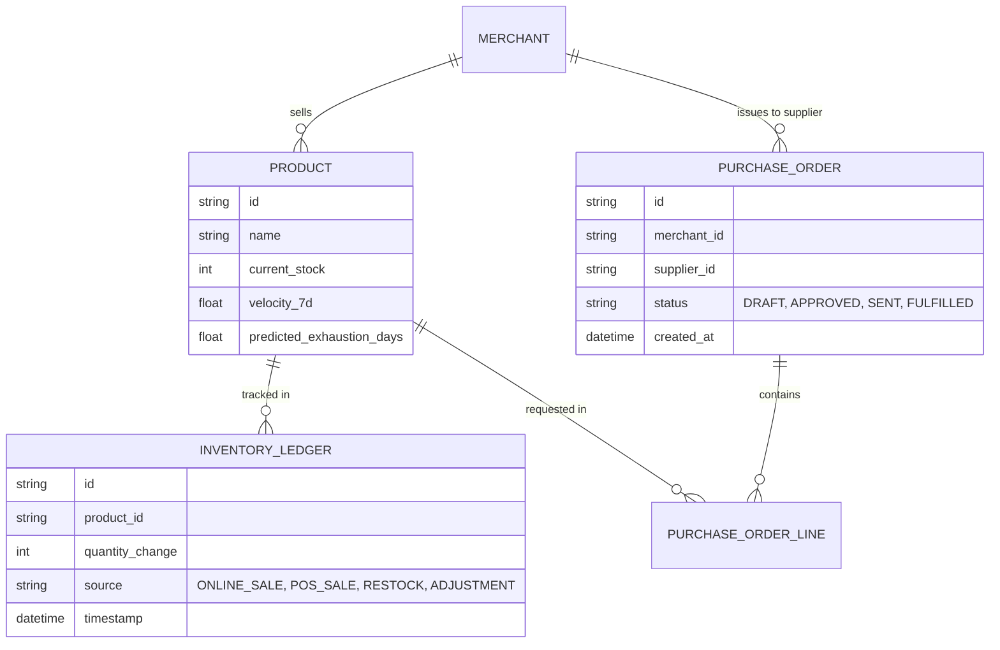
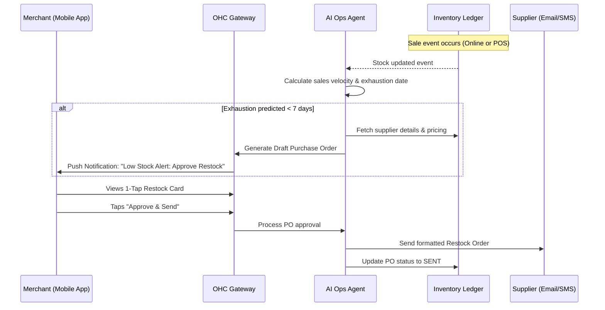

# [architecture]_autonomous_predictive_inventory_engine

## Title
Autonomous Predictive Inventory & Restocking Engine

## Problem Statement
Small business owners, particularly those managing physical products like Priya (boutique owner) and Fatima (food cart operator), suffer from inventory desynchronization and stockouts. They often manage inventory manually across multiple disconnected systems (e.g., in-store point of sale, online storefront, spreadsheets). This operational fatigue leads to missed sales when popular items run out, over-purchasing of slow-moving goods, and the "invisible discovery" problem where items show as available online but are sold out physically. Non-technical users need an inventory system that doesn't just track numbers, but actively predicts demand, alerts them before stockouts happen, and autonomously prepares restock purchase orders via an invisible AI agent.

## Research Report
**Competitor Systems Audit:**
- **Shopify:** Provides robust manual inventory tracking and multi-location support, but predictive restocking relies on third-party apps (e.g., Inventory Planner) which add "Cost Creep" and significant "Setup Complexity." It requires users to understand lead times, safety stock, and reorder points.
- **Wix / Squarespace:** Basic quantity tracking. No native intelligence for predicting when an item will sell out based on historical velocity or seasonal trends.
- **Square POS:** Good physical and online sync, but inventory forecasting is basic and often requires upgrading to more expensive retail tiers or relying on manual low-stock alerts.

**Market Gap:**
OHC currently lacks an AI-driven, predictive inventory system. The gap is the absence of an "Autonomous Restocking Engine" that monitors sales velocity across all channels (online, mobile POS, pre-orders) in real-time, predicts future stockouts using the AI Operations Agent, and drafts ready-to-approve purchase orders for suppliers. This addresses the "Operational Fatigue" pain point directly.

## Design Doc

### Architecture Diagram

### Mobile UX Flow (375px First)
1. **Screen 1: The Proactive Alert (Dashboard Card).** A translucent glass card appears at the top of the main dashboard: "⚠️ Vanilla Extract running low. Predicted to sell out by Friday. [Review Restock]".
2. **Screen 2: The 1-Tap Restock Detail.** Tapping the card opens a bottom sheet showing the AI's calculation in plain language: "You sold 14 bottles this week. To keep up, we should order 20 more from 'Wholesale Bake Supply' ($45.00)."
3. **Screen 3: Approval.** A massive, pill-shaped primary button: "Approve & Email Supplier". A secondary text link: "Edit quantities".
4. **Screen 4: Operations Hub.** If the user visits the Inventory tab, they don't see spreadsheets. They see visual, color-coded health indicators: Green (Healthy), Yellow (Restock Drafted), Red (Action Needed).

### AI Agent Integration Points
- **Operations Agent (AI Ops):** Continually monitors the Inventory Ledger. It calculates velocity, detects seasonal spikes, and drafts the Purchase Orders.
- **Business Advisory Agent:** Synthesizes inventory data into the weekly plain-language briefing (e.g., "Your vegan cakes are selling 3x faster this month. I've adjusted your baseline ingredient restock levels automatically.").
- **Customer Success Agent:** If a stockout *does* occur, it automatically intercepts DMs/emails asking about the item, replying with: "We're currently out of X, but expect more by Tuesday. Shall I notify you when it's back?"

### Key Design Decisions
- **Event-Driven Ledger:** Inventory is not a static integer column; it's an append-only ledger to guarantee consistency across multi-tenant, high-concurrency environments (like sudden social media traffic spikes).
- **Abstracted Supply Chain:** No mention of "Safety Stock", "Lead Times", or "Reorder Points" in the UI. The AI handles these parameters invisibly based on historical supplier response times.
- **Zero Trust Multi-Tenancy:** The Inventory Ledger enforces strict tenant boundaries; Merchant A's velocity data cannot influence Merchant B's AI predictions unless explicitly anonymized and aggregated at a global system level.

## Implementation Prompt
**Role:** Implementer Agent
**Task:** Build the core backend data models, multi-tenant isolation logic, and AI event hooks for the Autonomous Predictive Inventory & Restocking Engine.
**Outcome:**
1. An append-only `Inventory Ledger` data model.
2. A background worker / event subscriber that listens to inventory change events and recalculates a product's 7-day velocity and predicted exhaustion date.
3. A state machine for `Purchase Orders` (Draft -> Approved -> Sent -> Fulfilled).
4. An event trigger that notifies the AI Operations Agent to generate a "Draft" PO when the predicted exhaustion date falls below a configurable threshold (default 7 days).
**Acceptance Criteria:**
- The system must use an event-driven ledger for all stock adjustments to prevent race conditions during concurrent sales.
- Ensure strict multi-tenant isolation.
- Must emit events when a product crosses the "low stock prediction" threshold.
- Do not build the frontend UI; provide the robust backend foundation, background workers, and API endpoints. Ensure comprehensive unit testing.

## Priority
P0

## Estimated Scope
Large
