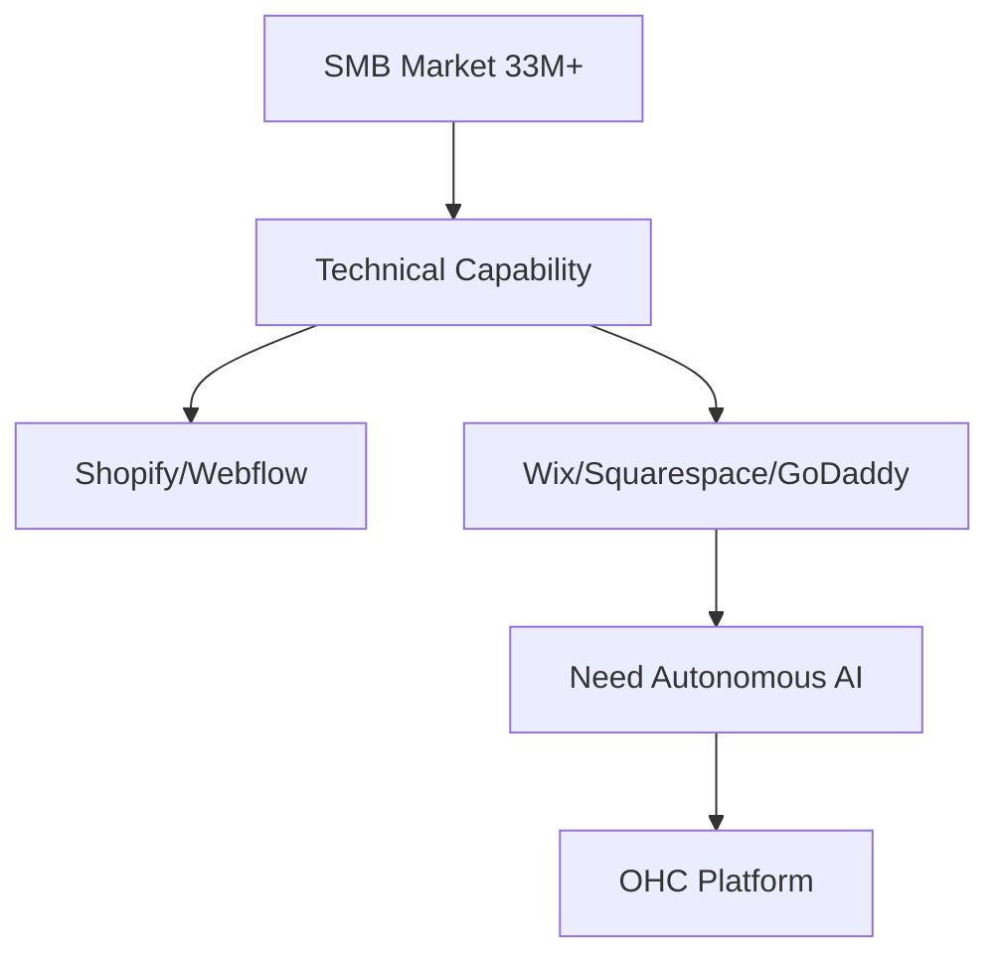

# OHC Small Business Platform Research Report

## Track 1: Deep Competitor Audit

### Shopify
- **Target Audience:** Established e-commerce stores.
- **Onboarding:** Extremely complex for non-technical beginners. Drops them into a complex dashboard with numerous settings.
- **Mobile Experience:** Strong app for managing existing stores (orders, inventory), but poor for initial setup.
- **AI Features:** Shopify Sidekick (Chat-based assistant, not autonomous), AI-generated product descriptions.
- **Pricing:** No meaningful free tier. Basic plan starts around $39/month.
- **Common Complaints:** Overwhelming interface, hidden costs (apps required for basic features), steep learning curve.

### Wix
- **Target Audience:** Service businesses, simple portfolios, small stores.
- **Onboarding:** Easier setup than Shopify. Wix ADI helps generate an initial site.
- **Mobile Experience:** Mobile editor is clunky and limited.
- **AI Features:** Wix ADI (AI website generator), AI text generation. One-time generation, lacks ongoing autonomous management.
- **Pricing:** Has a free tier (with Wix ads). Premium plans are reasonably priced but scale up with features.
- **Common Complaints:** Slower load times, can be difficult to migrate away from, mobile editor is frustrating.

### Squarespace
- **Target Audience:** Creatives, restaurants, portfolios (design-focused).
- **Onboarding:** Template-driven. Beautiful but can feel restrictive.
- **Mobile Experience:** Good mobile editing capabilities, but still better suited for desktop setup.
- **AI Features:** Limited. Some AI text generation.
- **Pricing:** No meaningful free tier. Premium pricing similar to Wix.
- **Common Complaints:** E-commerce features are less robust than Shopify, limited customization outside of templates.

### GoDaddy
- **Target Audience:** Very small businesses, domain buyers.
- **Onboarding:** Extremely simple, but results in a shallow website.
- **Mobile Experience:** Basic app.
- **AI Features:** GoDaddy Airo (AI branding, logo, tagline). Limited usefulness post-launch.
- **Pricing:** Aggressive upselling. Low initial price, high renewal rates.
- **Common Complaints:** Poor customer service, aggressive upselling, generic templates.

### Rising AI-Native Competitors
- **Durable:** Extremely fast setup (30 seconds), but very thin on actual business management features.
- **10Web:** Good for WordPress users, but still requires some technical understanding.

## Track 2: SMB User Pain Point Research

1. **Website Setup Complexity:** Users are overwhelmed by Shopify's dashboard and the number of decisions required.
2. **Connecting Payments/Stripe:** Often involves confusing jargon and complex verification steps.
3. **Managing Customer Messages:** Juggling Instagram DMs, Facebook messages, and emails is chaotic.
4. **No Unified Mobile Management:** Existing apps are either good for editing (Wix) or managing (Shopify), but rarely both seamlessly.
5. **Inventory Syncing:** Keeping in-store and online inventory in sync (especially for those not using advanced POS systems).
6. **Marketing/Social Media:** Creating consistent content is a massive time sink.
7. **Abandoned Carts:** Not knowing how to recover lost sales effectively.
8. **Booking/Scheduling Chaos:** For service businesses, managing appointments across different platforms.
9. **Hidden Costs:** Frustration with platforms that require paid add-ons for basic functionality.
10. **Lack of Guidance:** Feeling like they are "doing it wrong" because they don't have business experience.

## Track 3: OHC AI Differentiation Manifesto

OHC will leapfrog competitors by moving from *assistants* to *autonomous agents*. We will implement the following 5 AI automations:

1. **Autonomous Customer Inquiry Handling:** AI reads DMs/emails and suggests or automatically sends replies based on business context (saves 2+ hours/day).
2. **Invisible Product Catalog Management:** User takes a photo; AI generates the title, description, pricing suggestions, and categorizes it instantly.
3. **Proactive Social Media Generation:** AI generates a weekly calendar of social posts based on new inventory or seasonal trends, requiring only a "1-click approve".
4. **Automated Follow-up & Recovery:** AI autonomously handles abandoned cart emails and post-purchase thank yous, optimizing timing and messaging.
5. **Weekly "Business Health" Briefing:** Instead of complex analytics dashboards, AI provides a simple weekly text/audio summary: "You had 5 new orders. I noticed X product is popular, should we order more?"

## Track 4: Market Sizing & Strategic Direction

- **TAM:** There are over 33 million small businesses in the US alone, with millions more globally. A significant percentage (estimated 20-30%) still lack a robust, transactional online presence.
- **Beachhead Market:** Maya (The Baker) & Priya (The Boutique Owner). High density of underserved users who sell physical goods but struggle with the technical overhead of Shopify.
- **Geographic Expansion:** After English, target Spanish/LATAM due to high entrepreneurial growth and mobile-first adoption.
- **Vertical Expansion:** Maintain horizontal capability but build deep "Smart Templates" for specific verticals (e.g., Food, Retail, Services) that automatically configure the necessary tools (e.g., booking for services, POS for retail).

## Track 5: Feature Gap Matrix

| Feature | Shopify | Wix | OHC (Current) | OHC (Gap/Advantage) |
| :--- | :--- | :--- | :--- | :--- |
| **Setup Speed** | Slow/Complex | Medium | Fast | **Advantage:** AI-driven instant setup. |
| **Mobile App** | Strong (Management) | Weak (Editing) | Strong | **Advantage:** 100% mobile parity. |
| **AI Integration** | Assistant (Sidekick) | Generator (ADI) | Agents | **Advantage:** Autonomous, ongoing agents. |
| **Booking System** | Requires App | Built-in | Gap | **Gap:** Need native service booking. |
| **Unified Inbox** | Requires App | Built-in | Gap | **Gap:** Need native Omni-channel inbox. |
| **Subscription Billing** | Requires App | Built-in | Gap | **Gap:** Need native subscription management. |

---

# Issue Briefs

## [feature] Native Service Booking & Scheduling

- **Title:** Implement Native Service Booking & Scheduling for Service Businesses
- **Problem Statement:** Service businesses (like Leo the music tutor or Carlos the handyman) have no built-in way to schedule appointments and accept payments simultaneously without resorting to complex third-party integrations.
- **Research Report:** Competitors like Wix offer this built-in, while Shopify requires expensive apps. 30% of SMBs are service-based and need seamless booking.
- **Design Doc:**
  - **Key Entities:** Service Offering, Booking Slot, Calendar Integration, Customer.
  - **UI/UX:** Mobile-first calendar view. Simple flow: Select Service -> Select Time -> Pay/Confirm.
  - **AI Integration:** Agent auto-schedules follow-up reminders and requests reviews post-appointment.
- **Implementation Prompt:** Build a full-loop booking system. A user should be able to define a service (duration, price), and a customer should be able to book it via the OHC hosted storefront. Include conflict resolution for double bookings.
- **Priority:** P0
- **Estimated Scope:** Large

## [feature] Unified Omni-Channel Inbox

- **Title:** Unified Omni-Channel Inbox for Customer Communications
- **Problem Statement:** Business owners are overwhelmed jumping between Instagram DMs, emails, and website chats, leading to missed leads and slow response times.
- **Research Report:** This is a top 3 pain point mentioned in Reddit SMB communities. Centralizing communication drastically reduces owner fatigue.
- **Design Doc:**
  - **Key Entities:** Message, Conversation Thread, Channel (Email, IG, SMS), Customer Profile.
  - **UI/UX:** A single inbox view aggregating all channels. Clear indicators of message source.
  - **AI Integration:** AI suggests replies based on business knowledge base (FAQs, inventory status).
- **Implementation Prompt:** Create a unified inbox UI. Integrate at least one external channel (e.g., Email or simulated SMS) alongside internal website chat. Ensure the UI handles real-time updates gracefully.
- **Priority:** P1
- **Estimated Scope:** Medium

## [feature] AI-Powered Product Import via Image

- **Title:** Instant Product Creation via Photo Upload
- **Problem Statement:** Manually typing out product titles, descriptions, and setting prices is the biggest bottleneck to getting a store online.
- **Research Report:** Users drop off during the "add your first 5 products" onboarding step in traditional platforms.
- **Design Doc:**
  - **Key Entities:** Product Image, Generated Metadata, Inventory Item.
  - **UI/UX:** Camera icon prominent on dashboard. User snaps photo -> Loading spinner (Agent working) -> Pre-filled product form for review.
  - **AI Integration:** Vision AI analyzes image, generates SEO-optimized title, descriptive text, and suggests a price category.
- **Implementation Prompt:** Implement a flow where uploading an image triggers an AI service to return structured product data (Title, Description, Price). Populate a draft product form with this data for user approval.
- **Priority:** P1
- **Estimated Scope:** Medium
