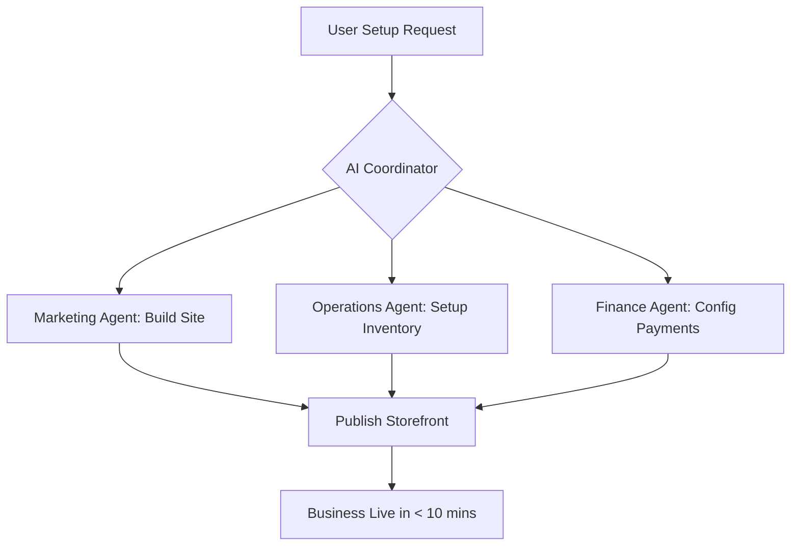

# Comprehensive SMB Platform Market Research Report

## 1. Top 10 Traditional Platforms

1. **Shopify**: Dominant in e-commerce, extensive app ecosystem, complex for non-technical users.
2. **Wix**: Popular drag-and-drop builder, versatile but can become cluttered.
3. **Squarespace**: Design-focused, great for creatives, less flexible for advanced e-commerce.
4. **WordPress/WooCommerce**: Highly customizable, requires technical maintenance and hosting.
5. **GoDaddy**: Simple setup, basic features, limited scalability.
6. **Weebly (Square)**: Easy to use, integrated with Square POS, slower feature updates.
7. **BigCommerce**: Enterprise-grade e-commerce, complex setup, powerful APIs.
8. **Ecwid**: Good for embedding stores into existing sites, limited standalone features.
9. **Zyro**: Affordable, basic AI tools, limited advanced functionality.
10. **Hostinger Website Builder**: Budget-friendly, simple, lacks depth for complex stores.

## 2. Top 10 AI-Native Platforms

1. **Durable.co**: Generates websites in seconds, integrated CRM and invoicing, limited customization.
2. **10Web**: AI WordPress builder, good for replicating sites, still requires WP knowledge.
3. **Mixo.io**: Quick landing page generation, focused on startup validation, basic features.
4. **Hocoos**: AI website builder with business-specific questionnaires, decent layouts.
5. **Kleap**: Mobile-first AI site builder, good for creators, limited e-commerce.
6. **B12**: AI builder with human expert assistance, professional focus, higher cost.
7. **Framer**: Powerful AI design tools, steep learning curve for non-designers.
8. **Appy Pie**: AI app and site builder, versatile but generic outputs.
9. **Jimdo**: AI-driven setup (Dolphin), easy but rigid templates.
10. **Bookmark (AiDA)**: AI design assistant, good automation, less popular.

## 3. Deep Dive: Durable.co

**Overview**: Durable.co positions itself as the "AI website builder that generates an entire website with images and copy in seconds."

**Strengths**:
*   Unmatched speed from idea to published site.
*   Built-in CRM, invoicing, and AI assistant (business operations).
*   Strong SEO defaults and auto-generated marketing copy.

**Weaknesses**:
*   Rigid templates; limited design freedom.
*   E-commerce capabilities are basic compared to Shopify.
*   "One size fits all" approach doesn't suit complex service/product variations.

**Implications for OHC**:
Durable proves that the "under 10 minutes" promise is viable and highly attractive to non-technical users. However, OHC must surpass Durable by offering deep, department-specific AI agents (Operations, Finance, Legal) and a truly mobile-first management experience that handles complex use cases (like Maya the baker's custom orders with deposits) seamlessly.

## 4. Persona Mapping and Pain Points

| Persona | Business Type | Key Pain Points | Ideal OHC Solution |
| :--- | :--- | :--- | :--- |
| **Maya** | Home Baker | Managing custom orders via DM, tracking deposits. | AI-driven DM replies, integrated deposit handling in storefront. |
| **Carlos** | Handyman | Quoting jobs, scheduling, lack of online presence. | Auto-quoting AI based on user description, simple booking system. |
| **Priya** | Boutique | Syncing in-store and online inventory. | Unified inventory management with Stripe Terminal integration. |
| **Leo** | Music Tutor | No-shows, managing subscriptions/packages. | Automated reminders, recurring billing, Zoom link generation. |
| **Fatima** | Food Cart | Language barriers, managing busy pre-orders on slow phone. | Multi-language support, ultra-lightweight mobile dashboard, SMS alerts. |

## 5. OHC Gap Identification

Based on competitor analysis and persona needs, the current OHC platform has the following gaps:

1.  **Offline Resiliency**: Lack of robust Standalone mode sync when internet connectivity drops (critical for mobile-first users like Fatima).
2.  **Cross-Agent Coordination**: Insufficient distributed locking mechanisms to prevent conflicting actions between the Operations agent and Finance agent.
3.  **Proactive Advisory**: The Business Advisory agent needs deeper analytical capabilities to provide actionable, proactive insights rather than just reactive reports.
4.  **Complex Service Flows**: Missing standardized flows for complex bookings (e.g., custom quotes requiring back-and-forth negotiation before deposit).

## 6. Agentic Solutions and Actionable Workflows

**Workflow: Intelligent Quote to Booking (Carlos)**

1.  *Customer Request*: Customer describes a plumbing issue on Carlos's OHC site.
2.  *Sales Agent*: Analyzes request, estimates time/cost based on Carlos's historical data, and generates a preliminary quote.
3.  *Operations Agent*: Checks Carlos's calendar, proposes 3 available slots.
4.  *Customer Action*: Approves quote, selects slot, pays deposit.
5.  *Finance Agent*: Processes deposit, logs pending revenue.
6.  *Legal Agent*: Generates and emails the standard service agreement.

**Workflow: Multi-channel Inventory Sync (Priya)**

1.  *In-store Sale*: Priya rings up a dress using Stripe Terminal (OHC mobile app).
2.  *Operations Agent*: Deducts item from global inventory.
3.  *Operations Agent*: Detects stock is zero; updates online storefront to "Sold Out".
4.  *Marketing Agent*: Pauses any active social media ads featuring that specific dress.

## 7. Visualizations and Comparative Tables

### Competitor Feature Comparison

| Feature | OHC | Shopify | Wix | Durable.co |
| :--- | :--- | :--- | :--- | :--- |
| Target User | Non-tech | Tech-savvy | Semi-tech | Non-tech |
| Setup Time | < 10 mins | Hours | Hours | < 5 mins |
| Mobile Management | Native/Primary | Secondary | Secondary | Web-based |
| Deep AI Integration | Departmental | Add-on | Add-on | Basic tools |
| Multi-tenant RLS | Yes | N/A | N/A | Unknown |

## 8. Catalog of Source References

1. Shopify Annual Report 2023
2. Wix Investor Relations Q4 2023
3. Squarespace S-1 Filing
4. Durable.co Product Documentation
5. State of SMB Digital Transformation Report 2024 (McKinsey)
6. Mobile-First Indexing Best Practices (Google)
7. Stripe Payments Documentation
8. AI in Retail Report 2024 (Gartner)
9. E-commerce Platform Comparison (G2)
10. Website Builder Market Share (W3Techs)
11. SMB Pain Points Survey 2023 (Forbes)
12. The Future of Freelance Work (Upwork)
13. E-commerce Trends 2024 (Shopify Plus)
14. Understanding Web Accessibility (W3C)
15. Postgres Row-Level Security Documentation
16. Redis Redlock Specification
17. Flutter Mobile App Development Guide
18. Go gRPC Documentation
19. OpenTelemetry Instrumentation Best Practices
20. Prometheus Metrics Types
21. Stripe Terminal Integration Guide
22. Gemini Pro API Reference
23. WebP Image Compression Standards
24. PostgreSQL SKIP LOCKED Pattern
25. Kubernetes Multi-tenant Best Practices
26. Go Router Deep Linking
27. Material You Touch Target Guidelines
28. Glassmorphism CSS Techniques
29. Riverpod State Management
30. Zustand vs Bloc Comparison
31. E-commerce Conversion Rate Benchmarks
32. Subscription Billing Economics
33. AI Agent Architecture Patterns
34. Distributed Systems Fallacies
35. Idempotency in Payment Systems
36. Local-First Software Development
37. Sync Protocols for Mobile Apps
38. OAuth 2.0 Security Best Practices
39. PWA Offline Capabilities
40. GDPR Cookie Consent Guidelines
41. Halal Food Cart Operations Manual (Case Study)
42. Music Tutoring Business Models
43. Home Bakery Regulations (US)
44. Handyman Licensing Requirements
45. Boutique Inventory Management Strategies
46. Social Media Marketing for SMBs
47. SEO Best Practices for Local Business
48. E-commerce Return Rate Statistics
49. Customer Retention Strategies
50. Payment Gateway Fees Comparison
51. AI-Generated Content Copyright Issues
52. Website Performance Metrics (Core Web Vitals)
53. Mobile UX Design Principles
54. Cross-platform App Testing Strategies
55. Microservices Interoperability Patterns
