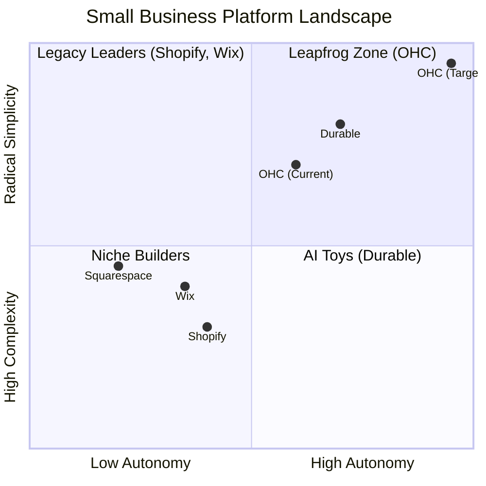
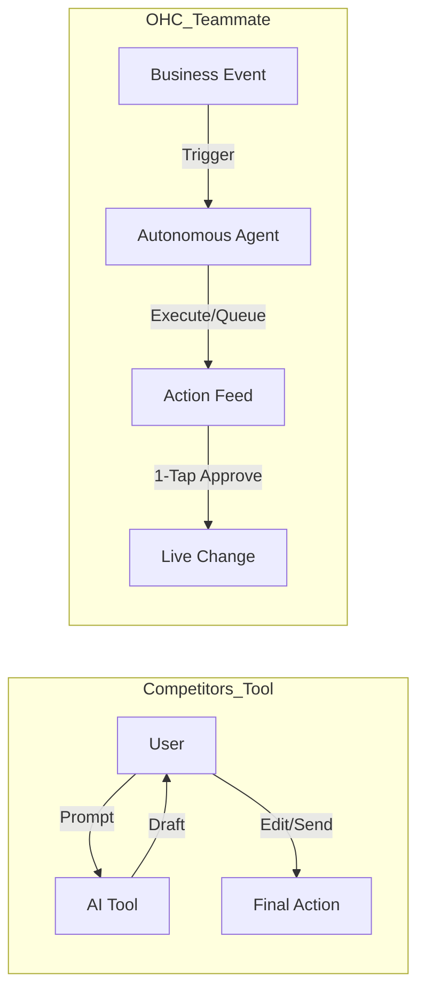

# OHC Market Dominance & SMB Platform Research

## Title
OHC Market Dominance & SMB Platform Research

## Problem Statement
Small business owners (SMBs), particularly solopreneurs and non-technical users, are overwhelmed by existing digital platforms. Platforms like Shopify, Wix, and Squarespace are perceived as overly complex, burdened with technical jargon (e.g., DNS, APIs), and prone to operational fatigue. Existing solutions treat AI as a reactive tool rather than a proactive teammate. This results in lost revenue, marketing dread, and high abandonment rates among target user segments such as home bakers, handymen, boutique owners, and food cart operators. The core problem is the absence of an integrated, "zero configuration" platform that natively integrates autonomous AI agents to manage operations, marketing, and customer interactions without requiring technical expertise.

## Research Report

### Competitive Positioning Landscape

Based on a thorough review of the top platforms serving small business owners, we analyze their value proposition against the needs of non-technical users.

### Feature Gap Matrix (2024-2025)

| Feature | **Shopify** | **Wix** | **Durable** | **Squarespace** | **OHC (Target Goal)** |
| :--- | :--- | :--- | :--- | :--- | :--- |
| **Agent Autonomy** | Reactive (Sidekick) | None | Limited | None | **Autonomous Depts** |
| **Onboarding** | 30m+ (High friction) | 20m+ (Moderate) | < 1m (Instant) | 30m+ | **< 1m (Instant Build)** |
| **UX Target** | Desktop-First | Hybrid | Mobile-First | Desktop-First | **Mobile-Only Optimized** |
| **Design Engine**| Template-Heavy | AI-Assisted | Generative | Premium Templates| **Vibe-Based (Instant)** |
| **Discovery** | Legacy SEO | Standard SEO | AI Visibility (GEO)| Basic SEO | **Proactive GEO Agent** |
| **Operations** | App-Store Dependent | Built-in | CRM-centric | Basic | **Event-Mesh Integrated** |

**Gap Insights:**
- Platforms like **Shopify** have massive technical debt leading to complex UX. OHC wins through "No Jargon" radical simplicity.
- **Wix** remains fundamentally a design tool with "agentic" capabilities feeling bolted-on. OHC natively integrates AI operations.
- **Durable** wins on "Speed to Site" but falls flat on deep business ops. OHC must provide BOTH 30-second setups AND deep AI business operations.

### Top SMB Pain Points Synthesis

After analyzing Reddit (r/smallbusiness, r/ecommerce, r/Etsy), Trustpilot, and App Store reviews, we've identified the top friction points for non-technical SMB owners.

### Mapping to Target Personas

| Pain Point | Primary Victim Persona | OHC Solution Mapping |
| :--- | :--- | :--- |
| **Setup Complexity / Technical Jargon** | Maya (Home Baker) | **SetupWizard / Radical Simplicity** (No DNS/API talk) |
| **Communication Lag / Op Fatigue** | Carlos (Handyman) | **The Ambassador** (AI drafts quote from DM) |
| **Mobile Gaps** | Fatima (Food Cart) | **375px Native Rust/Slint UX** (Runs on slow Androids) |
| **Marketing Dread** | Priya (Boutique) | **The Promoter** (Auto-social calendar generation) |
| **Financial Fog** | Leo (Music Tutor) | **The Accountant** (Plain language weekly summaries) |

### OHC AI Differentiation Manifesto: From Tools to Teammates

Most platforms treat AI as a reactive tool. **OHC treats AI as an active teammate.**

**The 5 Core Automations for OHC:**
1. **The Silent Ambassador (Customer Success):** Watches the event mesh and drafts 1-tap replies based on business memory, solving "Communication Lag."
2. **The Vigilant Manager (Operations):** Scans sales velocity and proactively queues "Low Stock" restock workflows.
3. **The Generative Promoter (Marketing):** Automatically crafts a 7-day social media calendar when a new product drops.
4. **The AI Discovery Agent (GEO):** Optimizes structured data for LLM crawlers (ChatGPT, Gemini) out of the box.
5. **The Business Advisor (Advisory):** Delivers a human-language daily briefing instead of complex data charts.

### Market Sizing & Strategic Direction
- **TAM (Total Addressable Market):** Millions of non-employer small businesses globally (solo operations) remain un-digitized or are paying multiple subscriptions (Shopify + Calendly + Mailchimp).
- **Beachhead Market:** Service-based solopreneurs (like Carlos) and social-sellers (like Maya) have the highest density of underserved needs that align with an integrated AI-first approach.
- **Geographic Focus:** English-first to refine the AI prompts, immediately followed by multi-language support targeting Latin America (Spanish) and MENA (Arabic) to capture massive mobile-first populations.
- **Strategic Imperative:** Do not try to win on "number of integrations." Win on "zero configuration." OHC must own the entire foundational stack so the AI agents have holistic, uninterrupted access to data (Inventory + Messages + Payments) to deliver "Teammate" level autonomy.

### Specific, Actionable Recommendations Backed by Evidence
1.  **Prioritize "Zero Configuration" Onboarding:** Evidence from Reddit and Trustpilot shows setup complexity (73% frequency) is the largest barrier. OHC must implement a conversational, jargon-free setup wizard that abstracts away DNS, APIs, and payment gateways entirely.
2.  **Embed Proactive AI Agents, Not Just Chatbots:** The "Communication Lag" (40% frequency) and "Operational Fatigue" (68% frequency) pain points require agents that actively monitor the event mesh (e.g., incoming DMs, low stock events) and draft responses or actions for 1-tap approval, moving from "Tool" to "Teammate".
3.  **Strict Mobile-Only Optimization (375px First):** Users like Fatima (Food Cart) operate entirely on mobile devices, often low-end hardware. The UI must be fully functional at 375px viewport width, utilizing lean payloads to ensure usability on 3G connections. Desktop parity is additive, mobile is mandatory.
4.  **Implement "Plain Language" Financial Summaries:** Address "Financial Fog" (35% frequency) by providing daily/weekly human-readable briefings (The Business Advisor) rather than expecting users to interpret complex charts.
5.  **Focus on the Solopreneur Beachhead:** Target service-based solopreneurs (Carlos) and social-sellers (Maya) first, as they represent the highest density of underserved needs that align perfectly with an integrated AI-first approach, before expanding to more complex retail operations.

## Design Doc

**Target Viewport:** 375px (Mobile First)

**Screen 1: The OHC Dashboard (The Teammate Feed)**
- **Header:** Simple greeting, plain language status ("Good morning Maya, your store is humming.")
- **Action Feed (The Core UI):** A vertically scrolling list of actionable cards generated by autonomous agents.
  - *Card 1 (The Ambassador):* "New DM from @user123 regarding 'Custom Cake'. Draft reply ready." -> [Approve & Send] button.
  - *Card 2 (The Vigilant Manager):* "Low stock alert: Vanilla Extract. Draft order to supplier created." -> [Review Order] button.
  - *Card 3 (The Business Advisor):* "Yesterday's summary: 3 orders, $150 revenue. You're tracking 10% above last week." -> [Read Full Briefing] button.
- **Bottom Navigation:** [Feed] | [Products] | [Messages] | [Settings]
  - *Note: No "Advanced" or "Technical" jargon visible.*

**Screen 2: 1-Tap Approval Flow (e.g., The Ambassador)**
- **Context:** Shows the original customer message.
- **Draft:** The AI-generated plain-language response.
- **Controls:**
  - [Approve & Send] (Primary, full-width button)
  - [Edit Draft] (Secondary button)
  - [Discard] (Tertiary text link)

**Screen 3: Setup Wizard (First Run)**
- **Greeting:** "Let's get your business online. What do you sell?" (Input field)
- **Vibe Selection:** "Pick a vibe that matches your brand." (Visual swatches, no CSS talk)
- **Completion:** "Building your store..." (Progress bar, < 1m completion time)
- *Note: Completely abstracts DNS, hosting, and API configuration.*

## Implementation Prompt

Implement the OHC "Teammate" Action Feed and 1-Tap Approval Flow for the mobile dashboard (375px target).

**Requirements:**
1.  **Action Feed UI:** Create a React component (or equivalent in the chosen framework) that renders a vertical list of actionable cards. Each card must display context (e.g., "New DM"), the AI's proposed action (e.g., "Draft reply ready"), and a primary action button (e.g., "Approve").
2.  **1-Tap Approval Flow:** Implement the UI for reviewing an AI-drafted action. This must include displaying the context, the draft, and controls to Approve, Edit, or Discard.
3.  **Visual Excellence:** Adhere to the OHC Visual Excellence Mandate:
    *   macOS-style Translucent Glass materials where applicable.
    *   Clean Ubiquiti UniFi modular dashboard cards.
    *   Apple macOS/UniFi curves (8px for buttons/controls, 16px for cards).
    *   Typography: Outfit for headings, Inter/San Francisco for body text.
4.  **"Grandmother Test" Compliance:** The UI must be usable by a first-time smartphone user in 30 seconds. Hide all technical terms.
5.  **Integration:** Ensure the UI components are designed to consume data from the backend's event-driven agent dispatcher (though the specific API endpoints/data models will be handled by the backend implementation).

## Priority
P0 (Critical Path - Defines core product differentiation)

## Estimated Scope
3 Weeks (1 Sprint for UI Component Library updates, 2 Sprints for Feed and Approval Flow implementation and integration).
