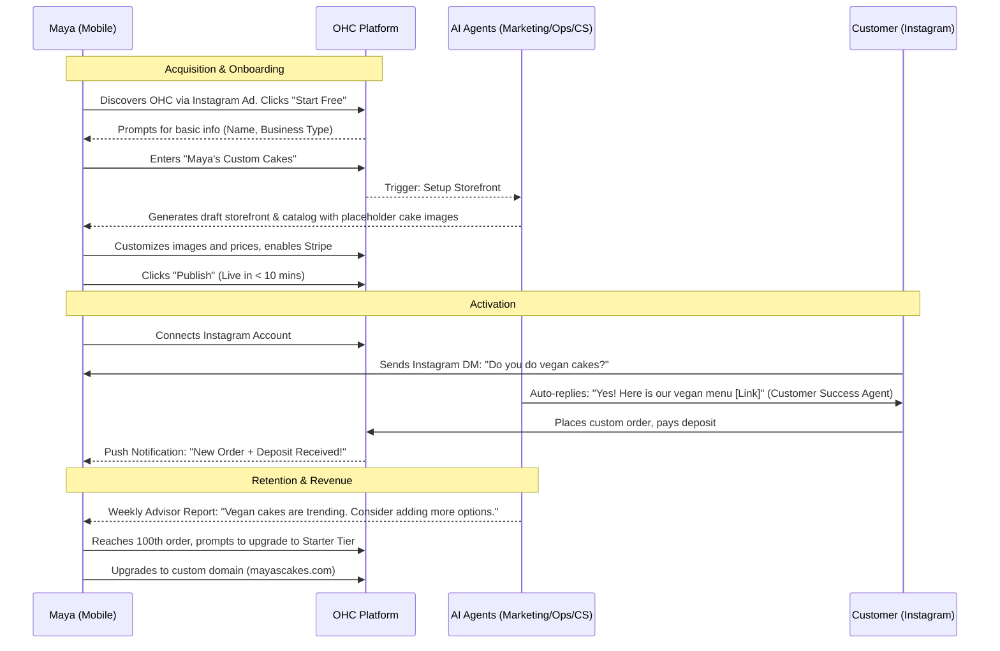
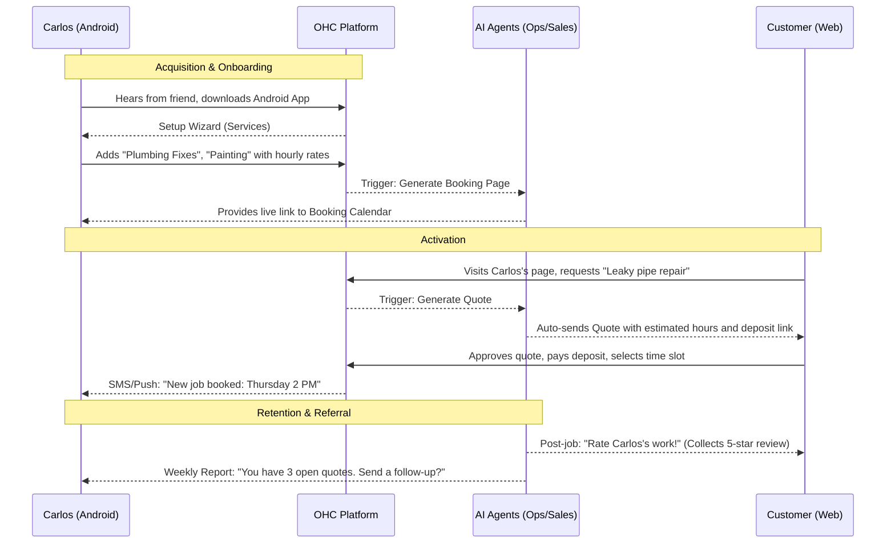
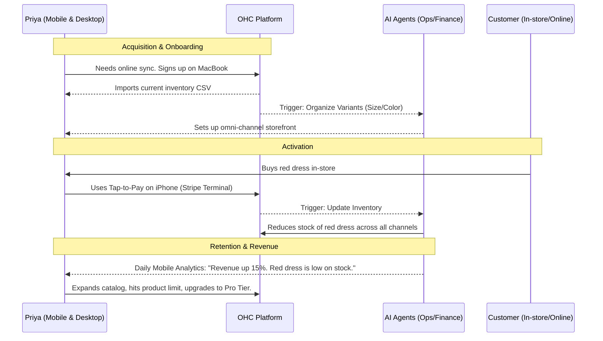
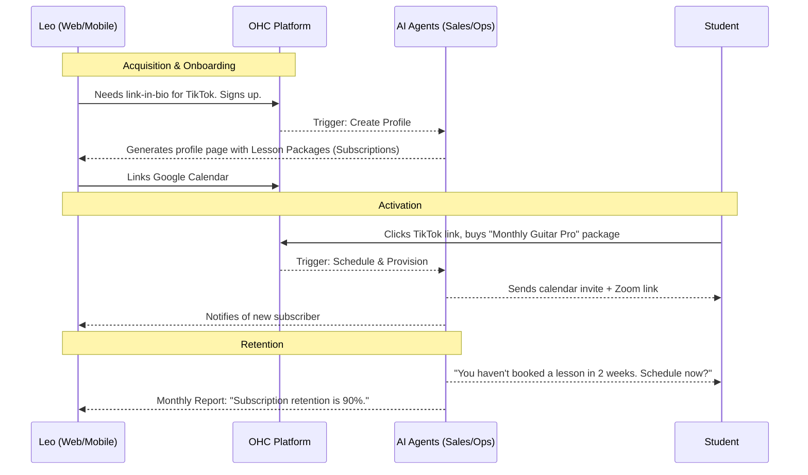
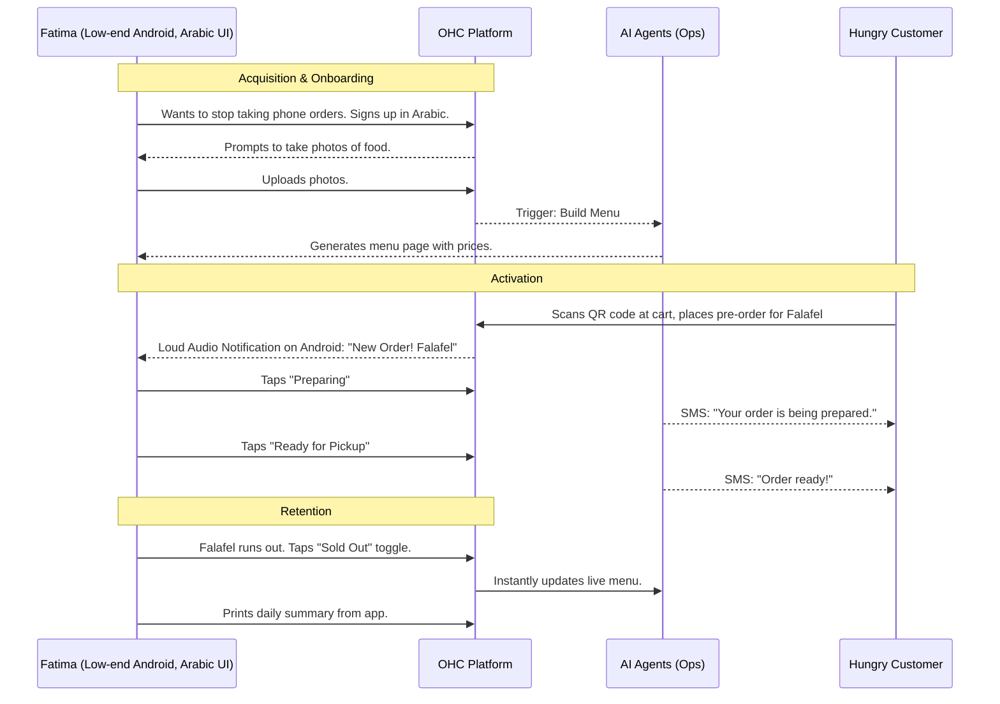

# Business Journey Architecture

## Problem Statement
The OneHumanCorp (OHC) platform aims to empower non-technical users to launch and manage their businesses in under 10 minutes. However, we lack a cohesive, documented end-to-end user journey that maps out how different real-world personas interact with the platform from discovery to ongoing retention and growth. Without this, architectural decisions may not align with the actual needs of our users.

## Research Report
The research focuses on defining the complete business lifecycle for key personas defined in the OHC platform:
1.  **Maya (The Home Baker):** Needs a mobile-first, simple storefront, custom orders with deposits, and Instagram DM management.
2.  **Carlos (The Freelance Handyman):** Needs a service listing, a booking calendar with deposits, and automated quote generation via Android.
3.  **Priya (The Boutique Owner):** Needs online/in-store inventory sync, product variants, and cross-platform (mobile/desktop) access.
4.  **Leo (The Music Tutor):** Needs lesson booking, subscription pricing, Zoom links, and a link-in-bio page.
5.  **Fatima (The Food Cart Operator):** Needs a multi-language UI, pre-order functionality, and low-data mobile performance.

The end-to-end journey encompasses the following phases:
*   **Acquisition:** How the user discovers OHC.
*   **Onboarding:** The initial setup wizard to go live.
*   **Activation:** The first critical action (e.g., first product, first sale).
*   **Retention:** Ongoing engagement via AI agents and reports.
*   **Revenue:** Upgrading from free to paid tiers based on limits or premium features.
*   **Referral:** Spreading the word to other potential users.

## Design Doc

### Architecture Diagrams (Mermaid.js)

#### 1. Maya (The Home Baker) - Product / Social Focus

#### 2. Carlos (The Freelance Handyman) - Service / Booking Focus

#### 3. Priya (The Boutique Owner) - Omni-channel / Inventory Focus

#### 4. Leo (The Music Tutor) - Subscription / Digital Focus

#### 5. Fatima (The Food Cart Operator) - Local / Fast Paced Focus

### UI Flow & Mobile UX (375px First)
*   **Onboarding Wizard:** 3-5 sequential screens. One question per screen (e.g., "What's the name of your business?", "What do you sell?"). Large tap targets (>= 44x44px). Native numeric keypads for pricing.
*   **Dashboard (The "Command Center"):** Glassmorphism cards displaying AI Agent notifications ("Your Promoter Agent drafted a new Instagram post", "Your Accountant Agent prepared your weekly summary").
*   **Friction Points to Avoid:**
    *   No complex DNS or SSL setup for custom domains; handled entirely by OHC in the background.
    *   No manual CSS/HTML layout editing on mobile; reliance on intelligent defaults and AI content block generation.
    *   Ensure critical flows (like Fatima's order received notification) work seamlessly even on 3G connections.

### AI Agent Integration Points
*   **Operations:** Automatically updating inventory, managing calendar syncs.
*   **Customer Success:** Auto-replying to DMs, sending Zoom links/receipts.
*   **Sales:** Generating quotes from customer requests.
*   **Marketing:** Generating the initial storefront and social media posts.
*   **Advisory:** Pushing weekly/daily plain-language insights to the user via push notifications.

## Implementation Prompt
"Implement the foundational 'Onboarding Wizard' UI flow and corresponding backend endpoints. The wizard must guide a new, non-technical user through the creation of their Tenant. It must capture the Business Name, Business Category (e.g., Services, Retail, Food), and automatically trigger the appropriate AI Agent (e.g., Marketing Agent) to generate a foundational, publish-ready storefront template. The UI must strictly adhere to the 375px mobile-first design system, utilizing native mobile keyboards for input, and feature OHC Premium Glassmorphism tokens. Acceptance Criteria: A user can complete the wizard in under 3 minutes, resulting in a provisioned Tenant, an active 'Draft' storefront, and a 'Welcome' notification from their Advisory Agent in the dashboard."

## Priority
P1

## Estimated Scope
Medium
