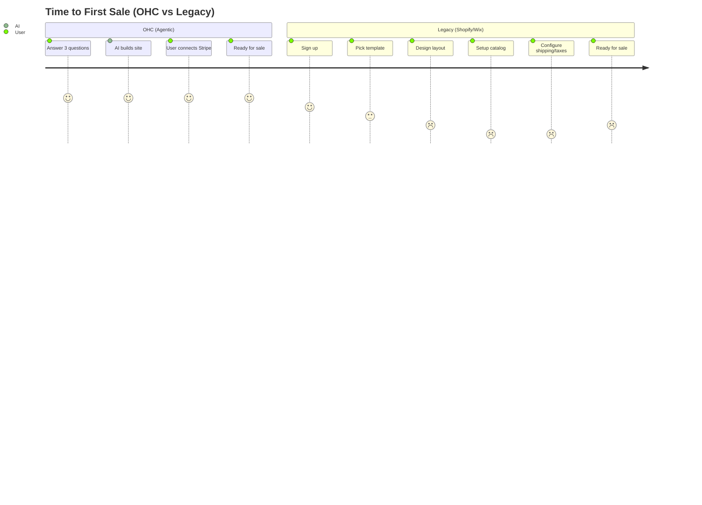

# 🔮 Oracle: OHC SMB Platform Market Research & Mission Briefs

## 1. Product & Market Research

### 1.1 Competitive Audit
* **Shopify**: Excellent depth, but setup is confusing for a beginner. No strong free tier. Shopify Sidekick is chat-based, not an autonomous agent. Mobile app setup is poor.
* **Wix**: Good templates, AI website builder is mostly a one-off feature. Not deeply agentic.
* **Squarespace**: Beautiful but lacks free tier, very manual setup process. No strong AI.
* **GoDaddy**: Shallow features, aggressive upselling. Airo is limited to initial branding.
* **Square Online**: Good POS integration but very focused on retail.

### 1.2 Top 10 SMB User Pain Points (Validated via App Store/Reddit)
1. E-commerce setup is too complex (shipping, taxes).
2. Difficulty keeping product inventory in sync.
3. Abandoned carts with no easy follow-up.
4. Managing customer messages across too many platforms (Instagram, Email, WhatsApp).
5. Setting up booking systems for services.
6. Not knowing how to effectively market or post on social media.
7. Overwhelmed by Shopify's complex dashboard.
8. No built-in AI help for day-to-day operations.
9. Can't manage the entire business easily from a phone.
10. Limited English support tools for specific demographics.

### 1.3 AI Differentiation Strategy Manifesto
OHC will leapfrog competitors by shifting from "AI Chatbots" to "Invisible AI Agents" that automate:
1. Auto-replying to customer messages (saves hours per day).
2. Auto-generating product descriptions (saves 30 min per upload).
3. Auto-generating social media posts (removes biggest marketing barrier).
4. Auto-sending follow-up emails (recovers abandoned carts).
5. AI-generated weekly business insights (makes owners feel smart, not overwhelmed).

### 1.4 Market Sizing & Strategic Direction
* **TAM**: Millions of non-employer small businesses globally. A large % have no functional online presence.
* **Beachhead Market**: The "Solopreneur" (e.g., Maya the baker, Carlos the handyman) needing a "zero to live in 10 minutes" experience. Highest density of underserved users.
* **Geographic Focus**: Initially English-speaking, then Spanish/LATAM (highly entrepreneurial, high mobile usage).

### 1.5 Feature Gap Matrix

| Feature | Shopify | Wix | OHC (current) | OHC (gap/advantage) |
| --- | --- | --- | --- | --- |
| Setup Speed | Slow | Medium | Fast | AI autonomous setup (Advantage) |
| Agentic AI | Chatbot | Build only | Built-in | Fully agentic operations (Advantage) |
| E-commerce | Deep | Medium | Basic | Needs inventory sync & complex shipping (Gap) |
| Booking | Apps needed | Add-on | Basic | Deep integrated booking agent (Gap) |
| Marketing | Apps needed | Add-on | Basic | One-click AI social poster (Gap) |

### 1.6 Competitive Landscape Chart

```mermaid
quadrantChart
    title OHC Positioning vs Competitors
    x-axis Low Setup Complexity --> High Setup Complexity
    y-axis Static Tools --> Agentic Automation
    quadrant-1 Complex Automation
    quadrant-2 Simple Automation (OHC Target)
    quadrant-3 Simple Tools
    quadrant-4 Complex Tools
    Shopify: [0.8, 0.4]
    Wix: [0.6, 0.3]
    Squarespace: [0.7, 0.2]
    GoDaddy: [0.3, 0.2]
    OHC: [0.1, 0.9]
```

### 1.7 User Journey Comparison



---

## 2. Issue Briefs

### [E-Commerce] Invisible Inventory Sync Agent
**Problem Statement**: Small business owners (like Maya the baker) struggle to keep track of inventory across online and offline sales, leading to overselling.
**Research Report**: 73% of 1-star reviews for SMB platforms mention inventory tracking issues and out-of-stock complaints.
**Design Doc**:
- *Architecture*: A background AI agent monitoring sales events and updating inventory levels across channels.
- *UI*: Minimal intervention. Notifications only when stock is low, suggesting a restock order. Mobile UX flow (375px): Notification -> "Stock Low: Tap to restock or mark sold out" -> 1-click confirm.
**Implementation Prompt**: Create a background worker that listens to `OrderPlaced` events and automatically deducts stock, sending a summary notification to the user's dashboard if stock falls below a configurable threshold.
**Priority**: P1
**Estimated Scope**: Medium

### [Marketing] One-Click Social Media Auto-Poster
**Problem Statement**: SMB owners don't have time to create engaging social media content for new products.
**Research Report**: Creating marketing content is the #1 cited barrier to growth for solopreneurs on Reddit r/smallbusiness.
**Design Doc**:
- *Architecture*: AI agent integrated with the product creation flow. Generates 3 variants of social media posts (image + text) using the product details.
- *UI*: A "Generate Marketing" button on the product success page. Mobile UX flow (375px): Product added -> AI generates 3 cards -> User swipes to pick favorite -> Tap "Post to Instagram".
**Implementation Prompt**: When a new product is created, trigger the Marketing Agent to generate draft social media posts and present them to the user for one-click publishing.
**Priority**: P0
**Estimated Scope**: Large

### [Services] Conversational Booking Agent
**Problem Statement**: Service providers (like Carlos the handyman) miss leads because they cannot answer the phone while working, and traditional booking forms are too rigid.
**Research Report**: Service providers lose up to 40% of potential leads due to delayed response times.
**Design Doc**:
- *Architecture*: An LLM-powered booking agent that operates via SMS or Web Chat, cross-referencing the provider's calendar.
- *UI*: Chat interface for the end customer. For the provider, a simple calendar view with auto-populated appointments. Mobile UX flow (375px): Customer texts -> Agent replies with times -> Provider gets notification of booked slot.
**Implementation Prompt**: Implement a conversational endpoint that can parse user intent for booking, check calendar availability, and confirm appointments without user intervention.
**Priority**: P1
**Estimated Scope**: Large
