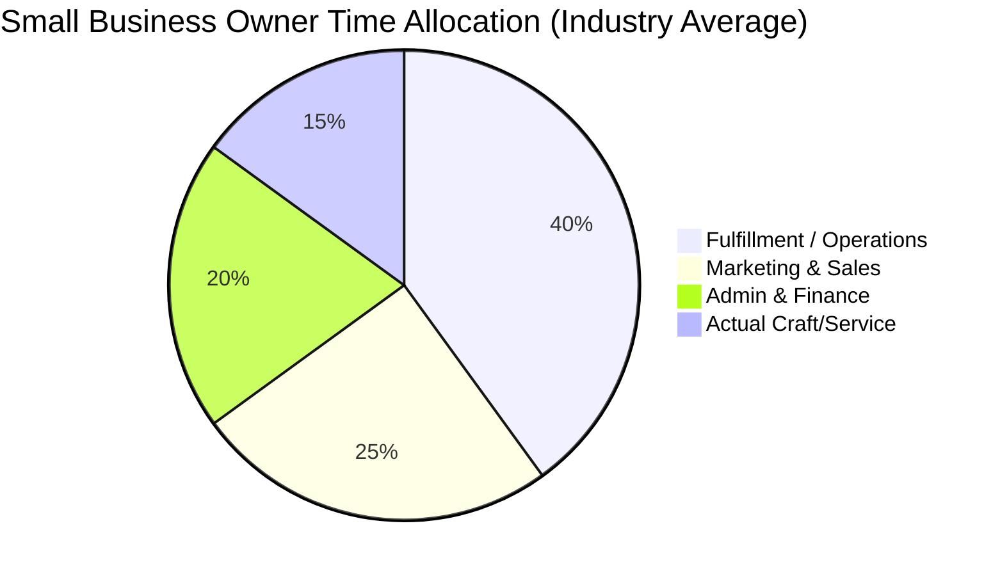

# Title: AI Agent Department Architecture & Orchestration

## Problem Statement
Running a business means wearing too many hats. Maya (the baker) is baking at 4 AM, answering Instagram DMs at 10 PM, and trying to figure out her taxes on Sunday. She doesn't have a team, and she definitely doesn't know what an "LLM vector store integration" is. When she signs up for a platform, she just wants a "Manager" to handle her orders, a "Promoter" to run her social media, and an "Accountant" to make sure she's profitable. The pain point is that traditional software provides *tools* that users must learn to operate. We need to provide *employees* that operate invisibly in the background, mirroring how a real business is structured. We must map complex backend AI orchestration into simple, human-understandable "Departments."

## Research Report

Small business owners abandon complex tools when the learning curve is too high or the required daily maintenance is too great.

### Persona-Specific Pain Point Summary
*   **Maya (Baker):** "I lose orders because I forget to reply to Instagram comments while my hands are covered in flour."
*   **Carlos (Handyman):** "I don't know how to follow up with leads or create a website; I just want someone to book jobs for me."
*   **Priya (Boutique Owner):** "Managing inventory across online and in-store makes my head spin."
*   **Leo (Tutor):** "Chasing students for payments or reminding them of sessions feels awkward."

### Competitive Analysis

| Platform | Approach to AI & Automation | Small Business Empathy (Grandmother Test) | Mobile-First | Standalone / Local |
| :--- | :--- | :--- | :--- | :--- |
| **Shopify** | "Shopify Magic" features integrated into specific inputs (e.g., generate a description). Tool-centric. | Low. It still requires the user to build and manage the store. | Yes | Cloud only |
| **Wix** | AI Site Generator builds the initial site. AI is used as a setup wizard, not a daily operator. | Medium. Good for setup, poor for ongoing business management. | Yes | Cloud only |
| **Squarespace**| AI writing assistants and design tools. Requires manual intervention for all operations. | Medium. Focuses on aesthetics over business operations. | Yes | Cloud only |
| **OHC (Proposed)** | AI is structured as "Departments" (e.g., "The Manager"). Autonomous operation with approval workflows. | High. Users interact with "employees", not software tools. | 100% Core | Cloud & Standalone |



## Design Doc

### Architecture Diagram

```mermaid
flowchart TD
    User([Business Owner]) -->|Mobile App / Slint UI| Dashboard

    subgraph OHC Multi-Tenant Cloud / Standalone Edge
        Dashboard -->|Views & Approvals| ControlRoom[Control Room: Action Approval Queue]

        subgraph AI Departments
            Ops[Operations<br/>"The Manager"]
            Mktg[Marketing & Advertising<br/>"The Promoter"]
            Sales[Sales & Acquisition<br/>"The Salesperson"]
            CS[Customer Success<br/>"The Ambassador"]
            Fin[Finance & Payments<br/>"The Accountant"]
            Legal[Legal & Compliance<br/>"The Protector"]
            Adv[Business Advisory<br/>"The Advisor"]
        end

        ControlRoom <--> Ops & Mktg & Sales & CS & Fin & Legal & Adv

        subgraph Coordination & Context
            EventBus{Event Bus / Triggers}
            MemoryStore[(Shared Department Memory)]
            Budgeting[Usage Budgeting & Throttling]
        end

        Ops & Mktg & Sales & CS & Fin & Legal & Adv --> MemoryStore
        Ops & Mktg & Sales & CS & Fin & Legal & Adv --> Budgeting
        EventBus -->|Trigger Events| Ops & Mktg & Sales & CS & Fin & Legal & Adv
        Ops & Mktg & Sales & CS & Fin & Legal & Adv -->|Cross-Department Triggers| EventBus
    end

    External[External APIs: Stripe, IG, etc.] <--> AI Departments
```

### Key Design Decisions

1.  **Humanized Department Abstraction**: AI agents are grouped into specialized "Departments" (e.g., "The Manager", "The Accountant"). *Why:* This maps directly to the mental model of a small business owner. It passes the Grandmother Test.
2.  **Shared Context Memory**: All departments write to and read from a shared contextual memory layer specific to the tenant. *Why:* If "The Manager" processes a refund, "The Ambassador" must instantly know not to ask the customer for a 5-star review.
3.  **Tier-Based Budgeting Engine**: AI action limits are enforced centrally by a budgeting engine before execution. *Why:* Protects platform margins and ensures Free/Starter tiers operate within their token/usage limits without exposing the complexity of "tokens" to the user.
4.  **Approval Draft System**: High-risk actions (e.g., spending ad money, sending a bulk email) generate "Drafts" in a Control Room. Low-risk actions (e.g., categorizing an order) auto-execute. *Why:* Builds trust incrementally. Users can switch agents from "Suggest" to "Auto-pilot" as they get comfortable.
5.  **Event-Driven Coordination**: Departments operate reactively based on events (time-scheduled, user-triggered, or external webhooks). *Why:* Allows asynchronous background execution without blocking the main thread or user UI.

### UI Wireframes & Mobile UX Flow (375px First)

**Screen 1: The Control Room (Home)**
*   **Header**: Glassmorphic top bar, greeting ("Good morning, Maya!").
*   **Action Required Stack**: A swipeable card stack of pending AI drafts.
    *   *Card Example*: "The Promoter suggests: Auto-reply to 4 new Instagram comments about vegan cakes. [Approve & Send] [Edit]."
*   **Department Status**: A horizontal scroll of department avatars. Green dot if active, sleep emoji if idle.

**Screen 2: Department Settings (e.g., "The Manager")**
*   **Toggle**: "Autopilot Mode" (Instantly handles tasks) vs. "Draft Mode" (Asks for review).
*   **Activity Log**: A simple timeline of what the manager did today ("Categorized 3 orders", "Updated inventory for Vanilla Cupcakes").

**Mobile UX Flow:**
1. User receives a push notification: "The Salesperson generated a new quote for Carlos. Tap to review."
2. User taps notification, opening the app directly to the Approval Card.
3. User reviews the quote, taps "Approve."
4. The system triggers the actual dispatch, logs the action in the shared memory, and updates the AI usage budget.

## Implementation Prompt

**Role:** Implementer
**Objective:** Implement the core underlying structure for the AI Departments and the Control Room approval queue. Ensure the components are modular so specific AI logic can be plugged in later.
**CUJ (Critical User Journey):**
A user logs into their mobile app. An event (e.g., "New Order Received") triggers the "Operations" department. The Operations department generates a draft action (e.g., "Send personalized thank you email"). The user sees this draft in their Control Room UI, taps "Approve", and the action status is updated to executed, deducting 1 action from their monthly budget.

**Acceptance Criteria:**
1.  Establish the internal Rust structure for AI Departments (Operations, Marketing, Sales, Customer Success, Finance, Legal, Advisory).
2.  Implement an event-bus or trigger mechanism to route internal events to the appropriate department.
3.  Create an Approval Queue (Control Room) system where actions can be marked as `Draft`, `Approved`, or `Rejected`.
4.  Implement a centralized AI budget tracker that intercepts approved actions, checks against the tenant's tier limits, and increments usage.
5.  Provide five Playwright/Slint UI tests that navigate the Control Room approval flow from the home page. Use injected mocks for any underlying network calls.
6.  Ensure all UI components strictly follow OHC premium CSS tokens (Glassmorphism, Outfit/Inter typography, 375px mobile-first responsiveness).

## Priority
P0 (Critical)

## Estimated Scope
Large
