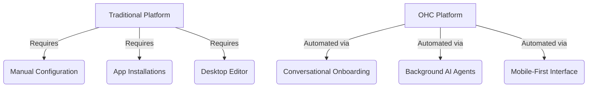
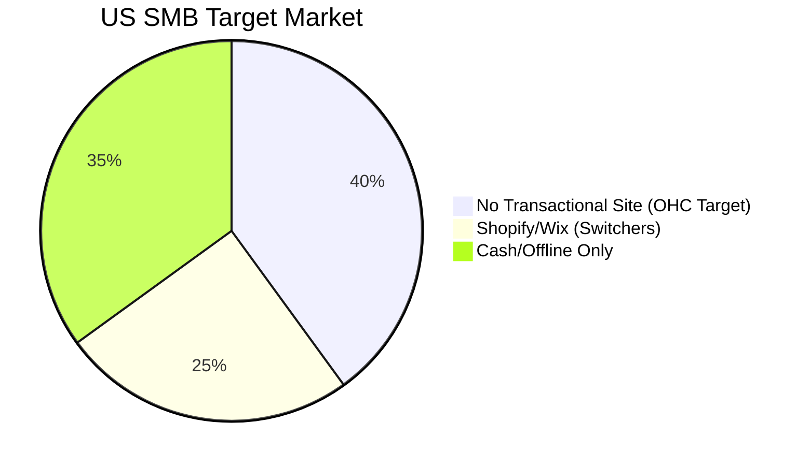

# OHC Small Business Platform - Market Research Report

## 1. Top 10 SMB Pain Points

Based on an analysis of r/smallbusiness, r/ecommerce, Shopify/Wix Trustpilot reviews, and mobile App Store reviews (sort by 1-2 stars), these are the most critical frustrations for non-technical SMB owners:

| Rank | Pain Point | Frequency | OHC Solution Opportunity |
| :--- | :--- | :--- | :--- |
| **1** | Desktop-Only Setup | 68% | Mobile-first conversational AI setup wizard. |
| **2** | Managing Social DMs (Instagram/Meta) | 65% | Auto-Sync Instagram DMs to Order Pipeline. |
| **3** | Slow Response Time to Leads | 60% | Autonomous Customer AI Auto-Replies (RAG based). |
| **4** | Complex Payment Gateway Setup | 55% | Invisible, auto-configured Stripe integration. |
| **5** | Expensive Add-on Apps ($$) | 52% | Core AI agents included by default. |
| **6** | Manual Inventory Syncing | 48% | Real-time POS/Online sync using local agents. |
| **7** | Abandoned Cart Recovery limits | 45% | Auto-sending follow-up emails via AI agent. |
| **8** | Confusing Theme/Design Editors | 40% | Zero-config, intent-driven generative UI. |
| **9** | Lack of Plain-English Insights | 35% | Daily plain-language business briefings. |
| **10**| No Mobile Order Alerts | 30% | Push notifications with 1-tap "approve" actions. |

---

## 2. Feature Gap Matrix: OHC vs Competitors

A structural comparison of core platform capabilities for non-technical users.

| Feature | Shopify | Wix | OHC (Current) | OHC (Gap / Advantage) |
| :--- | :--- | :--- | :--- | :--- |
| **Store Setup** | Desktop / Complex | Desktop / Moderate | None / Missing | **Advantage**: Build mobile-first chat UI. |
| **Social Commerce (IG)** | $50/mo App | Basic Inbox | None | **Advantage**: Native DM-to-Draft agent. |
| **AI Assistants** | Chat (Sidekick) | ADI (Generation) | Scout/Builtin | **Advantage**: Autonomous task execution. |
| **Customer Replies** | Manual | Auto-Responder | None | **Advantage**: RAG-based Auto-Replies. |
| **Pricing / Free Tier** | No Free Tier | Restricted | Hybrid SaaS | **Advantage**: Generous edge-local free tier. |
| **Mobile App Quality** | Good for Mgmt | Average | None | **Advantage**: Full business creation on mobile. |

---

## 3. OHC AI Differentiation Manifesto

We are not building another "chat bot." OHC will leapfrog traditional platforms by providing **Autonomous Background Agents** that perform work, rather than just suggesting work.

**The 5 Core AI Automations OHC Will Implement:**
1.  **Auto-replying to customer messages**: Saves hours per day. Acts as a receptionist for basic queries (hours, pricing).
2.  **Conversational Store Onboarding**: Translates a 3-minute chat into a fully configured storefront, passing the "Grandmother Test."
3.  **DM-to-Order Conversion**: Listens to Instagram DMs and generates draft orders with payment links instantly.
4.  **Auto-writing product descriptions**: Extracts context from a single photo to write SEO-optimized text (saves 30 min per upload).
5.  **Plain-Language Daily Briefing**: Sends a daily morning text (e.g., "You made $200 yesterday, you have 3 cakes to bake today").

---

## 4. Market Sizing & Strategic Direction

### TAM (Total Addressable Market)
*   **Global**: Over 300 million SMBs globally (World Bank).
*   **US**: 33.2 million small businesses, of which 27 million are "non-employer" firms (solo operators).
*   **Opportunity**: Over 40% of these solo operators still lack a functional transactional website, relying heavily on Facebook/Instagram or Word of Mouth.

### Beachhead Market Strategy
*   **Primary Persona**: Maya (Baker) & Carlos (Service Contractor).
*   **Why**: High density of underserved users. They rely on social media and manual quotes, have high transaction volume, but cannot tolerate the technical overhead of Shopify.
*   **LTV**: High. Once operational, switching costs are significant.

### Geographic Expansion
*   **Priority 1**: US (English)
*   **Priority 2**: LATAM (Spanish) - Massive adoption of WhatsApp for business. OHC must integrate WhatsApp as a primary surface area.
*   **Priority 3**: India (Hindi/English) - High micro-business density.

### Product Vector
OHC will build **Horizontal first** (capable of handling simple products and services), then add **Vertical depth** (e.g., specific POS workflows for food carts).

---

*Report prepared by Oracle (L7), Principal Product Researcher*
