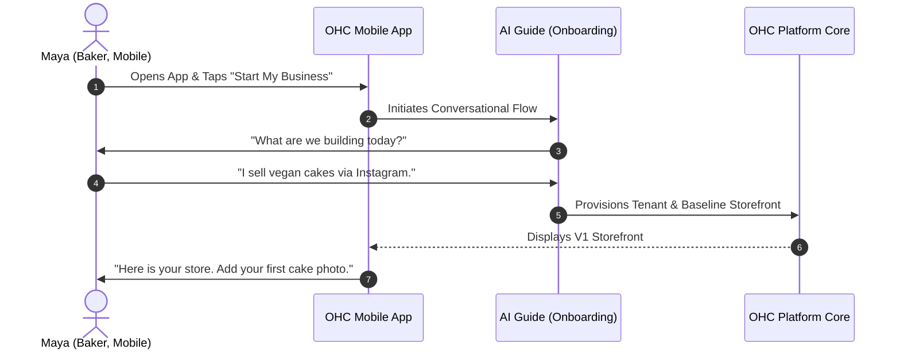
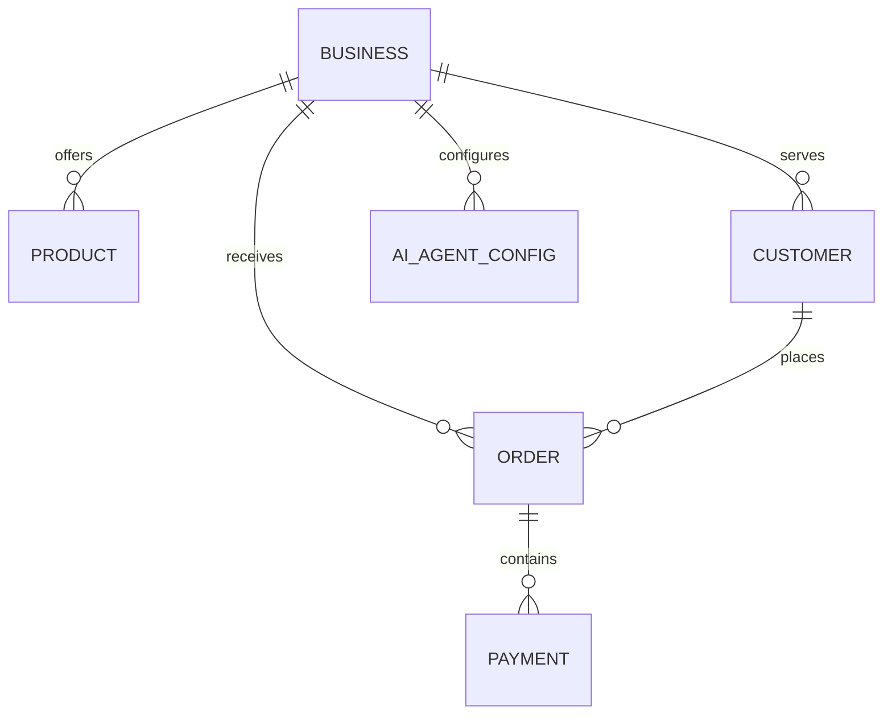
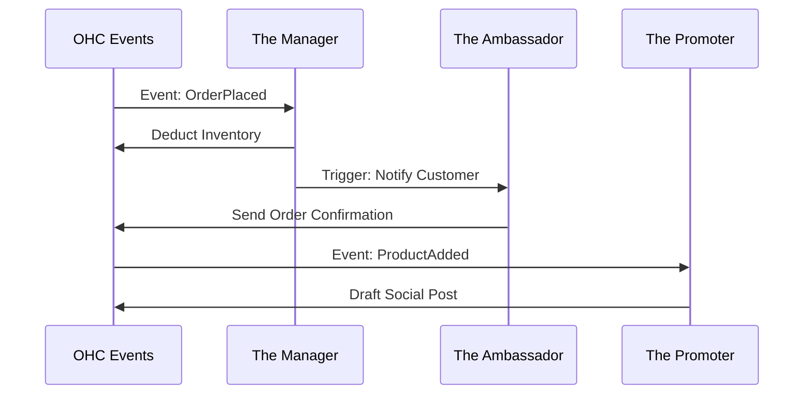
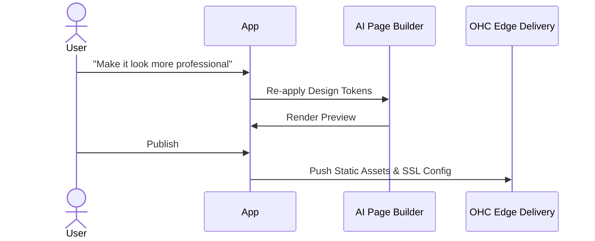
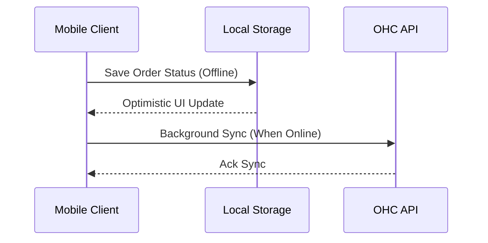
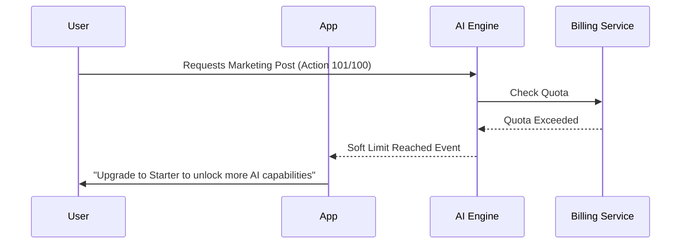

# OHC Architecture Research Reports

---

## [RESEARCHER] Issue Brief: Business Journey Architecture

**Title:** End-to-End Business Journey Architecture for OneHumanCorp Personas

**Problem Statement:** Small business owners (bakers, handymen, boutique owners, tutors, food cart operators) currently face immense friction when trying to establish an online presence. Existing tools require technical knowledge, manual configurations, or piecing together disjointed software. They need an invisible, AI-orchestrated system that takes them from zero to a live, functional business in under 10 minutes, fully managed from their mobile devices.

**Research Report:**
- **Competitive Analysis:**
  - *Shopify:* Excellent for traditional e-commerce, but overwhelming for service-based or digital businesses. Setup time often exceeds a week due to theme selection and app integrations. Not fundamentally mobile-first.
  - *Wix/Squarespace:* Require significant drag-and-drop design effort. Complex to attach bookings seamlessly.
  - *GoDaddy:* Provides quick setups, but lacks deep AI integration for ongoing operations.
- **Findings:**
  - Time-to-Value is critical: The highest drop-off rate occurs within the first 15 minutes of onboarding.
  - Mobile Dominance: 80% of our target personas operate their business primarily from a smartphone.
  - Conversational vs. Form-based: Users are more likely to complete setup when interacting with an AI assistant.

**Design Doc:**
- **Key Design Decisions and Why:**
  - *Mobile Parity as Baseline:* The entire onboarding, activation, and management journey must be executable from a 375px wide screen to support mobile-first users.
  - *Progressive Profiling:* We only ask for the minimum viable information (Name, Business Type) to generate a functional storefront.
  - *Visual Excellence Mandate:* All UI interactions employ Glassmorphism aesthetics, Outfit + Inter typography, and subtle motion to build trust.
- **AI Agent Integration Points:**
  - *Onboarding Agent (The Guide):* Conducts the initial conversational setup.
  - *Operations & Marketing (The Manager & Promoter):* Automatically pre-fill catalogs from uploaded photos.
- **Mobile UX Flow:**
  - Welcome Screen -> Conversational Wizard (Chat UI) -> Live Preview (Split View) -> Post-Activation Dashboard.
- **Architecture Diagram:**

**Implementation Prompt:**
Build the mobile-first (375px baseline) onboarding and dashboard flows for the OHC Business Journey. The user must experience a seamless, conversational setup where the AI Guide prompts for business details and immediately provisions a live, visually premium (Glassmorphism, Outfit/Inter typography) storefront preview. Ensure all interactions pass the "grandmother test" (highly intuitive, no technical jargon). Do NOT prescribe or hardcode specific database schemas or API signatures; design flexible, event-driven integrations.

**Priority:** P0

**Estimated Scope:** Large

---

## [RESEARCHER] Issue Brief: Data Model Architecture

**Title:** Unified Multi-Tenant Data Model & Event Architecture

**Problem Statement:** For AI agents to manage a business invisibly, they need a holistic, strongly isolated view of the business data. A fragmented or leaky data model will result in poor AI decision-making (e.g., cross-tenant data leaks) and manual intervention requirements, breaking the "zero manual work" promise for business owners.

**Research Report:**
- **Competitive Analysis:** Many legacy platforms struggle with bolting AI onto relational tables not designed for LLM context windows.
- **Findings:** The data model must natively support multi-tenancy at the lowest level to prevent data leaks. It also must support event-sourcing for critical flows (orders, payments) so AI agents can reconstruct state and audit trails.

**Design Doc:**
- **Key Design Decisions and Why:**
  - *Tenant-Isolating Abstraction:* Strict multi-tenancy ensures Maya's data never leaks to Carlos.
  - *Event-Sourced Foundations:* Core operations are event-sourced to allow AI agents to rebuild context effortlessly.
- **AI Agent Integration Points:**
  - The AI agent queries customer history via unified customer profiles rather than disjointed order tables.
- **Mobile UX Flow:**
  - N/A for data model directly, but enables offline mobile sync capabilities via event logs.
- **Architecture Diagram:**

**Implementation Prompt:**
Implement the core entity relationships and multi-tenancy access controls ensuring absolute tenant isolation and flexible data structures for AI queries, focusing on the event-driven behavior rather than specific SQL DDL. Ensure it supports offline mobile sync.

**Priority:** P0

**Estimated Scope:** Large

---

## [RESEARCHER] Issue Brief: AI Agent Department Architecture

**Title:** AI Agent Department Orchestration

**Problem Statement:** Business owners don't want to become "prompt engineers". They need specialized, domain-specific AI agents that act like human employees in specific departments (Operations, Marketing, Sales, Customer Success) to automatically handle day-to-day business tasks.

**Research Report:**
- **Findings:** Generic AI chat interfaces fail to inspire trust. Presenting AI as specialized "Departments" (e.g., "The Manager", "The Promoter") significantly increases adoption and understanding for non-technical users.
- **Competitive Analysis:** Most competitors just offer a generic text generation box, requiring the user to know what to ask. OHC will be proactive.

**Design Doc:**
- **Key Design Decisions and Why:**
  - *Departmental Metaphors:* AI is segmented into relatable departments.
  - *Event-Driven Coordination:* Departments react to platform events asynchronously.
- **AI Agent Integration Points:**
  - *Operations (The Manager):* Triggers on payment completion to update inventory.
  - *Marketing (The Promoter):* Triggers on new product creation to draft social media posts.
  - *Support (The Ambassador):* Intercepts customer inquiries and drafts responses for approval.
- **Mobile UX Flow:**
  - Dashboard notifications: "The Promoter drafted an Instagram post for your new product. [Approve / Edit]".
- **Architecture Diagram:**

**Implementation Prompt:**
Build the event-driven routing logic that seamlessly triggers the appropriate AI departments based on business events (like new orders or products), ensuring proper context delivery and approval workflows without dictating specific AI provider APIs.

**Priority:** P1

**Estimated Scope:** Medium

---

## [RESEARCHER] Issue Brief: Website & Storefront Builder Architecture

**Title:** Intent-Based, AI-Driven Storefront Builder

**Problem Statement:** Traditional website builders require design skills, understanding of layouts, and manual optimization for mobile. Small business owners need to assemble their storefront purely by stating their intent and providing content, allowing the system to instantly generate a professional, mobile-optimized experience.

**Research Report:**
- **Findings:** Drag-and-drop pixel-perfect editors are a massive source of friction. Users get stuck trying to align elements.
- **Competitive Analysis:** Wix/Squarespace demand design decisions. OHC shifts to an intent-based, block-level architecture where the design system guarantees visual excellence.

**Design Doc:**
- **Key Design Decisions and Why:**
  - *Block-Based System:* Users assemble intent-based blocks (Hero, Booking Calendar, Product Grid).
  - *Visual Excellence Mandate:* The system rigidly enforces Glassmorphism and Outfit/Inter typography.
  - *Auto-Publishing & SEO:* Changes draft instantly; SEO metadata is generated by AI based on block content.
- **AI Agent Integration Points:**
  - *AI Designer:* Re-themes the entire block structure instantly based on natural language input.
- **Mobile UX Flow:**
  - Real-time preview of changes on mobile UI, focusing on block ordering rather than pixel pushing.
- **Architecture Diagram:**

**Implementation Prompt:**
Develop the visual storefront builder allowing non-technical users to manage intent-based functional blocks (like bookings or product grids), ensuring all output strictly adheres to the Visual Excellence Mandate (Glassmorphism, Outfit+Inter fonts) without mandating specific frontend frameworks or CDN solutions.

**Priority:** P1

**Estimated Scope:** Large

---

## [RESEARCHER] Issue Brief: Mobile-First Architecture Review

**Title:** Mobile Parity and Offline Reliability Architecture

**Problem Statement:** Our users run their businesses from their phones, often in low-connectivity environments (e.g., food carts at festivals, handymen in basements). The platform must provide full administrative capabilities on mobile devices with sub-second responsiveness and offline reliability.

**Research Report:**
- **Findings:** Desktop-only features inherently block 80% of our personas. Offline capability is not a nice-to-have; it's essential for uninterrupted business operations.
- **Competitive Analysis:** Most SaaS tools assume stable broadband and desktop access for administrative tasks.

**Design Doc:**
- **Key Design Decisions and Why:**
  - *Offline Reliability:* Core actions (viewing menu, checking bookings) must work offline, syncing lazily.
  - *Performance Targets:* Payload under 50KB for initial load, optimistic UI updates for high-latency environments.
- **AI Agent Integration Points:**
  - AI summaries are cached locally to provide offline operational insights.
- **Mobile UX Flow:**
  - Bottom sheet navigation for immediate thumb reachability. Clear offline indicators that do not block usage.
- **Architecture Diagram:**

**Implementation Prompt:**
Establish the mobile-first baseline interactions and offline-sync capabilities for all critical business operations (e.g., viewing orders, updating inventory), ensuring strict adherence to performance targets and mobile parity constraints without dictating caching libraries.

**Priority:** P0

**Estimated Scope:** Medium

---

## [RESEARCHER] Issue Brief: Multi-Tenant SaaS Tier Architecture

**Title:** Frictionless Tier Escalation and Entitlements

**Problem Statement:** Users need a clear, risk-free path to start their business (Free tier) but the platform must monetize effectively as the business grows. Hard paywalls cause churn; graceful capability limits and value-driven upgrade prompts are required.

**Research Report:**
- **Findings:** Users upgrade when they clearly see the ROI (e.g., "Upgrading to Starter gives me a custom domain which builds trust").
- **Competitive Analysis:** Shopify has a hard 14-day trial which forces a decision before value is fully realized. A freemium model with AI action limits aligns better with our personas.

**Design Doc:**
- **Key Design Decisions and Why:**
  - *Transparent Limits:* Users hit soft limits (e.g., AI action limits) and are gracefully prompted to upgrade.
  - *Tier Escalation:* Capabilities unlock dynamically based on the plan (Free -> Starter -> Pro -> Business).
- **AI Agent Integration Points:**
  - The AI Advisor monitors usage and proactively suggests upgrades when it predicts a positive ROI for the user.
- **Mobile UX Flow:**
  - In-context upgrade modals explaining exactly what capability will be unlocked.
- **Architecture Diagram:**

**Implementation Prompt:**
Implement the tier entitlement and capability unlocking system, focusing on user-friendly upgrade paths and graceful quota handling, without prescribing specific Stripe APIs or database tracking methods. Ensure it supports dynamic feature flagging based on tier.

**Priority:** P2

**Estimated Scope:** Small
