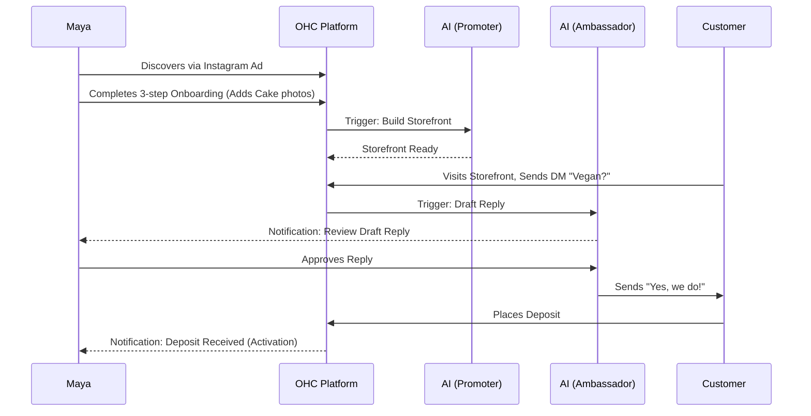
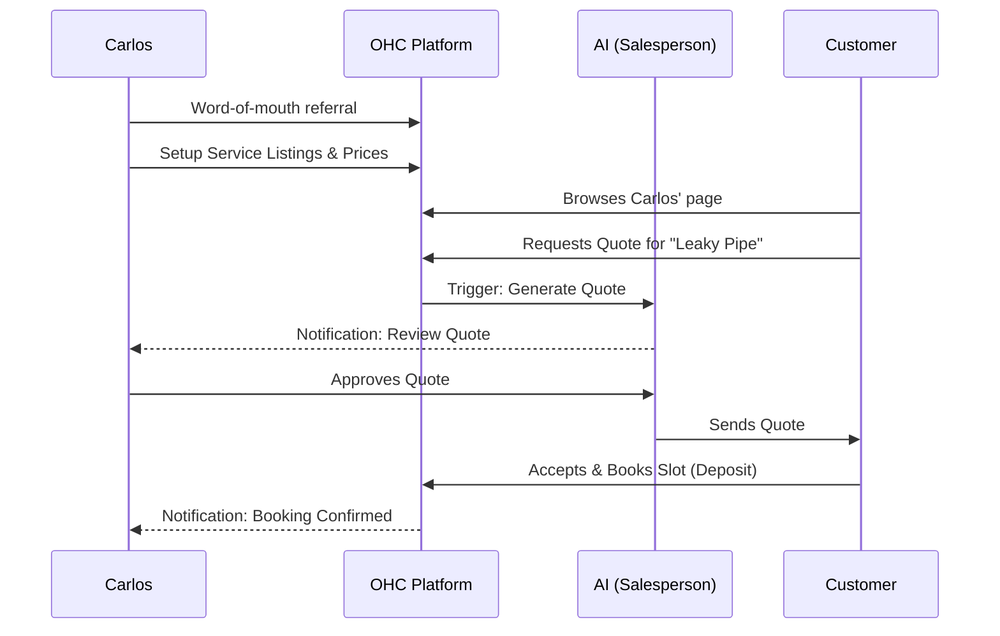
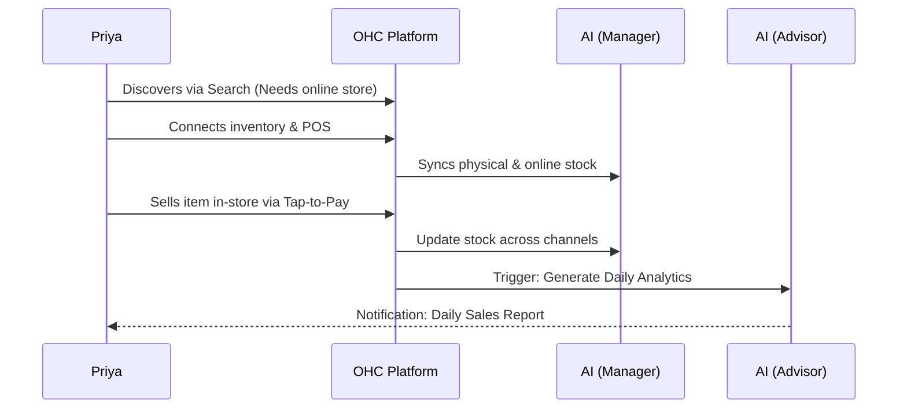
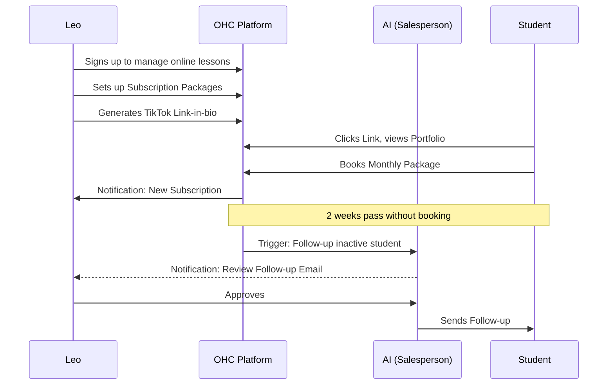
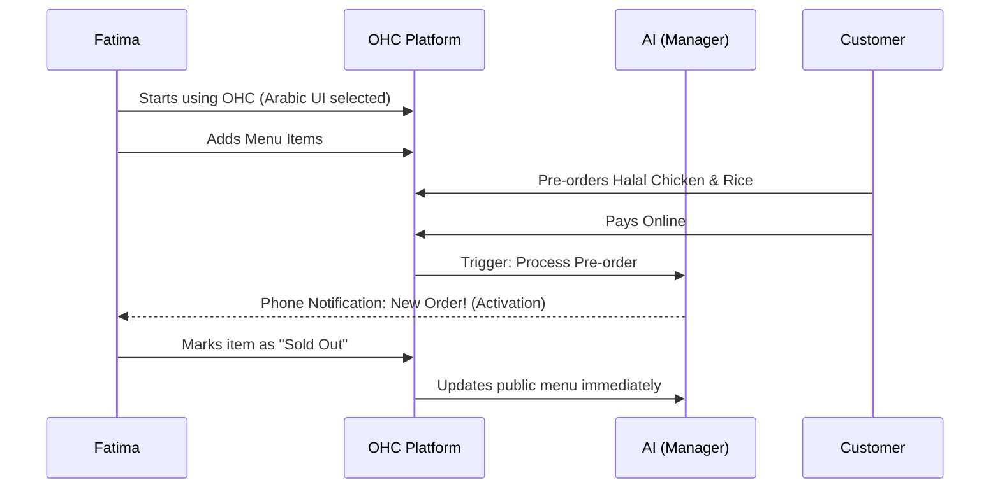

# [architecture] Business Journey Architecture

## Problem Statement
Small business owners—whether they are a baker like Maya or a handyman like Carlos—often lack the technical expertise to set up complex online storefronts, booking systems, or customer relationship management tools. The gap between starting a business and successfully operating it online is vast. They need a frictionless, end-to-end journey that takes them from initial discovery of the platform to running a fully operational, automated business with minimal effort. Currently, there is a lack of a clear architectural mapping of how different user personas (e.g., Maya, Carlos, Priya, Leo, Fatima) interact with the OHC platform across the phases of Acquisition, Onboarding, Activation, Retention, Revenue, and Referral.

## Research Report
Our analysis of the small business software market reveals that competitors like Shopify and Wix focus heavily on storefront creation but lack built-in, autonomous AI capabilities to manage operations, marketing, and customer success out-of-the-box.
- **Acquisition**: Many competitors rely on traditional digital marketing, whereas OHC can leverage viral loops and seamless onboarding flows.
- **Onboarding**: OHC's goal of "zero → live business in under 10 minutes" requires a simplified wizard approach compared to Shopify's comprehensive but overwhelming setup.
- **Activation**: True activation happens when a transaction occurs. OHC's AI agents (e.g., the Salesperson) actively facilitate this by following up with leads.
- **Retention**: AI-generated weekly health reports (Advisor) and automated notifications keep users engaged far beyond what competitors offer.
- **Revenue**: Upgrading from the Free tier to paid tiers in OHC is triggered organically when usage limits are approached or premium features are needed.

## Design Doc

### Key Invariants
- The journey must be 100% manageable from a mobile device (375px viewport).
- AI interaction should feel like working with a capable assistant, not configuring software.

### Architecture Diagrams (Mermaid.js)

#### 1. Maya — The Home Baker

#### 2. Carlos — The Freelance Handyman

#### 3. Priya — The Boutique Owner

#### 4. Leo — The Music Tutor

#### 5. Fatima — The Food Cart Operator

## Implementation Prompt
**User-facing Outcome**: Implement a cohesive onboarding wizard that allows a user to go from signing up to having a live storefront/booking page in under 10 minutes. The wizard should intelligently route the user to specific setup flows based on their business type (e.g., Physical Products, Services).
**CUJ**: A new user signs up, selects their business category (e.g., "Food Cart"), provides basic details (name, core offering), and the platform automatically generates a starting UI, provisions necessary AI agents (like the Manager and Promoter), and presents a simple checklist to reach activation (e.g., "Add first menu item").
**Acceptance Criteria**:
- The onboarding flow must be fully responsive and functional on a 375px mobile screen.
- Business category selection must dynamically adjust subsequent setup steps.
- Upon completion of the wizard, a live public URL must be generated.
- Initial AI agents must be provisioned and linked to the tenant.

## Priority
P0

## Estimated Scope
Medium

### UI Wireframes & Screen Flow (375px First)

1.  **Landing Page (Acquisition)**:
    *   **Hero Section**: Clean, glassmorphic card with the headline "Your business, online in 10 minutes."
    *   **Call to Action (CTA)**: Large (≥ 44px height) primary button: "Start for Free".
    *   **Value Prop**: 3-step visualization (Sign Up → Add Details → Go Live).
2.  **Onboarding Wizard (Activation)**:
    *   **Step 1**: "What's your business called?" (Input field for business name).
    *   **Step 2**: "What do you do?" (Grid of business types: Bakery, Handyman, Boutique, etc.).
    *   **Step 3**: "Add your first item/service" (Camera icon to upload photo, simple input for Name and Price).
3.  **Home Dashboard**:
    *   **Top Bar**: Business Name, Notification Bell.
    *   **Quick Actions**: "Add Product", "Create Post", "View Analytics" (horizontally scrollable row of chips).
    *   **AI Feed**: Vertical list of actionable items from AI Agents (e.g., "The Manager processed 2 orders today", "The Ambassador drafted a reply for you to review").

### Mobile UX Flow

*   **Friction Points to Avoid**:
    *   Long forms requiring technical details (e.g., DNS settings). These should be fully automated.
    *   Mandatory upfront connection to external services (e.g., Stripe) before the user sees the value of the platform. These should be delayed until the user is ready to activate payments.
    *   Overwhelming dashboards with too many metrics. Only show the most critical data (e.g., Today's Sales, Pending Actions).

*   **Happy Path**:
    1.  User taps "Start for Free" on the landing page.
    2.  User completes the 3-step wizard (Name, Category, First Item).
    3.  User arrives at the Home Dashboard, seeing their first item live.
    4.  An AI Agent (The Promoter) immediately suggests a simple social media post to announce the launch.
