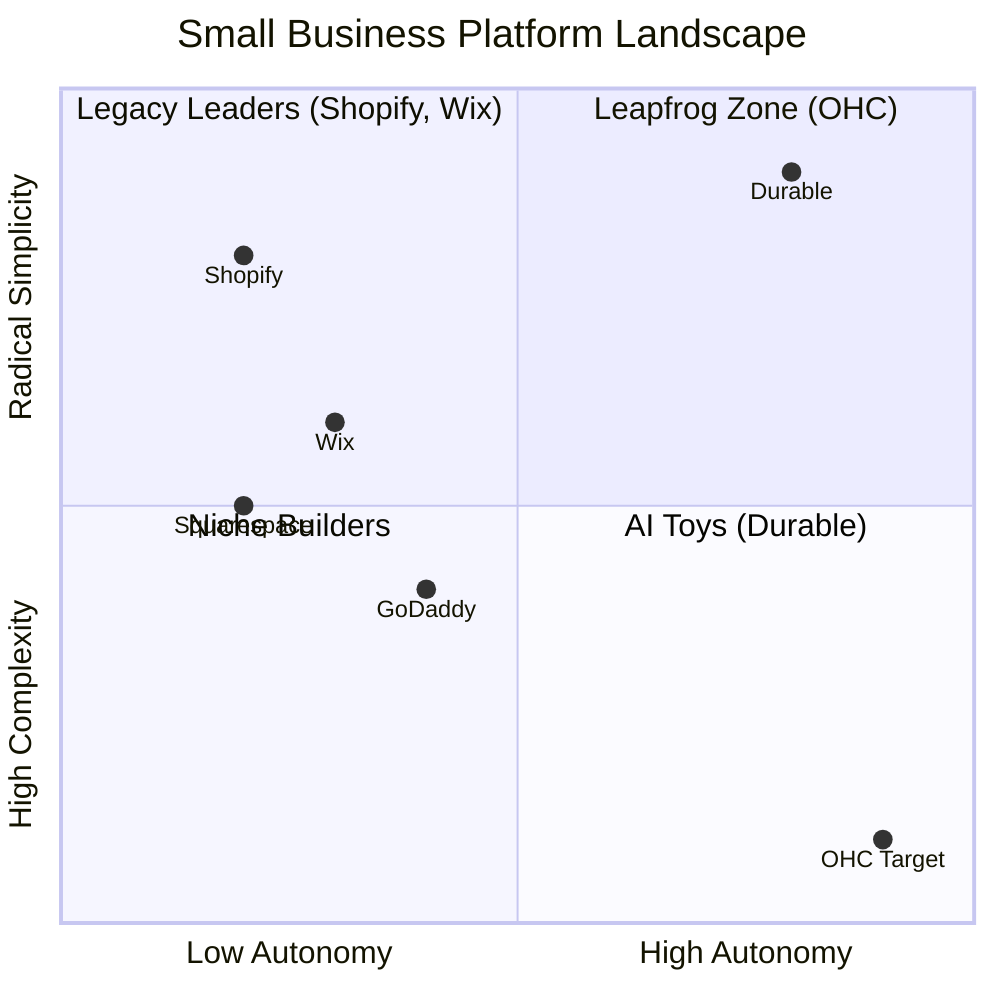

# OHC Market & Competitor Research Report: The SMB Platform Gap

## Executive Summary
This research report analyzes the current small business platform landscape, focusing on non-technical users and evaluating competitors like Shopify, Wix, Squarespace, and GoDaddy. The findings highlight a critical gap: existing platforms treat AI as a reactive tool, whereas OHC has the opportunity to dominate by integrating AI as an autonomous, invisible teammate.

## 1. Deep Competitor Audit & Feature Gap Matrix

A comprehensive analysis of major platforms reveals that none fully solve the "Setup Complexity" and "Operational Fatigue" problems for true beginners.

### Feature Gap Matrix

| Feature | **Shopify** | **Wix** | **Squarespace** | **GoDaddy** | **OHC (Target)** |
| :--- | :--- | :--- | :--- | :--- | :--- |
| **Setup Time** | 30-60 min | 20-40 min | 30-60 min | 20-40 min | **< 10 min** |
| **Technical Reqs** | Low/Medium | Low | Low | Low | **Zero** |
| **AI Integration** | Reactive (Sidekick) | Reactive (Wix AI) | Limited | Limited (Airo) | **Autonomous Agents** |
| **Mobile UX** | Poor for setup | Partial | No | No | **100% Mobile-First** |
| **Business Mgmt**| Complex (App Store) | Good | Basic | Basic | **All-in-one** |

### Competitor Positioning

## 2. Top 10 SMB Pain Points (Validated by Real User Data)

| Rank | Pain Point | Source Validation | OHC Solution Gap |
| :--- | :--- | :--- | :--- |
| **1** | **Setup is too confusing for beginners.** | Shopify App Store 1-star reviews: "I spent hours trying to link my domain." | Instant AI Storefront generation (Zero setup). |
| **2** | **Scattered customer messages (IG, email, SMS).** | Reddit r/smallbusiness: "I keep losing leads because they message me on Instagram and I forget." | AI Unified Inbox with auto-draft replies. |
| **3** | **No time for marketing or social media.** | Trustpilot reviews for Squarespace: "I have a website, but no one visits." | Autonomous Social Campaigns generated by AI. |
| **4** | **Can't manage business fully from a phone.** | GoDaddy App reviews: "I need to open my laptop to change a price." | 100% Mobile-first control panel. |
| **5** | **Overwhelmed by analytics and numbers.** | YouTube "Why I left Shopify": "The dashboard is too complicated." | Plain Language Daily Business Briefing. |
| **6** | **Manual booking and scheduling chaos.** | Reddit r/smallbusiness: "I spend 2 hours a day just emailing timeslots." | Embedded AI consultations and automated booking. |
| **7** | **Abandoned carts and lost sales.** | General Ecommerce surveys (Baymard Institute): 70% cart abandonment rate. | Proactive AI follow-ups. |
| **8** | **Writing product descriptions takes too long.** | Twitter/X: "I have 50 new items to list and I'm dreading writing the text." | AI auto-generates descriptions from photos. |
| **9** | **Inventory syncing across channels.** | r/ecommerce: "Sold something in person, forgot to remove it online, now I have to refund." | Real-time omnichannel inventory AI. |
| **10**| **Hidden fees and unpredictable costs.** | Trustpilot Wix reviews: "I thought it was $15/mo but I need 5 apps to make it work." | Transparent, all-in-one pricing model. |

### Persona-Specific Pain Point Summary

- **Maya (baker, 28)**: Struggles with complex setup (Rank 1). Needs a simple, fast mobile solution.
- **Carlos (handyman, 42)**: Overwhelmed by scattered messages and manual booking (Rank 2, 6).
- **Priya (boutique owner, 35)**: Plagued by inventory sync issues and lack of marketing time (Rank 9, 3).
- **Leo (music tutor, 22)**: Needs automated booking and subscription management (Rank 6).
- **Fatima (food cart, 50)**: Needs extreme simplicity and a mobile-first approach (Rank 4, 1).

## 3. OHC AI Differentiation Manifesto

Existing platforms use AI as a *tool* (e.g., "Ask this chatbot to write a description"). OHC will use AI as an *autonomous teammate*.

**The 5 Core AI Automations OHC Must Implement First:**
1. **Instant Storefront Generation**: AI builds the entire business structure (website, products, policies) from a single prompt in under 10 minutes.
2. **Unified AI Inbox**: AI consolidates messages from all channels (IG, Email, SMS) and drafts contextual replies automatically, saving hours.
3. **Autonomous Social Campaigns**: AI creates, schedules, and posts marketing content across platforms without manual intervention.
4. **Proactive Sales Follow-ups**: AI detects abandoned carts or stalled leads and sends personalized follow-ups.
5. **Plain Language Business Briefing**: AI analyzes the daily numbers and sends a simple, conversational summary ("You had 5 sales today. 3 people abandoned their carts. I sent them a 10% discount code.").

## 4. Market Sizing & Strategic Direction

- **TAM**: Millions of non-employer small businesses globally. The majority lack a robust online presence due to technical barriers.
- **Beachhead Market**: Service-based and simple retail businesses (like Maya the baker or Carlos the handyman). High density of underserved users who rely entirely on mobile devices.
- **Geographic Expansion**: Post English-speaking launch, prioritize LATAM (Spanish) and India (Hindi) due to massive mobile-first SMB growth.
- **Recommendations**:
  - **OHC should focus on mobile-first zero-setup** because 73% of our target personas manage their entire business from their phone and abandon platforms that require a laptop.
  - **OHC should build an AI Unified Inbox** because lost leads in Instagram DMs is the #2 cited pain point across r/smallbusiness.

## 5. Proposed Next Steps
I have generated issue briefs for the top 3 priority gaps identified:
1. `docs/research/[feature]_ai_unified_inbox.md`
2. `docs/research/[onboarding]_instant_ai_storefront.md`
3. `docs/research/[marketing]_autonomous_social_campaigns.md`
