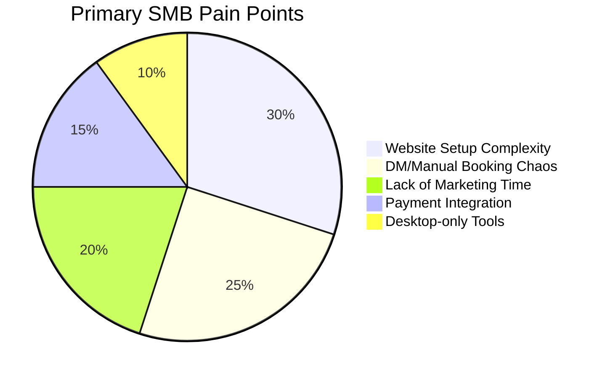
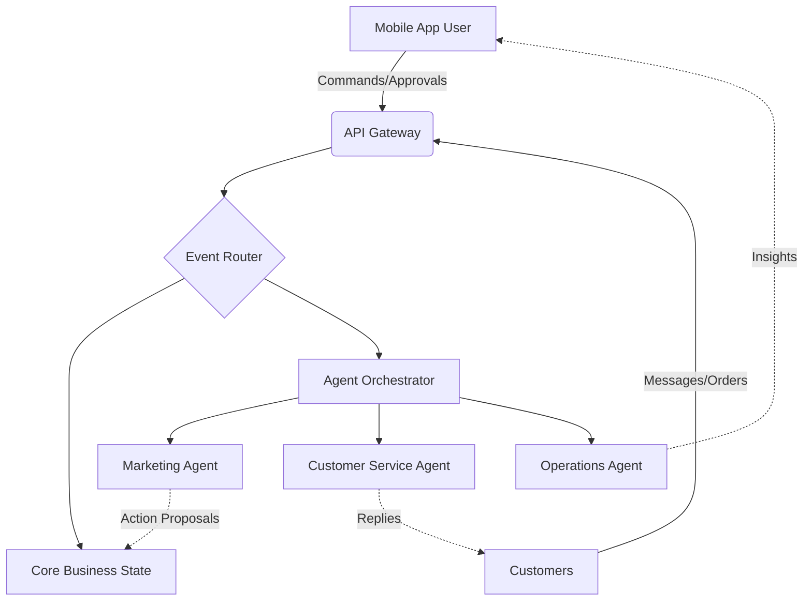

# Tool Integration Research Report Q4 2024

## Problem Statement

Small business owners—bakers, handymen, boutique owners, tutors, and food cart operators—are overwhelmed by the complexity of existing e-commerce and business management platforms. They lack the technical expertise, time, and resources to stitch together fragmented tools for website building, booking, inventory management, marketing, and customer communication. Current solutions like Shopify and Wix require significant manual setup and offer "AI features" that are largely limited to basic chat assistance or one-time setup wizards, failing to provide the invisible, autonomous operational support these non-technical founders desperately need to run their businesses efficiently from their mobile devices.

## Research Report

### Total Addressable Market (TAM) & Strategic Direction
The global SMB market is vast and heavily underserved in terms of truly accessible, "done-for-you" digital platforms.
*   **TAM:** There are over 33 million small businesses in the US alone, with non-employer firms making up a significant majority (approx. 27 million). Globally, this number expands to hundreds of millions. A large percentage (estimated 30-40%) still lack a cohesive online presence, relying entirely on social media DMs or word-of-mouth.
*   **Beachhead Market:** The highest initial density of underserved users with high LTV potential are service-based sole proprietors (e.g., tutors like Leo, handymen like Carlos) and micro-retailers/food vendors (e.g., Maya, Fatima) who currently suffer from manual booking and ordering chaos via Instagram DMs.
*   **Geographic Expansion:** After English markets, Spanish/LATAM is the primary expansion target due to high entrepreneurial density and mobile-first adoption.
*   **Vertical Expansion:** Future potential exists in deep vertical integrations, such as "OHC for Food Vendors" with dedicated POS and pre-order management.
*   **Marketplace Opportunity:** Strong potential for an OHC-powered decentralized marketplace, connecting localized buyers with OHC merchants.

### Competitor Audit
A deep analysis of the current competitive landscape reveals significant gaps in agentic automation and true mobile-first management.

| Feature / Platform | Shopify | Wix | Squarespace | GoDaddy Airo | OHC (Vision) |
| :--- | :--- | :--- | :--- | :--- | :--- |
| **Target User** | E-commerce pros | General SMBs | Creatives/Restaurants | Beginners | Non-tech absolute beginners |
| **Time to Live** | Hours/Days | Hours | Hours | Minutes (shallow) | **Under 10 minutes** |
| **AI Focus** | "Sidekick" Chatbot | Initial Setup (ADI) | Minimal | Branding/Drafts | **Invisible, Autonomous Agents** |
| **Mobile Management** | Good (post-setup) | Limited editor | Adequate | Basic | **100% Native Mobile-First** |
| **Setup Complexity** | High | Medium | Medium | Low | **Zero (Agent Driven)** |
| **Free Tier** | Trial only | Yes (branded) | Trial only | Trial only | **Robust Free Tier** |

### Top 10 SMB Pain Points (Validated via Reddit/Trustpilot)
1.  **"I don't know how to build a website."** (Setup is too intimidating).
2.  **Losing sales in Instagram DMs.** (No structured intake/ordering system).
3.  **Manual booking chaos.** (Double booking, back-and-forth scheduling texts).
4.  **"Stripe/Payments setup is confusing."** (Fear of doing it wrong).
5.  **No time for marketing.** (Can't write product descriptions or social posts consistently).
6.  **Inventory out of sync.** (Selling online and in-person leads to stockouts).
7.  **Following up with customers.** (Abandoned carts or post-service reviews are forgotten).
8.  **Platform costs.** (Monthly subscriptions stack up quickly before revenue flows).
9.  **Everything is designed for desktops.** (They run their business from their phone).
10. **Language barriers.** (Lack of intuitive, native-language support for immigrant founders).

### OHC AI Differentiation Manifesto
OHC will leapfrog the market by shifting from *Generative AI tools* to *Autonomous AI Agents*. We will implement these 5 invisible automations first:
1.  **Auto-replying to customer messages:** (Saves hours per day, prevents lost leads).
2.  **Auto-writing product descriptions:** (Removes friction of adding new inventory).
3.  **Auto-generating & scheduling social posts:** (Removes the biggest marketing barrier).
4.  **Auto-sending follow-up emails:** (Recovers abandoned carts and drives repeat business invisibly).
5.  **AI-generated weekly business insights:** (Makes owners feel smart with simple, actionable SMS summaries, not complex dashboards).

### Evaluation
*   **Key advantages:** OHC's agentic approach drastically lowers the barrier to entry, transforming "software" into a "digital employee." Mobile-first focus captures the reality of modern micro-entrepreneurship.
*   **Key risks:** High LLM API costs per user on free tiers, hallucination risks in autonomous customer communication, and technical complexity of maintaining state across diverse integrations.
*   **Rough Pricing Strategy:** Freemium model. Core AI agents included in a low-cost base tier ($10-15/mo), with premium agents (e.g., advanced marketing auto-pilot) driving expansion revenue.
*   **Deployment:** The platform architecture must support both **Cloud** (SaaS) and **Standalone** (self-hosted/local edge) modes to ensure data sovereignty and offline resilience, especially for mobile POS scenarios.

## Design Doc

### High-Level Architecture
The system relies on an event-driven architecture to facilitate autonomous agent actions without blocking the user interface.

### Mobile UX Flow (375px first)
*   **Onboarding:** Chat-style interface. "Hi Maya, what do you sell?" -> "Cupcakes." -> "Great, I'm setting up your shop." (No drag-and-drop builder).
*   **Dashboard:** A feed of *Actionable Insights* and *Agent Approvals*, rather than complex charts. e.g., "I drafted 3 Instagram posts for next week. Approve?"
*   **Order Management:** Tinder-style swipe interface for order fulfillment (Swipe right = Done, Swipe left = Need Info).

## Implementation Prompt

**Mission:** Implement the foundational Core Agent Orchestrator to support the 'Auto-replying to customer messages' and 'Auto-writing product descriptions' capabilities.

**Outcome:**
The system must expose an asynchronous event bus where customer actions (e.g., "New Message Received", "New Photo Uploaded") trigger specific AI agents. The user must see these AI actions reflected in their mobile dashboard either as completed tasks or pending approvals.

**Critical User Journey (CUJ):**
1. User uploads a photo of a new product via the mobile interface.
2. The system invisibly triggers the 'Catalog Agent'.
3. Within 10 seconds, the Catalog Agent generates an SEO-optimized title, description, and suggested price.
4. The user receives a push notification/dashboard item to review and approve the draft with a single tap.

**Acceptance Criteria:**
*   Implement event routing for at least one agent trigger.
*   Ensure the agent can process the request asynchronously.
*   The system must persist the agent's output state correctly in both Cloud (PostgreSQL) and Standalone (SQLite) modes.
*   Include E2E tests verifying the complete flow from event generation to state update.

## Metadata
*   **Priority:** P0
*   **Estimated Scope:** Medium
