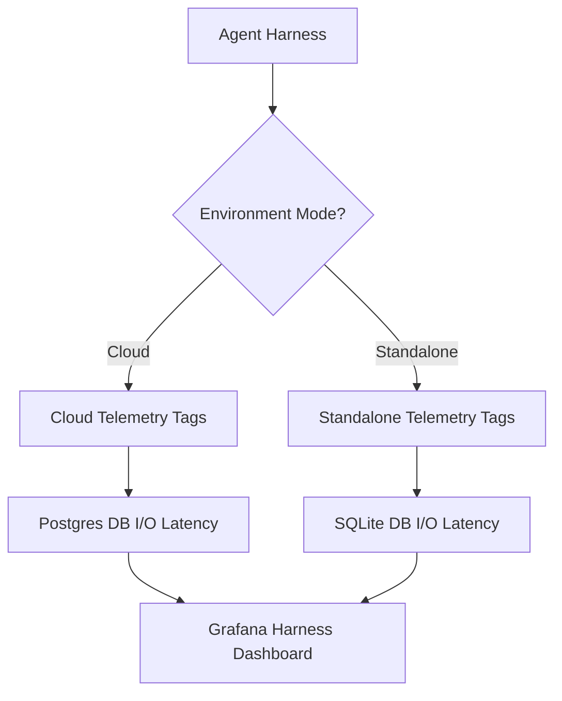

# Mission Queue Protocol Report

## Title
Architect Cloud vs Standalone Efficiency Telemetry for Agent Harness

## Problem Statement
The OHC agent execution environment (Harness) lacks distinct observability metrics when running in Cloud-native (K8s/multi-tenant) versus Standalone (local SQLite/single-tenant) modes. Without unified but distinct telemetry, it is impossible to correctly identify execution bottlenecks specific to the host environment.

## Research Report
Our current metric collection implicitly assumes Cloud-native limits (e.g., K8s pod CPU/RAM). Standalone execution on varying host machines requires different baseline assumptions. Analyzing OpenTelemetry traces reveals that execution latency differs significantly when falling back to SQLite vs. standard PostgreSQL operations. A unified Grafana dashboard to track these disparities is missing.

### Persona Pain Points
- **Maya (The Home Baker):** Wants her AI agents to reply quickly on her phone in Standalone mode without lag, but without standalone DB metrics, developers cannot optimize her specific local latency.
- **Priya (The Boutique Owner):** Needs reliable and rapid inventory syncs in both Cloud and Standalone modes. Lack of partitioned metrics obscures sync efficiency issues on the local side.

### Comparative Table: Cloud vs Standalone Assumptions
| Metric Area | Cloud-Native | Standalone |
|---|---|---|
| Latency Baseline | Fast internal network, predictable I/O | Highly variable hardware, limited I/O |
| DB Access | Remote Postgres, connection pooling | Local SQLite file, direct I/O |
| Bottlenecks | Network latency, K8s throttling | Disk speed, available local CPU |

## Design Doc
1. Instrument `srcs/server/agents/` (and proxy components) to tag OpenTelemetry metrics with `deployment_mode: cloud|standalone`.
2. Introduce specific counter and histogram metrics for sandbox initialization time, sub-agent spawning, and database I/O latency.
3. Create a new `monitoring/dashboards/harness_efficiency.json` Grafana dashboard tracking these tagged metrics, specifically highlighting latency deltas between Cloud and Standalone modes.

### Mermaid Visualization

## Implementation Prompt
Implementer: Please add the following metric tags to the OHC agent harness (e.g. `srcs/server/agents/mcp/proxy/`): tag all OpenTelemetry metrics with `deployment_mode` (derived from environment config). Add new `harness_init_latency` and `harness_db_io_latency` histograms. Finally, create a new Grafana dashboard in `monitoring/dashboards/harness_efficiency.json` to visualize these differences. Include unit tests in Go verifying the telemetry emission.

## Priority
P1

## Estimated Scope
Medium
