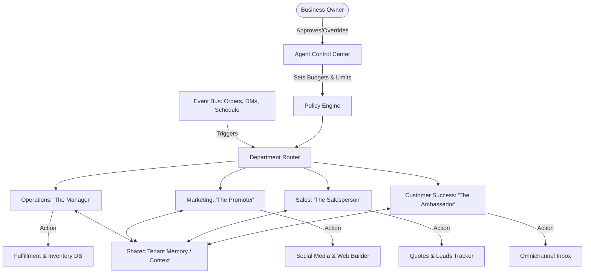

# [RESEARCHER] AI Agent Department Architecture

## Title
AI Agent Department Architecture

## Problem Statement
Small business owners—like Maya the baker or Carlos the handyman—often struggle to manage the operational overhead of running their business. They spend hours replying to inquiries, managing schedules, processing refunds, and keeping up with marketing, all of which distracts from their core craft. They need an "invisible" team of AI agents that can act as a fully staffed business department, handling routine tasks automatically, securely, and seamlessly while keeping the owner in the loop for critical decisions.

## Research Report
### Findings & Market Analysis
1. **Current Platforms:**
   - *Shopify:* Offers basic automation via Shopify Flow and AI descriptions via "Shopify Magic", but lacks a holistic "department" abstraction.
   - *Wix/Squarespace:* Provide basic AI text generation and limited scheduling automations but do not offer autonomous agents that proactively manage customer success or sales.
   - *GoDaddy:* Focuses on simple setup but lacks sophisticated, domain-specific AI workflows.
2. **User Pain Points:**
   - Context switching between DMs, emails, and order management.
   - Fear of AI making a mistake (e.g., offering a discount incorrectly).
   - Lack of time to set up complex automations or learn a new tool.
3. **Opportunity:** Creating "Departments" (e.g., Operations, Marketing, Sales) that represent familiar business roles. This reduces the cognitive load of understanding "AI Agents" by mapping them to real-world functions.

## Design Doc
### Architecture Diagram

### UI Wireframes & Screen Flow (375px First)
- **Home Screen Dashboard:** Clean interface showing notifications like "The Salesperson drafted a quote for 3 vegan cakes." with quick [Approve] or [Edit] buttons.
- **Department Settings:** A list of "Employees" (Departments). Tapping "The Manager" shows toggles like "Auto-approve refunds under $10" or "Notify me for every new inventory alert."
- **Omnichannel Inbox:** Unified thread where the business owner sees messages from customers, with the AI's replies highlighted in a subtle different color.
- **Budget/Limit Screen:** Simple visual progress bars indicating AI usage per month, designed to look like a "utility bill" rather than API usage.

### Mobile UX Flow
1. **Event Occurs:** A customer sends an Instagram DM.
2. **Push Notification:** The owner receives a push: "The Ambassador is replying to a DM from @vegan_eats."
3. **Review/Action:** The owner taps the notification to see the drafted reply. If auto-approve is off, they tap "Send." If on, the notification is just FYI.
4. **Context Access:** The owner can swipe right on the chat to see the AI's summary of the customer's history.

### AI Agent Integration Points
- **Event Bus:** All tenant events (new order, message, time passage) publish to an event bus.
- **Router & Policy Engine:** Evaluates events against the owner's configured policies before routing to the specific Department Agent.
- **Memory/Context Store:** Agents query a shared semantic layer for past interactions and business context to ensure coherent and personalized responses.
- **Action Execution:** Agents emit standardized action payloads (e.g., `SEND_MESSAGE`, `UPDATE_INVENTORY`) that the core backend safely executes.

### Key Design Decisions
- **Familiar Terminology:** Using department names ("The Manager", "The Ambassador") rather than technical AI terms.
- **Human-in-the-Loop by Default:** For sensitive operations (e.g., financial, quotes), agents default to drafting rather than auto-executing, building trust.
- **Shared Memory Layer:** Ensures "The Ambassador" knows about a delay caused by "The Manager", preventing disjointed customer experiences.
- **Budgeting via Actions:** Abstraction of LLM tokens into "AI Actions/mo" to simplify SaaS tier constraints.

## Implementation Prompt
**To the Implementer:**
Please implement the foundational backend structures and core mobile UI for the "Operations (The Manager)" and "Customer Success (The Ambassador)" departments.

**User-Facing Outcome:**
The business owner (e.g., Maya) should be able to navigate to a "My Team" section in the mobile app (375px viewport optimized), view the two departments, and toggle their autonomy level (Draft Mode vs. Auto-Pilot). When a mock event occurs (e.g., new order or message), the system should demonstrate the agent's response surfacing in an inbox or notification feed for approval.

**Acceptance Criteria:**
1. A mobile-responsive "My Team" screen showing at least two agent departments.
2. The ability to toggle the approval setting for an agent.
3. A simulated workflow where an event triggers an agent to generate a draft action (e.g., a drafted message reply), visible in an inbox view.
4. Smooth, premium UI (glassmorphism, clean typography) adhering to the "grandmother test."
5. Do NOT prescribe the specific LLM integration—focus on the application architecture, routing logic, and UX flow.

## Priority
P0

## Estimated Scope
Large
