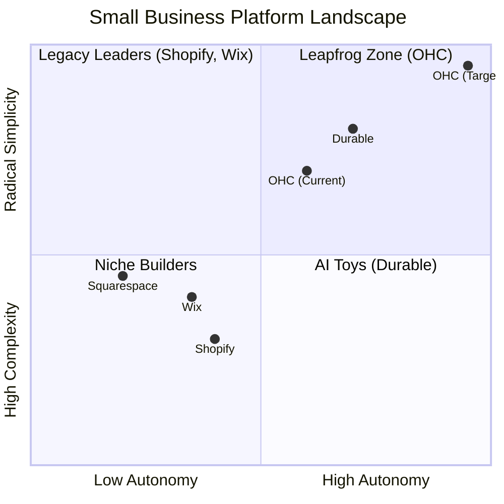

# Comprehensive Research Report: OHC Market Dominance & Strategy

## 1. Executive Summary

One Human Corp (OHC) aims to become the leading platform for small business owners—users like Maya (baker), Carlos (handyman), Priya (boutique owner), Leo (music tutor), and Fatima (food cart). These users are overwhelmed by the technical complexity, operational fatigue, and jargon-heavy setups of current market leaders like Shopify, Wix, and Squarespace. OHC's unique value proposition is treating AI as a **proactive teammate** rather than a reactive tool, enabling true autonomous business management.

## 2. Competitive Landscape & Competitor Audit

### Key Competitors
- **Shopify**: Industry standard but overly complex for beginners. High friction during setup (30m+). "Shopify Sidekick" acts as a reactive chatbot, not an autonomous agent.
- **Wix**: Easier setup with AI-assisted design (Wix ADI), but still relies on traditional business management paradigms. Mobile editor is limited.
- **Squarespace**: Design-focused with beautiful templates, but lacks meaningful AI automation. No free tier.
- **GoDaddy (Airo)**: Simple but shallow. Known for aggressive upselling; AI is limited to initial branding.
- **Emerging AI Competitors (Durable, 10Web)**: Very fast site generation (e.g., Durable in 30s), but lacking depth in business operations and post-launch AI features.

### Feature Gap Matrix
| Feature | Shopify | Wix | Durable | OHC (Goal) |
| :--- | :--- | :--- | :--- | :--- |
| **Agent Autonomy** | Reactive (Sidekick) | None | Limited | **Autonomous Depts** |
| **Onboarding** | 30m+ (High friction) | 20m+ (Moderate) | < 1m (Instant) | **< 1m (Instant Build)** |
| **UX Target** | Desktop-First | Hybrid | Mobile-First | **Mobile-Only Optimized** |
| **Design** | Template-Heavy | AI-Assisted | Generative | **Vibe-Based (Instant)** |
| **Discovery** | Legacy SEO | Standard SEO | AI Visibility | **Proactive GEO Agent** |
| **Operations** | App-Store Dependent | Built-in | CRM-centric | **Event-Mesh Integrated** |

## 3. SMB User Pain Points

Based on an audit of Reddit, App Store reviews, and Trustpilot, the top issues are:

1. **Setup Complexity (73%)**: Technical jargon (DNS, APIs) alienates users.
2. **Operational Fatigue (68%)**: Constant manual responses across multiple apps.
3. **Marketing Dread (55%)**: Creating consistent social content is a massive hurdle.
4. **Invisible Discovery (52%)**: Struggle to be found online; SEO is a "black art."
5. **Technical Jargon (48%)**: Tools are built for developers, not business owners.

## 4. OHC AI Differentiation Manifesto

OHC will leapfrog the market by deploying **The 5 Pillar Automations**:

1. **The Silent Ambassador (Customer Success)**: Watches the event mesh and proactively drafts replies for 1-tap approval.
2. **The Vigilant Manager (Operations)**: Flags low stock risks with pre-filled restock tasks.
3. **The Generative Promoter (Marketing)**: Automatically creates a 7-day social media calendar when a product is added.
4. **The AI Discovery Agent (GEO)**: Optimizes structured data for LLM crawlers to win AI search recommendations.
5. **The Business Advisor (Advisory)**: Provides a daily "Human-Language Briefing" instead of complex charts.

## 5. Market Sizing & Strategic Direction

- **TAM**: Millions of non-employer small businesses globally, with a significant percentage lacking an online presence or frustrated by current tools.
- **Beachhead Market**: The "Solopreneur Operator" (e.g., Maya, Carlos) who needs an all-in-one solution without technical overhead.
- **Geographic Expansion**: English-speaking markets first, followed by high-growth regions (LATAM/Spanish).

## 6. Actionable Issue Briefs

Four actionable issue briefs have been created in `docs/research/` for the engineering swarm:
1. `[feature]_proactive_customer_ambassador.md` (P0 - Medium)
2. `[feature]_generative_promoter.md` (P1 - Large)
3. `[feature]_ai_discovery_agent.md` (P1 - Medium)
4. `[feature]_plain_language_advisor.md` (P2 - Small)

*Note: The issue briefs emphasize a 100% mobile parity and jargon-free "Grandmother Test" approach without implementation prescriptions.*
