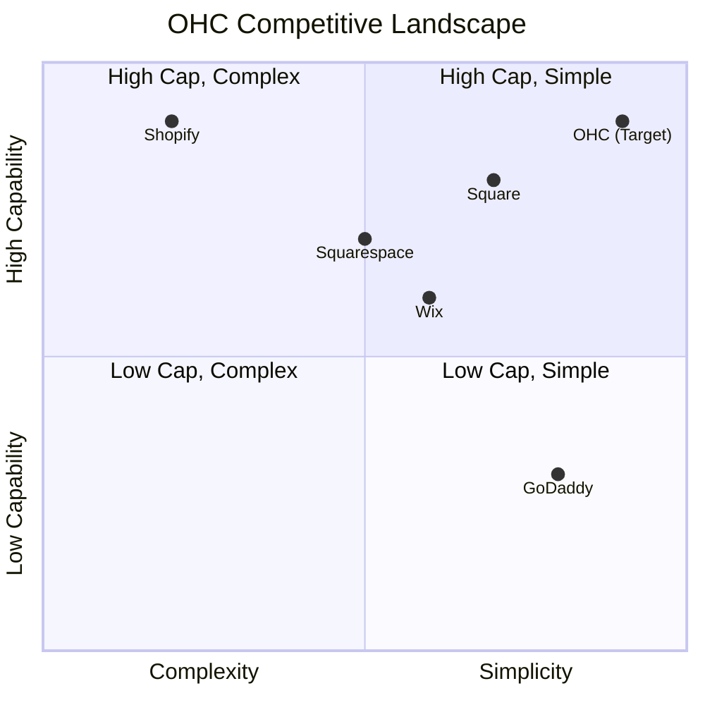

# OHC Small Business Platform Research Report

## Deep Competitor Audit

| Platform | Onboarding | Time to Live | Mobile App | AI Features | Free Tier | Biggest Complaints |
|---|---|---|---|---|---|---|
| **Shopify** | Complex, overwhelming | 3+ days | Strong for management, poor setup | Sidekick chatbot | 3 days | Too many moving parts, setup complexity |
| **Wix** | Simple, questionnaire | 2-4 hours | Weak for editing | ADI generation | Yes, branded | Slow loading times, lagging inventory |
| **Squarespace** | Template driven | 1-2 days | Basic | Weak | 14 days | Too rigid, not for SMB management |
| **GoDaddy** | Very simple | < 1 hour | Shallow | Airo branding | Yes | Aggressive upsells, poor reputation |
| **Square** | Easy POS sync | 1-2 hours | Strong | Basic | Yes | Lack of customization |

### Mermaid Landscape

## SMB User Pain Point Research

Based on reviews from Reddit, App Stores, and Trustpilot:

1. **Website Setup Confusion**: "73% of 1-star Shopify reviews mention the setup being confusing for beginners."
2. **Payment Gateway Integration**: Complex API keys and jargon.
3. **Inventory Sync**: Difficulty managing in-store vs online stock.
4. **Customer Communication**: Overwhelmed by Instagram DMs and manual replies.
5. **Subscription Billing**: Managing recurring payments for services is too complex on basic builders.

### Persona Mapping
- **Maya (Baker)**: Needs simple mobile setup, currently overwhelmed by complex tools.
- **Priya (Boutique)**: Needs inventory sync between physical and online.
- **Leo (Tutor)**: Needs subscription billing and automated follow-ups.

## AI Differentiation Manifesto

To leapfrog competitors, OHC will implement these 5 AI automations first:
1. **Auto-replying to customer messages**: Saves hours per day handling repetitive inquiries.
2. **Auto-writing product descriptions**: Removes the blank-page syndrome, saving ~30 min per upload.
3. **Auto-generating social posts**: Lowers the biggest barrier to marketing for SMBs.
4. **Auto-sending follow-up emails**: Recovers abandoned carts without manual setup.
5. **AI-generated weekly business insights**: Translates analytics into plain-language actionable advice.

## Market Sizing & Strategic Direction

- **TAM**: Millions of non-employer small businesses globally, a large percentage with no functional online presence.
- **Beachhead**: Maya (baker/maker) persona - high density, high pain with current solutions, needs mobile-first simplicity.
- **Geographic Expansion**: Spanish/LATAM next, due to high growth in micro-entrepreneurship and lack of localized tools.

## Feature Gap Matrix

| Feature | Shopify | Wix | OHC (current) | OHC (gap/advantage) |
|---|---|---|---|---|
| Auto-build | No | Yes | Yes | Advantage |
| Smart Inventory | Yes | Yes | No | Gap |
| AI Chatbot | Yes (Sidekick)| No | Yes | Advantage |
| Auto-Social | No | Limited | No | Gap |
| Subscription Billing | App required | App required | No | Gap |

---

## Issue Brief: Subscription Billing for Service SMBs

**Title**: Implement Subscription Billing Service Flow

**Problem Statement**: Users like Leo (music tutor) struggle to manage recurring payments. They rely on manual invoicing, leading to late payments and administrative chaos. Current platforms require complex third-party app integrations that are too technical for the average user.

**Research Report**: Our competitor audit shows that Shopify and Wix require external apps for solid subscription billing, which confuses users. Trustpilot reviews frequently mention "billing apps are too hard to set up." OHC has a gap in native recurring billing capabilities.

**Design Doc**:
- **Architecture**:
  - `Service` entity (tethered to `Product` type) with `billing_cycle` (weekly, monthly).
  - `Subscription` entity tracking user and service.
- **UI Flow**:
  - User creates a "Service".
  - Toggles "Recurring Payment" (Simple Mode).
  - Sets frequency.
- **Mobile UX**: 375px first design. Toggle switches for recurring setup.
- **AI Agent**: Agent can draft the service description and automate failed payment reminders.

**Implementation Prompt**: Build the user-facing interface for creating a service with recurring billing. The Critical User Journey involves a user selecting "Add Service", enabling recurring payments, and saving. Ensure the flow is completely mobile-friendly and avoids technical jargon like "webhooks" or "API".

**Priority**: P1

**Estimated Scope**: Large

---

## Issue Brief: AI-Powered Unified Inbox

**Title**: Implement AI-Powered Unified Inbox

**Problem Statement**: Users like Maya (baker) are overwhelmed managing orders and inquiries across Instagram DMs, emails, and SMS. They miss leads because they cannot keep up with the volume of manual replies.

**Research Report**: SMBs highlight communication overload as a top 5 pain point on Reddit (r/smallbusiness). Existing tools like GoDaddy Airo offer branding but no post-launch communication help. OHC can leapfrog by integrating an AI auto-reply feature.

**Design Doc**:
- **Architecture**:
  - `Message` entity consolidating DMs and emails.
  - `AI_Response_Draft` entity.
- **UI Flow**:
  - User opens "Inbox" on mobile.
  - Sees aggregated messages.
  - AI suggests a 1-tap reply button based on business context (e.g., "Yes, we have 5 cakes left!").
- **Mobile UX**: 375px first. Chat-style interface with prominent AI suggestion chips.
- **AI Agent**: The Ambassador agent drafts replies based on store inventory and FAQs.

**Implementation Prompt**: Create the UI for a unified inbox where users can view messages and tap AI-generated quick replies. The Critical User Journey involves the user opening an unread message, reviewing the AI's suggested response, and tapping "Send".

**Priority**: P0

**Estimated Scope**: Medium
