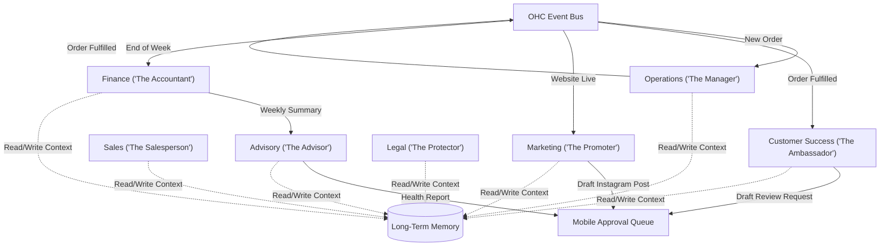

# AI Agent Department Architecture: The Invisible Workforce

## Title
Implement AI Agent Department Orchestration

## Problem Statement
Small business owners like Maya (baker) and Carlos (handyman) wear too many hats. They are their own marketers, salespeople, customer support agents, and accountants. While they know how to bake cakes or fix sinks, they don't have the time or expertise to coordinate social media campaigns, follow up on quotes, or track monthly revenue. Existing platforms expect them to learn a complex dashboard or manually trigger AI tools. Our users need these tasks done *for* them, automatically and invisibly in the background, just as if they had hired a real team of human specialists.

## Research Report
Current small business tools provide isolated AI capabilities that require manual intervention:
- **Shopify Magic & Wix AI**: Great at generating website copy or product descriptions, but the user must click a button to trigger the generation and manually review/apply it.
- **Squarespace AI**: Good at drafting emails, but lacks the ability to coordinate an entire marketing campaign automatically.
- **GoDaddy Airo**: Auto-generates basic sites and logos but stops there; it doesn't run the business post-launch.

**Key Findings:**
1. **Coordination Gap**: None of the competitors offer cross-department coordination (e.g., when "Operations" completes an order, "Customer Success" should automatically ask for a review without the user doing anything).
2. **Context Fragmentation**: Existing AI tools are stateless. They don't remember that Maya's customer "Sarah" previously ordered a vegan cake last year.
3. **Action Friction**: Requiring a non-technical user to "prompt" or manually approve every AI action defeats the purpose. The AI needs to operate autonomously within safe, predefined boundaries.

**OHC Should Do X Because Y Evidence**:
OHC should implement an autonomous "Department" architecture because our core promise is zero-management. By giving agents friendly titles ("The Manager", "The Promoter") and having them coordinate via KAIROS, we remove the cognitive load from the user.

## Design Doc

### Architecture Diagram

### Mobile UX Flow (375px first)
1. **The "Team" Tab**: The primary mobile interface for interacting with the AI. Instead of a complex dashboard, the user sees avatars for their "Team" (e.g., a briefcase icon for The Manager, a megaphone for The Promoter).
2. **The Daily Brief**: A combined feed of activity and pending approvals.
   - *Example card*: "The Promoter drafted an Instagram post for your new Vegan Cake. [Approve & Post] [Edit] [Discard]"
3. **Department Settings**: Simple toggles for autonomy.
   - *Example*: "Auto-reply to customer FAQs? [On/Off]" or "Ask for approval before sending quotes? [Always/Never]".

### AI Integration Points
- **Event Triggers**: KAIROS routes domain events (like a completed booking or a new product added) to the relevant department agent.
- **Episodic Memory**: All departments share the AutoDream pipeline to maintain a unified long-term memory of the business and its customers.
- **Budget Throttling**: Each tenant has a defined token budget. If a department is overly active (e.g., spamming social media drafts), the Orchestrator throttles it and alerts "The Advisor" to notify the user.

### Key Design Decisions
- **Friendly Naming**: We use terms like "The Manager" instead of "Operations Sub-Agent" to ensure the system passes the grandmother test.
- **Draft-for-Review Default**: To build trust, critical external actions (sending quotes, posting to social media) default to a draft state requiring a one-tap mobile approval until the user explicitly enables full autonomy.
- **Decentralized Coordination**: Departments don't call each other directly; they emit events to the bus. This prevents infinite loops and deadlocks in the KAIROS engine.

## Implementation Prompt
**To the Implementer:**
Your task is to build the user-facing "Team" interface and the underlying event routing that powers the AI departments.

**Acceptance Criteria:**
1. Build the mobile-first "Team" tab in the Slint UI where users can see the status of their departments.
2. Implement the Daily Brief feed where AI agents can surface draft actions for user approval (one-tap approval).
3. Ensure all UI elements use premium design tokens (Glassmorphism, Outfit + Inter typography).
4. Implement the backend routing logic to ensure domain events (e.g., new order) are dispatched to the correct department queue.
5. Create a unified, consistent way for departments to write to the shared episodic memory.
6. **Do NOT** prescribe the specific database schema or API endpoints; design them as you see fit to satisfy the user journey.

## Priority
P0

## Estimated Scope
Large
