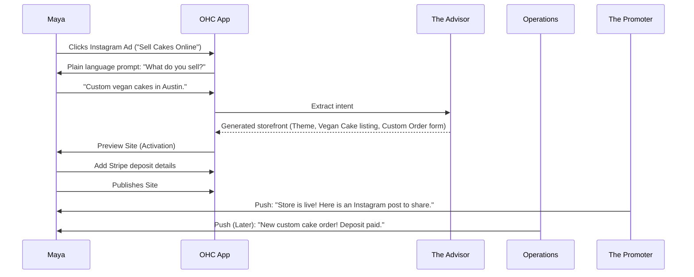
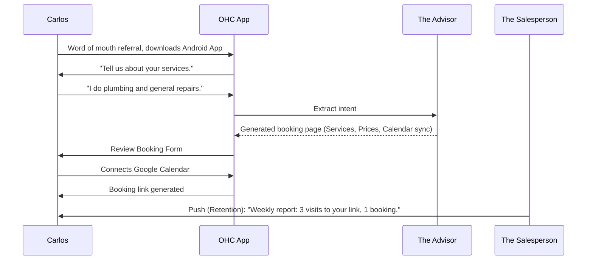
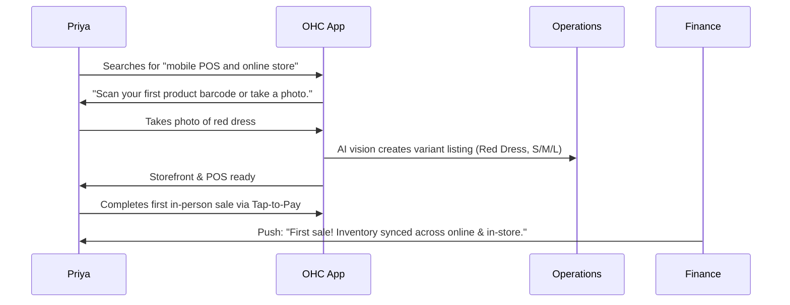
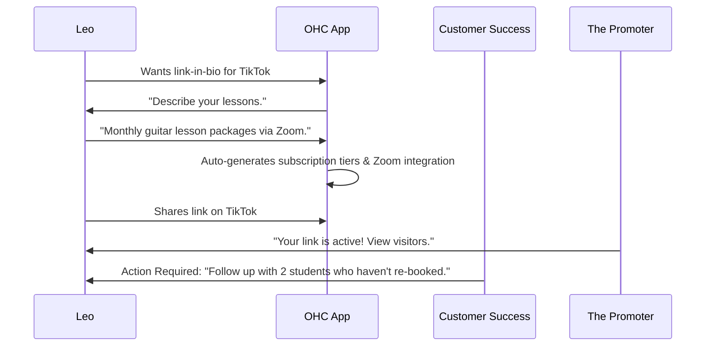
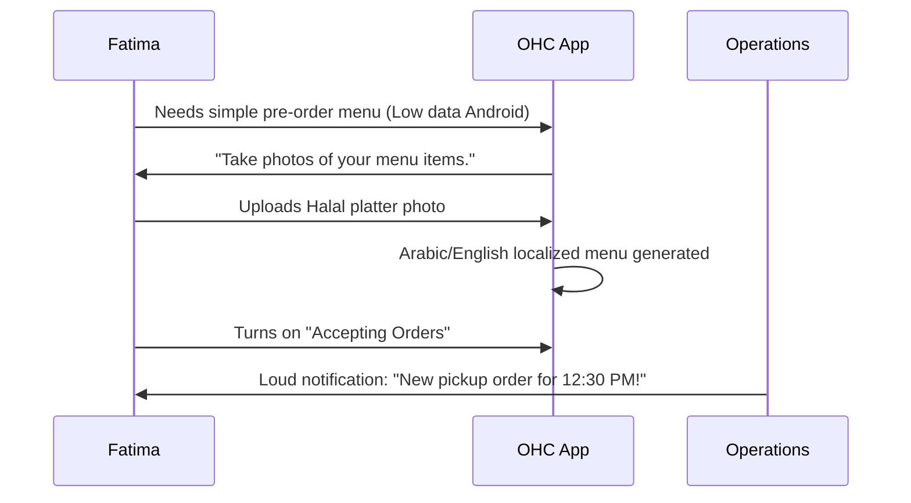

# [architecture] Business Journey End-to-End Design

## Title
End-to-End Business Journey Architecture for Core Personas

## Problem Statement
Small business owners (like Maya the Baker or Carlos the Handyman) experience high friction on legacy platforms when moving from initial sign-up to realizing their first sale or booking. They abandon setups due to confusing jargon, complex multi-step wizards, and a lack of immediate, tangible value. The opportunity is to map a seamless, AI-driven journey from acquisition through referral that guarantees a "live business in under 10 minutes" experience, entirely on mobile.

## Research Report
Our analysis of the small business platform market (Shopify, Wix, Squarespace) and user pain points reveals that:
- **Acquisition & Onboarding** are the most critical drop-off points. Competitors demand users understand DNS, templates, and complex settings. OHC must leverage "Instant Storefront Generation" using plain language prompts.
- **Activation** requires early wins. A user needs to see a generated product or receive a test booking immediately.
- **Retention** is currently plagued by operational fatigue. OHC's proactive agents (e.g., The Ambassador, The Business Advisor) must keep users engaged through simple, plain-language actionable insights delivered via push notifications, rather than complex analytics dashboards.
- **Revenue & Upgrades** often fail due to sudden paywalls. A freemium model with clear, value-based upgrade triggers (e.g., hitting the 10-product limit or needing custom domains) converts best.

## Design Doc

### High-Level Design Decisions
- **Mobile-First UX (375px):** All onboarding steps and dashboard views must be optimized for single-column, touch-friendly interactions on devices like an iPhone or a mid-range Android phone.
- **Friction Mitigation:** Remove all jargon. Replace manual data entry with conversational AI extraction. Defer complex configurations (e.g., taxes, custom domains) until after the first sale.
- **AI Integration Points:**
  - **The Advisor** extracts user intent during onboarding to generate the initial site.
  - **The Promoter** auto-creates marketing content once the first product is listed.
  - **The Manager & Ambassador** handle ongoing operations and customer interactions to drive retention.

### User Journeys

#### 1. Maya — The Home Baker (Product/Custom Orders)

#### 2. Carlos — The Freelance Handyman (Services/Bookings)

#### 3. Priya — The Boutique Owner (Physical/In-Store + Online)

#### 4. Leo — The Music Tutor (Digital/Subscriptions)

#### 5. Fatima — The Food Cart Operator (Food/Pre-Orders)

### Friction Point Mitigations
- **Friction:** Blank canvas anxiety during onboarding.
  - **Mitigation:** "Instant Storefront Generation" pre-fills 80% of the site based on a single text prompt or photo.
- **Friction:** Complex checkout or booking configuration.
  - **Mitigation:** AI infers the business model (e.g., custom order vs. direct sale) and auto-configures the correct Stripe/Calendar flow.
- **Friction:** Forgetting to promote the new site.
  - **Mitigation:** The Promoter immediately generates a shareable social media post upon launch.

### Mobile UX Flow
- **Onboarding:** A chat-like, conversational UI taking full advantage of the native keyboard and camera.
- **Dashboard:** A 375px feed of AI agent actions and simple, plain-language metrics. No multi-level navigation trees.
- **Action Feed:** A unified inbox for order updates, agent drafts needing approval, and advisory insights.

## Implementation Prompt
Implement the initial "Conversational Onboarding" flow for the Flutter application.
- Create a mobile-first (375px baseline) chat-like UI that replaces the standard multi-step form.
- Integrate this UI with "The Advisor" agent backend endpoint to send the user's initial business description and receive a structured storefront configuration payload.
- Ensure the UI displays a live, optimistic preview of the storefront as it is generated, matching the design tokens for Glassmorphism.
- The outcome must allow a user to go from app launch to a previewed, generated site within 60 seconds.

## Priority
P0

## Estimated Scope
Medium

