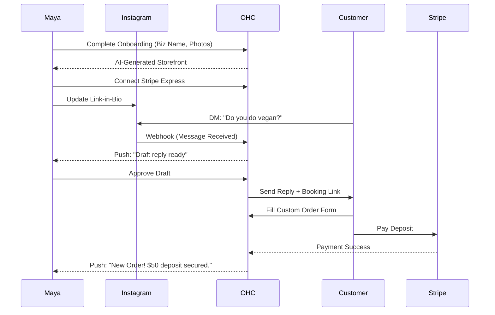
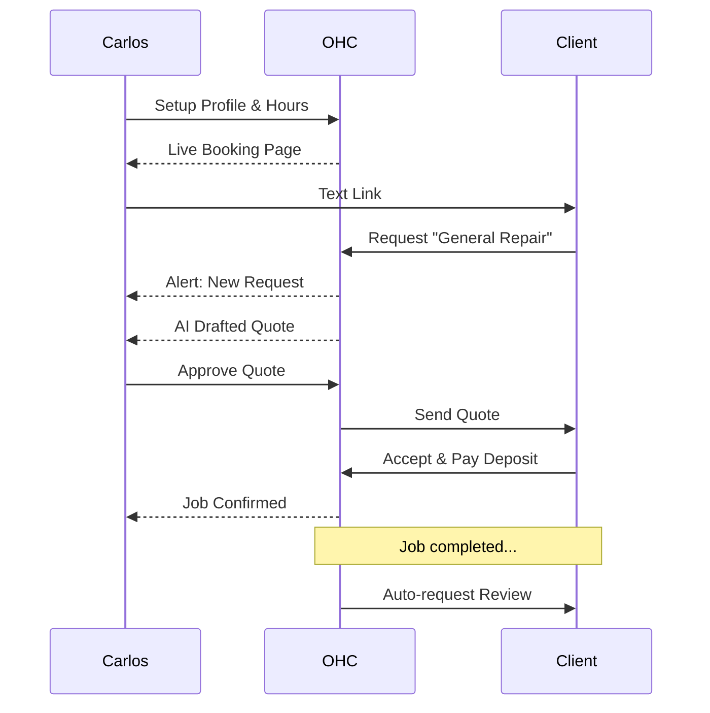
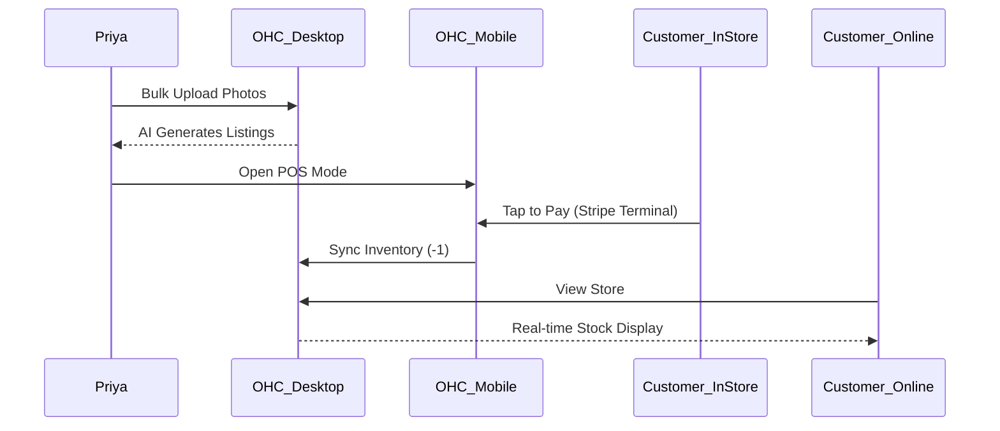
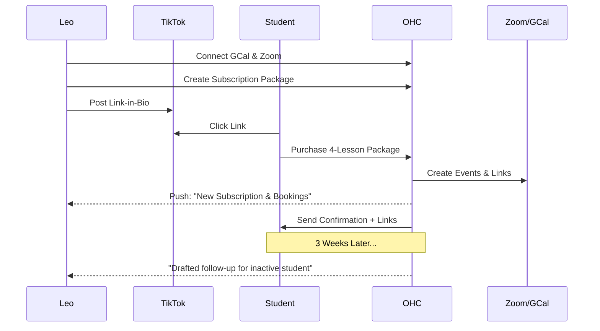
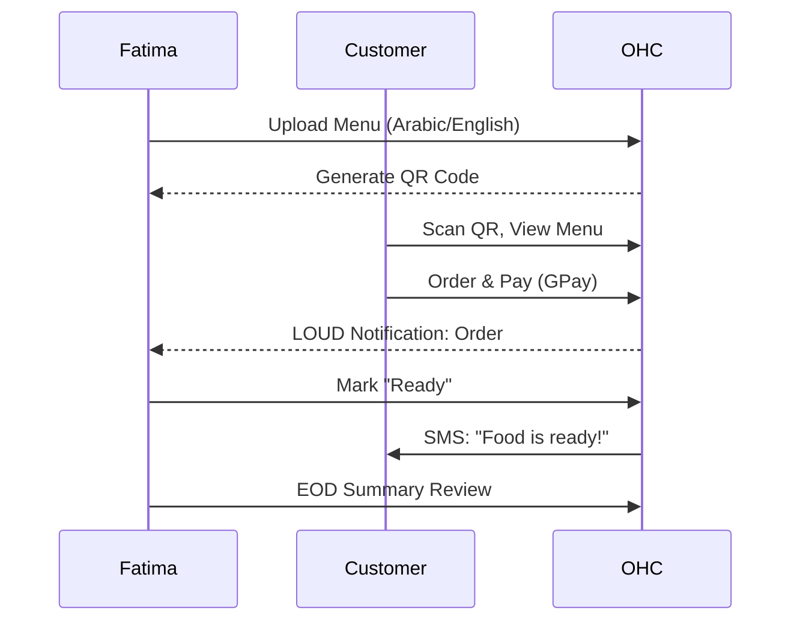

# Architecture Task: Business Journey Architecture

## Overview
This design document defines the complete end-to-end user journey for each of the core OHC personas: Maya (Baker), Carlos (Handyman), Priya (Boutique Owner), Leo (Music Tutor), and Fatima (Food Cart). The goal is to identify friction points where non-technical users might abandon the flow and design mitigations to ensure a seamless "Idea → Live Business in under 10 minutes" experience.

## Persona Journeys

### 1. Maya — The Home Baker
**Context:** Sells custom cakes via Instagram DMs. Overwhelmed by Shopify. Needs a beautiful storefront, custom order deposits, and an AI agent for DM replies. Mobile-only.

**Acquisition:**
- Discovers OHC via a targeted Instagram Ad showing a baker managing orders on her phone.
- Clicks "Start Selling in 2 Minutes" link.

**Onboarding:**
- Enters business name: "Maya's Sweet Treats".
- Selects business type: "Food & Beverage" -> "Baked Goods".
- Uploads 3 photos of her cakes.
- AI (Marketing Dept) instantly generates a "Glassmorphism" styled storefront with her photos, a bio, and a custom order form.
- *Friction Point:* Connecting Stripe for deposits can be confusing.
- *Mitigation:* The Onboarding Wizard explicitly asks "Do you want to take deposits?". If yes, it walks through Stripe Express connect with plain-language explanations ("Where should we send your money?").

**Activation (Day 1 - Week 1):**
- Maya links her new OHC custom domain (`mayassweettreats.com` or OHC subdomain) to her Instagram Bio.
- A customer DMs her: "Do you do vegan cakes?".
- AI (Customer Success Dept) auto-drafts a reply based on her menu and alerts Maya: "I drafted a reply to a vegan cake inquiry. Tap to approve."
- Maya approves. Customer clicks the link in the DM, fills out the custom order form, and pays a 50% deposit.
- Maya gets a push notification: "New Custom Order: Vegan Chocolate Cake. $50 deposit secured."

**Retention:**
- Maya receives daily summary push notifications: "You have 3 cakes to bake tomorrow."
- The Business Advisory Agent sends a weekly report summarizing income and suggesting she add a "Vegan" tag to her top-selling items.

**Revenue:**
- Maya hits her 100-order limit on the Starter tier.
- The Finance Agent sends a plain-language notification: "You're growing fast! Upgrade to Pro to accept unlimited orders." Maya upgrades.

**Referral:**
- Maya shares a screenshot of her clean order list to a baker's Facebook group with her referral link.

### 2. Carlos — The Freelance Handyman
**Context:** No website, word of mouth only. Needs service listings, booking calendar, and AI quote generator. Android only.

**Acquisition:**
- Hears about OHC from another contractor.
- Searches "OHC app" on Google Play Store and downloads it.

**Onboarding:**
- Enters business name: "Carlos Home Repairs".
- Selects "Services & Bookings" -> "Home Repair".
- Selects services from AI-suggested list: Plumbing, Painting, General Repair.
- Sets his hourly rate or base call-out fee.
- *Friction Point:* Setting up a calendar can be tedious.
- *Mitigation:* OHC asks "When do you work?". Carlos selects "Mon-Fri 8am-5pm". OHC automatically creates bookable time slots.

**Activation:**
- Carlos shares his OHC link with a previous client via text.
- Client books a "General Repair" for Tuesday at 10 AM.
- AI (Sales Dept) auto-generates a quote request based on the client's description ("Leaky faucet").
- Carlos reviews the quote on his phone and hits "Send".
- Client accepts and pays the base call-out fee deposit.

**Retention:**
- Carlos uses the OHC app as his sole CRM and calendar. The app alerts him when it's time to head to the next job.
- After the job, the Customer Success Agent automatically sends the client a review request.

**Revenue:**
- Carlos upgrades to Starter to access custom domains and more AI quote generations per month.

**Referral:**
- Recommends the app to a plumber friend because "it handles the scheduling and quotes for me."

### 3. Priya — The Boutique Owner
**Context:** In-store + online. Needs inventory sync, variants, POS, and analytics. Desktop + Mobile.

**Acquisition:**
- Searching for "Shopify alternatives for small boutiques". Finds an OHC blog post.

**Onboarding:**
- Creates account on Desktop.
- Connects Stripe.
- *Friction Point:* Uploading 100s of products is slow.
- *Mitigation:* Priya takes photos of her clothing racks with her phone. The Operations Agent identifies items, suggests categories, and drafts product descriptions.

**Activation:**
- Priya downloads the OHC app and uses Stripe Terminal (Tap-to-Pay on iPhone) for an in-store customer.
- The inventory for that specific dress (Size M, Red) instantly decrements across her online store.

**Retention:**
- Priya checks the mobile dashboard daily for "Revenue Today" vs. "Yesterday".
- The Marketing Agent drafts an email newsletter highlighting new arrivals and sends it for Priya's approval.

**Revenue:**
- Upgrades to Pro for unlimited products and advanced multi-channel analytics.

**Referral:**
- Writes a positive review on G2 or Capterra.

### 4. Leo — The Music Tutor
**Context:** Online + In-person. Needs Zoom sync, subscriptions, and a link-in-bio. Non-technical.

**Acquisition:**
- Sees a TikTok ad emphasizing "Link-in-bio that actually takes bookings".

**Onboarding:**
- Sets up via mobile.
- Selects "Services & Bookings" -> "Tutoring".
- Connects Google Calendar and Zoom via simple OAuth flows.
- *Friction Point:* Setting up recurring subscriptions.
- *Mitigation:* The setup wizard offers a template: "4 Lessons/Month Package". Leo just enters the price.

**Activation:**
- Adds his OHC link to his TikTok bio.
- A student buys the "4 Lessons/Month" package.
- OHC automatically schedules the next 4 weeks on Leo's calendar and generates unique Zoom links for each.

**Retention:**
- AI Sales Agent notices a student hasn't booked in 3 weeks and drafts a "Checking in" email for Leo to approve.
- Leo uses the dashboard to see upcoming lessons at a glance.

**Revenue:**
- Remains on Starter tier, as his student count is steady.

**Referral:**
- Other tutors see his seamless booking link and ask what he uses.

### 5. Fatima — The Food Cart Operator
**Context:** Pre-orders, pick-up notifications, multi-language. Low-end Android.

**Acquisition:**
- A family member helps her set it up after hearing about it locally.

**Onboarding:**
- Setup is entirely in Arabic (or bilingual).
- She uploads pictures of her 5 main dishes.
- *Friction Point:* Complex order management during a busy rush.
- *Mitigation:* The "Operations Dashboard" is stripped down to just a big "Incoming Orders" list and a toggle to mark items "Sold Out" instantly.

**Activation:**
- Customer scans a QR code taped to the side of the cart.
- Customer views the menu, orders 2 Chicken over Rice, and pays via Google Pay.
- Fatima's phone plays a distinct, loud notification sound: "New Order #42".

**Retention:**
- Fatima relies on the app to manage the queue. She hits "Ready" when the food is done, which texts the customer.
- At the end of the day, she views a simple summary: Total Sales, Most Popular Item.

**Revenue:**
- Free tier is sufficient for her volume initially, potentially moving to Starter.

**Referral:**
- Other food cart operators nearby see her QR code system and ask how to get it.

## Critical Frictions & Systemic Mitigations

1. **Payment Onboarding (The "Stripe" hurdle):**
   - *Friction:* Non-technical users freeze when asked for banking details or business tax IDs.
   - *Mitigation:* Defer full Stripe onboarding. Allow them to set up the store and take "Cash/Manual" payments or accept the *first* online payment before gating payouts behind KYC.
2. **Asset Creation (The "Blank Page" problem):**
   - *Friction:* Users don't have good photos or copywriting skills.
   - *Mitigation:* AI (Marketing Dept) instantly generates high-quality placeholder images (or enhances their bad ones) and writes compelling product descriptions based on a 3-word input.
3. **App Overload:**
   - *Friction:* Too many features visible at once.
   - *Mitigation:* **Progressive Disclosure Pattern**. The UI only shows what is relevant. Fatima only sees her order queue and "Sold Out" toggles. Leo only sees his calendar.

## Architectural Requirements Derived from Journeys
- **Real-time Notifications:** WebSockets or Push notifications are critical for Fatima and Carlos.
- **Agent Interactivity:** The KAIROS Orchestrator must support pausing an AI flow to request human approval (Draft-for-review) via mobile push.
- **Mobile Device Capabilities:** The app must seamlessly integrate with native camera (for Priya's inventory), native sharing (for Leo's links), and native payment terminals (Stripe Terminal for Priya).
- **Internationalization (i18n):** Deeply embedded in the UI and AI prompts to support users like Fatima.
