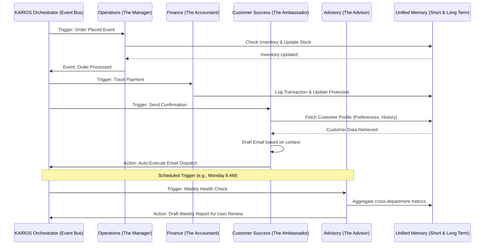

# [architecture] AI Agent Department Architecture Implementation Brief

## Title
Implement the AI Agent Department Architecture for Invisible Business Management

## Problem Statement
Small business owners—whether it's Maya baking custom cakes from her kitchen, Carlos fixing plumbing, or Fatima running a food cart—are overwhelmed by the operational complexity of running a business. Existing platforms like Shopify or Wix bolt on "AI Chatbots" as an afterthought, still requiring the owner to act as the manager, marketer, accountant, and support rep. The gap is a system that natively acts as a complete back-office. OHC needs to deploy invisible "AI Departments" (Operations, Marketing, Sales, Customer Success, Finance, Legal, Advisory) that do the actual work autonomously, without requiring the user to learn technical jargon or write prompts. Owners need AI that proactively runs the business rather than just answering questions.

## Research Report
**Findings & Competitive Analysis:**
- **Shopify:** Provides "Sidekick," an AI chat interface that helps users navigate the Shopify admin or write product descriptions. It relies heavily on user initiation (on-demand) and does not proactively coordinate end-to-end tasks like booking follow-ups or full-lifecycle management autonomously.
- **Wix:** Offers AI website generation and some text/SEO tools, but lacks cross-functional business intelligence. Users must manually stitch together marketing campaigns, customer support, and operations.
- **Squarespace:** Features generative AI for text and layout but no autonomous agentic workflows that act on incoming business events.
- **GoDaddy:** "Airo" generates basic sites and logos but stops short of continuous, background business execution.

**Conclusion:**
The market gap is *proactive, cross-departmental AI automation*. By structuring AI as recognizable "departments" that talk to each other and operate in the background (triggering on events or schedules), OHC completely differentiates itself. A non-technical user immediately understands what "The Accountant" or "The Promoter" does.

## Design Doc

### Architecture Diagram

### Key Design Decisions
1. **Department Functional Boundaries:**
   - **Operations ("The Manager"):** Order/booking processing, inventory, fulfillment, refunds.
   - **Marketing & Advertising ("The Promoter"):** Web design, SEO, social posts, QR codes, link-in-bio.
   - **Sales & Acquisition ("The Salesperson"):** Quote generation, lead follow-up, upsells.
   - **Customer Success ("The Ambassador"):** Messaging, order updates, review requests.
   - **Finance & Payments ("The Accountant"):** Processing, financial reports, tax summaries, subscriptions.
   - **Legal & Compliance ("The Protector"):** Policies, contracts, GDPR, licenses.
   - **Business Advisory ("The Advisor"):** Weekly health reports, trends, next-action suggestions.

2. **Trigger Mechanisms:**
   - **On Schedule (Cron):** Weekly health reports (Advisory), daily order summaries, recurring billing processing.
   - **On Event:** New order created, inventory depleted, message received. Drives department coordination (e.g., Operations finishes order -> triggers Customer Success to send update).
   - **On Demand:** User explicitly asks for a new flyer or a custom quote via the dashboard.

3. **Memory & Context:**
   - **Short-Term Context:** Specific payload tied to the triggering event (e.g., order #123 details).
   - **Long-Term Memory:** Semantic recall of past interactions and business context (e.g., "Customer Y is a VIP", "Summer sales typically peak in July"). Accessed by all departments before acting.

4. **Approval Workflows (Auto-execute vs. Draft-for-review):**
   - **Auto-Execute:** Low-risk, routine, or internal actions (e.g., updating inventory, logging payments, sending standard order confirmations).
   - **Draft-for-Review:** High-risk, high-visibility actions (e.g., publishing a social media post, issuing a refund, sending a custom customer response, altering site design).

5. **Usage Budgeting & Throttling:**
   - Agent usage is tracked per tenant. Hard limits correlate to tiers (e.g., Free = 100 actions/mo, Pro = Unlimited). Graceful degradation occurs when limits are hit, prompting a simple upgrade UI.

### UI Wireframes & Screen Flow (375px Mobile First)
- **Home Dashboard:** A minimalist feed of "Action Items" and "FYI."
  - *Draft-for-Review Card:* "The Promoter drafted an Instagram post for your new vegan cakes. [Review & Post]"
  - *FYI Card:* "The Manager restocked inventory. 3 items sold out today."
- **Review Modal (Bottom Sheet):** When clicking [Review & Post], a bottom sheet slides up displaying the AI-generated image and text. Two large, 44px high buttons: "Approve" (Primary) and "Edit/Reject" (Secondary).
- **Advisory Screen:** A dedicated tab for plain-English metrics. "You made $400 this week. Tuesdays are your busiest. Consider running a Tuesday special."

### Mobile UX Flow
1. User receives a push notification: "New customer inquiry needs your review."
2. User taps notification, opening the app directly to the Customer Success department's pending drafts.
3. User reads the drafted response to an Instagram DM.
4. User taps "Approve & Send." The AI handles dispatching the message.

### AI Agent Integration Points
- **KAIROS Orchestrator:** The central hub routing events between departments.
- **Teammate Mesh:** Handles cross-department messaging and ensures distributed locking when modifying shared resources (e.g., Inventory).
- **Notification Service:** Routes Draft-for-Review tasks to the mobile app via push notifications or in-app badges.

## Implementation Prompt
**For the Implementer Agent:**
Implement the foundational event routing and state management for the 7 AI Agent Departments. The outcome must allow a user to receive an event (like a new order), which autonomously triggers "The Manager" to update inventory and "The Ambassador" to draft a thank-you message. Ensure that actions flagged as "high-risk" (e.g., sending the custom message) are placed into a "Draft-for-Review" state, surfacing on the user's mobile dashboard for 1-tap approval.

**Acceptance Criteria:**
- All 7 departments are defined with distinct event-listening capabilities.
- An event successfully triggers a chained workflow across at least two departments.
- Actions are correctly categorized as Auto-Execute or Draft-for-Review based on risk level.
- High-risk actions halt execution and surface a pending approval request that can be resolved via a mock UI/API call.
- Provide a full Critical User Journey (CUJ) E2E test starting from a logged-in state, simulating an order event, and verifying the drafted action appears for approval.

## Priority
P0

## Estimated Scope
Large