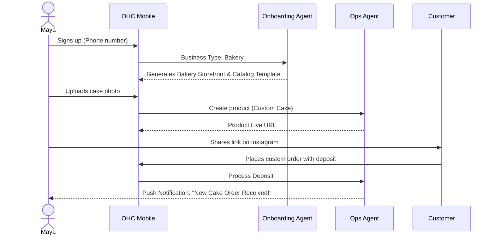
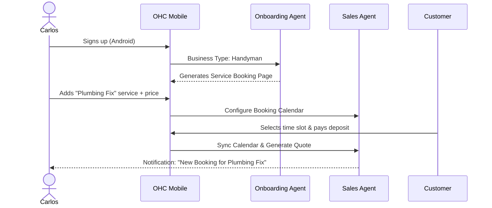
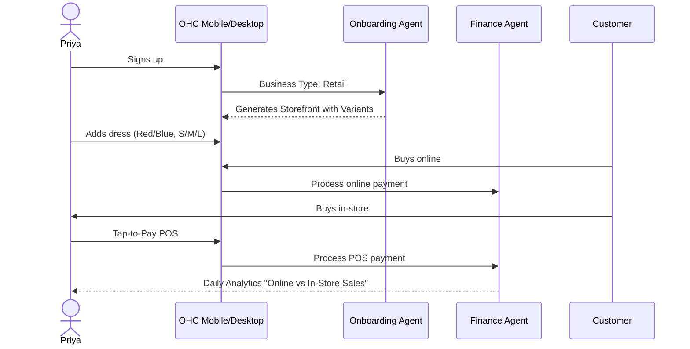
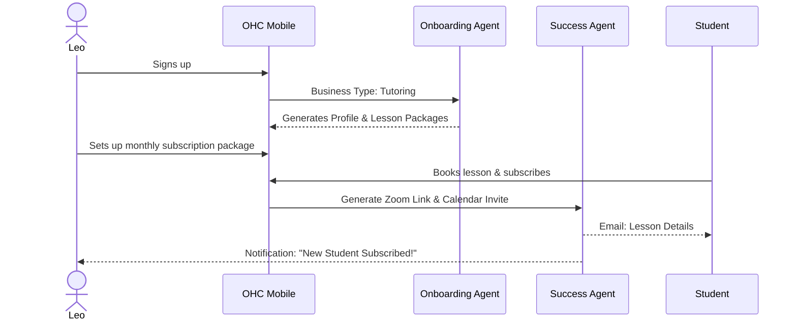
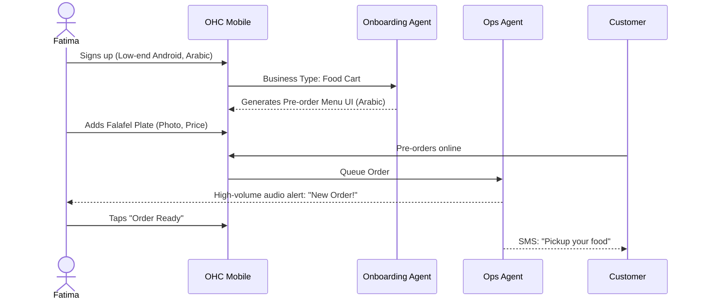

# Issue Brief: End-to-End Business Journey Architecture

## Title
Business Journey Architecture & Activation Workflows

## Problem Statement
Small business owners joining OneHumanCorp (OHC) range from completely non-technical bakers to semi-technical boutique owners. Existing platforms (Shopify, Wix) present immediate friction during onboarding by asking technical questions (e.g., DNS setup, payment gateway integration) before demonstrating value. If a user cannot experience their "aha" moment—seeing their live business ready to accept a real order—within the first 10 minutes, they churn. OHC needs a seamlessly guided, AI-assisted journey covering acquisition, onboarding, activation, retention, revenue, and referral that shields users from all technical complexity and operates flawlessly on mobile.

## Research Report
Based on market analysis of SMB platform onboarding and user behavior:
- **Acquisition**: Non-technical users convert best through social proof and direct link-in-bio examples (e.g., seeing another baker use OHC).
- **Onboarding**: Shopify requires ~30-60 minutes to set up a basic store. OHC targets <10 minutes. By leveraging AI to pre-fill descriptions, generate placeholder images, and design the initial layout based on just 3 inputs (Name, Business Type, Primary Goal), we eliminate the "blank canvas" paralysis.
- **Activation**: True activation happens when the first order is placed or booked. OHC must prioritize creating a functional storefront with at least one active product/service before asking for complex configurations.
- **Retention**: Push notifications showing real business activity (new orders, AI agent actions) are the strongest retention driver.
- **Friction Points Identified**:
  - Connecting payment gateways (Stripe setup can be daunting). OHC should allow deferred payout setup while instantly enabling pre-orders or deposit collection.
  - Adding inventory. OHC must support photo-to-product AI extraction.

## Design Doc
### High-Level Architecture
- **Journey Tracks**:
  - **Acquisition**: Discovery via social channels, organic search, or referral links. Landing page CTA focuses on "Start selling in 10 minutes."
  - **Onboarding**: Step-by-step wizard (375px mobile-first). AI generates the initial storefront.
  - **Activation**: First product/service creation. Success is defined by the user viewing their live, shareable storefront URL.
  - **Retention**: Push notifications for business activity, weekly plain-language AI advisory reports ("Your top seller is...").
  - **Revenue**: Trigger-based prompts to upgrade from Free to Starter when limits (e.g., product count, AI actions) approach 80%.
  - **Referral**: Viral loop where every receipt and booking confirmation includes a "Powered by OHC" link, turning customers into new tenants.

### Mobile UX Flow (375px First)
- **Onboarding Screen 1**: "What's your business called?" (Text input)
- **Onboarding Screen 2**: "What do you do?" (Grid selection: Bake, Fix, Teach, Sell Clothes, etc.)
- **Onboarding Screen 3**: "AI is building your store..." (Progress animation, background API calls to Marketing Agent)
- **Home Dashboard**: "Your store is live! Add your first item." (Card layout, large touch targets ≥ 44x44px).
- **Friction Reduction**: Use native mobile keyboards. Defer complex setups (taxes, custom domains) to a "Finish Setup" checklist that appears post-activation.

### Persona Sequence Diagrams (Mermaid)

#### Maya (The Home Baker)

#### Carlos (The Freelance Handyman)

#### Priya (The Boutique Owner)

#### Leo (The Music Tutor)

#### Fatima (The Food Cart Operator)

## Implementation Prompt
Design and implement the unified Onboarding Engine and User Journey state machine for the OHC platform. The engine must track each tenant's progression through Acquisition, Onboarding, Activation, Retention, and Revenue phases. Implement the Flutter mobile UI for the step-by-step onboarding wizard (max 3 inputs before storefront generation) ensuring perfect 375px rendering. Integrate with the backend `Onboarding Agent` to auto-generate initial catalog items and storefront designs based on the user's business type. Create E2E tests validating the complete flow from sign-up to viewing a live storefront URL for at least two personas (e.g., Baker and Handyman). Do not require complex configuration (like Stripe setup or custom domains) during the initial onboarding flow; defer these to a post-activation checklist.

## Priority
P0

## Estimated Scope
Large
