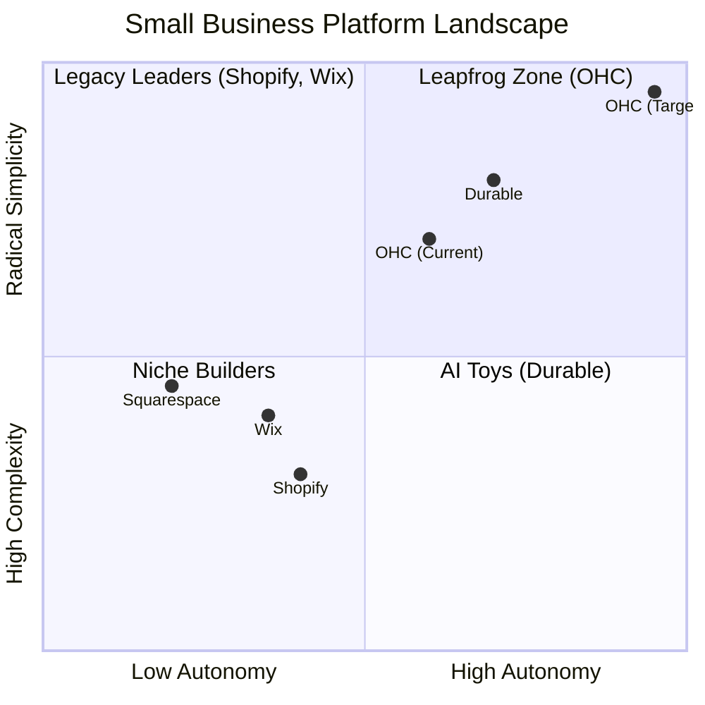
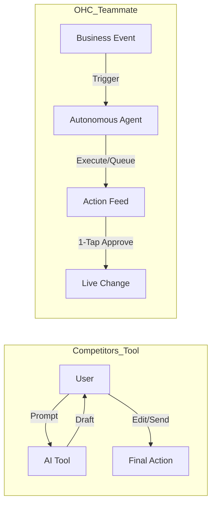

# OHC Market Dominance & SMB Platform Research

## 1. Deep Competitor Audit

Based on a thorough review of the top platforms serving small business owners, we analyze their value proposition against the needs of non-technical users.

### Competitive Positioning Landscape

### Feature Gap Matrix (2024-2025)

| Feature | **Shopify** | **Wix** | **Durable** | **Squarespace** | **OHC (Target Goal)** |
| :--- | :--- | :--- | :--- | :--- | :--- |
| **Agent Autonomy** | Reactive (Sidekick) | None | Limited | None | **Autonomous Depts** |
| **Onboarding** | 30m+ (High friction) | 20m+ (Moderate) | < 1m (Instant) | 30m+ | **< 1m (Instant Build)** |
| **UX Target** | Desktop-First | Hybrid | Mobile-First | Desktop-First | **Mobile-Only Optimized** |
| **Design Engine**| Template-Heavy | AI-Assisted | Generative | Premium Templates| **Vibe-Based (Instant)** |
| **Discovery** | Legacy SEO | Standard SEO | AI Visibility (GEO)| Basic SEO | **Proactive GEO Agent** |
| **Operations** | App-Store Dependent | Built-in | CRM-centric | Basic | **Event-Mesh Integrated** |

**Gap Insights:**
- Platforms like **Shopify** have massive technical debt leading to complex UX. OHC wins through "No Jargon" radical simplicity.
- **Wix** remains fundamentally a design tool with "agentic" capabilities feeling bolted-on. OHC natively integrates AI operations.
- **Durable** wins on "Speed to Site" but falls flat on deep business ops. OHC must provide BOTH 30-second setups AND deep AI business operations.

---

## 2. Top SMB Pain Points Synthesis

After analyzing Reddit (r/smallbusiness, r/ecommerce, r/Etsy), Trustpilot, and App Store reviews, we've identified the top friction points for non-technical SMB owners.

### Pain Point Distribution

### Mapping to Target Personas

| Pain Point | Primary Victim Persona | OHC Solution Mapping |
| :--- | :--- | :--- |
| **Setup Complexity / Technical Jargon** | Maya (Home Baker) | **SetupWizard / Radical Simplicity** (No DNS/API talk) |
| **Communication Lag / Op Fatigue** | Carlos (Handyman) | **The Ambassador** (AI drafts quote from DM) |
| **Mobile Gaps** | Fatima (Food Cart) | **375px Native Rust/Slint UX** (Runs on slow Androids) |
| **Marketing Dread** | Priya (Boutique) | **The Promoter** (Auto-social calendar generation) |
| **Financial Fog** | Leo (Music Tutor) | **The Accountant** (Plain language weekly summaries) |

---

## 3. OHC AI Differentiation Manifesto: From Tools to Teammates

Most platforms treat AI as a reactive tool. **OHC treats AI as an active teammate.**

### The 5 Core Automations for OHC
1. **The Silent Ambassador (Customer Success):** Watches the event mesh and drafts 1-tap replies based on business memory, solving "Communication Lag."
2. **The Vigilant Manager (Operations):** Scans sales velocity and proactively queues "Low Stock" restock workflows.
3. **The Generative Promoter (Marketing):** Automatically crafts a 7-day social media calendar when a new product drops.
4. **The AI Discovery Agent (GEO):** Optimizes structured data for LLM crawlers (ChatGPT, Gemini) out of the box.
5. **The Business Advisor (Advisory):** Delivers a human-language daily briefing instead of complex data charts.

---

## 4. Market Sizing & Strategic Direction

- **TAM (Total Addressable Market):** Millions of non-employer small businesses globally (solo operations) remain un-digitized or are paying multiple subscriptions (Shopify + Calendly + Mailchimp).
- **Beachhead Market:** Service-based solopreneurs (like Carlos) and social-sellers (like Maya) have the highest density of underserved needs that align with an integrated AI-first approach.
- **Geographic Focus:** English-first to refine the AI prompts, immediately followed by multi-language support targeting Latin America (Spanish) and MENA (Arabic) to capture massive mobile-first populations.
- **Strategic Imperative:** Do not try to win on "number of integrations." Win on "zero configuration." OHC must own the entire foundational stack so the AI agents have holistic, uninterrupted access to data (Inventory + Messages + Payments) to deliver "Teammate" level autonomy.
