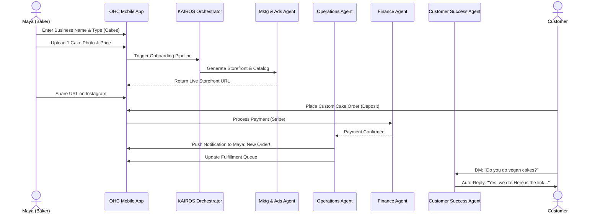
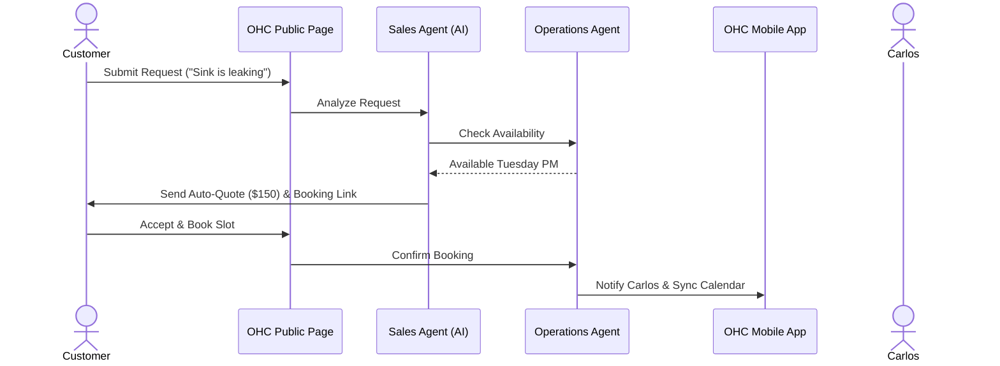
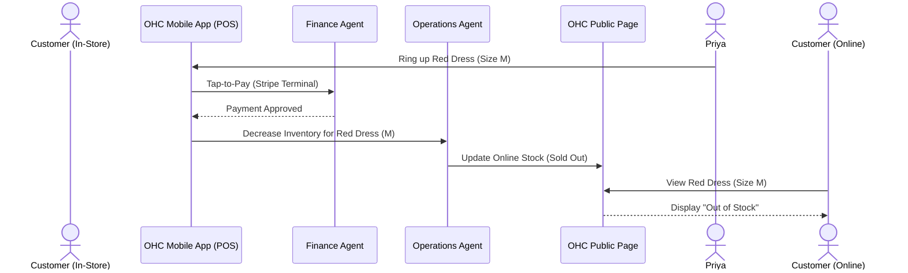
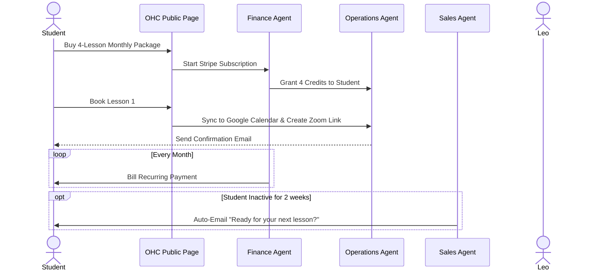
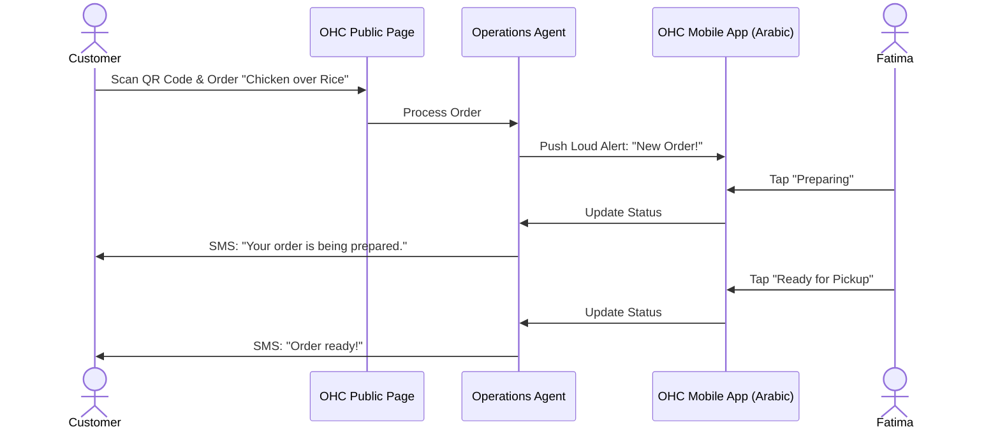

# [architecture]_business_journey_architecture

## Title
Business Journey Architecture: End-to-End User Flow Definition for Non-Technical Founders

## Problem Statement
Small business owners (bakers, handymen, boutique owners, tutors, and food cart operators) with zero technical background struggle to establish and manage their online presence. Traditional platforms (like Shopify, Wix, or Squarespace) are overly complex, requiring hours of setup, technical configuration (DNS, payment gateways, theme styling), and continuous manual management. When users hit friction during onboarding or daily operations, they abandon the platform. The OneHumanCorp (OHC) platform must completely eliminate this friction by orchestrating a 10-minute "zero to live" journey where AI handles the heavy lifting, ensuring the experience is seamless, accessible exclusively from mobile if necessary, and relentlessly simple.

## Research Report
### Competitive Analysis
- **Shopify:** Powerful but overwhelming for a solo baker or handyman. Requires desktop for initial setup, manual theme editing, and app integrations to function fully. Onboarding takes 30-60 minutes at minimum.
- **Wix/Squarespace:** Website builders first. Complex drag-and-drop interfaces that do not easily translate to native mobile creation. They lack built-in business operation tools (like AI quoting, daily summaries) out of the box.
- **GoDaddy (Airo):** Basic AI setup but limited functional depth. It creates a landing page but doesn't integrate deep business logic (like variant management or automated AI DM replies).
- **OHC Distinction:** OHC is a *business* builder, not just a *website* builder. AI acts as active "departments" seamlessly executing tasks based on the business lifecycle. The platform must feel like an invisible co-founder that only asks for critical input when required.

### Core User Journeys Analyzed
1.  **Acquisition:** Users find OHC via organic social, paid ads highlighting "Build your business on your phone in 10 minutes", or word of mouth.
2.  **Onboarding:** The platform asks only essential questions (Name, Business Type, 1-2 product photos) and defers the rest.
3.  **Activation:** Success means receiving the first order/payment, seeing the live storefront, or getting the first automated AI action (e.g., an automated quote sent).
4.  **Retention:** Kept engaged via proactive push notifications, AI weekly summaries (e.g., "Tuesday was your best day"), and actionable insights.
5.  **Revenue:** Upgrade path from Free -> Starter triggered naturally when reaching limits (e.g., product count, AI action limit).
6.  **Referral:** Inviting other business owners via a personalized link with incentives (e.g. "Give a free month, get a free month").

## Design Doc

### Design Decisions
- **Mobile-First Everything:** The entire journey, from onboarding to daily analytics, is designed primarily for a 375px mobile screen. Complex forms use conversational UI or wizard steps.
- **Deferred Complexity:** We only ask for information when it is strictly necessary to unlock the next step. E.g., we don't ask for tax details until the first payout.
- **AI-Assisted Operations:** Users interact with friendly AI personas ("The Manager", "The Advisor") rather than complex dashboards.
- **Optimistic UI:** Local changes (like adding a product) are reflected immediately in the UI while syncing with the backend to ensure a snappy experience even on slow connections.

### Mobile UX Flow (375px)
1.  **Welcome Screen:** Large, friendly typography (Outfit). "What's your business idea?" -> Text input.
2.  **Setup Wizard (3 Steps):**
    - "What are you selling?" (Products, Services, Food, etc.)
    - "Add your first item" (Photo upload, Title, Price). Native numeric keyboard.
    - "Where should we send the money?" (Connect bank/Stripe).
3.  **Generation Screen:** Glassmorphism loading animation. "The Promoter is building your website..."
4.  **Dashboard (Home):** Clean, card-based layout.
    - Top: Weekly Revenue + Actionable Insights from "The Advisor".
    - Middle: Pending Orders/Bookings.
    - Bottom: Floating action button for quick actions (Add Product, Create Post).

### Architecture Diagrams

#### Journey 1: Maya (The Baker, 28) - Custom Orders & AI DMs
- **Acquisition**: Sees TikTok ad showing a business setup in 3 mins.
- **Onboarding**: Uploads 2 cake photos, enters "Maya's Cakes", and sets deposit requirement.
- **Activation**: Shares OHC storefront link in her Instagram bio. First custom order with deposit received.
- **Retention**: Gets daily digest via push notification from "The Advisor" on new orders. "Customer Success" agent auto-replies to Insta DMs.
- **Revenue**: Upgrades to Starter tier when she needs more than 10 products listed for holiday season.
- **Referral**: Sends referral link to another baker friend she met online.

#### Journey 2: Carlos (The Handyman, 42) - Service Booking & Quoting
- **Acquisition**: Hears about OHC from a client who built their own site.
- **Onboarding**: Uses Android phone. Types "Handyman", creates 3 services (Plumbing, Painting, Repairs) with base prices.
- **Activation**: Customer books a time slot and Carlos gets a notification to approve.
- **Retention**: Daily morning summary of upcoming jobs and locations from "The Manager".
- **Revenue**: Upgrades to Pro when he starts taking on more than 100 bookings a month and needs advanced calendar sync.
- **Referral**: Mentions it to a fellow contractor at a supply store.

#### Journey 3: Priya (Boutique Owner, 35) - Multi-channel & POS
- **Acquisition**: Needs to replace a clunky Shopify setup; searches "easy online store with in-person POS".
- **Onboarding**: Uploads inventory spreadsheet, sets up variants (Size/Color), connects Stripe Terminal.
- **Activation**: Makes her first in-store sale via phone tap-to-pay which syncs inventory online.
- **Retention**: Views daily analytics dashboard on her MacBook comparing online vs in-store sales.
- **Revenue**: Immediately on Starter or Pro due to need for custom domain and higher storage.
- **Referral**: Tells her networking group about the easy dual-channel setup.

#### Journey 4: Leo (Music Tutor, 22) - Subscriptions & Calendars
- **Acquisition**: Sees an ad for an "all-in-one link-in-bio for creators".
- **Onboarding**: Sets up 4 lesson packages (Subscriptions), syncs Google Calendar.
- **Activation**: Shares link in TikTok bio. First student buys a monthly package.
- **Retention**: AI Agent sends automated Zoom links and reminders 24h before lessons. "The Salesperson" follows up with inactive students.
- **Revenue**: Upgrades to Pro when he exceeds 10 students to manage advanced scheduling limits.
- **Referral**: Shares referral via TikTok video showing his setup.

#### Journey 5: Fatima (Food Cart, 50) - Pre-orders & Multi-language
- **Acquisition**: Her son sets it up for her to stop taking orders via phone calls.
- **Onboarding**: Uses Arabic UI on a low-end Android. Snaps 5 photos of dishes, types prices.
- **Activation**: Customer orders via QR code on her cart, she gets a loud notification to prep it.
- **Retention**: Simple printable daily digest of all orders from "The Manager".
- **Revenue**: Free tier is sufficient initially; upgrades when she expands the menu beyond 10 items.
- **Referral**: Son sets up another account for a friend's food cart.

## Implementation Prompt
**Task for Implementer Agent:**
Implement the end-to-end "Zero to Live" onboarding wizard and the primary mobile dashboard for the OHC platform.
- The UI must strictly follow mobile-first principles (375px baseline) using OHC premium design tokens (Glassmorphism, Outfit/Inter typography).
- Build the onboarding flow to collect minimal viable data (Business Name, Type, and one Initial Product/Service) and trigger the backend KAIROS Orchestrator to generate the storefront.
- Build the primary dashboard to display a daily summary card (Revenue/Orders) and pending actionable items.
- Ensure all forms use appropriate native mobile keyboards (e.g., numeric for price).
- Add E2E tests simulating a new user signing up and viewing their dashboard. Ensure 100% test coverage for new components.

## Priority
P0

## Estimated Scope
Large
