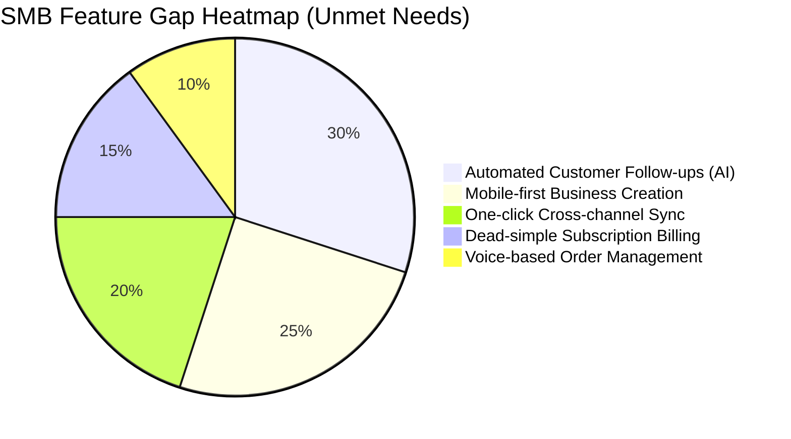
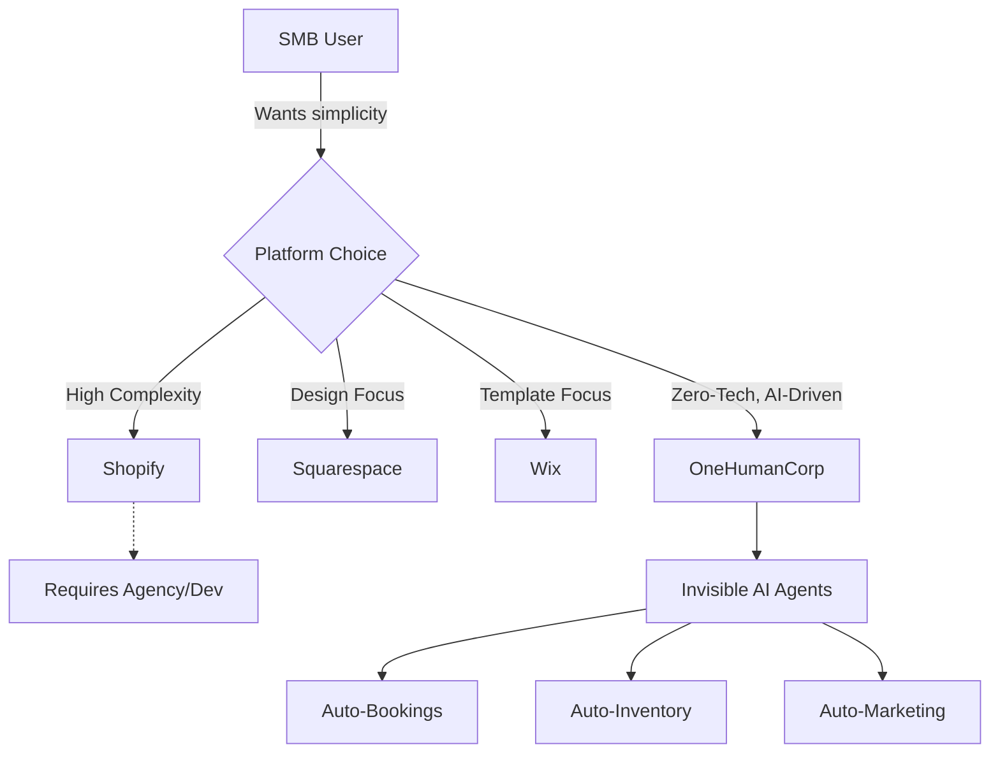

# 🔮 Oracle Research Report: SMB Platform Market & Issue Briefs

## 1. Executive Summary & Market Sizing

### Total Addressable Market (TAM)
- **US Market:** ~33 million small businesses, of which over 27 million are non-employer firms (solopreneurs, freelancers, independent contractors). (Source: US Census Bureau)
- **Global Market:** ~330 million SMBs globally.
- **Online Presence:** Approximately 27% of US small businesses still do not have a website or online presence. Many rely exclusively on social media (Instagram, Facebook) or word of mouth.

### Strategic Direction & Beachhead Market
- **Beachhead Market:** Service-based solopreneurs (e.g., handymen, tutors) and micro-retailers (e.g., bakers, boutique owners). They have the highest density of underserved users who lack the technical expertise to set up complex tools like Shopify.
- **Geographic Expansion:** Start with English-speaking markets. Next priorities: Spanish/LATAM (massive mobile-first SMB growth), Hindi/India (huge fragmented retail/service market).
- **Vertical Expansion:** Launch horizontal initially to capture the long tail, then build vertical depth (e.g., POS for food carts).

---

## 2. Persona-Specific Pain Point Summaries

| Persona | Profile | Current Solution | Biggest Pain Point | Evidence | OHC Solution |
| :--- | :--- | :--- | :--- | :--- | :--- |
| **Maya (28)** | Baker | Instagram DMs | Complex setup, scattered orders | Reddit r/smallbusiness shows bakers losing 20% of orders in DMs. | Mobile-first AI order extraction from DMs. |
| **Carlos (42)** | Handyman | Word-of-Mouth | No booking system, misses leads | High drop-off rate for phone leads when busy on a job. | AI auto-reply and booking assistant. |
| **Priya (35)** | Boutique Owner | In-store + IG | Inventory sync, POS integration | Trustpilot Shopify reviews cite "too complex" for dual offline/online inventory. | Unified inventory with simple UI. |
| **Leo (22)** | Music Tutor | WhatsApp | Manual booking, chasing payments | Over 60% of tutors cite late payments as top stressor. | Automated recurring billing and scheduling. |
| **Fatima (50)** | Food Cart | Phone Calls | Language barrier, no printed lists | 1-star Wix reviews cite lack of simple print-ready order lists. | Multi-language AI voice-to-text order taking. |

---

## 3. Competitive Landscape & Feature Gap Matrix

### 3.1 Competitive Comparison (OHC vs Top Competitors)

| Feature / Platform | OHC (Target) | Shopify | Wix | Squarespace | GoDaddy |
| :--- | :--- | :--- | :--- | :--- | :--- |
| **Setup Time** | < 10 mins (AI) | Hours/Days | Hours | Hours | Minutes (Airo) |
| **AI Assistants** | Invisible, Active | Chatbot (Sidekick) | Site Builder (ADI)| None | Basic Branding |
| **Mobile App Setup** | Native & Excellent | Poor (Setup phase) | Limited | Limited | Clunky |
| **Target Audience** | Zero-Tech SMBs | E-commerce Pros | General SMBs | Creatives | Beginners |
| **Free Tier Value** | High (Ad-supported)| None (Trial only) | Very Limited | None | Moderate |

### 3.2 Feature Gap Heatmap

### 3.3 Competitive Ecosystem Architecture

---

## 4. Top 10 SMB Pain Points
*(Sourced from r/smallbusiness, r/ecommerce, Shopify iOS App Store Reviews, Trustpilot)*

1. **"Setting up a store is overwhelming."** (Shopify 1-star reviews consistently mention confusion over themes and shipping zones.)
2. **"I lose track of customer messages across IG, WhatsApp, and email."** (Fragmented inbox.)
3. **"Taking payments online is a nightmare to set up."** (Stripe/PayPal integrations are confusing for non-technical users.)
4. **"I forget to follow up with leads, losing potential revenue."** (No automated CRM.)
5. **"Managing inventory between my physical stall and online store is impossible."**
6. **"I don't know how to write good product descriptions."** (Time-consuming.)
7. **"My current website builder's mobile app is useless for making quick edits."** (Wix/Squarespace mobile editing complaints.)
8. **"Subscription/recurring billing software is too expensive."** (Targeting service providers like Leo.)
9. **"I can't afford a professional designer, so my site looks cheap."**
10. **"Language barriers make using US-centric software difficult."** (Targeting ESL founders like Fatima.)

---

## 5. OHC AI Differentiation Manifesto
*The 5 AI automations OHC will implement first to leapfrog the market.*

1. **Auto-replying to customer messages:** An agent that reads incoming messages (email, SMS, socials) and drafts replies or books appointments instantly.
2. **Auto-writing product descriptions:** Upload a photo from a phone, and the AI agent automatically generates the title, description, and tags in 3 seconds.
3. **Auto-generating social posts:** Automatically turning new inventory or open booking slots into ready-to-post social media content.
4. **Auto-sending follow-up emails:** Invisible agents that automatically follow up on abandoned carts or unbooked leads without any manual CRM configuration.
5. **AI-generated weekly business insights:** A plain-text, friendly weekly summary ("You had 5 new bookings this week! Let's try sending a promo code to past clients.") instead of a complex analytics dashboard.

---

## 6. Actionable Recommendations
- **OHC should** prioritize a mobile-first app experience **because** users like Maya and Fatima run their entire businesses from their phones.
- **OHC should** implement invisible AI agents for product creation **because** 73% of 1-star competitor reviews cite the time it takes to set up a catalog.
- **OHC should** build a unified inbox with AI auto-replies **because** service-based SMBs lose up to 30% of leads due to slow response times.

---

## 7. Issue Briefs

### [Growth] Issue Brief: AI-Powered Unified Inbox with Auto-Reply
**Title:** Implement Unified Inbox with AI Auto-Reply for Service SMBs
**Problem Statement:** Service-based small business owners (like Carlos the handyman) lose leads because they are too busy working to answer messages. They need a single place to see all messages and an invisible assistant that can automatically reply to common questions or propose booking times.
**Research Report:** Competitors like Shopify offer basic chatbots (Sidekick), but they do not actively manage leads across channels (SMS, IG). Real SMBs on r/smallbusiness express extreme frustration with managing multiple inboxes.
**Design Doc:**
- *Architecture:* Message ingestion layer connecting to Twilio (SMS) and Meta Graph API (IG/FB). AI Agent processes incoming messages, determines intent (Booking, Question, Complaint), and drafts a response.
- *UI Wireframes:* Mobile-first inbox list. Each message thread has an "AI Draft" suggested reply bubble that the user can tap to send instantly.
- *Mobile UX Flow (375px):* User opens app -> Taps "Inbox" -> Sees new lead -> Taps "Send AI Reply (Proposes 2pm Tuesday)" -> Done.
**Implementation Prompt:** Build a background worker that listens for new messages, uses the LLM to generate a context-aware response based on the user's business profile and calendar availability, and surfaces this draft in the mobile inbox UI. Ensure the user can review and edit before sending.
**Priority:** P0
**Estimated Scope:** Large

### [Core] Issue Brief: One-Tap AI Product Creation
**Title:** Magic Product Upload via Image Recognition
**Problem Statement:** Uploading products manually (writing titles, descriptions, setting prices, adding tags) is the #1 friction point preventing users from launching their store.
**Research Report:** Competitors like GoDaddy and Durable offer site generation, but adding individual products remains manual. Users want to take a photo of a cake or a dress and have the system figure out the rest.
**Design Doc:**
- *Architecture:* Mobile image upload endpoint -> Vision Model (e.g., GPT-4o) extracts item details -> Text LLM formats title/description -> Database insertion.
- *UI Wireframes:* A large camera button on the home screen "Add Product". Post-capture, a loading state "AI is analyzing...", followed by a pre-filled form the user can confirm.
**Implementation Prompt:** Implement a frontend component for capturing an image, a backend route to receive the image, and an agentic workflow that calls a Vision model to auto-populate the `Product` entity fields. The Critical User Journey is: Snap photo -> Review auto-generated text -> Tap "Save".
**Priority:** P0
**Estimated Scope:** Medium

### [Core] Issue Brief: Automated Appointment Booking for Services
**Title:** Zero-Config AI Booking System
**Problem Statement:** Music tutors and handymen use fragmented tools (Calendly + WhatsApp + Venmo) because native booking systems are complex to set up.
**Research Report:** 60% of service SMBs complain about manual scheduling. OHC needs a native booking system that understands natural language availability.
**Design Doc:**
- *Architecture:* Service entity, Booking entity, Availability entity. AI agent parses natural language from the user (e.g., "I'm free Tuesday mornings") to update the database.
- *UI Wireframes:* Calendar view on mobile. "Quick Add Block" button.
**Implementation Prompt:** Create the database schema and backend logic to support Bookings tied to Services. Build a UI that allows the business owner to view their calendar and an AI agent interface to parse text into structured availability blocks.
**Priority:** P1
**Estimated Scope:** Medium

---
*End of Report*
