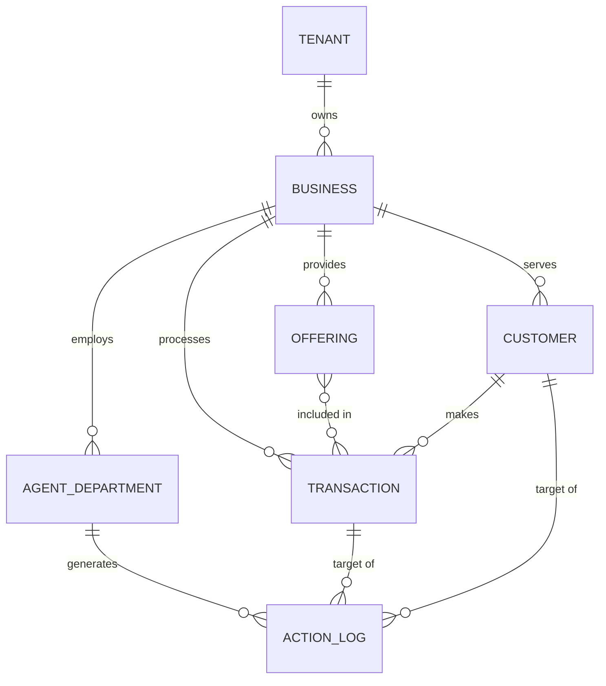

# [architecture] Data Model Evolution

## Title: Evolve OHC Data Model for Multi-Tenancy and AI Agent Access Patterns

## Problem Statement
Small business owners like Maya (baker) and Carlos (handyman) shouldn't have to manage separate systems for selling physical items, booking appointments, and offering digital downloads. They just want to list what they offer and start taking money. Currently, if Carlos wants to sell a physical product alongside his service, the system feels disjointed. Furthermore, the AI assistants working in the background need to safely look at and update all these different types of sales without accidentally crossing wires between different businesses. The data model needs to be simple enough for non-technical users to grasp conceptually but flexible enough to support all business types seamlessly.

## Research Report
*   **Competitor Analysis**:
    *   **Shopify**: Strong product/variant model, but struggles with service/booking integration without complex third-party apps.
    *   **Wix/Squarespace**: Good general-purpose models, but the UI exposes too much complexity to the user (e.g., managing separate databases for products and bookings).
    *   **GoDaddy**: Simple onboarding, but rigid data structures limit growth.
*   **OHC Needs**: A unified entity model. A "Business" has "Offerings" (which can be products, services, digital goods). "Offerings" have "Transactions" (orders, bookings, subscriptions). AI Agents need secure, scoped access to these entities to perform actions like "refund this order" or "update this booking".

## Design Doc

### Architecture Diagram

### Key Invariants
1.  **Strict Multi-Tenancy**: Every entity must have a `tenant_id` (or `business_id` linking back to the tenant). All queries must include this ID to prevent cross-tenant data leakage.
2.  **Agent Access Scopes**: AI Agent Departments (e.g., "Operations", "Sales") operate within specific access scopes. "Operations" can read/write Transactions, but only read Customers. "Finance" can read Transactions and write Invoices.
3.  **Unified Offerings**: Products, services, and digital goods are all "Offerings" with different metadata (e.g., a physical product has `inventory_count`, a service has `duration` and `availability_schedule`).

### Mobile UX Flow
*   **Adding an Offering**: User opens app -> Taps "Add" -> Selects type (Product, Service, Food) -> UI dynamically adjusts fields based on type -> Saves. The complexity of different data models is hidden; the user just sees a simple form.
*   **AI Agent View**: User opens "Manager" tab -> Sees a natural language feed of actions ("I refunded order #123 because the customer requested it"). The complex data joins required to generate this feed are handled invisibly.

### Migration Strategy
1.  **Phase 1 (Shadow Schema)**: Introduce the new "Offering" and "Transaction" tables alongside the existing legacy tables. Implement dual-writes for new entities.
2.  **Phase 2 (Backfill)**: Run a background migration job to transform and backfill existing products, bookings, and digital goods into the new "Offering" schema.
3.  **Phase 3 (Read Switchover)**: Switch read operations to query the new unified schema instead of legacy tables, utilizing feature flags.
4.  **Phase 4 (Cleanup)**: Remove the legacy tables after observing system stability for an adequate period.

## Implementation Prompt
**For Implementer Agent:**
Implement a unified "Offering" and "Transaction" system that natively supports products, services, and digital goods. The outcome should be that a small business owner can effortlessly create both a physical item and a bookable service from the same mobile UI, without realizing they share a data structure.

**Critical User Journey (CUJ):**
A user (like Maya, a baker) navigates to "Add Item", creates a Custom Cake (Service - requires booking/deposit), then immediately creates a Cookie Box (Physical Product - requires shipping/inventory). She then views her dashboard where both items sit naturally side-by-side.

**Acceptance Criteria:**
*   Database schema supports creating physical products, bookable services, and digital downloads in a unified way.
*   Multi-tenant isolation is enforced at the query level for all operations.
*   AI Agent access scopes can be defined and enforced for read/write on these entities.
*   The system can cleanly differentiate offering types without exposing schema complexity to the frontend.

## Priority
P0

## Estimated Scope
Large
