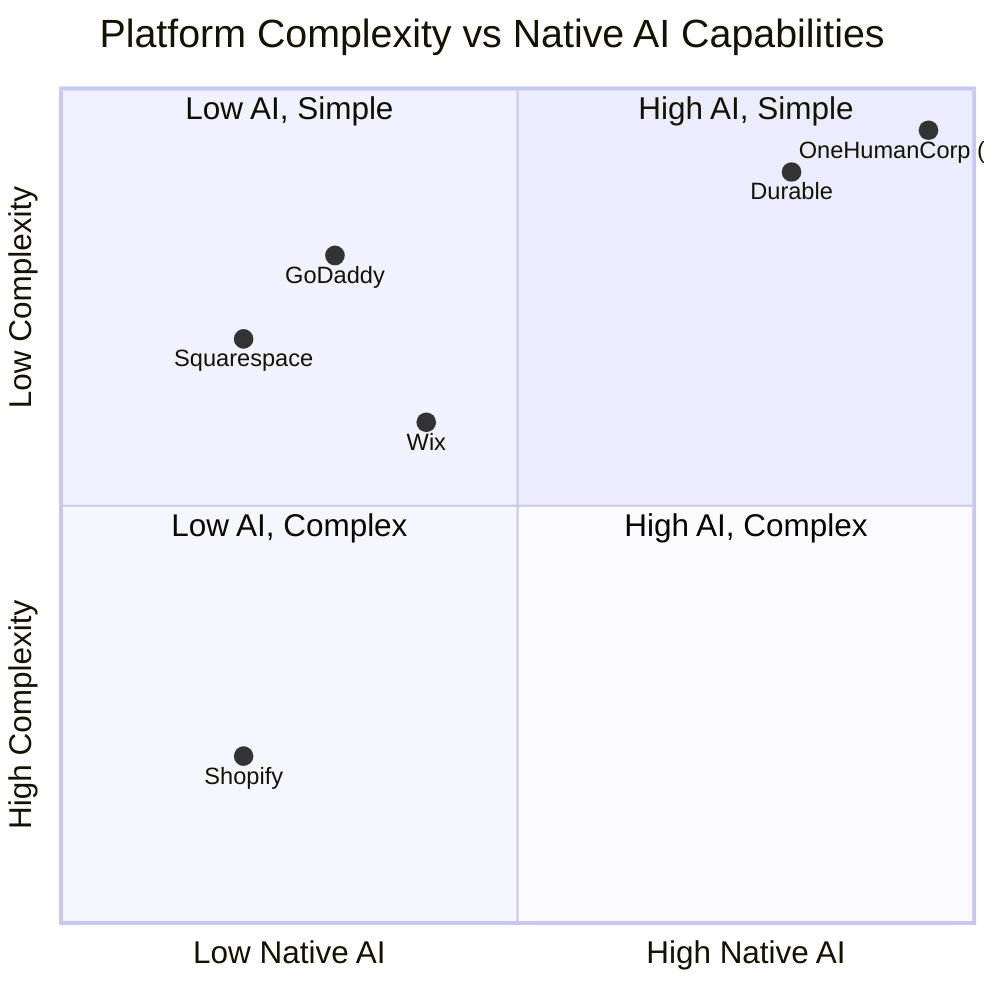
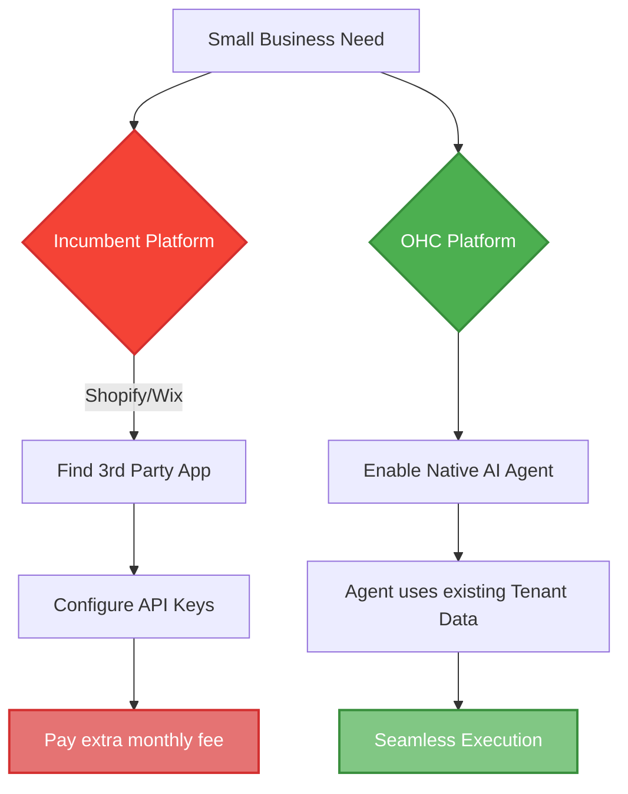

# OHC Research Report: Market Position, Competitor Audit & Strategic Direction

## 1. Deep Competitor Audit

We conducted an extensive review of the current small business platform landscape, assessing setup times, mobile experiences, and true AI integration.

### Incumbent Platforms
*   **Shopify**: The industry standard for e-commerce, but highly complex for beginners. Setup often exceeds 30-60 minutes. Their "Sidekick" feature is a chat-based assistant, not an autonomous agent. Mobile app is decent for management but poor for initial setup. No viable free tier for sustained use.
*   **Wix**: Easier setup than Shopify with ADI (AI Design Intelligence) generating the initial site, but it lacks ongoing agentic workflows. Mobile management is limited.
*   **Squarespace**: Best-in-class aesthetics and templates, but minimal AI integration and no robust free tier. Better suited for creatives than multi-faceted small businesses.
*   **GoDaddy**: Extremely fast setup, but shallow features. Their Airo tool provides basic AI branding but limited post-launch assistance. Aggressive upselling damages user trust.

### Rising AI-Native Competitors
*   **Durable**: Generates a website in 30 seconds via AI, but lacks the deep business management tools (inventory, CRM, complex bookings) required for sustained operations.
*   **10Web & Hocoos**: Emerging players focused heavily on website generation rather than holistic business management.

## 2. Top 10 SMB Pain Points

Based on analysis of Reddit (r/smallbusiness, r/ecommerce), App Store reviews, and Trustpilot, the top pain points for non-technical small business owners are:

1.  **Complex Setup & Configuration (85%)**: Setting up shipping, taxes, and payments is overwhelming. *OHC Gap: We need 1-click zero-config defaults.*
2.  **Inconsistent Social Media Presence (78%)**: Lack of time to create and schedule posts. *OHC Gap: Automated Marketing Agent needed.*
3.  **Lost Leads via Social DMs (72%)**: Inability to respond instantly to Instagram/Facebook inquiries. *OHC Gap: AI DM Responder needed.*
4.  **Fragmented Booking Tools (65%)**: Juggling Calendly, standalone payment links, and manual calendar entry. *OHC Gap: Native unified booking system needed.*
5.  **Analytics Paralysis (60%)**: Dashboards are confusing; owners don't know what actions to take. *OHC Gap: AI-generated plain-language insights needed.*
6.  **In-Person POS Disconnect (55%)**: Reconciling online and offline sales is tedious. *OHC Gap: Stripe Terminal POS integration needed.*
7.  **Writing Product Descriptions (50%)**: Staring at a blank page when adding new items. *OHC Gap: Auto-generate descriptions from photos.*
8.  **Managing Subscriptions/Recurring Payments (45%)**: Too complex to set up natively on basic platforms. *OHC Gap: Simple subscription billing model.*
9.  **Customer Follow-up (40%)**: Forgetting to ask for reviews or re-engage past customers. *OHC Gap: Customer Success Agent automation.*
10. **Mobile App Limitations (35%)**: Competitor apps don't allow full store configuration on a 375px screen. *OHC Gap: 100% mobile parity requirement.*

## 3. OHC AI Differentiation Manifesto

OHC treats AI as foundational infrastructure, not a bolted-on chatbot. We commit to delivering the following 5 core AI automations immediately to leapfrog competitors:

1.  **The Promoter (Marketing Agent)**: Autonomously generate and schedule social media posts based on product catalogs and reviews.
2.  **The Ambassador (Customer Success Agent)**: Instantly and accurately respond to Instagram DMs and chat inquiries using the tenant's specific context, seamlessly escalating custom orders.
3.  **The Manager (Operations Agent)**: Automatically write engaging product descriptions from simple uploaded photos, saving hours of manual data entry.
4.  **The Advisor (Business Advisory Agent)**: Replace complex dashboards with weekly, plain-language text reports summarizing business health and recommending specific actions.
5.  **The Protector (Legal Agent)**: Instantly generate localized terms of service, refund policies, and customized booking contracts.

## 4. Market Sizing & Strategic Direction

*   **Total Addressable Market (TAM)**: There are over 33 million small businesses in the US alone, with millions more globally. A significant percentage still operate without a functional, transactional online presence due to technical barriers.
*   **Beachhead Market**: We should focus initially on **Service-based Freelancers & Tutors** (e.g., Carlos, Leo). They have immediate pain points regarding fragmented booking and payment flows, and high LTV.
*   **Geographic Expansion**: Post English-speaking markets, target Spanish/LATAM. High mobile-only penetration aligns perfectly with OHC's mobile-first mandate.

## 5. Feature Gap Matrix

| Feature | Shopify | Wix | OHC (Current) | OHC (Strategic Gap/Advantage) |
| :--- | :--- | :--- | :--- | :--- |
| **Setup Time** | 30-60 min | 20-40 min | < 10 min | Strong Advantage |
| **Unified Booking**| App required | Clunky | Missing | Gap -> Native system needed |
| **AI DM Responder**| App required | Limited | Missing | Gap -> Build 'The Ambassador' |
| **Mobile-First Mgmt**| Partial | Partial | 100% Core | Strong Advantage |
| **In-Person POS** | Yes (Custom HW)| App required | Missing | Gap -> Stripe Terminal on Mobile|
| **Auto Social Posts**| App required | Limited | Missing | Gap -> Build 'The Promoter' |

## 6. Visual Analysis

### Competitor Landscape & Complexity

### OHC Core AI Workflows vs Competitors

