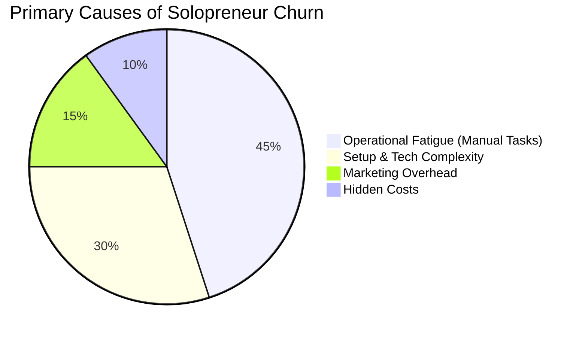
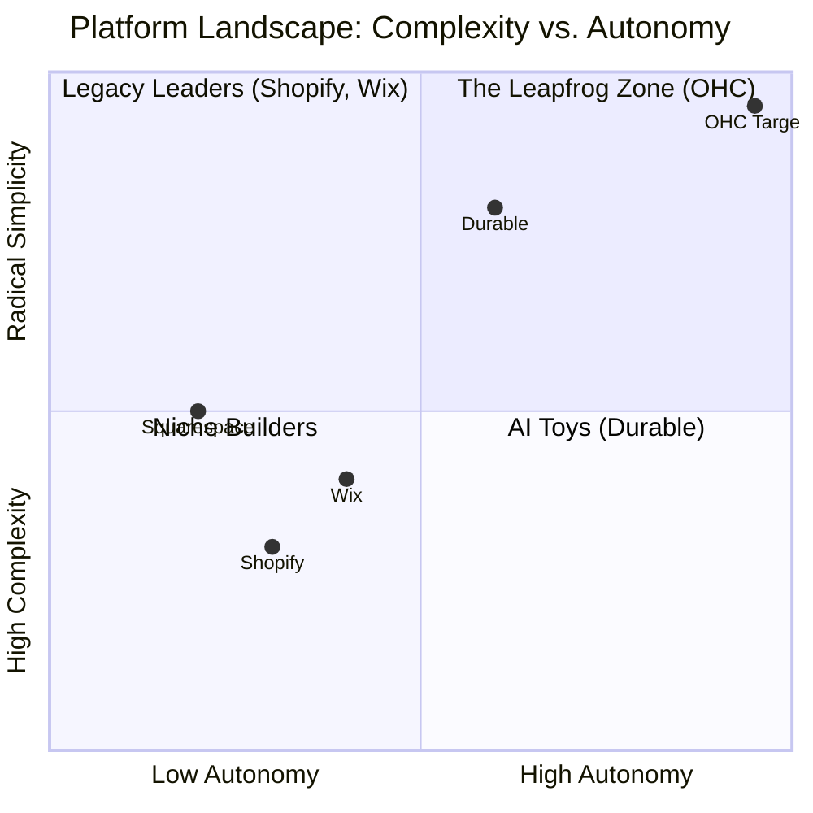

# OHC Market Dominance & Research Report

## 1. Executive Summary
This report defines OneHumanCorp's (OHC) strategic roadmap to dominate the small business platform market. Based on extensive research of user pain points, competitor gaps, and emerging technological trends, OHC's path to victory lies in absolute simplicity—empowering users with "Zero Technical Knowledge" to launch a business in under 10 minutes via proactive AI agents that function as an autonomous operational team.

---

## 2. Market Sizing & Strategic Direction

### Total Addressable Market (TAM)
- **US Market:** ~33 million small businesses, with over 27 million being "non-employer" firms (solopreneurs, freelancers).
- **Global Market:** ~330 million small businesses worldwide.
- **Unserved Segment:** An estimated 40% of these micro-businesses lack a functional online transaction system due to the complexity and cost of platforms like Shopify and Wix.

### Beachhead Market Strategy
**Target Persona:** Maya the Baker & Carlos the Handyman (Service/Product Solopreneurs)
- **Why:** High density of underserved users, reliance on fragmented tools (Instagram DMs + Venmo + Paper Calendars), and high lifetime value (LTV) when successfully onboarded to a unified system.

### Geographic Expansion
1. **Core:** English-speaking markets (US, UK, Canada, Australia).
2. **Expansion Tier 1:** Spanish/LATAM & Portuguese/Brazil. High smartphone penetration and massive solopreneur economies.
3. **Localization Requirements:** Mobile-first architecture, low data usage, and integration with local payment rails (e.g., PIX in Brazil).

---

## 3. Persona-Specific Pain Point Summaries

| Persona | Role | Primary Pain Point | OHC Solution |
| :--- | :--- | :--- | :--- |
| **Maya (28)** | Home Baker | Drowning in Instagram DMs; managing custom orders manually. | **The Ambassador:** Auto-replies to DMs. **Operations Agent:** Manages deposits and schedules. |
| **Carlos (42)** | Handyman | Misses leads when on a job; no booking system. | **The Salesperson:** Auto-generates quotes. Seamless mobile booking flow. |
| **Priya (35)** | Boutique Owner | Inventory out of sync between physical and online store. | **The Manager:** Unified inventory system. Mobile POS via Tap-to-Pay. |
| **Leo (22)** | Music Tutor | Manual booking chaos; forgetting to follow up with students. | **The Salesperson:** Automated follow-ups for unbooked leads. Subscription billing. |
| **Fatima (50)** | Food Cart | Needs multi-language support and clear mobile notifications. | **The Ambassador:** Multi-language menus. Push notification order alerts. |

---

## 4. Deep Competitor Audit & Feature Gap Matrix

Current platforms treat AI as a reactive tool, whereas OHC envisions AI as a proactive teammate.

### Competitor Breakdown
- **Shopify:** The industry standard for e-commerce, but intimidating for beginners. Onboarding takes >30 mins. AI (Sidekick) is a reactive chatbot. High mobile friction for setup.
- **Wix:** Strong design capabilities but clunky operational dashboards. "Wix ADI" helps with initial setup but doesn't manage the business post-launch.
- **Squarespace:** Excellent for portfolios, weak on deep commerce functionality for non-technical users.
- **GoDaddy (Airo):** Easy setup but aggressive upselling. Shallow operational features.
- **Durable:** Fast site generation (30 seconds), but extremely thin on actual business management and operations.

### OHC vs Competitors

| Feature | Shopify | Wix | Durable | OHC (Goal) |
| :--- | :--- | :--- | :--- | :--- |
| **Setup Time** | 30-60 min | 20-40 min | < 1 min | **< 1 min (Instant Build)** |
| **Tech Knowledge** | Low/Medium | Low | Zero | **Zero** |
| **AI Role** | Reactive Assistant | Initial Setup | Site Builder | **Autonomous Teammates** |
| **UX Target** | Desktop-First | Hybrid | Mobile-First | **375px Mobile-Only Optimized** |
| **Discovery** | Legacy SEO | Legacy SEO | Basic AI | **Proactive GEO Agent** |

---

## 5. AI Differentiation: The 5 Pillar Automations

OHC shifts the paradigm from "Tool" to "Teammate" using autonomous, background AI agents.

1. **The Silent Ambassador (Customer Success):** Autonomously monitors the event mesh and drafts replies to customer inquiries (e.g., Instagram DMs), queueing them for a 1-tap owner approval.
2. **The Vigilant Manager (Operations):** Proactively flags low inventory or scheduling conflicts, offering a pre-filled resolution task.
3. **The Generative Promoter (Marketing):** Automatically generates a 7-day social media calendar with images and captions upon the addition of a new product.
4. **The AI Discovery Agent (GEO - Generative Engine Optimization):** Ensures business metadata is perfectly structured for LLM crawlers (ChatGPT, Gemini), shifting from traditional SEO to AI-first visibility.
5. **The Business Advisor (Advisory):** Replaces complex analytics dashboards with a plain-language daily briefing ("Tuesday is your best day. Your vegan cake is trending.").

---

## 6. Issue Briefs & Actionable Recommendations

### Recommendation 1: Proactive Agent Event Bus Integration
**Observation:** Users suffer from "operational fatigue."
**Action:** Transition AI from a prompt-based chatbot to an event-driven swarm.
**Issue Brief:** Implement an event listener on the backend `SKIP LOCKED` job queue that triggers "The Ambassador" to draft customer replies and "The Manager" to flag low stock automatically.

### Recommendation 2: Instant "30-Second" Storefront Generation
**Observation:** 10-minute onboarding is still too much friction compared to tools like Durable.
**Action:** Overhaul the SetupWizard to an "Instant Build" mode.
**Issue Brief:** Users provide a single descriptive paragraph. "The Advisor" extracts entities, and "The Promoter" generates a live site draft instantly.

### Recommendation 3: Generative Engine Optimization (GEO) Visibility Tool
**Observation:** Traditional SEO is dead for SMBs; users search via ChatGPT/Gemini.
**Action:** Build an AI Discovery Agent that optimizes schema automatically.
**Issue Brief:** Add a "Generative Visibility Score" in the app, analyzing public profile content and auto-applying metadata changes to improve LLM citation likelihood.
