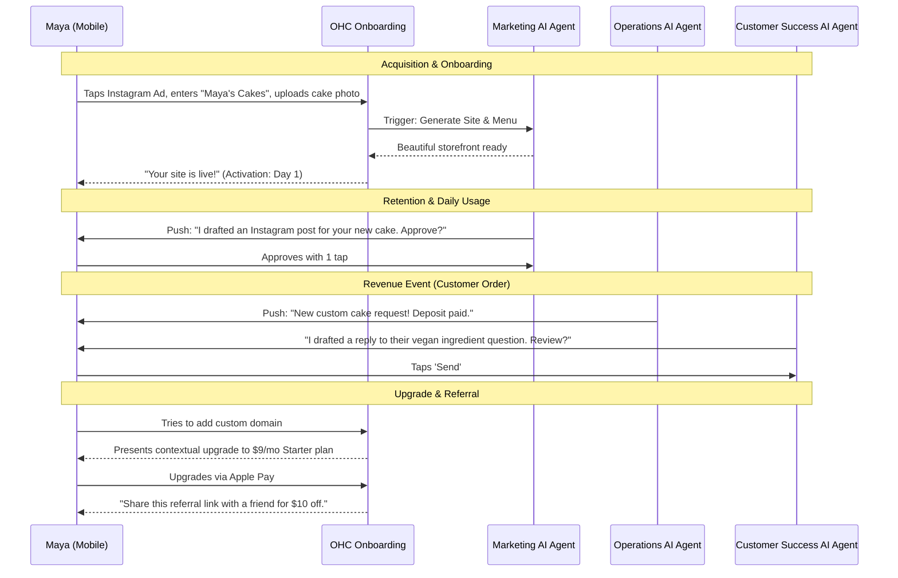
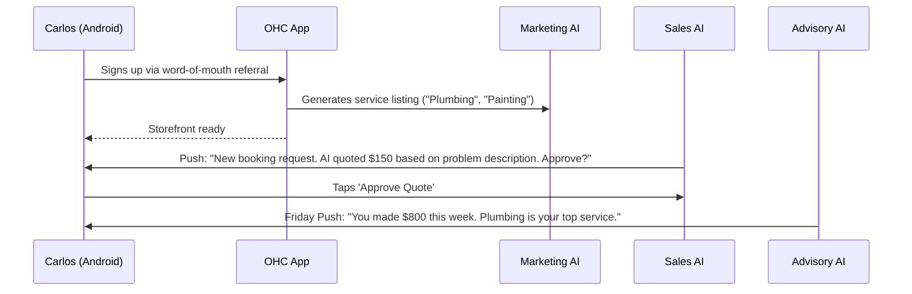
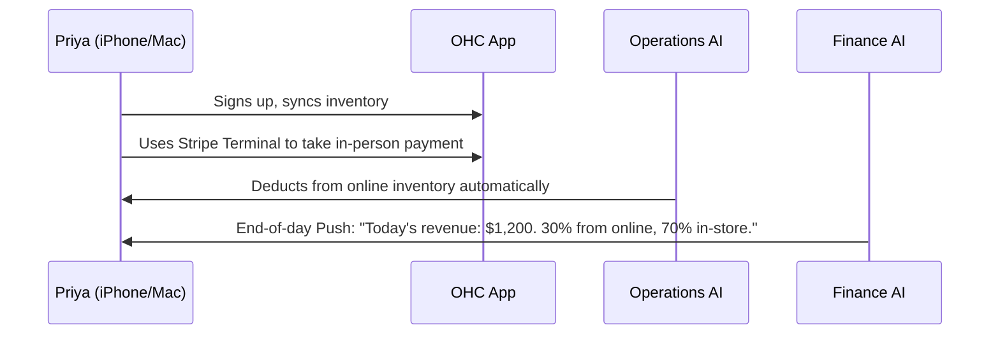
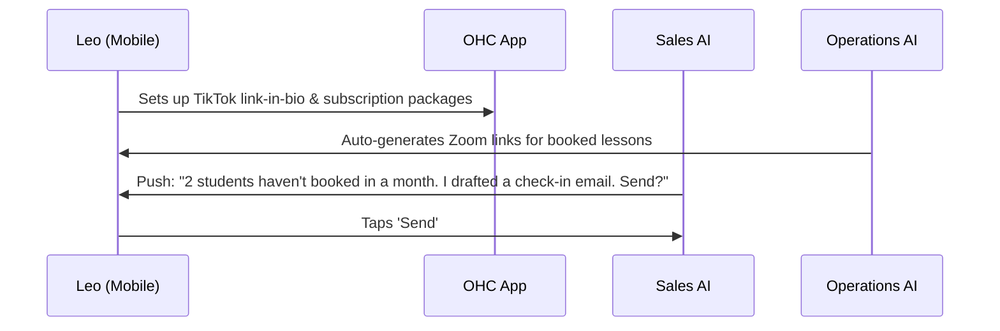
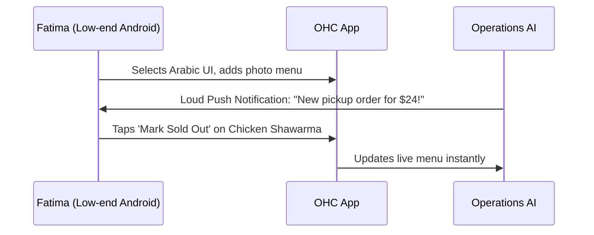

# [business] Issue Brief: Business Journey Architecture - End-to-End Persona Lifecycle

## Title
Implement the End-to-End Mobile-First User Journey Workflows for Non-Technical Founders

## Problem Statement
Small business owners—from bakers to freelance handymen to food cart operators—are overwhelmed by existing platforms like Shopify, Wix, and Squarespace. These tools are built for semi-technical users, feature complex desktop-first interfaces, and require users to manually piece together storefronts, booking systems, and AI tools. For a non-technical user, setting up a business requires dozens of decisions before they even see value, leading to high abandonment rates during onboarding. Our non-technical personas (Maya, Carlos, Priya, Leo, Fatima) need a "grandmother-test-approved" journey that guides them from idea to live business in under 10 minutes from a 375px mobile screen, with AI doing all the heavy lifting invisibly.

## Research Report
### Competitive Analysis
| Platform | Setup Friction | Mobile-First Management | AI Integration | Verdict for Non-Tech Users |
|---|---|---|---|---|
| **Shopify** | High (complex taxonomy, themes) | Partial (companion app, not full parity) | Bolted-on chatbots | Too complex, intimidating. |
| **Wix / Squarespace** | Medium (desktop-centric dragging) | Poor (requires desktop for real design) | Template generators | Fails the mobile-only creation test. |
| **GoDaddy** | Low-Medium | Basic | Basic generative AI | Lacks booking & product depth. |
| **OHC (Proposed)** | **Zero (AI auto-generates)** | **100% Native (375px first)** | **Invisible Agent Departments** | **The only viable option for true beginners.** |

### Key Findings
1. **Time-to-Value is Critical:** Users abandon setup if they are forced to configure shipping zones, tax rates, and complex product variants before seeing their storefront. These must be deferred.
2. **Mobile is the Primary Workstation:** Maya and Carlos do not own laptops. The entire acquisition, onboarding, and retention loop must happen via SMS, Push, and a 375px touch interface.
3. **AI as an Invisible Co-Founder:** Instead of a chat window asking "How can I help?", AI should proactively generate the site, create the products from a photo, and draft social posts for 1-tap approval.

## Design Doc

### 1. Key Design Decisions
- **Progressive Profiling:** Minimum inputs required to go live: Name, Business Type, 1 Product/Service Photo. Everything else (taxes, custom domains) is deferred.
- **AI-Led Onboarding:** The "Marketing & Advertising" AI department designs the site in the background while the user uploads their first photo.
- **Granular Retention Loop:** Users are pulled back into the app via push notifications for tangible events (New Order, AI draft ready for review, Weekly Health Report).
- **Contextual Upgrades:** Upgrading to the Starter/Pro tier is prompted contextually (e.g., when a user tries to add their 101st product or link a custom domain), not aggressively during onboarding.

### 2. UI/UX Flow (375px Mobile First)
- **Acquisition (Instagram Ad) -> Landing Page:** A clean mobile page with a single CTA: "Start your business for free. Under 10 mins."
- **Onboarding Wizard (3 steps):**
  1. "What do you do?" (Grid of visual icons: Baker, Handyman, Boutique, etc.)
  2. "What's your business name?" (Text input)
  3. "Upload one photo of your work." (Native image picker) -> *Magic Loading Screen while AI builds the site.*
- **Activation:** "Your site is live! Here is your link. Tap here to set up how you get paid."
- **Retention Dashboard:** A single scrollable feed on mobile. Top card: "Pending Actions" (e.g., "Review draft reply to customer"). Middle card: "Today's Revenue." Bottom card: "AI Advisor Suggestion."

### 3. Architecture Diagrams (Mermaid.js)

#### Persona Journey: Maya (The Home Baker)

#### Persona Journey: Carlos (The Freelance Handyman)

#### Persona Journey: Priya (The Boutique Owner)

#### Persona Journey: Leo (The Music Tutor)

#### Persona Journey: Fatima (The Food Cart Operator)

## Implementation Prompt
**Task for Implementer Agent:**
Implement the mobile-first (375px) onboarding and daily dashboard flows mapped out in this design document.

1. **Onboarding Flow:** Create the 3-step progressive profiling wizard. Ensure native mobile inputs (image pickers, numeric keypads) are prioritized. Connect the final step to the AI Marketing department to trigger background site generation.
2. **Daily Dashboard:** Implement the Retention Dashboard with the specific card layout: "Pending AI Actions" at the top, "Revenue" in the middle, and "Advisory" at the bottom.
3. **Upgrade Path:** Implement the contextual upgrade modal triggered when users hit tier limits (e.g., custom domain linking). Use the OHC Premium Glassmorphism design tokens (`backdrop-filter: blur(20px) saturate(200%)`).

**Acceptance Criteria:**
- The onboarding flow must be completable in under 2 minutes (excluding background AI generation time).
- The UI must perfectly fit a 375px width without any horizontal scrolling.
- All "Approve AI Action" buttons must be a single tap and feature micro-animations.
- E2E tests must cover the complete onboarding and first-action approval path.

## Priority
**P0** (Critical path for user acquisition and activation).

## Estimated Scope
**Large** (Involves multiple UI screens, cross-department AI triggers, and strict mobile-first constraints).

