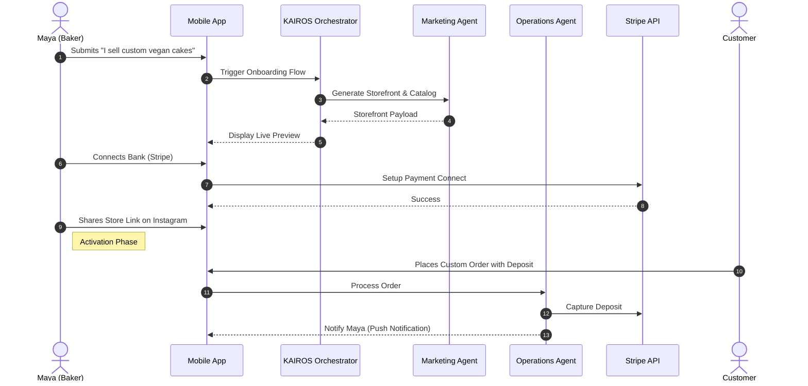
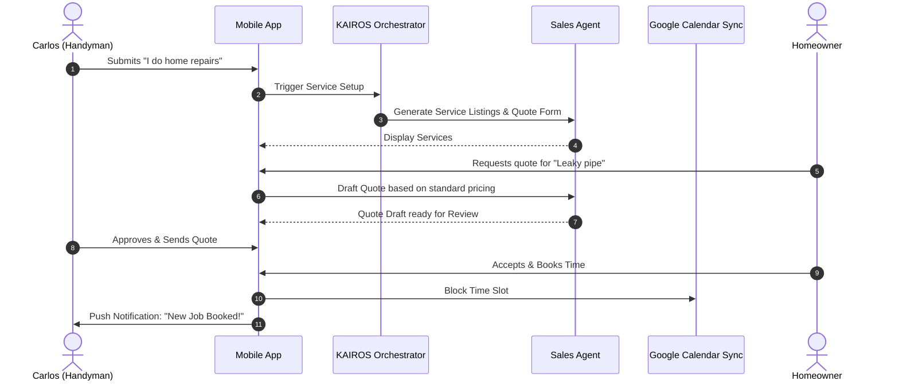
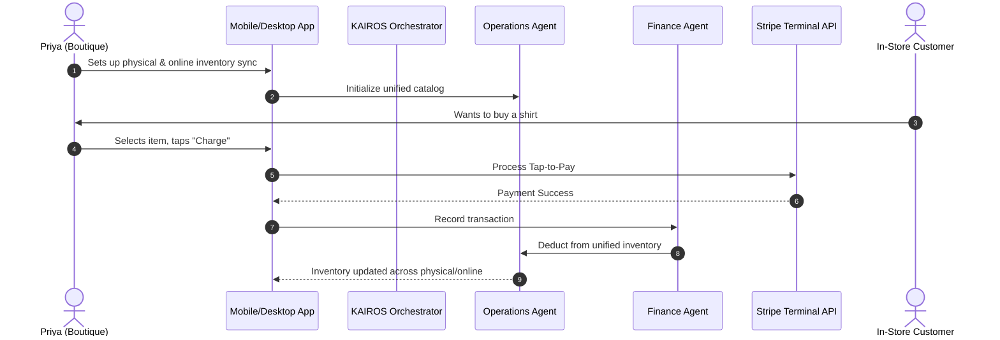
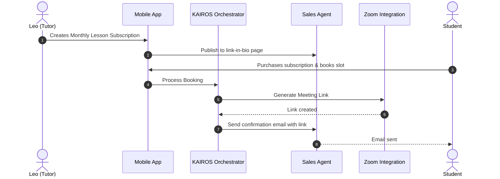
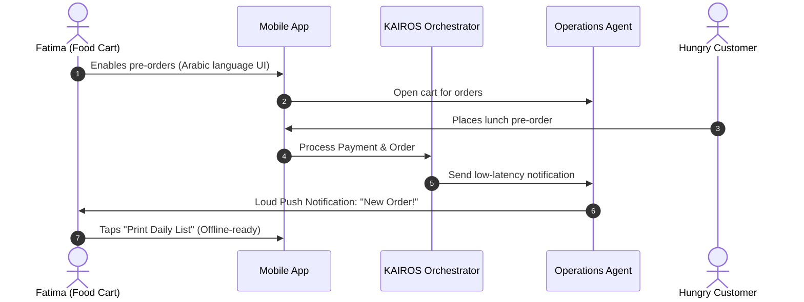

# [architecture] Business Journey Architecture

## Title
End-to-End Business Journey Architecture for OneHumanCorp

## Problem Statement
Small business owners—especially non-technical users like Maya, Carlos, Priya, Leo, and Fatima—struggle to transition from an idea or offline operation to a fully functional online presence. Existing tools are fragmented, overly complex, and assume desktop-first workflows with steep learning curves. We need a zero-friction, fully mobile-first business journey where AI agents invisibly handle onboarding, activation, retention, and growth, empowering any user to launch and run their business in under 10 minutes without writing code or learning jargon.

## Research Report
- **Competitive Landscape:** Platforms such as Shopify, Wix, and Squarespace generally require 30–60 minutes of setup time, rely heavily on desktop interfaces, and treat AI as a bolted-on chat assistant rather than core infrastructure.
- **Key Pain Points:**
  - **Onboarding Friction:** Overwhelming settings (DNS, SEO configurations, complex variant management).
  - **Platform Fragmentation:** Users must stitch together multiple services (e.g., Shopify for storefront, Calendly for booking, Instagram for DMs, Stripe for payments).
  - **Desktop Dependency:** Most platforms offer mobile apps for viewing orders, but require a desktop for initial setup or complex management.
- **Persona Analysis:**
  - **Maya (Baker):** Needs custom deposit orders and an agent to reply to Instagram DMs. Runs entirely on an iPhone.
  - **Carlos (Handyman):** Relies on service listings, quotes, and a booking calendar. Uses a mid-range Android device.
  - **Priya (Boutique):** Requires physical inventory sync with online sales, product variants, and POS tap-to-pay. Uses both mobile and desktop.
  - **Leo (Tutor):** Needs subscription packages, automated Zoom links, and a link-in-bio portfolio.
  - **Fatima (Food Cart):** Needs pre-orders, sold-out toggles, simple offline-ready lists, Arabic support, and runs on a low-end Android.

## Design Doc

### Journey Phases
- **Acquisition:** Users discover OHC via organic search, Instagram/TikTok link-in-bio, or QR codes at physical shops. The primary CTA is: *"Launch your business in 10 minutes from your phone."*
- **Onboarding:** A simple 3-step wizard flow asking only essential questions ("What's your business name?", "What do you sell?", "Connect your bank"). AI automatically generates the storefront, sample items, and policies.
- **Activation:** Success is defined by the user adding their first real product/service, sharing their link, and receiving their first order or deposit.
- **Retention:** AI agents keep the user engaged via push notifications ("You got a new order!", "Weekly summary: You made $500").
- **Revenue:** As users approach the Free tier limits (e.g., 10 products, 100 AI actions), the Business Advisory Agent triggers a contextual upgrade prompt: *"You're growing fast! Upgrade to Starter to add more products and unlock your custom domain."*
- **Referral:** A built-in viral loop prompting users to "Share a $10 credit with another business owner."

### Mobile UX Flow (375px baseline)
- **Screen 1 (Welcome):** Large touch targets (≥ 44x44px). "Let's build your business."
- **Screen 2 (Chat/Input):** Uses native mobile keyboards. "Tell me what you sell in one sentence."
- **Screen 3 (Generating):** Glassmorphism loading state while the Marketing Agent designs the site.
- **Screen 4 (Dashboard):** Clean bottom navigation (Home, Orders, AI Agents, Settings). "Home" features a prominent "Share Link" button and real-time revenue stats.

### AI Agent Integration Points
- **Marketing & Advertising:** Automatically builds the initial site and sets up SEO during onboarding.
- **Operations:** Monitors inventory, tracks bookings, and triggers notifications on sold-out items.
- **Customer Success:** Drafts replies to incoming customer inquiries and prepares post-purchase thank-you messages.
- **Business Advisory:** Generates and delivers weekly health reports to drive retention.

### Architecture Diagrams (Mermaid.js)

## Implementation Prompt
**For Implementer Agent:**
Implement the mobile-first Onboarding Wizard and the core Dashboard shell. The onboarding flow must consist of a conversational UI (3 steps max) where the user inputs their business name and type, which triggers the AI Marketing Agent to generate the initial storefront state. The dashboard must display a top-level overview (today's revenue, active orders) and integrate the standard bottom navigation.

**Acceptance Criteria:**
- The UI must render flawlessly on a 375px wide viewport without horizontal scrolling.
- Incorporate the OHC Premium Token library (Glassmorphism, Outfit/Inter typography, >44px touch targets).
- Ensure network resilience (graceful degradation or offline read-only mode if the connection drops).
- The system must correctly update and persist the user's "activation" state in the database once the first product is generated.

## Priority
P0

## Estimated Scope
Large

### Additional Persona Architecture Diagrams

