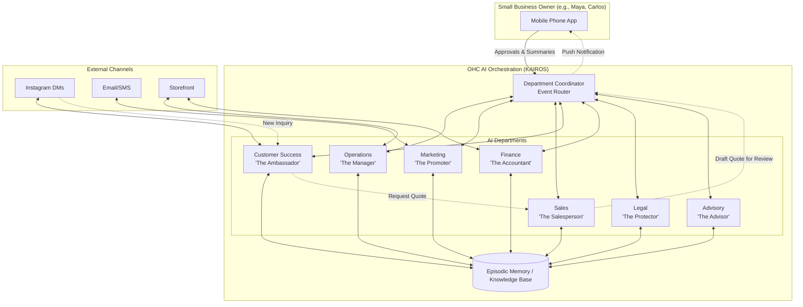

# 🔎 Oracle: AI Agent Department Architecture

## Title
AI Agent Department Architecture: Designing an Invisible AI Workforce for Small Business Owners

## Problem Statement
Small business owners—whether they are bakers like Maya or handymen like Carlos—need the power of advanced AI to run their operations, but they find technical jargon like "vector databases," "LLMs," and "agentic orchestration" intimidating and alienating. They are accustomed to dealing with people: a manager, a promoter, a salesperson. Currently, OneHumanCorp's platform provides an "agentic OS," but its interface exposes too much complexity. To achieve our vision of a "zero → live business in under 10 minutes" platform, we must abstract this complexity by organizing AI capabilities into intuitive, familiar "Departments."

Business owners need the platform to automatically handle operations, marketing, sales, customer success, finance, legal, and advisory roles—in the background, seamlessly coordinating, and communicating in plain language. They shouldn't configure "agents"; they should simply "hire a department."

## Research Report
### Market Needs & Persona Alignment
- **Maya (Baker):** Needs "The Manager" to handle Instagram DM inquiries ("do you do vegan cakes?") and "The Accountant" to collect deposits.
- **Carlos (Handyman):** Needs "The Salesperson" to generate quotes and "The Promoter" to send out service listings.
- **Priya (Boutique Owner):** Needs "The Manager" for inventory sync and "The Promoter" for email newsletters.
- **Leo (Music Tutor):** Needs "The Manager" for booking and "The Ambassador" to re-engage inactive students.
- **Fatima (Food Cart):** Needs "The Manager" for order notifications and "The Promoter" to blast out daily specials.

### Competitive Analysis
- **Shopify:** Offers strong e-commerce but limited built-in AI for service/booking businesses; requires technical third-party apps for marketing automation.
- **Wix/Squarespace:** Provides basic site-building AI, but no unified, autonomous back-office workforce.
- **GoDaddy:** Simple domain/site setup, but lacks sophisticated customer success and operations automation.
**OHC's Unfair Advantage:** By structuring AI as integrated business departments, OHC provides an entire back office out-of-the-box, without manual configuration or App Store integrations.

### Concept: The "Department" Abstraction
1. **Operations ("The Manager"):** Order/booking processing, inventory, fulfillment, refunds.
2. **Marketing & Advertising ("The Promoter"):** Website design, SEO, social media, promos.
3. **Sales & Acquisition ("The Salesperson"):** Quotes, lead follow-up, referrals.
4. **Customer Success ("The Ambassador"):** Message replies, order updates, review requests.
5. **Finance & Payments ("The Accountant"):** Payments, reporting, subscriptions.
6. **Legal & Compliance ("The Protector"):** Policies, GDPR, disclaimers.
7. **Business Advisory ("The Advisor"):** Health reports, next-action suggestions, trends.

## Design Doc

### Architecture Diagram (Mermaid.js)

### Key Design Decisions
1. **Event-Driven Coordination:** Departments do not work in silos. An event (e.g., "Order Completed" by Operations) triggers Customer Success to send a confirmation message, without manual setup.
2. **Plain Language Transparency:** The system will never say "Agent failed to execute context." It will say, "The Manager needs your approval on this refund."
3. **Draft-for-Review vs. Auto-Execute:** By default, critical actions (like refunds or sending quotes) are drafted for the business owner's approval (push notification on mobile). Low-risk actions (like answering FAQs) are auto-executed.
4. **Shared Context (Memory):** All departments share a unified episodic memory. The Promoter knows what The Manager sold yesterday, enabling perfectly targeted campaigns.
5. **Usage Throttling (Tenant Budgeting):** AI actions are pooled per tenant based on their tier (e.g., Starter tier gets 1,000 actions/mo), abstracted as "Work Capacity."

### UI Wireframes & Mobile UX Flow (375px baseline)
- **Home Screen ("The Desk"):**
  - A clean feed of pending approvals and insights.
  - Example card: **"The Salesperson drafted a quote for Carlos. [Review & Send]"**
- **Departments Screen ("The Team"):**
  - A grid of icons representing hired departments.
  - Tapping "The Manager" shows recent tasks: "Processed 5 orders, updated inventory."
  - Toggle switch for "Auto-Pilot" vs "Ask Me First".
- **Chat Interface:**
  - The primary interface for configuration. Instead of forms, the owner chats with "The Advisor": "I want to run a 20% sale on cakes this weekend." "The Advisor" then coordinates "The Promoter" and "The Manager" to execute.

## Implementation Prompt
**To the Implementer Swarm:**
Your task is to build the backend logic and the corresponding mobile-first UI components for the "AI Departments" abstraction.

**User Journey (CUJ):**
1. Maya (the baker) logs into the OHC mobile app.
2. She navigates to the "My Team" tab (Departments).
3. She taps on "Customer Success (The Ambassador)" and toggles it to "Active."
4. She connects her Instagram account.
5. The next time a customer DMs her asking about vegan cakes, "The Ambassador" automatically reads her catalog, sees she offers them, and replies with a friendly message and a booking link.
6. A summary of this interaction is added to Maya's daily digest.

**Acceptance Criteria:**
- Implement the "Department" selection UI (mobile-first, 375px) using the existing OHC design tokens (Outfit/Inter fonts, Glassmorphism).
- Ensure the language is 100% jargon-free (no mention of agents, prompts, or vectors). Use the "Grandmother Test."
- Create the background event routing that allows an incoming external message (e.g., via a simulated webhook) to be routed to the "Customer Success" department.
- Implement a "Draft for Review" mechanism where actions can be queued for manual user approval before execution.
- (Do not prescribe specific database tables, API endpoints, or AI models; focus on the business logic and UI layer).

## Priority
P0 (Critical to the core value proposition of simplifying AI for non-technical users).

## Estimated Scope
Large
