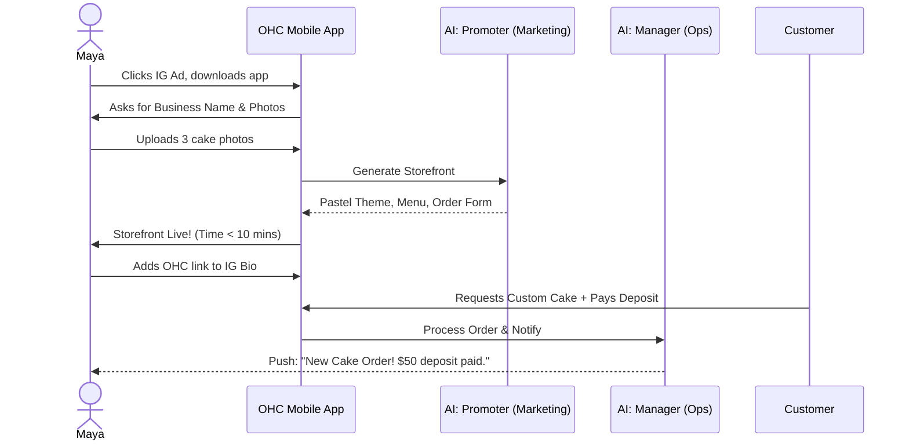
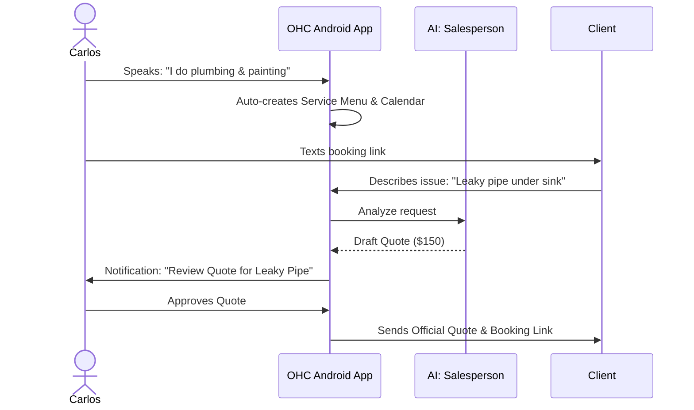
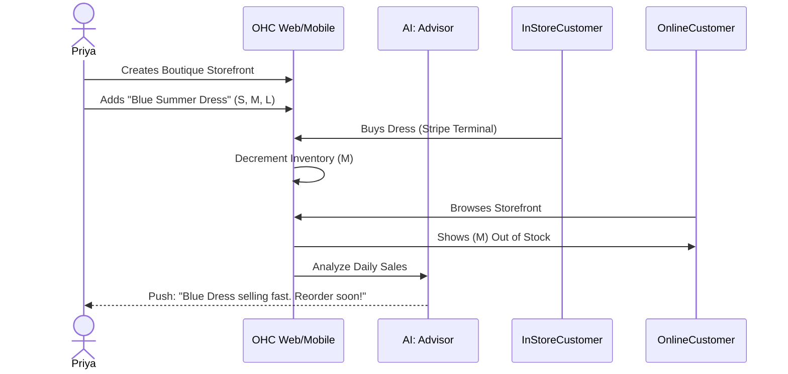
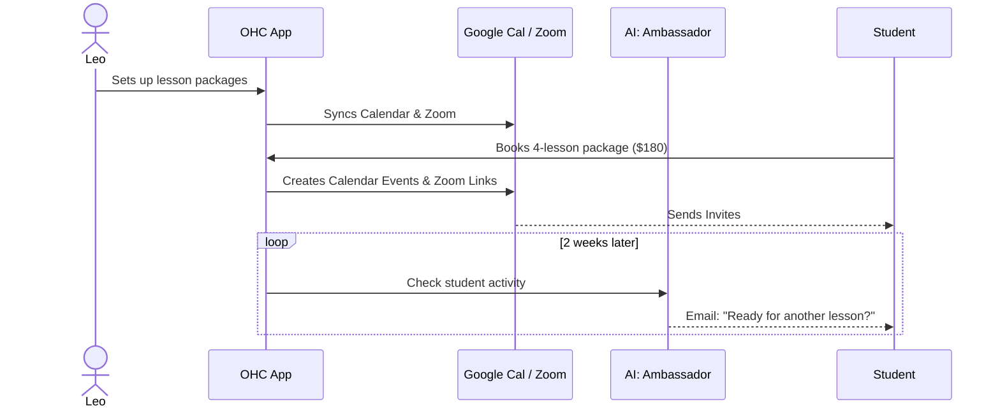
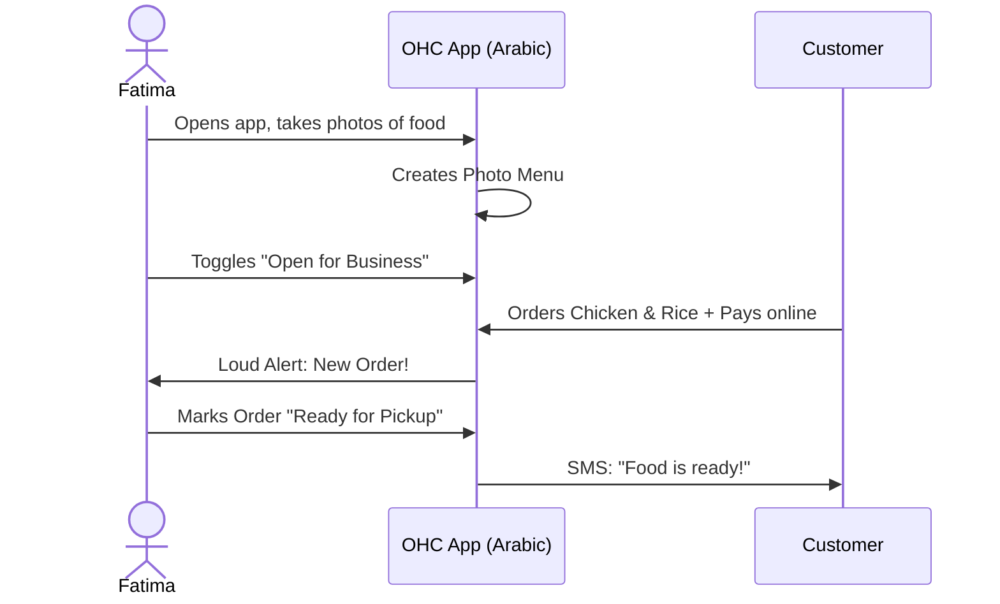

# Business Journey Architecture Report

## 1. Introduction
This document defines the complete end-to-end user journey for OneHumanCorp (OHC) from the perspective of non-technical small business owners. OHC enables a user to go from idea to live business in under 10 minutes via a mobile-first experience driven by AI agents.

## 2. Personas

- **Maya (The Home Baker, 28)**: Needs a mobile-only storefront, deposit-based orders, and IG DM automated replies.
- **Carlos (The Freelance Handyman, 42)**: Needs service listings, a booking system with deposits, and automated quote generation. Android mobile only.
- **Priya (The Boutique Owner, 35)**: Needs storefront + in-store POS integration, product variants, inventory sync, and daily analytics.
- **Leo (The Music Tutor, 22)**: Needs lesson booking via Google Calendar, Zoom link auto-generation, subscription billing, and a TikTok link-in-bio page.
- **Fatima (The Food Cart Operator, 50)**: Needs a photo menu, pre-orders, sold-out toggles, bilingual support (English/Arabic), and functionality on low-end devices.

## 3. End-to-End User Journeys

### 3.1 Maya - The Home Baker

**Acquisition:** Maya sees an Instagram Reel showing another baker using OHC to manage orders. She clicks the link-in-bio CTA "Start your bakery in 10 mins".
**Onboarding:** Maya opens OHC on her iPhone. She enters her business name "Maya's Cakes". The "Marketing" AI agent asks for 3 pictures of her cakes and auto-generates a storefront with a catalog, a pastel theme, and a custom order form.
**Activation:** Maya connects Stripe (guided flow) and receives her first test order. Success is publishing her storefront link to her IG bio.
**Retention:** Push notifications alert Maya of new custom order requests. The "Advisory" AI sends a weekly summary: "You made $400 this week. Want to add a Valentine's special?"
**Revenue:** After 10 free orders, Maya upgrades to the Starter plan ($9/mo) because she wants a custom domain (`mayascakes.com`).
**Referral:** Maya shares a referral link on a baker's Facebook group: "This app replaced Shopify for me."

#### Journey Sequence (Maya)

### 3.2 Carlos - The Freelance Handyman

**Acquisition:** Word-of-mouth. Another contractor shows Carlos the OHC app on a job site.
**Onboarding:** Carlos downloads the Android app. He speaks into the mic: "I do plumbing and painting." The AI generates service listings and a booking calendar.
**Activation:** Carlos sets his available hours and connects his bank. He sends his new OHC booking link to a past client.
**Retention:** Carlos checks the app daily to see his schedule. The "Sales" AI drafts quotes for new inquiries.
**Revenue:** Carlos upgrades to Pro ($29/mo) to unlock unlimited AI quote generation.
**Referral:** Carlos uses the "Refer a pro" button to invite his electrician friend.

#### Journey Sequence (Carlos)

### 3.3 Priya - The Boutique Owner

**Acquisition:** Priya searches Google for "Shopify alternative for small boutique". OHC SEO lands her on a comparison page.
**Onboarding:** Signs up on MacBook. Imports CSV of inventory or takes photos of tags. "Marketing" AI generates a premium black-and-white theme.
**Activation:** Configures variants (Size/Color). Orders Stripe Terminal for in-store checkout.
**Retention:** Daily mobile push: "Yesterday's Revenue: $1,200. Top item: Blue Summer Dress."
**Revenue:** Upgrades to Pro ($29/mo) for unlimited products and advanced analytics.
**Referral:** Invites her sister who runs a jewelry store.

#### Journey Sequence (Priya)

### 3.4 Leo - The Music Tutor

**Acquisition:** TikTok search for "how to sell lessons online".
**Onboarding:** Connects Google Calendar. Defines "$50/hr Guitar Lesson". OHC generates a link-in-bio page.
**Activation:** Syncs Zoom account. Success is the first booked lesson showing up in his calendar.
**Retention:** "Success" AI automatically emails students who haven't booked in 2 weeks.
**Revenue:** Uses Starter plan ($9/mo) to sell monthly lesson subscriptions.
**Referral:** Mentions OHC in his YouTube tutorial descriptions.

#### Journey Sequence (Leo)

### 3.5 Fatima - The Food Cart Operator

**Acquisition:** A local community organizer helps her set it up.
**Onboarding:** Opens app (Arabic language selected). Takes photos of her falafel and chicken over rice. App builds a visual menu.
**Activation:** Toggles "Open for Pre-orders". Receives her first notification: a loud *DING* on her phone.
**Retention:** She uses the "Print Daily Orders" feature at the start of every shift.
**Revenue:** Stays on the Free tier as she only lists 8 items. She is deeply loyal to the platform.
**Referral:** Tells the halal cart operator on the next block.

#### Journey Sequence (Fatima)

## 4. Friction Points & Mitigation (Non-Technical User Focus)

| Friction Point | Persona | Impact | Mitigation Strategy |
|---|---|---|---|
| **Domain Configuration** | Maya, Priya | High (Abandonment) | Do not ask for DNS records. Provide a `.ohc.app` subdomain by default. OHC handles DNS programmatically for custom domains. |
| **Payment Gateway Setup** | All | Medium | Abstract Stripe behind "Connect Bank Account". Use Stripe Connect Standard/Express with the simplest possible flow. |
| **Blank Canvas Syndrome** | Carlos, Maya | High | Never show a blank website editor. AI must generate a 90%-complete storefront based on 1-2 inputs (e.g., business name + 3 photos). |
| **Language Barrier** | Fatima | Medium | Native support for full app localization (RTL support for Arabic). Icons instead of text where possible. |
| **Subscription Cost Phobia**| Leo | Medium | Generous free tier (up to 10 products). Only prompt upgrade when value is proven (e.g., after 10th sale). |

## 5. Architectural Invariants for Business Journeys
1. **Mobile-First Data Entry:** Forms must use native mobile keyboards (numeric for price, email for email). No tiny desktop-oriented date pickers.
2. **Offline Resilience:** If Carlos opens the app in a basement with no signal, his schedule must load from local cache.
3. **AI Autonomy vs Approval:** High-stakes actions (sending quotes, refunds) require explicitly user approval (Draft mode). Low-stakes actions (updating inventory count) are autonomous.
